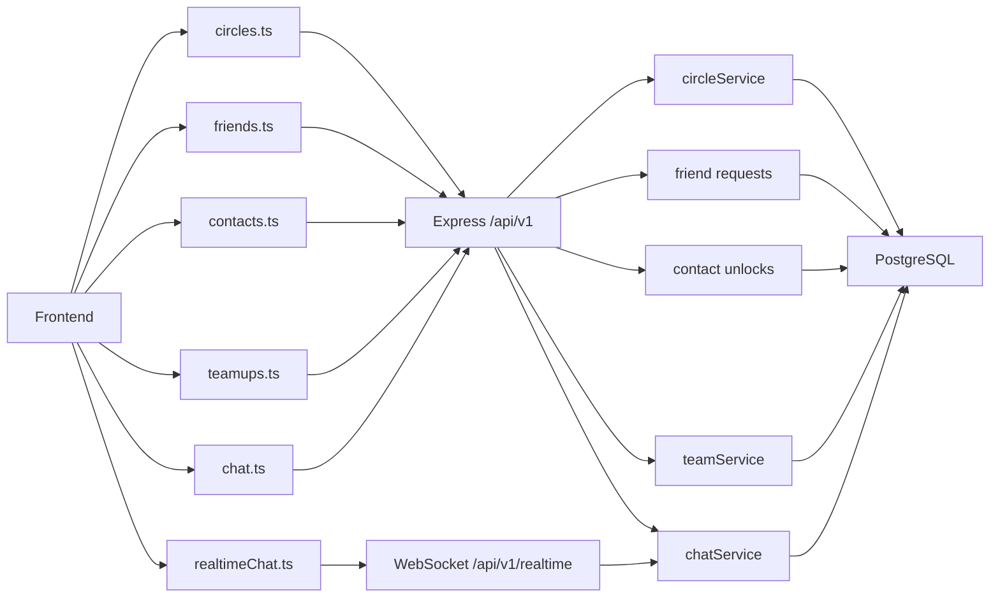
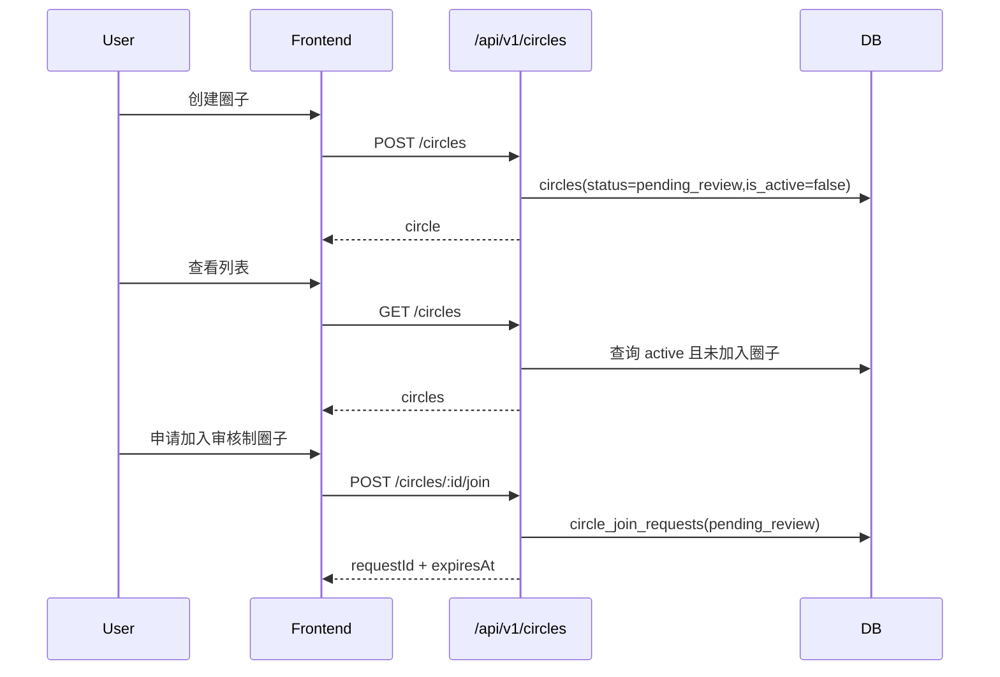
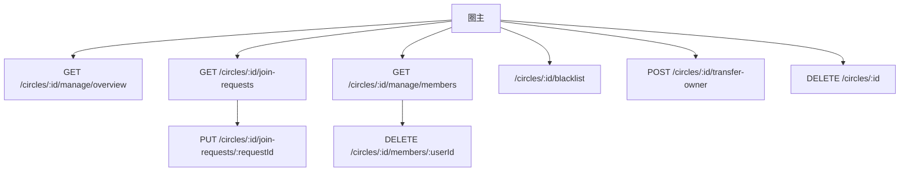
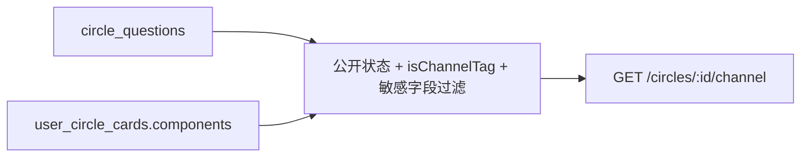
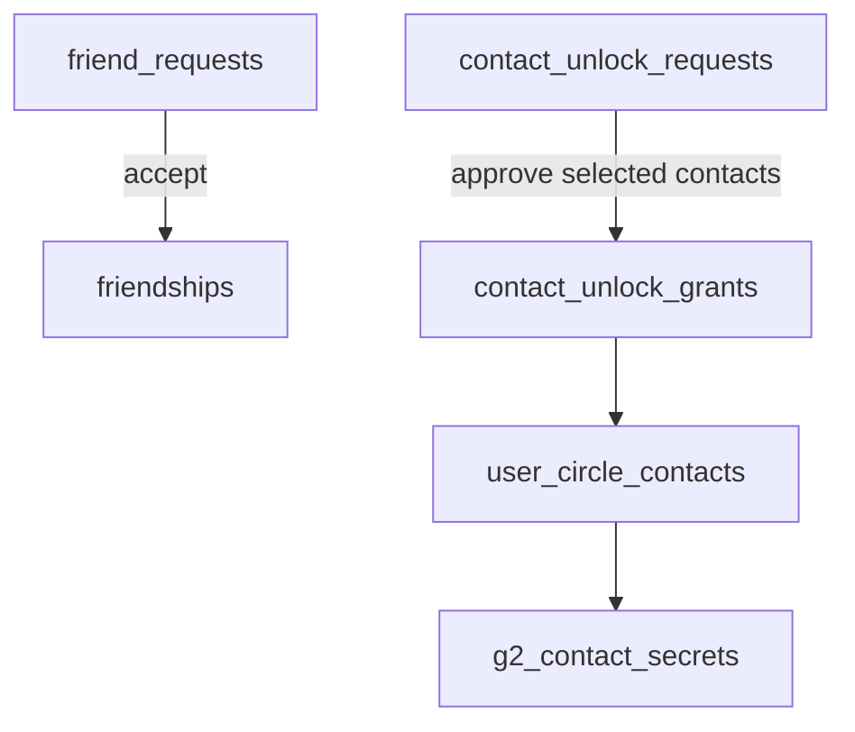
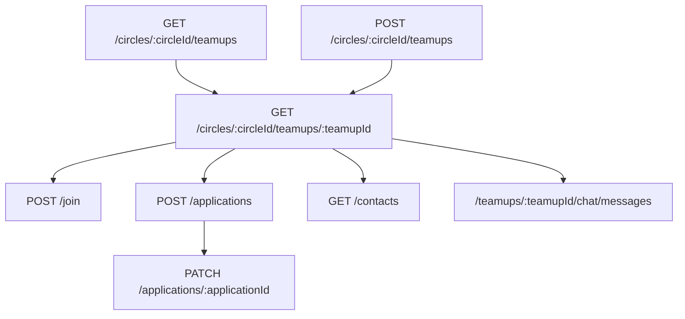
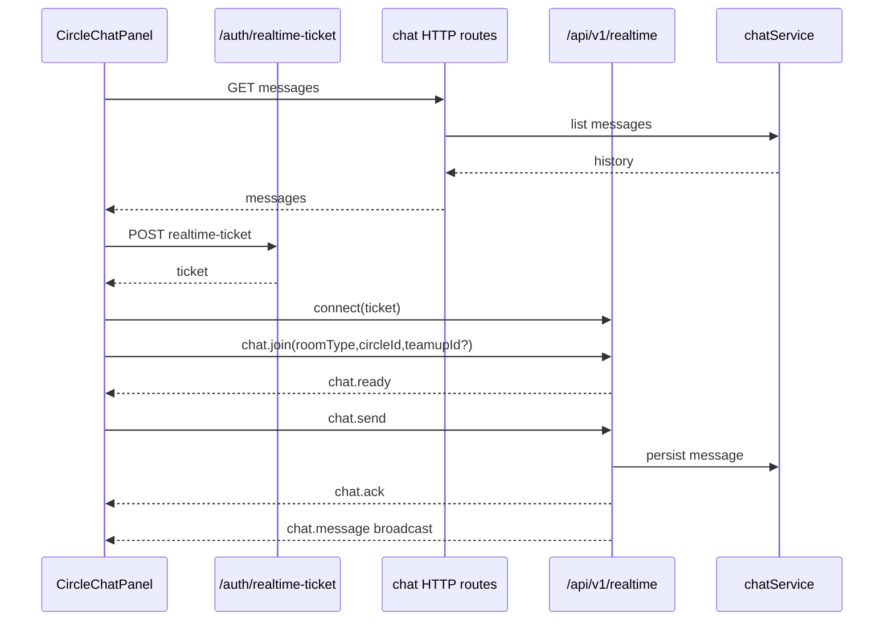

# CIRCLE 架构图（第二组当前状态）

本文只画第二组维护的圈子、关系、组队和 livechat 架构。圈内匹配不在本文范围内。

## 总览

## 圈子主流程

## 圈主管理

当前管理能力由 `viewerPermissions` 控制，后端只给圈主开放。

## 圈内资料与频道

频道标签来自公开 B 卡组件，不再从旧问卷答案生成。

## 关系与联系方式

好友关系和联系方式授权是两个独立层级。删除好友、退出圈子或拉黑用户时，服务端会清理对应范围内的待处理申请和授权。

## 组队

当前论坛同步开关关闭，组队不会自动同步为论坛贴。

## Livechat

HTTP 路径：

| 房间 | 历史 |
| --- | --- |
| 圈子 | `/circles/:circleId/chat/messages` |
| 组队 | `/circles/:circleId/teamups/:teamupId/chat/messages` |
