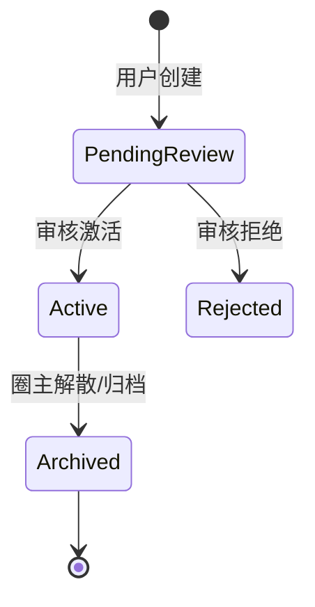

# CIRCLE 产品设计（第二组当前状态）

本文描述当前已经实现或前端已经接入的第二组 CIRCLE 体验。圈内匹配属于第一组，本文不描述其产品逻辑。

## 信息架构

| 页面 | 用户目标 | 当前能力 |
| --- | --- | --- |
| 圈子列表 | 找到可加入圈子 | 分类、关键词、标签筛选；展示可加入 active 圈子 |
| 圈子详情 | 判断是否加入、进入圈内功能 | 圈子信息、加入状态、成员态、频道、组队、livechat 入口 |
| 圈主管理 | 维护圈子秩序 | 申请审核、成员移除、黑名单、加入策略、转让、解散 |
| 圈内频道 | 看见圈内成员 | 基于公开 B 卡展示标签，支持附近模式 |
| 圈内组队 | 发起或加入具体活动 | 创建、加入、申请、审核、联系人、组队聊天 |
| Livechat | 圈内即时交流 | 圈子房间和组队房间 |

## 圈子状态

新建自定义圈子默认不可见，不进入普通列表。普通列表只展示 active 且当前用户尚未加入的圈子。

## 加入策略

| 策略 | 用户体验 | 后端行为 |
| --- | --- | --- |
| `public` | 点击后直接加入 | 创建 active 成员关系 |
| `review` | 提交申请，等待圈主审核 | 创建 `pending_review` 申请 |
| `invite` | 输入邀请码后加入 | 校验邀请码哈希后创建成员关系 |

审核申请可以撤回。圈主审核通过后，成员关系被激活；拒绝后申请进入 `rejected`。

## 圈内资料

圈内资料以 A/B/C 卡为核心，而不是旧问卷：

| 卡片 | 设计含义 | 展示规则 |
| --- | --- | --- |
| A 卡 | 基础身份资料 | 加入圈子时初始化 |
| B 卡 | 圈内结构化资料 | 由圈子组件定义控制 |
| C 卡 | 自定义扩展资料 | 用户自行维护 |

频道标签来自公开 B 卡组件。敏感字段名和值会在服务端过滤，避免被作为频道标签暴露。

## 位置与附近

用户主动上传位置后，可以使用附近频道。位置有有效期，关闭位置或停用圈内状态后，后端会删除当前位置。

附近频道只返回可见成员，不暴露原始定位用途之外的多余数据。前端可通过 `includeUnknownDistance` 决定是否展示无法计算距离的成员。

## 圈主管理体验

| 能力 | 行为 |
| --- | --- |
| 审核加入申请 | 批准或拒绝 `pending_review` 申请 |
| 成员管理 | 移除成员，可选择加入黑名单 |
| 黑名单 | 阻止加入，加入黑名单会拒绝待处理申请并移除现有成员 |
| 加入策略 | 切换公开、审核、邀请 |
| 转让圈主 | 目标必须是 active 成员 |
| 解散圈子 | 归档圈子，不物理删除主体数据 |

当前管理权限只对圈主开放。

## 关系与联系方式

好友关系和联系方式授权是分开的：

| 层级 | 说明 |
| --- | --- |
| 好友 | 表示双方关系，可按圈子存在，也可全局存在 |
| 联系方式授权 | 好友或目标用户是否允许对方查看指定联系方式 |
| 圈内联系方式设置 | 用户在某个圈子内准备可授权的联系方式 |

联系方式必须通过申请和授权流程查看，不在普通名片或用户资料里直接暴露。

## 组队体验

组队挂在圈子内，强调短期协作和线下/线上活动组织。

| 状态 | 说明 |
| --- | --- |
| `recruiting` | 招募中 |
| `full` | 满员 |
| `cancelled` | 已取消 |
| `expired` | 已过报名截止时间 |
| `ended` | 已过结束时间 |

组队支持直接加入和审核加入。满员时，服务端可能把加入/申请转为候补状态；当前没有单独候补页面或独立候补接口。

联系人只在服务端判定可见时返回，返回窗口到 `endAt`。

## Livechat 体验

livechat 复用一个聊天组件支持两类房间：

| 房间 | 场景 |
| --- | --- |
| 圈子房间 | `/circles/:id/livechat` |
| 组队房间 | 组队详情页内的组队聊天 |

历史消息通过 HTTP 拉取；在线状态下发送优先走 WebSocket，失败或离线时回退 HTTP。删除和已读状态走 HTTP，删除事件会通过 WebSocket 广播给房间内成员。
