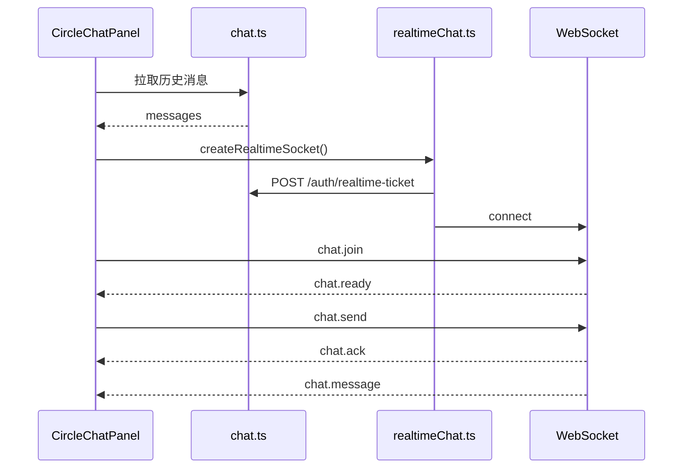

# G2 Livechat 方案（当前状态）

本文记录第二组 livechat 的当前实现方案。livechat 已同时支持圈子聊天室和组队聊天室。

## 范围

| 房间 | 场景 | 前端 |
| --- | --- | --- |
| `circle` | 圈子 livechat 页面 | `/circles/:id/livechat` |
| `teamup` | 组队详情内聊天 | `/circles/:id/teamups/:teamupId` |

聊天 UI 复用 `frontend/src/components/chat/CircleChatPanel.tsx`，通过 `roomType` 和可选 `teamupId` 区分房间。

## 通信模式

| 通道 | 用途 |
| --- | --- |
| HTTP | 历史消息、离线发送 fallback、删除消息、已读状态 |
| WebSocket | 入房、实时发送、消息推送、删除广播、输入状态、心跳 |

前端发送消息时，如果 socket 已连接且 room ready，优先发送 `chat.send`；否则调用 HTTP 发送接口。

## HTTP API

### 圈子房间

| 方法 | 路径 | 说明 |
| --- | --- | --- |
| `GET` | `/api/v1/circles/:circleId/chat/messages` | 历史消息 |
| `POST` | `/api/v1/circles/:circleId/chat/messages` | HTTP 发送 |
| `DELETE` | `/api/v1/circles/:circleId/chat/messages/:messageId` | 删除消息 |
| `PUT` | `/api/v1/circles/:circleId/chat/read-state` | 更新已读 |

### 组队房间

| 方法 | 路径 | 说明 |
| --- | --- | --- |
| `GET` | `/api/v1/circles/:circleId/teamups/:teamupId/chat/messages` | 历史消息 |
| `POST` | `/api/v1/circles/:circleId/teamups/:teamupId/chat/messages` | HTTP 发送 |
| `DELETE` | `/api/v1/circles/:circleId/teamups/:teamupId/chat/messages/:messageId` | 删除消息 |
| `PUT` | `/api/v1/circles/:circleId/teamups/:teamupId/chat/read-state` | 更新已读 |

历史接口支持 `before` 和 `limit`。`limit` 默认 30，范围 1 到 50。

发送消息 Body：

```json
{
  "clientMessageId": "client-generated-id",
  "content": "hello",
  "mentions": []
}
```

后端 `content` 最大 1000 字符；当前前端输入框限制 500 字符。

已读 Body：

```json
{
  "lastReadMessageId": "message uuid",
  "lastReadAt": "2026-06-06T12:00:00.000+08:00"
}
```

两个字段都可选。

## WebSocket

### 连接

1. 前端调用 `POST /api/v1/auth/realtime-ticket`。
2. 后端返回 `{ ticket, expiresIn }`。
3. 前端连接 `/api/v1/realtime?ticket=...`。

ticket 为短期 JWT，包含 `purpose=realtime` 和 `audience=realtime`，服务端会校验并消费 ticket id。

### Client Events

```ts
type ClientRealtimeEvent =
  | { type: 'chat.join'; roomType: 'circle'; circleId: string }
  | { type: 'chat.join'; roomType: 'teamup'; circleId: string; teamupId: string }
  | { type: 'chat.send'; clientMessageId: string; roomType: 'circle'; circleId: string; content: string; mentions?: string[] }
  | { type: 'chat.send'; clientMessageId: string; roomType: 'teamup'; circleId: string; teamupId: string; content: string; mentions?: string[] }
  | { type: 'chat.typing'; roomType: 'circle'; circleId: string; isTyping: boolean }
  | { type: 'chat.typing'; roomType: 'teamup'; circleId: string; teamupId: string; isTyping: boolean }
  | { type: 'ping'; ts: number };
```

### Server Events

```ts
type ServerRealtimeEvent =
  | { type: 'chat.ready'; roomType: 'circle'; circleId: string }
  | { type: 'chat.ready'; roomType: 'teamup'; circleId: string; teamupId: string }
  | { type: 'chat.ack'; clientMessageId: string; message: ChatMessage }
  | { type: 'chat.message'; message: ChatMessage }
  | { type: 'chat.deleted'; messageId: string; roomType: 'circle'; circleId: string }
  | { type: 'chat.deleted'; messageId: string; roomType: 'teamup'; circleId: string; teamupId: string }
  | { type: 'chat.typing'; userId: string; nickname: string | null; isTyping: boolean; circleId: string; teamupId?: string }
  | { type: 'chat.error'; code: string; message: string; clientMessageId?: string }
  | { type: 'pong'; ts: number };
```

## 权限

| 房间 | 接收/发送条件 |
| --- | --- |
| 圈子 | active 圈内成员 |
| 组队 | active 组队成员，且组队属于该圈子 |

服务端广播时会重新过滤可接收用户，避免已退出成员继续收到消息。

## 前端流程



## 当前文件位置

| 文件 | 说明 |
| --- | --- |
| `backend/src/routes/chat.ts` | HTTP 聊天路由 |
| `backend/src/modules/chat/circleChat.ts` | 圈子聊天服务 |
| `backend/src/modules/chat/teamupChat.ts` | 组队聊天服务 |
| `backend/src/realtime/chatServer.ts` | WebSocket 服务 |
| `backend/src/realtime/roomHub.ts` | room 广播 |
| `frontend/src/api/chat.ts` | HTTP API wrapper |
| `frontend/src/api/realtimeChat.ts` | WebSocket wrapper |
| `frontend/src/components/chat/CircleChatPanel.tsx` | 聊天面板 |
