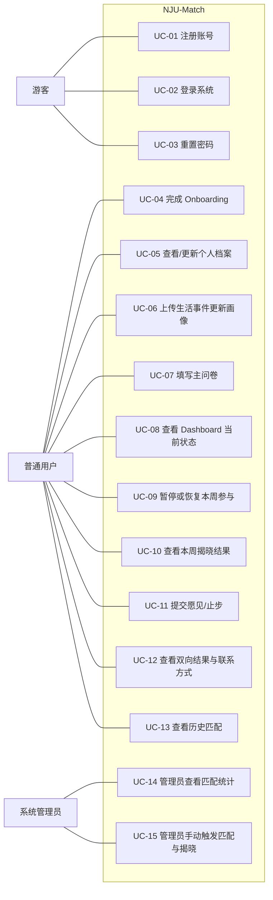

# Phase 1 交付物 05：用例图与详细用例描述

## 1. 系统级用例图

本交付物围绕“校园交友匹配主线”展开。系统级主要角色如下：

1. 游客：完成注册、登录和密码重置。
2. 普通用户：完成建档、问卷、查看揭晓结果与双向选择。
3. 系统管理员：查看匹配统计，手动触发匹配或揭晓。

系统级用例图如下：

## 2. 用例清单

| 用例编号 | 用例名称 | 主要参与者 |
|---------|---------|-----------|
| UC-01 | 注册账号 | 游客 |
| UC-02 | 登录系统 | 游客 |
| UC-03 | 重置密码 | 游客 |
| UC-04 | 完成 Onboarding | 普通用户 |
| UC-05 | 查看/更新个人档案 | 普通用户 |
| UC-06 | 上传生活事件更新画像 | 普通用户 |
| UC-07 | 填写主问卷 | 普通用户 |
| UC-08 | 查看 Dashboard 当前状态 | 普通用户 |
| UC-09 | 暂停或恢复本周参与 | 普通用户 |
| UC-10 | 查看本周揭晓结果 | 普通用户 |
| UC-11 | 提交愿见/止步 | 普通用户 |
| UC-12 | 查看双向结果与联系方式 | 普通用户 |
| UC-13 | 查看历史匹配 | 普通用户 |
| UC-14 | 管理员查看匹配统计 | 系统管理员 |
| UC-15 | 管理员手动触发匹配与揭晓 | 系统管理员 |
共计 15 个用例，覆盖 3 个角色。

## 3. 详细用例描述

以下选择 3 个核心用例进行详细描述：

1. UC-04 完成 Onboarding
2. UC-10 查看本周揭晓结果
3. UC-11 提交愿见/止步

### 3.1 UC-04 完成 Onboarding

| 项目 | 内容 |
|------|------|
| 用例编号 | UC-04 |
| 用例名称 | 完成 Onboarding |
| 主要参与者 | 普通用户 |
| 目标 | 用户补全基础档案，获得参与主问卷和主匹配的资格 |
| 前置条件 | 用户已注册并登录 |
| 后置条件 | 用户档案被完整保存，系统将其标记为已完成建档 |

#### 基本流

1. 用户进入 Onboarding 页面。
2. 系统按步骤展示昵称、性别、匹配意向、年级、院系、校区等字段。
3. 用户逐步填写信息。
4. 系统在步骤切换时自动保存草稿。
5. 用户完成全部必填项并提交。
6. 系统校验字段合法性并保存完整档案。
7. 系统提示建档完成，并引导用户进入主问卷页面。

#### 替代流

1. 用户中途退出页面，系统保留已保存的草稿。
2. 用户再次进入时，系统回填已保存内容。
3. 用户可以在完成建档后再次进入并更新资料。

#### 异常流

1. 若必填项缺失，系统提示补全后再提交。
2. 若字段格式非法，系统提示具体错误位置。
3. 若保存失败，系统提示稍后重试，且不得误标记为“已完成”。

### 3.2 UC-10 查看本周揭晓结果

| 项目 | 内容 |
|------|------|
| 用例编号 | UC-10 |
| 用例名称 | 查看本周揭晓结果 |
| 主要参与者 | 普通用户 |
| 目标 | 用户在揭晓窗口内查看本周匹配结果及脱敏画像信息 |
| 前置条件 | 用户已登录；系统已到达揭晓时间或已进入过期状态 |
| 后置条件 | 用户成功查看结果，或被系统明确告知当前不可查看 |

#### 基本流

1. 用户进入 Dashboard。
2. 系统返回本周匹配状态。
3. 若状态为 `REVEALED`，系统展示进入揭晓页的入口。
4. 用户进入揭晓页。
5. 系统展示对方脱敏档案、兼容度信息和简要解释。
6. 用户可进一步选择“愿见”或“止步”。

#### 替代流

1. 若状态为 `WAITING`，系统展示等待提示或倒计时。
2. 若状态为 `NO_MATCH`，系统展示本周未匹配成功及下一步建议。
3. 若状态为 `EXPIRED`，系统展示结果已过期，用户不可继续操作。

#### 异常流

1. 若用户直接访问揭晓页，但状态不允许查看，系统应将其重定向回 Dashboard。
2. 若揭晓数据加载失败，系统提示刷新或稍后重试。
3. 若结果不属于当前用户，系统拒绝访问。

### 3.3 UC-11 提交愿见/止步

| 项目 | 内容 |
|------|------|
| 用例编号 | UC-11 |
| 用例名称 | 提交愿见/止步 |
| 主要参与者 | 普通用户 |
| 目标 | 用户对本周匹配结果做出一次有效选择 |
| 前置条件 | 用户已登录；当前状态允许提交选择 |
| 后置条件 | 系统保存选择结果，并更新后续等待或双向结果状态 |

#### 基本流

1. 用户在揭晓页查看匹配结果。
2. 用户选择“愿见”或“止步”。
3. 系统弹出确认提示。
4. 用户确认提交。
5. 系统记录本次选择并返回提交成功反馈。
6. 若对方尚未选择，系统返回等待状态。
7. 若双方均选择“愿见”，系统进入双向成功状态。

#### 替代流

1. 用户在确认前取消操作，则系统不保存任何选择。
2. 用户提交“止步”后，系统直接结束本期互动，不展示联系方式。

#### 异常流

1. 若用户重复提交，系统应拒绝第二次请求。
2. 若当前期次已过期，系统应拒绝提交并返回过期提示。
3. 若匹配记录不存在或不属于当前用户，系统拒绝访问。

## 4. 用例设计说明

本次用例建模体现以下原则：

1. 用例仅覆盖校园交友匹配主线，不扩展到公开社区、交易或即时聊天等能力。
2. 保留了课程验收所需的 3 个角色和 15 个以上用例。
3. 在详细用例中明确补充了锁定窗口、揭晓状态、重复提交和非法访问等异常流。

## 5. 与需求规格说明书的对应关系

本交付物与 [04-需求规格说明书.md](./04-需求规格说明书.md) 保持一致，可直接用于后续用户故事和测试场景编写。
