# 圈子与关系链模块 - 用例建模文档

> 本文档为校园社交与互助平台"圈子与关系链组"模块的完整用例建模规范，包含系统用例清单、参与角色定义、用例关系图以及三个核心用例的详细说明。

---

## 一、模块范围与角色定义

### 1.1 功能范围

本模块严格限定在以下五个业务范围内，不涉及用户认证、全站论坛治理等相关模块：

| 功能范围 | 描述 |
|:---|:---|
| **圈子管理** | 圈子的创建、发现、权限设置、成员管理、申请审核等 |
| **名片展示权限** | 个人信息的可见性分层、权限级别配置、权限查询等 |
| **好友关系建立** | 好友申请、申请处理、好友管理、关系维护等 |
| **隐私解锁** | 联系方式解锁申请、批准/拒绝流程、双向确认机制等 |
| **圈内专属互动** | 圈内问卷、同好推荐、活动组队、群组协作互动等 |

### 1.2 参与角色

| 角色 | 定义 | 主要权限 |
|:---:|:---|:---|
| **普通学生** | 平台的一般用户，可以创建圈子、加入圈子、管理隐私 | 创建圈子、申请加入、设置权限、发起解锁申请、管理好友 |
| **圈主** | 圈子的创建者或管理员，拥有圈子管理权限 | 修改圈子信息、设置加入权限、审核申请、移除成员 |
| **平台系统服务** | 提供通知、推荐、频控与状态机处理的系统级服务角色（非人工后台） | 通知推送、推荐排序、频率限制校验、状态流转与自动处理 |

---

## 二、系统用例清单

### 2.1 完整用例列表（共26个用例）

| # | 用例ID | 用例名称 | 参与角色 | 所属模块 | 优先级 |
|:---:|:---:|:---|:---|:---|:---:|
| 1 | UC01 | 浏览公开圈子列表 | 普通学生 | 圈子管理 | P0 |
| 2 | UC02 | 创建新圈子 | 普通学生 | 圈子管理 | P0 |
| 3 | UC03 | 修改圈子基本信息 | 圈主 | 圈子管理 | P1 |
| 4 | UC04 | **申请加入私密圈子** | 普通学生 | 圈子管理 | **P0** |
| 5 | UC05 | 审批圈子入申请 | 圈主、平台系统服务 | 圈子管理 | P0 |
| 6 | UC06 | 浏览圈子成员列表 | 普通学生 | 圈子管理 | P0 |
| 7 | UC07 | 设置圈子加入权限 | 圈主 | 圈子管理 | P0 |
| 8 | UC08 | 移除违规成员 | 圈主 | 圈子管理 | P1 |
| 9 | UC09 | 退出圈子 | 普通学生 | 圈子管理 | P1 |
| 10 | UC10 | **设置名片隐私权限** | 普通学生 | 名片展示权限 | **P0** |
| 11 | UC11 | 查看公开名片信息 | 普通学生 | 名片展示权限 | P0 |
| 12 | UC12 | 查看好友名片详情 | 普通学生 | 名片展示权限 | P0 |
| 13 | UC13 | 查询可见范围内的名片 | 普通学生 | 名片展示权限 | P1 |
| 14 | UC14 | 发送好友申请 | 普通学生 | 好友关系建立 | P0 |
| 15 | UC15 | 处理好友申请（同意/拒绝） | 普通学生 | 好友关系建立 | P0 |
| 16 | UC16 | 删除好友关系 | 普通学生 | 好友关系建立 | P1 |
| 17 | UC17 | **申请解锁对方联系方式** | 普通学生 | 隐私解锁 | **P0** |
| 18 | UC18 | 批准/拒绝隐私解锁申请 | 普通学生、平台系统服务 | 隐私解锁 | P0 |
| 19 | UC19 | 圈内双通道互动（群聊+帖子） | 普通学生 | 圈内专属互动 | P0 |
| 20 | UC20 | 配置入圈问答与关键词过滤 | 圈主 | 圈子管理 | P1 |
| 21 | UC21 | 好友通过后获取破冰提示 | 普通学生 | 好友关系建立 | P1 |
| 22 | UC22 | 关系降级为仅关注不可互动 | 普通学生 | 好友关系建立 | P2 |
| 23 | UC23 | 填写圈内专属问卷 | 普通学生 | 圈内专属互动 | P0 |
| 24 | UC24 | 查看同好推荐及推荐依据 | 普通学生、平台系统服务 | 圈内专属互动 | P0 |
| 25 | UC25 | 发起活动组队 | 普通学生 | 圈内专属互动 | P0 |
| 26 | UC26 | 组队报名候补退出与群组协作 | 普通学生、平台系统服务 | 圈内专属互动 | P0 |

**说明**：标粗的用例为三个核心用例，将在后续章节进行详细说明。

---

## 三、用例关系图

```mermaid
graph TB
    Student["👤 普通学生"]
    Owner["👑 圈主"]
  Sys["⚙️ 平台系统服务"]

    subgraph GM["圈子管理模块"]
        direction TB
        UC01["UC01: 浏览公开圈子列表"]
        UC02["UC02: 创建新圈子"]
        UC03["UC03: 修改圈子基本信息"]
        UC04["UC04: 申请加入私密圈子"]
        UC05["UC05: 审批圈子入申请"]
        UC06["UC06: 浏览圈子成员列表"]
        UC07["UC07: 设置圈子加入权限"]
        UC08["UC08: 移除违规成员"]
        UC09["UC09: 退出圈子"]
    end

    subgraph CP["名片展示权限模块"]
        direction TB
        UC10["UC10: 设置名片隐私权限"]
        UC11["UC11: 查看公开名片信息"]
        UC12["UC12: 查看好友名片详情"]
        UC13["UC13: 查询可见范围内的名片"]
    end

    subgraph FR["好友关系建立模块"]
        direction TB
        UC14["UC14: 发送好友申请"]
        UC15["UC15: 处理好友申请"]
        UC16["UC16: 删除好友关系"]
      UC21["UC21: 好友通过后获取破冰提示"]
      UC22["UC22: 关系降级为仅关注不可互动"]
    end

    subgraph PU["隐私解锁模块"]
        direction TB
        UC17["UC17: 申请解锁对方联系方式"]
        UC18["UC18: 批准/拒绝隐私解锁申请"]
    end

    subgraph CI["圈内专属互动模块"]
      direction TB
      UC19["UC19: 圈内双通道互动"]
      UC23["UC23: 填写圈内专属问卷"]
      UC24["UC24: 查看同好推荐及依据"]
      UC25["UC25: 发起活动组队"]
      UC26["UC26: 组队报名候补退出与协作"]
    end

    Student -->|可执行| UC01
    Student -->|可执行| UC02
    Student -->|可执行| UC04
    Student -->|可执行| UC06
    Student -->|可执行| UC09
    Student -->|可执行| UC10
    Student -->|可执行| UC11
    Student -->|可执行| UC12
    Student -->|可执行| UC13
    Student -->|可执行| UC14
    Student -->|可执行| UC15
    Student -->|可执行| UC16
    Student -->|可执行| UC17
    Student -->|可执行| UC18
    Student -->|可执行| UC19
    Student -->|可执行| UC21
    Student -->|可执行| UC22
    Student -->|可执行| UC23
    Student -->|可执行| UC24
    Student -->|可执行| UC25
    Student -->|可执行| UC26

    Owner -->|可执行| UC02
    Owner -->|可执行| UC03
    Owner -->|可执行| UC05
    Owner -->|可执行| UC07
    Owner -->|可执行| UC08
    Owner -->|可执行| UC20
    Owner -.->|角色继承| Student

    Sys -->|自动处理| UC05
    Sys -->|自动处理| UC18
    Sys -->|自动处理| UC24
    Sys -->|自动处理| UC26
```



---

## 四、核心用例详细说明

### 用例一：申请加入私密圈子 (UC04)

#### 基本信息

| 属性 | 内容 |
|:---|:---|
| **用例名称** | 申请加入私密圈子 |
| **用例ID** | UC04 |
| **参与者** | 普通学生（申请者）、圈主（审核者）|
| **优先级** | P0 |
| **触发方式** | 学生主动操作或系统邀请 |

#### 前置条件

1. 申请学生已登录系统，身份验证通过
2. 目标圈子存在且状态为"启用"
3. 目标圈子的加入权限设置为"需要审核"或"私密"
4. 申请学生当前不是该圈子的成员
5. 申请学生未被该圈主拉入黑名单
6. 申请学生在过去30天内未因违规被拒绝超过3次

#### 基本流程

| 步骤 | 角色 | 操作描述 |
|:---:|:---:|:---|
| 1 | 申请学生 | 在圈子发现页中找到目标私密圈子，查看圈子详情 |
| 2 | 系统 | 在圈子详情页展示【申请加入】按钮（而非【加入】按钮） |
| 3 | 申请学生 | 点击【申请加入】按钮，触发申请表单 |
| 4 | 系统 | 弹出申请表单窗口，显示必填字段：加入理由、院系、是否已知圈内成员 |
| 5 | 申请学生 | 填写完整信息，确认无误，点击【提交申请】 |
| 6 | 系统 | 验证表单数据的完整性和合法性，存储申请记录，状态标记为"待审核" |
| 7 | 系统 | 生成系统通知，向圈主发送"新的入圈申请待处理"消息并推送到个人中心 |
| 8 | 圈主 | 登录系统，进入圈子管理后台，进入"待审批申请"列表 |
| 9 | 圈主 | 查看申请者的个人名片摘要（包含昵称、院系、共同圈子等信息）和申请理由 |
| 10 | 圈主 | 基于综合判断，点击【同意申请】或【拒绝申请】按钮进行决策 |
| 11a | 系统（同意路线） | 更新申请状态为"已通过"，将申请者的ID加入圈子成员列表 |
| 11b | 系统（同意路线） | 该学生自动获得"圈内成员"身份，可访问圈子内容 |
| 11c | 系统（同意路线） | 发送通知给申请学生："太棒了！你已加入【圈子名称】" |
| 12a | 系统（拒绝路线） | 更新申请状态为"已拒绝"，记录拒绝时间戳 |
| 12b | 系统（拒绝路线） | 发送通知给申请学生，附带圈主可选的拒绝理由 |
| 13 | 申请学生 | 收到系统提醒，查看申请处理结果 |

#### 替代流程

**替代流 A1：表单验证失败 - 必填项缺失**
- **触发时机**：申请学生未填写必填字段就点击【提交申请】
- **处理流程**：
  1. 系统识别缺失字段，在表单对应位置显示红色警告提示："请填写加入理由"
  2. 【提交申请】按钮禁用，申请无法提交
  3. 用户补充信息后，警告解除，按钮恢复可用
  4. 返回基本流第6步

**替代流 A2：表单验证失败 - 字数超限**
- **触发时机**：申请理由超过500字
- **处理流程**：
  1. 系统弹出警告"申请理由不能超过500字，当前已输入XXX字"
  2. 用户修改内容至规定范围内
  3. 返回基本流第6步

**替代流 A3：申请重复检测**
- **触发时机**：申请学生对同一圈子已有状态为"待审核"的申请未过期
- **处理流程**：
  1. 系统检测到重复申请，阻止提交
  2. 页面提示："您对该圈子的申请正在处理中（提交时间：XX月XX日），请勿重复申请"
  3. 用户可选择查看历史申请或返回
  4. 流程中止

**替代流 A4：用户在黑名单中**
- **触发时机**：申请学生被圈主拉入圈子黑名单
- **处理流程**：
  1. 系统检测到黑名单关系
  2. 圈子详情页不显示【申请加入】按钮，转而显示灰色提示"此圈子需邀请才能加入"或"暂无法加入"
  3. 用户无法发起申请，流程结束
  4. 用户可选择联系圈主获取邀请或申请解除黑名单

**替代流 A5：圈子已满员**
- **触发时机**：圈子设置了最大成员数限制，且已达上限
- **处理流程**：
  1. 系统检测成员数达到上限
  2. 表单弹出，但显示禁用提示："该圈子暂已满员，请稍后再试"
  3. 【提交申请】按钮禁用
  4. 用户可点击【关注圈子】按钮，待有空位时收到通知

**替代流 A6：申请超时自动失效**
- **触发时机**：申请提交7天后圈主仍未审核
- **处理流程**：
  1. 定时任务检测到过期申请
  2. 系统自动将申请状态修改为"已过期"
  3. 不再显示在圈主的"待审批"列表中，但申请者仍可在"申请历史"中查看
  4. 申请者收到"申请已过期"通知，可重新发起申请

**替代流 A7：圈主拒绝申请**
- **触发时机**：圈主点击【拒绝申请】
- **处理流程**：
  1. 系统弹出可选框"是否填写拒绝理由？"
  2. 圈主可选填拒绝理由（如"暂还不够了解你"等），点击【确认拒绝】
  3. 申请状态更新为"已拒绝"
  4. 申请者收到拒绝通知，可查看拒绝理由（若有）
  5. 申请者30天后可重新申请

#### 后置条件

**成功情景下的后置条件：**
1. 申请状态持久化为"已通过"
2. 申请学生的ID被添加到圈子成员表中
3. 申请学生的角色权限更新，具备"圈内成员"权限
4. 圈子成员统计数字增加1
5. 申请学生的个人页面显示"已加入【圈子名称】"
6. 圈主的圈子管理数据统计更新

**失败情景下的后置条件：**
1. 申请状态持久化为"已拒绝"或"已过期"
2. 申请学生的ID不被添加到圈子成员表
3. 申请学生仍然无法访问圈子内容
4. 如系统记录多次拒绝，可能限制该学生后续对同一圈子的申请频率

---

### 用例二：设置名片隐私权限 (UC10)

#### 基本信息

| 属性 | 内容 |
|:---|:---|
| **用例名称** | 设置名片隐私权限 |
| **用例ID** | UC10 |
| **参与者** | 普通学生 |
| **优先级** | P0 |
| **触发方式** | 学生主动操作 |

#### 前置条件

1. 学生已登录系统，身份验证通过
2. 学生已完善个人基础资料（昵称、性别、院系、专业）
3. 学生已补充至少一项隐私信息（微信号、手机号、宿舍信息等）
4. 系统中隐私权限分类已定义完整
5. 学生的账户状态为"正常"，未被禁用

#### 基本流程

| 步骤 | 角色 | 操作描述 |
|:---:|:---:|:---|
| 1 | 学生 | 登录个人中心，点击【隐私与权限设置】菜单项 |
| 2 | 系统 | 加载隐私权限设置页面，显示所有可配置的信息字段及其当前权限状态 |
| 3 | 系统 | 展示权限级别选项：🌐完全公开、👥仅好友可见、🏢同圈子可见、🔒需申请解锁、🚫完全私密 |
| 4 | 学生 | 浏览各个字段的现有权限配置，了解谁可以看到自己的哪些信息 |
| 5 | 学生 | 识别需要调整的字段，点击该字段的下拉菜单 |
| 6 | 系统 | 展开权限等级选项列表 |
| 7 | 学生 | 从下拉菜单中选择新的权限等级，页面即时反馈选择结果 |
| 8 | 学生 | 针对其他需调整的字段重复步骤 5-7 |
| 9 | 学生 | 完成所有权限配置调整后，点击页面底部的【保存设置】按钮 |
| 10 | 系统 | 对所有权限配置进行合法性验证（如：联系方式不能同时设为"完全私密"和"需申请解锁"） |
| 11 | 系统 | 若验证通过，将权限配置提交到数据库，执行数据持久化 |
| 12 | 系统 | 更新内存缓存中该学生的权限规则 |
| 13 | 系统 | 在页面顶部显示绿色成功提示："隐私设置已保存✓" |
| 14 | 系统 | 根据新权限配置，实时更新其他用户对该学生名片的访问权限 |
| 15 | 学生 | 等待3秒后成功提示自动消失，用户可返回个人中心或继续其他操作 |

#### 权限级别详解

| 权限级别 | 可见范围 | 使用场景 | 解释 |
|:---|:---|:---|:---|
| 🌐 **完全公开** | 所有登录用户 | 昵称、性别、院系 | 任何人可见 |
| 👥 **仅好友可见** | 已建立好友关系的用户 | 宿舍区、专业、班级 | 仅好友列表中用户可见 |
| 🏢 **同圈子可见** | 共同所在圈子的成员 | 参与活动、兴趣标签 | 与我在同一圈子的用户可见 |
| 🔒 **需申请解锁** | 经过审批的用户 | 微信号、手机号、QQ | 需提交申请，经我批准后可见 |
| 🚫 **完全私密** | 仅自己 | 身份证号、家庭住址 | 任何人都无法看到（仅自己可见） |

#### 替代流程

**替代流 B1：网络连接异常 - 保存失败**
- **触发时机**：点击【保存设置】时网络中断或服务器无响应（超过30秒）
- **处理流程**：
  1. 系统捕获网络异常，页面显示红色错误提示："保存失败，请检查网络连接后重试"
  2. 用户界面保持编辑状态，之前做的所有修改保留在表单中，不会丢失
  3. 用户检查网络后，点击【重新保存】或【保存】按钮重试
  4. 返回基本流第10步

**替代流 B2：权限冲突检测**
- **触发时机**：用户设置的权限组合存在逻辑冲突
- **处理流程**：
  1. 系统在保存时检测到冲突（如：联系方式同时为"完全私密"和"需申请解锁"）
  2. 系统不执行保存，反馈错误信息："检测到权限冲突：微信号不能同时设为私密和需审批，请调整"
  3. 冲突字段在页面上高亮为红色边框
  4. 用户修正冲突配置
  5. 返回基本流第10步

**替代流 B3：部分字段保存失败**
- **触发时机**：用户修改了多个字段，但由于数据库或权限问题导致某个字段保存失败
- **处理流程**：
  1. 系统返回部分成功的保存结果，显示提示："共3项中已保存2项，微信号保存失败，请重试"
  2. 失败的字段显示警告图标，用户可选择：
     - 【全部重试】：重新尝试保存所有项
     - 【仅重试失败项】：只重试微信号字段
     - 【放弃】：恢复到保存前的状态
  3. 若选择【全部重试】或【仅重试失败项】，返回基本流第10步

**替代流 B4：权限未充分**
- **触发时机**：用户账户因某些原因被限制修改隐私设置（如受到平台处罚）
- **处理流程**：
  1. 系统在加载页面时检测到权限限制
  2. 所有权限配置字段显示为禁用状态（灰色不可点击）
  3. 页面显示提示信息："由于账户存在异常标记，暂时无法修改隐私设置。请联系客服。"
  4. 用户可点击【联系客服】获取帮助
  5. 流程结束

**替代流 B5：会话超时**
- **触发时机**：用户长时间未操作（如编辑25分钟后才点击保存）
- **处理流程**：
  1. 系统检测到会话过期，阻止保存操作
  2. 弹出提示："您的登录状态已失效，请重新登录后继续"
  3. 用户点击【重新登录】，返回登录页
  4. 登录后回到隐私设置页，之前的修改已清除，用户需重新配置

**替代流 B6：并发冲突 - 多设备同时修改**
- **触发时机**：用户在多个设备上同时修改隐私设置，两个请求几乎同时到达
- **处理流程**：
  1. 系统基于时间戳判断哪个请求优先
  2. 后到达的请求被拒绝，返回错误："您的隐私设置已在其他设备上更新，页面已刷新"
  3. 页面自动刷新，显示最新的远程状态
  4. 用户可查看当前配置，若需再次修改，可重新操作

#### 后置条件

**成功情景下的后置条件：**
1. 所有权限配置被持久化到数据库的 `user_privacy_settings` 表
2. 内存缓存中该用户的权限规则完全更新，立即生效
3. 其他用户对该学生名片的可见范围根据新权限实时调整
4. 系统审计日志记录该操作："用户XXX修改了隐私权限，涉及YYZ个字段"，包含时间戳和变更内容
5. 用户个人页面显示"隐私设置最后更新于 YYYY-MM-DD HH:MM"

**失败情景下的后置条件：**
1. 数据库中用户隐私设置保持修改前的状态，无任何改变
2. 权限规则缓存不被更新，其他用户对该学生的名片访问权限不变
3. 用户界面保留所做的编辑修改，允许用户再次尝试保存
4. 若多次失败（超过5次），系统可能建议用户"稍后重试"或"联系技术支持"

---

### 用例三：申请解锁对方联系方式 (UC17)

#### 基本信息

| 属性 | 内容 |
|:---|:---|
| **用例名称** | 申请解锁对方联系方式 |
| **用例ID** | UC17 |
| **参与者** | 普通学生 A（申请者）、普通学生 B（信息所有者/审批者） |
| **优先级** | P0 |
| **触发方式** | 学生A主动操作 |

#### 前置条件

1. 学生A和B都已登录系统，身份验证通过
2. 双方都是系统正常用户，账户状态为"启用"
3. A正在浏览B的名片，B已将其联系方式（如微信号、手机号）设置为"需申请解锁"或需要双向确认
4. A和B之间不存在黑名单或拉黑关系
5. A在过去30天内对B的解锁申请次数未超过2次（防止骚扰）
6. A与B目前不是进行中的、未过期的解锁申请关系

#### 基本流程

| 步骤 | 角色 | 操作描述 |
|:---:|:---:|:---|
| 1 | A学生 | 浏览B的个人名片页面 |
| 2 | 系统 | 根据B的隐私权限配置，显示各信息字段及其可见状态 |
| 3 | 系统 | 对于需解锁的字段（如"微信号"），显示锁定图标 🔒 和【申请解锁】按钮 |
| 4 | A学生 | 识别感兴趣但锁定的信息，点击【申请解锁】按钮 |
| 5 | 系统 | 弹出解锁申请表单，包含字段："申请理由"（必填，最多200字）、"期望用途"（可选） |
| 6 | A学生 | 在表单中填写详细的申请理由（如"想一起组织读书分享会"），点击【提交申请】 |
| 7 | 系统 | 校验表单数据完整性和合法性，验证A没有被拉黑、没有超过申请频率限制 |
| 8 | 系统 | 创建申请记录，状态标记为"待审核"，存储申请时间戳和申请内容 |
| 9 | 系统 | 向B发送系统通知："有人申请查看你的联系方式 - 【查看详情】" |
| 10 | 系统 | 将申请消息推送到B的个人中心和消息列表，设置为"未读"状态 |
| 11 | B学生 | 登录系统，收到通知角标提示，点击进入【隐私申请列表】 |
| 12 | B学生 | 查看申请者A的名片摘要（昵称、院系、共同圈子），以及A填写的申请理由 |
| 13 | B学生 | 基于信息和申请理由进行判断 |
| 14a | B学生（批准路线） | 确认A是值得信任的人，点击【批准申请】按钮 |
| 15a | 系统（批准路线） | 更新申请状态为"已批准"，创建"解锁记录"，记录解锁时间、解锁字段、有效期等 |
| 15b | 系统（批准路线） | 向A发送确认通知："申请已批准✓，你可以查看对方的微信号：wxid_****（部分打码显示）" |
| 15c | 系统（批准路线） | 在B的名片页中关闭该字段的锁定，显示解锁后的信息 |
| 16a | 系统 | 创建双向关系记录（若B之前也对A发起过未过期的申请）激活"双向共振"逻辑 |
| 17a | 系统 | 向双方推送"社交破冰成功 💫"通知，展示彼此的完整信息 |
| 14b | B学生（拒绝路线） | 认为A的申请不合适，点击【拒绝申请】按钮 |
| 15d | 系统（拒绝路线） | 弹出可选框"是否添加拒绝理由？"，B可选填理由 |
| 15e | 系统（拒绝路线） | 更新申请状态为"已拒绝"，存储拒绝时间和理由 |
| 15f | 系统（拒绝路线） | 向A发送拒绝通知："很遗憾，对方暂时不想分享联系方式"，可选显示理由 |

#### 替代流程

**替代流 C1：申请表单验证失败 - 必填项缺失**
- **触发时机**：A未填写申请理由就点击【提交申请】
- **处理流程**：
  1. 系统检测到必填字段"申请理由"为空
  2. 在"申请理由"输入框下方显示红色提示："请填写申请理由"
  3. 【提交申请】按钮禁用
  4. A补充申请理由后警告消失，按钮可用
  5. 返回基本流第7步

**替代流 C2：申请理由字数超限**
- **触发时机**：A填写的申请理由超过200字
- **处理流程**：
  1. 系统实时计数，当字数接近200时提示："还可输入X字"
  2. 若超过200字，显示警告："申请理由不超过200字，当前XXX字"
  3. 【提交申请】按钮禁用
  4. A删除多余内容至规定范围
  5. 返回基本流第7步

**替代流 C3：A被B拉入黑名单**
- **触发时机**：系统检测到A已被B拉黑
- **处理流程**：
  1. 系统在验证阶段检测到黑名单关系
  2. 申请被拒绝，不发送到B
  3. 向A显示友好提示："该用户暂不接受解锁申请"（不直接告知被拉黑）
  4. 申请未被创建，流程结束

**替代流 C4：A申请频率过高**
- **触发时机**：A在过去30天内对B的申请次数已达到2次上限
- **处理流程**：
  1. 系统检查A对B的申请历史
  2. 检测到超过申请频率限制
  3. 阻止提交，显示提示："你在过去30天内已向对方申请X次，请稍后再试"
  4. 【提交申请】按钮禁用，显示下次可申请的时间
  5. 流程结束

**替代流 C5：B还未设置隐私权限**
- **触发时机**：A试图解锁B的信息，但B尚未配置隐私权限
- **处理流程**：
  1. 系统检测到B的隐私设置为默认状态（通常默认所有信息"完全公开"）
  2. 信息已经对A可见，无需解锁
  3. 页面不显示【申请解锁】按钮，改为显示信息直接可见
  4. 流程结束

**替代流 C6：B拒绝申请**
- **触发时机**：B点击【拒绝申请】
- **处理流程**：
  1. 系统弹出对话框"是否填写拒绝理由？"
  2. B可选填理由（如"暂时还不了解你"），点击【确认拒绝】
  3. 申请状态更新为"已拒绝"，记录拒绝时间和理由
  4. A收到拒绝通知，可查看理由（若B填写）
  5. A在30天内不可对B重新发起该字段的解锁申请

**替代流 C7：申请超时自动失效**
- **触发时机**：申请提交10天后B仍未进行任何操作
- **处理流程**：
  1. 定时任务检测到过期申请
  2. 系统自动将申请状态修改为"已过期"
  3. 不再在B的"待处理"列表中显示，但仍在"历史记录"中
  4. 向A发送温和通知："你对对方的解锁申请已过期，若仍有需要可重新申请"
  5. A可重新发起新申请

**替代流 C8：双向共振 - 彼此互相申请**
- **触发时机**：在A申请B的同时，B之前也向A申请了相同字段的解锁
- **处理流程**：
  1. 系统检测到B对A存在未过期的申请记录
  2. A点击【提交申请】后，系统触发"双向共振"逻辑
  3. 不需等待B的审核，直接向双方推送"社交破冰成功 💫 - 你们相互感兴趣！"
  4. 自动解锁双方对应字段的信息
  5. 生成"双向解锁记录"，双方都能看到对方的完整信息

**替代流 C9：A与B已是好友**
- **触发时机**：A和B已建立好友关系，隐私权限包含"仅好友可见"
- **处理流程**：
  1. 系统在检验时发现双方已是好友
  2. 根据隐私规则，好友可直接看到该信息（无需申请）
  3. 【申请解锁】按钮不显示，信息直接可见
  4. 流程结束

**替代流 C10：会话过期**
- **触发时机**：A提交申请时会话已失效
- **处理流程**：
  1. 系统检测到认证信息过期
  2. 弹出"登录状态已失效，请重新登录"提示
  3. 跳转到登录页，用户重新登录
  4. 用户可再次尝试提交申请

#### 后置条件

**申请被批准的后置条件：**
1. 申请记录在数据库中状态更新为"已批准"，记录批准时间戳
2. 在 `privacy_unlock_records` 表中创建新记录，包含字段：申请者ID、信息所有者ID、解锁字段、解锁时间、有效期（通常为永久）
3. A对B要求的信息字段的访问权限被更新，下次查看B的名片时直接看到解锁信息
4. B的名片显示"已解锁给XXX用户"的提示（对B本人可见）
5. 在 `user_audit_log` 中记录此操作，供日后审计和隐私监控使用
6. 若达成双向解锁，两用户的通知中心都增加"社交破冰成功"记录

**申请被拒绝的后置条件：**
1. 申请记录状态更新为"已拒绝"，记录拒绝时间和拒绝理由
2. A对B的该字段信息访问权限保持不变，仍然看不到
3. A收到拒绝通知，可在"申请历史"中查看此记录
4. B的申请列表中该记录移出"待处理"，进入"已处理"存档
5. 系统在A的账户和B的账户上各记录一次"拒绝交互"，用于风险评分（防止骚扰）

**申请超时失效的后置条件：**
1. 申请状态自动更新为"已过期"
2. 该申请不再占用B的"待处理"任务
3. A收到"申请已过期"通知，可查看过期原因和时间
4. A可根据需要重新发起新的申请请求
5. 系统不再为该申请发送任何提醒通知

---

## 五、用例优先级与实现计划

| 优先级 | 用例列表 | 实现阶段 | 预计工时 |
|:---:|:---|:---|:---:|
| **P0（核心功能）** | UC01, UC02, UC04, UC05, UC06, UC07, UC10, UC11, UC12, UC14, UC15, UC17, UC18, UC19, UC23, UC24, UC25, UC26 | 第3阶段 | 125h |
| **P1（重要功能）** | UC03, UC08, UC09, UC13, UC16, UC20, UC21 | 第3-4阶段 | 60h |
| **P2（扩展功能）** | UC22 | 第4-5阶段 | 20h |

---

## 六、文档版本与更新记录

| 版本 | 发布日期 | 主要内容 | 作者 |
|:---:|:---:|:---|:---|
| 1.0 | 2026-04-15 | 完成18个用例清单、用例关系图、3个核心用例详细说明 | AI协作团队 |
| 1.1 | 2026-04-17 | 新增UC19-UC26（8个用例），补齐圈内专属互动与关系链补强场景 | AI协作团队 |
| 1.2 | 2026-04-17 | 补充第3角色“平台系统服务”，并在UC05/UC18/UC24/UC26中体现系统角色参与，满足3角色覆盖验收项 | AI协作团队 |

---

## 附录：用例之间的依赖关系

```
UC02(创建圈子)
  ├─ UC03(修改圈子信息)
  ├─ UC07(设置权限)
  └─ UC04(申请加入) ─→ UC05(审批请求) ─→ UC06(成员列表)

UC10(设置隐私权限)
  ├─ UC11(查看公开名片)
  ├─ UC12(查看好友名片)
  └─ UC17(申请解锁) ─→ UC18(批准/拒绝)

UC14(发送好友申请)
  └─ UC15(处理好友申请) ─→ UC12(查看详细名片)

UC15(处理好友申请)
  ├─ UC21(好友通过后破冰提示)
  └─ UC22(关系降级为仅关注)

UC06(浏览圈子成员列表)
  ├─ UC19(圈内双通道互动)
  ├─ UC23(填写圈内问卷) ─→ UC24(查看同好推荐)
  └─ UC25(发起活动组队) ─→ UC26(报名候补退出与群组协作)

UC03(修改圈子信息)
  └─ UC20(配置入圈问答与关键词过滤)
```

---

**文档完成于**：2026年4月15日
**下一步计划**：待用户反馈后进行迭代优化，准备进入架构设计阶段
