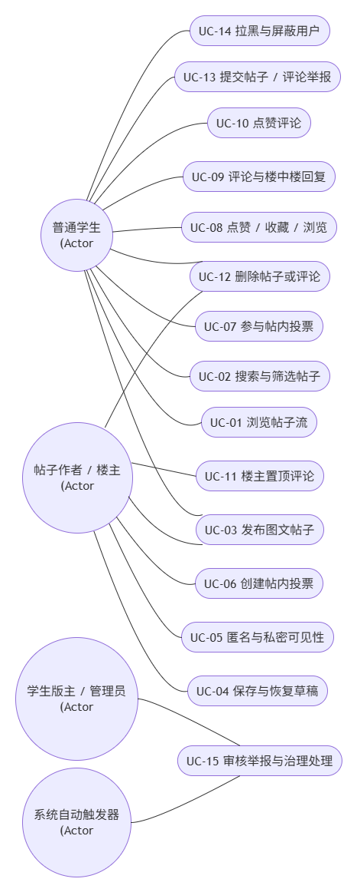

# 校园社交与互助平台 - 用例建模报告 (论坛与治理模块)

## 一、系统用例图
> **说明**：本图涵盖“普通学生”“帖子作者/楼主”“学生版主/管理员”以及“系统自动触发器”四类角色。根据当前需求范围，用例覆盖基础发帖/评论/举报、推荐信息流、发帖草稿、帖子摘要与封面、帖内投票、一级评论置顶、举报治理、阳光值信用分与管理员置顶等完整论坛能力。

---

## 二、用例简表 (汇总列表)

| 编号 | 用例名称 | 参与者 | 优先级 |
| :--- | :--- | :--- | :--- |
| UC-01 | 浏览推荐/最新/热门帖子流 | 普通学生 | Must |
| UC-02 | 搜索与筛选论坛帖子 | 普通学生 | Should |
| UC-03 | 发布图文帖子 | 普通学生 | Must |
| UC-04 | 保存与恢复发帖草稿 | 普通学生 | Should |
| UC-05 | 切换匿名与私密可见性 | 普通学生 | Must |
| UC-06 | 创建帖内投票 | 普通学生 | Should |
| UC-07 | 参与帖内投票 | 普通学生 | Should |
| UC-08 | 点赞、收藏、浏览帖子 | 普通学生 | Must |
| UC-09 | 发表评论与楼中楼回复 | 普通学生 | Must |
| UC-10 | 点赞评论 | 普通学生 | Should |
| UC-11 | 置顶一级评论 | 帖子作者/楼主 | Should |
| UC-12 | 删除自己的帖子或评论 | 普通学生/楼主 | Should |
| UC-13 | 提交帖子/评论举报 | 普通学生 | Must |
| UC-14 | 拉黑与屏蔽用户 | 普通学生 | Should |
| UC-15 | 审核举报内容 | 学生版主/管理员 | Must |
| UC-16 | 管理员置顶/取消置顶帖子 | 学生版主/管理员 | Should |
| UC-17 | 执行阳光值扣减与治理处罚 | 学生版主/系统触发器 | Must |
| UC-18 | 发送举报处理与违规通知 | 系统触发器 | Must |
| UC-19 | 记录治理审计日志 | 系统触发器/高级管理员 | Should |

---

## 三、核心用例详细说明

### UC-01: 浏览推荐/最新/热门帖子流
| 字段 | 内容 |
| :--- | :--- |
| **用例名称** | 浏览推荐/最新/热门帖子流 |
| **参与者** | 普通学生 |
| **前置条件** | 用户已登录并进入论坛首页 |
| **基本流** | 1. 用户进入论坛首页。 2. 系统默认展示“推荐”信息流。 3. 每张帖子卡片展示标题、类型、作者展示名、发布时间、摘要、封面图、点赞数、收藏数、浏览数、是否匿名、是否私密、是否置顶、是否包含投票等信息。 4. 用户可切换“最新”或“热门”排序。 5. 系统按所选排序重新加载帖子列表。 |
| **替代流** | 4a. 若用户选择推荐排序，系统结合 MBTI、历史互动、帖子热度、发布时间等信号生成推荐结果。 4b. 若帖子为管理员置顶帖，公共列表中优先展示。 |
| **后置条件** | 用户看到符合权限、排序和屏蔽规则的帖子流；私密帖和被拉黑用户内容不会越权展示。 |

### UC-03: 发布图文帖子
| 字段 | 内容 |
| :--- | :--- |
| **用例名称** | 发布图文帖子 |
| **参与者** | 普通学生 |
| **前置条件** | 用户已登录，当前阳光值未处于禁言或限制发帖状态 |
| **基本流** | 1. 用户点击“发布帖子”。 2. 系统打开发帖弹窗。 3. 用户填写标题、正文并选择帖子类型。 4. 用户可上传最多 9 张图片。 5. 用户可选择匿名发布和公开/私密可见性。 6. 用户点击提交。 7. 系统校验标题、正文、图片数量、投票选项等字段。 8. 校验通过后，系统生成帖子摘要，取首图作为封面图，并写入帖子、图片等数据。 9. 系统返回发布成功提示并刷新帖子列表或跳转详情页。 |
| **替代流** | 4a. 图片上传中时，用户关闭弹窗需等待或保存已上传成功的图片 URL。 7a. 校验失败时，系统提示具体错误，例如标题为空、图片超过上限、投票选项不合法。 5a. 匿名发布时，前端仅展示匿名身份，不暴露真实用户信息。 |
| **后置条件** | 新帖子进入对应可见范围的信息流；列表页可显示摘要、封面图和互动计数。 |

### UC-04: 保存与恢复发帖草稿
| 字段 | 内容 |
| :--- | :--- |
| **用例名称** | 保存与恢复发帖草稿 |
| **参与者** | 普通学生 |
| **前置条件** | 用户正在编辑发帖表单 |
| **基本流** | 1. 用户输入标题或正文。 2. 用户尝试关闭发帖弹窗。 3. 系统检测标题或正文非空，弹出是否保存草稿的确认框。 4. 用户选择保存。 5. 系统将标题、正文、帖子类型、匿名状态、可见性、已上传图片 URL、投票开关和投票选项保存到本地草稿。 6. 用户下次打开发帖弹窗时，系统自动恢复草稿。 |
| **替代流** | 3a. 若标题和正文均为空，系统直接关闭弹窗并清除旧草稿。 4a. 用户选择不保存，系统清除草稿并关闭弹窗。 4b. 用户取消关闭，继续编辑。 6a. 发布成功后，系统自动清除草稿。 |
| **后置条件** | 未发布内容不会误丢失；已发布或明确放弃的草稿不会残留。 |

### UC-06: 创建帖内投票
| 字段 | 内容 |
| :--- | :--- |
| **用例名称** | 创建帖内投票 |
| **参与者** | 普通学生 |
| **前置条件** | 用户正在创建帖子 |
| **基本流** | 1. 用户在发帖弹窗中打开“发起投票”。 2. 系统展示投票选项输入框。 3. 用户输入 2-4 个投票选项。 4. 系统校验每个选项非空、长度不超过 15 字且不得重复。 5. 用户提交帖子。 6. 系统在创建帖子时同步创建投票选项。 |
| **替代流** | 4a. 选项少于 2 个、多于 4 个、重复或超长时，系统阻止发布并提示原因。 |
| **后置条件** | 帖子详情页展示投票模块，其他用户可参与投票。 |

### UC-07: 参与帖内投票
| 字段 | 内容 |
| :--- | :--- |
| **用例名称** | 参与帖内投票 |
| **参与者** | 普通学生 |
| **前置条件** | 帖子包含投票，用户有权限查看该帖子，且该用户尚未对该投票投票 |
| **基本流** | 1. 用户进入帖子详情页。 2. 系统展示投票选项和当前票数。 3. 用户点击某个选项投票。 4. 系统校验用户未投过票。 5. 系统写入投票记录并更新选项票数。 6. 前端刷新投票结果，并提示投票成功。 |
| **替代流** | 4a. 若用户已投票，系统拒绝重复投票，并提示投票后不能更改选项。 |
| **后置条件** | 投票结果更新；同一用户对同一帖子只保留一次投票记录。 |

### UC-09: 发表评论与楼中楼回复
| 字段 | 内容 |
| :--- | :--- |
| **用例名称** | 发表评论与楼中楼回复 |
| **参与者** | 普通学生 |
| **前置条件** | 用户已登录，帖子存在且用户有权限访问 |
| **基本流** | 1. 用户进入帖子详情页。 2. 用户在评论框输入内容并提交一级评论。 3. 系统校验内容并写入评论。 4. 用户可点击某条一级评论下的回复入口。 5. 系统创建二级回复，并在评论区展示回复关系。 |
| **替代流** | 2a. 若帖子为匿名帖且评论者为楼主，系统应保持“匿名楼主”识别。 3a. 内容为空或用户无权限时，系统拒绝提交。 |
| **后置条件** | 评论数更新，相关用户可收到回复通知。 |

### UC-11: 置顶一级评论
| 字段 | 内容 |
| :--- | :--- |
| **用例名称** | 置顶一级评论 |
| **参与者** | 帖子作者/楼主 |
| **前置条件** | 用户是帖子作者，目标评论为该帖子下未删除的一级评论 |
| **基本流** | 1. 楼主进入自己帖子的详情页。 2. 楼主在某条一级评论旁点击“置顶”。 3. 系统校验该评论属于当前帖子，且不是二级回复、未删除、未违规。 4. 系统将该评论记录为当前帖子的置顶评论。 5. 评论列表刷新，置顶评论显示在最上方并带有置顶标识。 |
| **替代流** | 2a. 若已有其他置顶评论，系统自动取消原置顶并切换到新评论。 2b. 楼主点击已置顶评论的“取消置顶”，系统清空置顶评论。 |
| **后置条件** | 每个帖子最多有一条置顶评论，其余评论保持原排序逻辑。 |

### UC-13: 提交帖子/评论举报
| 字段 | 内容 |
| :--- | :--- |
| **用例名称** | 提交帖子/评论举报 |
| **参与者** | 普通学生 |
| **前置条件** | 用户已登录，目标帖子或评论存在且用户可见 |
| **基本流** | 1. 用户点击帖子或评论旁的举报按钮。 2. 系统打开举报弹窗。 3. 用户选择举报原因并填写补充说明。 4. 用户提交举报。 5. 系统创建举报工单，并记录被举报内容、举报人、原因和时间。 |
| **替代流** | 3a. 用户未选择举报原因时，系统阻止提交并提示。 |
| **后置条件** | 举报进入管理员审核队列，等待处理。 |

### UC-15: 审核举报内容
| 字段 | 内容 |
| :--- | :--- |
| **用例名称** | 审核举报内容 |
| **参与者** | 学生版主/管理员 |
| **前置条件** | 举报队列中存在待处理工单，管理员已登录后台 |
| **基本流** | 1. 管理员进入举报处理中心。 2. 系统展示举报类型、举报说明、被举报内容和必要快照。 3. 管理员判定内容违规。 4. 管理员选择处理动作，例如软删除内容、扣减阳光值、限制用户功能。 5. 系统执行处理动作，更新举报状态，写入审计日志。 6. 系统向举报人和被处理用户发送通知。 |
| **替代流** | 3a. 若判定不违规，管理员驳回举报并填写理由，系统向举报人发送驳回通知。 |
| **后置条件** | 举报工单完结，治理结果可追溯，前台内容状态与处理结果一致。 |

### UC-16: 管理员置顶/取消置顶帖子
| 字段 | 内容 |
| :--- | :--- |
| **用例名称** | 管理员置顶/取消置顶帖子 |
| **参与者** | 学生版主/管理员 |
| **前置条件** | 管理员已登录后台，目标帖子存在且未删除 |
| **基本流** | 1. 管理员在帖子管理入口选择目标帖子。 2. 管理员点击置顶。 3. 系统更新帖子置顶状态。 4. 公共论坛列表刷新后，该帖子优先展示并显示置顶标识。 |
| **替代流** | 2a. 若帖子已置顶，管理员可点击取消置顶，系统移除置顶状态。 |
| **后置条件** | 置顶/取消置顶操作写入审计日志，公共列表排序生效。 |

### UC-17: 执行阳光值扣减与治理处罚
| 字段 | 内容 |
| :--- | :--- |
| **用例名称** | 执行阳光值扣减与治理处罚 |
| **参与者** | 学生版主、系统触发器 |
| **前置条件** | 用户内容被确认违规，或阳光值低于治理阈值 |
| **基本流** | 1. 管理员确认举报成立或系统识别到违规状态。 2. 系统按规则扣减用户阳光值。 3. 若分值低于阈值，系统进入限制或冷却状态。 4. 低分用户在发帖、评论等操作中受到限制。 5. 系统向用户发送违规与限制说明。 |
| **替代流** | 3a. 若用户处于恢复期，系统按时间和行为规则逐步恢复信用分。 |
| **后置条件** | 用户信用状态更新，后续论坛权限按阳光值状态执行。 |

---

## 四、用例关系说明

- `UC-03 发布图文帖子` 可扩展 `UC-04 保存与恢复发帖草稿`、`UC-05 切换匿名与私密可见性`、`UC-06 创建帖内投票`。
- `UC-01 浏览帖子流` 包含摘要/封面展示、置顶帖优先展示、推荐/最新/热门排序等子能力。
- `UC-09 发表评论与楼中楼回复` 可扩展 `UC-10 点赞评论` 和 `UC-11 置顶一级评论`。
- `UC-13 提交举报` 触发 `UC-15 审核举报内容`，审核完成后触发 `UC-18 发送处理结果通知`。
- `UC-15 审核举报内容` 可触发 `UC-17 阳光值扣减与治理处罚` 和 `UC-19 记录治理审计日志`。

---

## 五、优先级任务汇总 (MoSCoW)

### Must Have - 必须交付
- UC-01 浏览推荐/最新/热门帖子流
- UC-03 发布图文帖子
- UC-05 切换匿名与私密可见性
- UC-08 点赞、收藏、浏览帖子
- UC-09 发表评论与楼中楼回复
- UC-13 提交帖子/评论举报
- UC-15 审核举报内容
- UC-17 执行阳光值扣减与治理处罚
- UC-18 发送举报处理与违规通知

### Should Have - 重要增强
- UC-02 搜索与筛选论坛帖子
- UC-04 保存与恢复发帖草稿
- UC-06 创建帖内投票
- UC-07 参与帖内投票
- UC-10 点赞评论
- UC-11 置顶一级评论
- UC-14 拉黑与屏蔽用户
- UC-16 管理员置顶/取消置顶帖子
- UC-19 记录治理审计日志

### Could Have - 后续优化
- 更细粒度的推荐解释
- 更丰富的投票类型，如多选投票或截止时间
- 更完整的申诉工作流
- 敏感词前置拦截和内容安全模型

