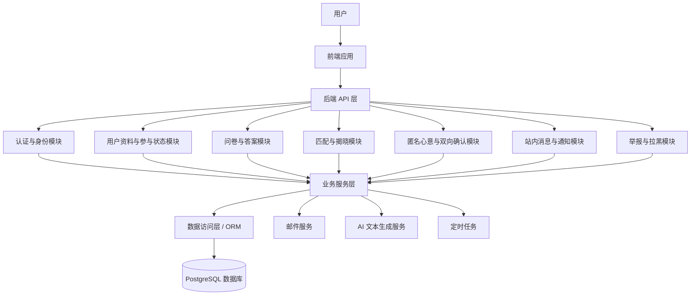
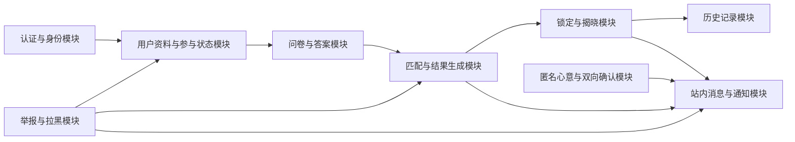

# 03-architecture-design-document

# 一、架构图

本系统采用前后端分离的分层架构。前端负责页面展示与用户交互，后端负责业务规则、认证鉴权、匹配流程、消息通知与数据访问，数据库负责持久化核心业务数据。系统整体以模块化单体作为 Phase 2 阶段的落地形态，在保持实现成本可控的同时，为后续拆分服务或扩展能力预留边界。

# 二、模块划分

## 2.1 认证与身份模块

认证与身份模块负责用户注册、登录、找回密码、身份认证与登录态维护。该模块是系统入口模块，为其他业务模块提供用户身份识别能力。

**职责边界：**

- 处理用户注册、登录、找回密码等账号流程
- 生成和校验用户登录凭证
- 为后续业务请求提供用户身份上下文
- 不负责用户详细资料、问卷答案或匹配逻辑

## 2.2 用户资料与参与状态模块

用户资料与参与状态模块负责维护用户个人资料、建档流程和参与匹配的状态信息。该模块为问卷、匹配、揭晓等模块提供用户基础数据。

**职责边界：**

- 管理用户个人资料
- 维护用户是否完成建档、是否参与本轮匹配等状态
- 为匹配流程提供用户可参与性判断依据
- 不负责问卷题目管理、匹配算法或通知投递

## 2.3 问卷与答案模块

问卷与答案模块负责灵魂问卷、答案保存和问卷版本管理。该模块沉淀用户偏好与人格相关数据，是匹配算法的重要输入来源。

**职责边界：**

- 管理问卷题目与问卷版本
- 保存用户问卷答案
- 支持后续根据问卷版本追溯用户答案
- 不直接生成匹配结果

## 2.4 匹配与结果生成模块

匹配与结果生成模块负责主匹配算法、结果生成、匹配锁定与匹配批次处理。该模块是系统核心业务模块，依赖用户资料、参与状态和问卷答案。

**职责边界：**

- 读取可参与匹配的用户集合
- 根据用户资料与问卷答案计算匹配关系
- 生成并锁定匹配结果
- 维护本轮匹配结果的生命周期
- 不负责前端展示细节或消息列表管理

## 2.5 揭晓与历史记录模块

揭晓与历史记录模块负责匹配结果揭晓页、历史记录页和未成功提示。该模块面向用户展示匹配结果状态，但不负责生成匹配结果本身。

**职责边界：**

- 展示已锁定并可揭晓的匹配结果
- 展示用户历史匹配记录
- 处理未匹配成功时的提示信息
- 不修改匹配算法和匹配结果生成规则

## 2.6 匿名心意与双向确认模块

匿名心意与双向确认模块负责用户对匹配对象的匿名心意表达，以及双方意向达成时的确认流程。

**职责边界：**

- 保存用户对匹配对象的匿名表达
- 判断是否形成双向意向
- 将双向确认结果传递给消息与通知模块
- 不负责匹配对象生成或站内消息列表维护

## 2.7 站内消息与通知模块

站内消息与通知模块负责站内消息中心、消息列表、未读 / 已读状态、红点 / 角标，以及与主线相关的通知提醒。邮件提醒属于通知渠道之一，站内消息中心是独立的业务模块。

**职责边界：**

- 管理站内消息的生成、读取和状态变化
- 支持未读数量、已读状态、红点或角标展示
- 承接匹配、揭晓、双向确认等业务事件产生的通知
- 不负责匹配算法或用户资料维护

## 2.8 举报与拉黑模块

举报与拉黑模块负责用户侧举报与拉黑入口的业务接入，为匹配、消息和用户互动提供安全边界。

**职责边界：**

- 接收用户举报
- 维护用户拉黑关系
- 在匹配、展示和消息相关流程中提供限制依据
- 不负责审核后台或复杂风控策略

## 2.9 定时任务模块

定时任务模块负责与主线业务有关的周期性流程，例如提醒、匹配、解锁和过期处理。该模块不承载业务规则本身，而是按时间触发对应业务模块执行。

**职责边界：**

- 触发周期性提醒
- 触发匹配与揭晓相关流程
- 触发过期状态处理
- 不直接实现认证、问卷、匹配算法或消息展示逻辑

## 2.10 外部服务适配模块

外部服务适配模块负责对邮件服务和 AI 文本生成服务进行封装，使业务模块不直接依赖外部服务的具体实现。

**职责边界：**

- 封装邮件发送能力
- 封装 AI 生成 Curator's Note 的能力
- 为业务模块提供稳定的内部调用边界
- 不保存核心业务状态

# 三、模块间接口

本系统采用前后端分离与后端模块化单体架构，因此系统接口主要分为前端与后端通信接口、后端内部模块调用以及外部服务接口。

## 3.1 前后端通信接口

- **调用方式**：HTTP/HTTPS RESTful API。
- **数据格式**：请求和响应的数据载荷统一为 JSON（`application/json`）格式。请求头中需携带 JWT Token 进行身份认证（`Authorization: Bearer <token>`），响应内容统一包装为标准结构对象（包含状态码 code、业务提示 message 和具体数据体 data）。

## 3.2 后端内部模块间接口

由于后端采用模块化单体架构（Modular Monolith），所有业务模块（如认证、用户、匹配等）均运行在同一个 Node.js 进程中。为了保证模块间的隔离与高内聚，模块间禁止直接连接对方的数据库表，必须通过各模块对外暴露的 Service 层接口进行交互。

- **调用方式**：进程内的方法或函数调用（In-process Function/Method Call）。
- **数据格式**：TypeScript 强类型接口或数据传输对象（DTO, Data Transfer Objects）。内部方法调用过程若发生错误，抛出标准化业务异常。

下面列举核心业务模块之间的关键调用接口（伪代码表示）：

### 3.2.1 认证与身份模块提供给其他模块
- `AuthService.validateSession(token: string): Promise<UserSessionDTO>`
  - 收口所有需要鉴权的请求调用，解析 Token 并返回当前用户上下文。

### 3.2.2 用户资料与状态模块提供给其他模块
- `UserService.getUserProfile(userId: string): Promise<UserProfileDTO>`
  - 用于匹配逻辑中获取用户性别、性取向、MBTI等基础属性。
- `UserService.checkParticipationStatus(userId: string): Promise<boolean>`
  - 获取某用户是否符合本轮匹配的要求（如已建档、无违规、未主动退出）。
- `UserService.getEligibleUsers(): Promise<string[]>`
  - 供定时任务或匹配模块调用，一次性拉取本轮可生成匹配的所有活跃用户ID。

### 3.2.3 问卷与答案模块提供给其他模块
- `SurveyService.getUserAnswers(userId: string, versionId?: string): Promise<UserAnswerDTO[]>`
  - 核心接口。匹配模块通过该接口获取参与者所有的底层价值观数据，以进行匹配度计算。

### 3.2.4 匹配与结果生成模块提供给其他模块
- `MatchService.triggerWeeklyMatch(batchConfig: MatchBatchDTO): Promise<MatchResultSummaryDTO>`
  - 供定时任务模块调用，触发周三的整批匹配运算逻辑。
- `MatchService.revealMatch(userId: string, matchId: string): Promise<void>`
  - 用户解锁时前端请求触发，更新匹配状态并可能会抛出未准备好解锁等异常。

### 3.2.5 举报与拉黑模块提供给其他模块
- `SafetyService.getBlockedList(userId: string): Promise<string[]>`
  - 匹配发生前，匹配模块通过该接口提取不可进入匹配池的黑名单用户集合。
- `SafetyService.checkInteractionAllowed(userA: string, userB: string): Promise<boolean>`
  - 站内信互发前，消息模块调用验证这两人是否因为最近被拉黑而不能通信。

### 3.2.6 站内消息与通知模块提供给其他模块
- `MessageService.sendSystemNotification(receiverId: string, payload: SystemNoticeDTO): Promise<void>`
  - 通用的系统发信接口。例如，当匹配成功、揭晓成功或是匿名双向确认达成意向时，其他模块调用此接口投递站内红点或消息。

## 3.3 外部服务接口

系统对外部服务的依赖被封装在独立的外联适配模块中，业务层仅通过内部方法接口获得外部支持能力。

- **调用方式**：基于 HTTP/HTTPS API 远程调用或底层专用通信协议（如 SMTP）。
- **数据格式**：以目标服务商平台的标准规范为准，多数为 JSON 数据格式。
- **外部调用示例**：
  - **AI 文本生成服务**：向阿里云 DashScope 发送 HTTP POST 请求，通过 JSON 载荷传递 Prompt 与参数，解析响应 JSON 提取生成的 Curator's Note。
  - **邮件投递服务**：应用 Nodemailer 基于 SMTP 协议或封装一层 HTTP 接口向外发送验证码与通知通知邮件（HTML 格式报文）。

# 四、技术选型

| 层次 | 选型 | 选择理由 |
|---|---|---|
| Runtime | Node.js 20+（ES Modules） | 与前端统一技术生态，降低团队学习成本；适合 I/O 密集型 Web 后端；便于快速交付。 |
| 后端框架 | Express.js | 框架轻量，学习成本低，生态成熟；适合 10 周内完成以业务流程为主的模块化单体系统。 |
| 后端语言 | TypeScript | 提供类型安全，降低模块间调用错误；与前端技术栈一致，便于团队协作。 |
| 数据库 | PostgreSQL 16 | 适合保存用户、问卷、匹配结果、消息、举报拉黑等强关系数据；支持事务和并发访问。 |
| ORM | Drizzle ORM | 类型安全、轻量、接近原生 SQL；便于在保持开发效率的同时控制数据库访问逻辑。 |
| 认证 | JWT（jsonwebtoken） | 无状态认证方式，适合前后端分离；便于前端保存和携带登录凭证。 |
| 邮件服务 | Nodemailer（SMTP）+ 阿里云 DirectMail API | 支持验证码、提醒和匹配通知等邮件场景；双 Provider 设计便于后续切换和容灾。 |
| AI 服务 | 通义千问（DashScope OpenAI 兼容 API） | 用于生成 Curator's Note；OpenAI 兼容接口便于封装和替换。 |
| 定时任务 | node-cron | 能够支持周二提醒、周三匹配 / 解锁、周五过期等周期性任务；实现简单，适合当前阶段。 |
| 数据校验 | Zod | 与 TypeScript 深度结合，适合对请求参数和业务输入进行 Schema 校验。 |
| 容器化与部署 | Docker Compose | 支持一键启动 PostgreSQL、Backend、Frontend；降低本地开发与演示部署成本。 |
