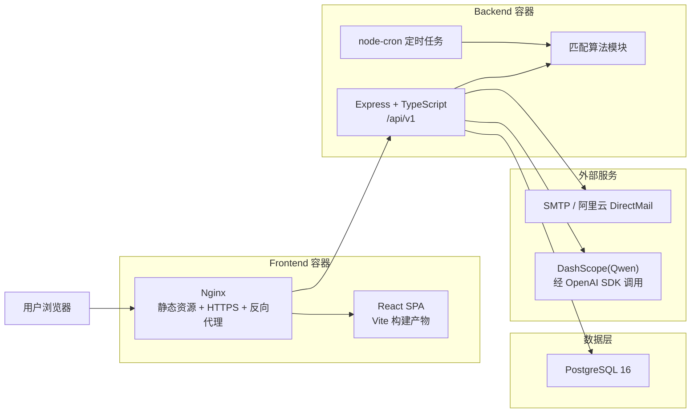
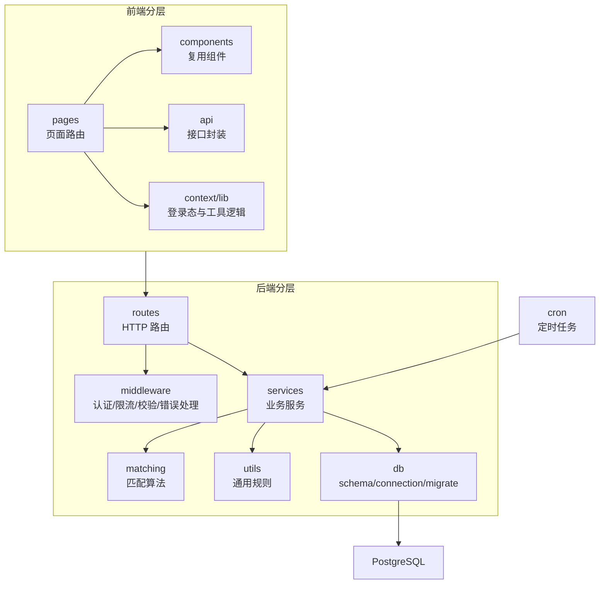
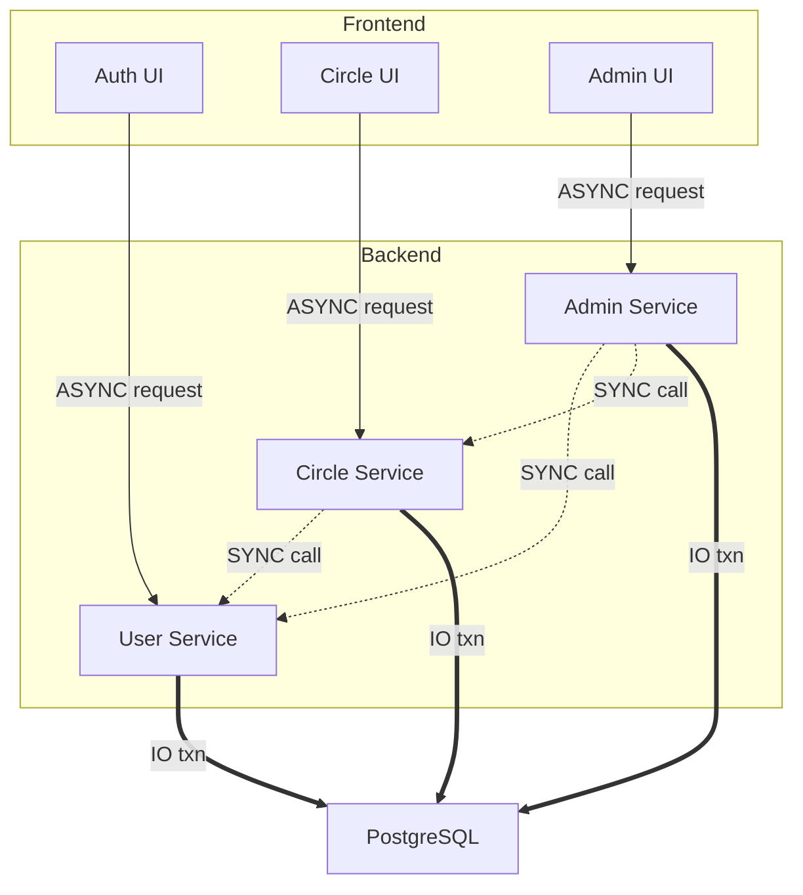

# 架构设计文档（统一架构 + 圈子组范围）

## 1. 架构概览

### 1.1 架构风格

统一仓库下的模块化分层单体架构（Modular Layered Monolith）。

### 1.2 系统总体架构图

### 1.3 统一分层图

## 2. 模块划分说明

### 2.1 三组在同一套架构中的分工

| 业务域 | 负责组 | 当前真实情况 |
|------|------|-------------|
| 注册、登录、用户资料、问卷、主匹配、揭晓 | 第一组主责 | 已接入统一前后端与数据库 |
| 兴趣圈、圈内名片、好友、联系方式解锁、圈内组队 | 第二组主责 | 已接入统一前后端与数据库 |
| 举报、拉黑、后台治理、论坛 | 第三组主责 | 治理部分已实现；论坛未完整接通 |

### 2.2 当前真实模块总表（统一系统视角）

| 模块 | 前端入口 | 后端接口/入口 | 核心数据对象 | 当前状态 |
|------|---------|---------------|-------------|---------|
| 认证与账户 | `/login`、账户设置页 | `/api/v1/auth/*` | `users`、`otp_codes` | 已实现 |
| 用户资料与参与状态 | `/dashboard`、`/account` | `/api/v1/user/*` | `users` | 已实现 |
| 主问卷与主匹配 | `/survey`、`/reveal` | `/api/v1/survey/*`、`/api/v1/match/*` | `survey_answers`、`matches` | 已实现 |
| 兴趣圈发现与加入退出 | `/circles`、`/circles/:id` | `/api/v1/circles/*` | `circles`、`circle_members`、`circle_member_roles` | 已实现 |
| 圈内问卷与圈内匹配 | 圈子详情相关流程 | `/api/v1/circles/:circleId/questionnaire`、`/api/v1/circles/:circleId/match/*` | `circle_questions`、`circle_matches` | 已实现 |
| 圈内频道成员展示 | `/circles/:id` | `/api/v1/circles/:circleId/channel` | `circle_questions`、`user_circle_cards` | 已实现 |
| 基础名片与圈内名片 | `/settings/card`、圈子名片弹窗 | `/api/v1/card/*` | `base_card_components`、`user_base_cards`、`user_circle_cards`、`user_circle_custom_cards` | 已实现 |
| 圈内好友关系 | 圈子详情页、名片弹窗 | `/api/v1/friends/*` | `friendships`、`global_friendships`、`friend_requests` | 已实现 |
| 联系方式解锁 | 相关弹窗/名片流程 | `/api/v1/contacts/*` | `contact_unlock_requests` | 已实现 |
| 圈内组队 TeamUp | `/circles/:id/teamups*` | `/api/v1/circles/:circleId/teamups*` | `teamups`、`teamup_members`、`teamup_applications`、`teamup_member_contacts` | 已实现 |
| 后台管理与治理 | `/admin` | `/api/v1/admin/*` | `audit_logs`、`user_reports` 及多业务表 | 部分实现 |
| 举报与拉黑 | 用户侧入口 | `/api/v1/user/report/*`、`/api/v1/user/block/*` | `user_reports`、`user_blocks` | 已实现 |
| 论坛 | 当前无真实前端页面 | 当前无真实 forum 路由 | `forum_posts`、`forum_comments`、`teamup_forum_sync_jobs` | 仅数据层预留，未完整接通 |

### 2.3 模块职责边界与依赖关系

在模块化单体架构下，系统按业务域划设核心模块边界，各模块职责如下：

- **用户与认证模块（User & Auth）**：第一组主责。负责全局身份的认证凭发（JWT）、生命周期管理、基础档案数据维护。作为底层基建，向下管理用户库，不核心依赖其他业务模块。
- **圈子与社交模块（Circle & Social）**：第二组主责。构筑场域与名片社交链路。负责独立场域的创建与成员调度（圈子）、关系资产沉淀（好友网络、多层级名片）以及场内撮合（TeamUp组队）。
- **治理与论坛模块（Forum & Admin）**：第三组主责。负责整个应用生态的内容沉淀与健康管控（拉黑、举报审核）与论坛发帖。

**模块依赖关系图：**

**关键数据流与通信标识说明 (Flows highlight)：**
- **SYNC call (.-.)**：表示后端进程内的同步调用，不经过网络栈。
- **ASYNC request (-->)**：表示前端到后端的异步接口请求（Frontend -> Backend）。
- **IO txn (==>)**：表示连接数据层的同频事务流，强调同一事务实例贯通多表写入。圈子服务（CircleSvc）还包含按活动时间窗口计算 TeamUp 有效状态的逻辑；cron 主要用于主匹配与提醒流程。

### 2.4 模块间的接口与通信规范

鉴于系统采用**模块化单体（Modular Monolith）架构**，模块间的边界隔离与通信绝非远程网络调用，具体细则和数据格式明确如下：

1. **前后端接口（跨物理边界通信）**：
   - **调用方式**：前后端完全分离，前端基于 HTTP/1.1 RESTful API 通过 `Axios`/`Fetch` 向后端发包。
   - **数据格式**：统一以 JSON (`application/json`) 格式传输。接口输入数据必须在后端的路由中间件层（Route Middleware）利用 `Zod` 库统一完成入参拦截与业务反序列化；后端返回数据封装为统一格式结构回传。

2. **后端内部业务模块接口（进程内通信）**：
   - **调用方式**：通过 **Service 层的函数方法直接调用（In-Process calls）**。业务执行具有边界保护机制，明确禁止直接跨业务模块越权操作底层数据库（例如：圈子社交模块不能直接编写原生 SQL 修改 User 表的数据，必须通过引入并调用 `UserService.updateProfile(...)` 提供的方法来规制）。
   - **数据格式**：采用强类型的 TypeScript Interfaces 以及 Drizzle 提供的强类型 Schema，直接在内存中流转对象引用，杜绝无谓的 JSON 序列化与反序列化性能损耗。
   - **跨模块同频事务**：当存在跨模块联动操作（如：TeamUp成队后强制建立临时联系人身份）时，底层直接传递由 Drizzle 创建的数据库 `Transaction` 事务连接实例。下级依赖的所有 Service 共享同一事务管线，确保操作的 ACID 原子能力不受业务解耦影响。

### 2.5 圈子组（第二组）模块细化与交互模型

第二组主责在统一模块体系中管理核心的 **“场域与名片社交链路”**，重点落脚在发现、留存、社交与成组。以下为涉及架构的核心交互链路及其实现原理：

**1. 圈子场域（Discovery & Core Domain）**
- **发现与加入流程**：前端由 `CircleHome`（历史实现含 `CircleList`）发起查询，通过 `GET /api/v1/circles` 读取状态活跃的广场圈子。一旦用户调用 `POST /api/v1/circles/:circleId/join`，后端将在数据库层的同一事务下，更新 `circle_members` 建立身份状态，并立刻初始化与之关联的名片实体记录（见流程 4）。
- **频道隔离**：在 `CircleDetail` 的核心频道展示中，`GET /api/v1/circles/:circleId/channel` 会严格控制权限，并在服务端通过视图查询阻断非 `public` 的字段实体以及没有标记为 `isChannelTag=true` 的数据，从底层保障隐私不出圈。

**2. 深度关系（Friends & Contacts）**
- **社交闭环构建**：基于圈子的二次交互衍生出好友体系。`POST /api/v1/friends/request` 被强依赖于两个前提上下文——一是必须在同一圈内，二是身份为 active。关系的确立过程带有防抵赖性，会抓取当时的**名片快照**一并记入 `friend_requests` 之中。
- **高敏数据提防**：联系方式（Contacts）受到最严密的隔离管控。不能由于单向关注或仅因同圈直接获取，当 `sourceType=circle` 时，要求存在双向的好友关联（Global Friend），且需经过 `POST /api/v1/contacts/unlock-request` 的显式请求以及对方的 Approve 操作才能实现授权可见。

**3. 多层名片（Cards: A/B/C）**
- **结构模型**：架构上的设计解耦了基础信息与具体场域。
  - **A 区名片**：统配信息，绑定 `base_card_components` 映射用户原生的调查信息与通配身份（`GET/PUT /card/base/me`）。
  - **B/C 区名片**：基于圈的特化模块。系统字段通过圈子初始化自带；自定义内容（C区）则支撑灵活扩展（`PATCH /card/circle/:circleId/me/custom-items`）。两者基于粒度权限（公开/好友/隐藏）提供给 API `GET /card/:userId/public` 和 `friend` 的聚合计算。

**4. 衍生能力（TeamUp 组队）**
- **圈闭环发车**：圈内组队机制复用了场域拦截，由 `CircleTeamHall` 管理。发车/参与要求前置拥有可见状态。架构上支持两套挂载引擎：
  - Direct 模式及 Approval 模式在路由组 `/api/v1/circles/:circleId/teamups*` 完成状态机流转。成员的关联信息以联防保护方式（活动未结束且属于同队）向外有限透明。

主要请求的路由边界集合：
- 场域承载：`/api/v1/circles/*`
- 信息分发：`/api/v1/card/*`
- 社交网络：`/api/v1/friends/*`
- 隐私资产：`/api/v1/contacts/*`
- 同好聚集：`/api/v1/circles/:circleId/teamups*`
- TeamUp 公共摘要：`/api/v1/teamups/public/*`
- TeamUp 申请回复：`/api/v1/teamups/applications/replies`

### 2.6 圈子组核心状态机与数据流说明

基于上文的模块划分，核心数据在单体架构下流转时受到严格的状态机管控：

- **圈子成员状态（membershipStatus）**：由 `active`（活跃）主导频道访问权限，同时配合 `isActive` 防打扰拨板控制当前用户是否接收圈内邀请。
- **名片字段状态（public / hidden / deleted）**：决定字段粒度的呈现。`deleted` 状态主要用于 B区组件默认隐藏；`public` 是进入大厅频道流（Channel）的硬性前置条件。
- **好友申请状态机（friend_requests）**：状态在 `pending -> accepted / rejected` 之间流转。发起动作同时锚定了一份瞬时名片快照（Card Snapshot），避免后续修改导致的语境欺诈。
- **联系方式解锁状态机（contact_unlock_requests）**：流转于 `pending -> approved / rejected`，在批准事件（approved）落库后，访问层才会解除针对该请求方查询 `targetUserId` 联系方式的拦截。
- **组队生命周期（TeamUp）**：包括队伍状态（`recruiting -> full -> cancelled`）与用户席位审批（基于 `direct` 与 `approval` 加入模式的不同策略）；系统同时基于 `deadlineAt/endAt` 计算 `effectiveStatus`（如 `expired/ended`）。

## 3. 技术选型说明

| 层次 | 选择 | 选择理由 | 框架与代码配置路径 (证据) |
|------|------|---------|-------------------------|
| 前端框架 | React 19 + React Router 7 + Vite 6 | SPA 组织方式已落地，路由与构建链路稳定 | `frontend/package.json` |
| 前端样式与动效 | Tailwind CSS 4 + Framer Motion | 当前页面样式与动画基于该组合 | `frontend/package.json`, `frontend/vite.config.ts` |
| 后端框架 | Express 5 + TypeScript | 入口、路由与中间件体系已落地 | `backend/package.json` |
| 数据库 | PostgreSQL 16 | 统一主数据源，关系型建模适配当前业务 | `docker-compose.yml` (`db` 服务) |
| ORM / 数据访问 | Drizzle ORM + `postgres` 驱动 | schema 与查询统一在 Drizzle 上管理 | `backend/src/db/schema.ts`, `backend/package.json` |
| 认证 | JWT + bcryptjs + OTP 验证码 | 当前登录、注册、找回密码均依赖该方案 | `backend/package.json` |
| 请求校验 | Zod | 路由层请求体验证统一使用 | `backend/package.json` |
| 安全中间件 | Helmet + CORS + express-rate-limit | 后端入口层统一启用 | `backend/package.json` |
| 定时任务 | node-cron | 匹配与提醒等定时流程在后端进程内触发 | `backend/src/cron/*` |
| 邮件能力 | Nodemailer / 阿里云 DirectMail | 验证码与通知邮件发送 | `backend/src/utils/email.ts` |
| AI 能力 | OpenAI SDK + DashScope(Qwen) 兼容接口 | 生成部分匹配相关 AI 内容 | `backend/src/services/aiService.ts` |
| 反向代理 / 静态部署 | Nginx | HTTPS、静态资源与 API 转发 | `nginx-ssl.conf`, `frontend/nginx.conf` |
| 容器化部署 | Docker Compose | 一键启动前端、后端、数据库 | `docker-compose.yml`, `backend/Dockerfile`, `frontend/Dockerfile` |
| 缓存 | 当前未引入 | 代码中未落地 Redis 等缓存层 | 无相关代码实体 |
| 消息队列 | 当前未引入 | 代码中未落地 MQ | 无相关代码实体 |

## 4. ADR 集合

- ADR-001：采用统一仓库下的模块化分层单体架构（详见 ADR 文件）
- ADR-002：统一使用 PostgreSQL + Drizzle 作为主数据层（详见 ADR 文件）
- ADR-003：圈子社交的隐私分层与可见性控制（详见 ADR 文件）
- ADR-004：加入圈子时自动初始化 A/B 区名片（详见 ADR 文件）
