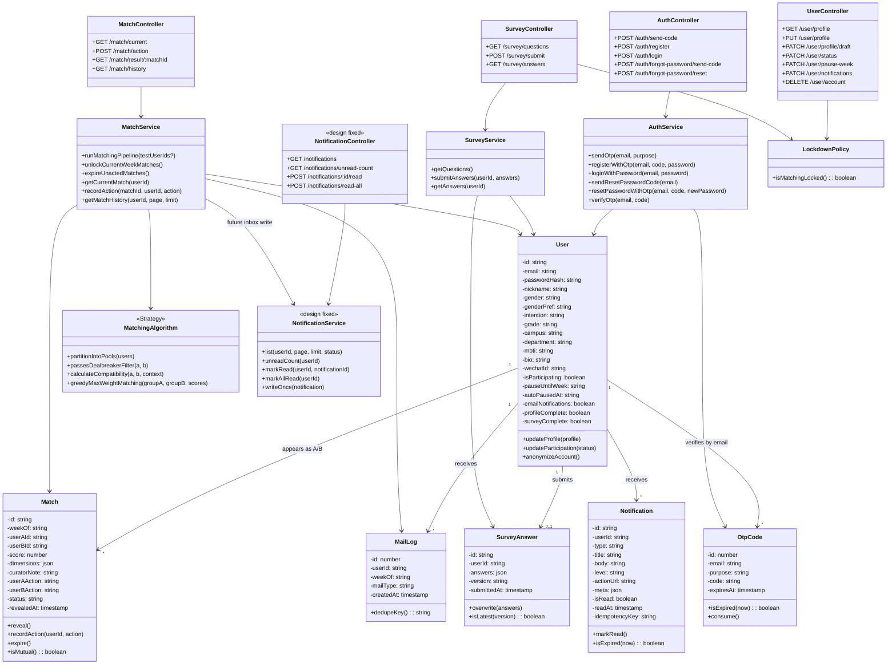

# 类图设计（用户主线与匹配子系统）

> 阶段：P3 详细设计  
> 小组：g1  
> 范围：认证、用户资料、问卷、主匹配、揭晓/历史、站内消息中心

---

## 1. 当前实现基线

当前后端实际采用 TypeScript + Express + Drizzle 的函数式模块组织方式，而不是传统 Java/OOP 的 Controller-Service-Repository 类继承结构。

因此本文使用 UML 类图表达**逻辑设计边界**，映射关系如下：

| UML 层次 | 当前代码中的落点 |
|---|---|
| Controller | `backend/src/routes/auth.ts`、`user.ts`、`survey.ts`、`match.ts` |
| Service | `authService.ts`、`surveyService.ts`、`matchService.ts`、`aiService.ts` |
| Algorithm / Policy | `matching/*`、`utils/lockdown.ts`、`middleware/validate.ts` |
| Entity | `backend/src/db/schema.ts` 与迁移 SQL |

站内消息中心属于第一组主责，但当前 `/api/v1/notifications` 尚未注册，本文按“设计已定”表达。

---

## 2. 核心类图

---

## 3. 核心职责拆分

| 模块 | 职责 | 关键类/文件 |
|---|---|---|
| 认证 | 邮箱验证码、注册、登录、重置密码、JWT 签发 | `AuthController`、`AuthService`、`OtpCode` |
| 用户资料 | 建档、草稿保存、参与状态、注销匿名化 | `UserController`、`User`、`LockdownPolicy` |
| 问卷 | 题库读取、答案提交、版本校验、匹配输入 | `SurveyController`、`SurveyService`、`SurveyAnswer` |
| 匹配 | 候选人筛选、硬条件过滤、兼容度评分、配对、揭晓、历史 | `MatchService`、`MatchingAlgorithm`、`Match` |
| 通知 | 邮件去重与站内消息中心 | `MailLog`、`NotificationService`、`Notification` |

---

## 4. 关键关系说明

1. `User` 与 `SurveyAnswer` 是一对一关系。每个用户最多保留一份当前问卷答案，提交时覆盖更新。
2. `User` 与 `Match` 是一对多关系。一个用户每周最多出现在一个主匹配记录中，通过 `user_a_id` 或 `user_b_id` 关联。
3. `MatchService` 组合多个算法策略：候选池分组、dealbreaker 过滤、兼容度评分、最大权重匹配。
4. `LockdownPolicy` 被用户状态和问卷提交共同依赖，用于保证周三匹配窗口内数据不被修改。
5. `MailLog` 与未来的 `Notification` 都承担幂等职责，防止重复提醒。

---

## 5. 设计模式应用

### 5.1 策略模式（Strategy）

使用位置：`MatchingAlgorithm` 中的候选池划分、硬条件过滤、兼容度评分、最大权重匹配。

使用理由：
- 匹配规则天然会迭代，例如恋爱匹配与朋友匹配权重不同，未来也可能新增实验算法。
- 将评分、过滤、配对拆成策略后，可以单独测试和替换某一环节。

如果不用：
- 所有算法逻辑会堆进 `matchService.ts`，新增问卷维度或调整权重时容易影响揭晓、邮件、历史等流程。

### 5.2 状态模式（State）

使用位置：`Match.status` 的 `LOCKED -> REVEALED -> MUTUAL/MISSED/EXPIRED`。

使用理由：
- 不同状态允许的操作不同：`LOCKED` 不能选择，`REVEALED` 可选择，`EXPIRED` 不可再选择。
- 状态机能把业务约束放在一个可验证的模型里。

如果不用：
- 各接口会用零散 if 判断状态，容易出现“过期后还能操作”或“双选后状态不一致”等问题。

### 5.3 门面模式（Facade）

使用位置：`MatchService` 对 Controller 暴露 `getCurrentMatch`、`recordAction`、`getMatchHistory` 等稳定入口。

使用理由：
- Controller 不需要知道候选池、评分、邮件、历史记录如何组合。
- 便于定时任务和管理后台复用同一组业务能力。

如果不用：
- 路由层会直接编排数据库、算法和通知，HTTP 代码变厚，后续维护成本上升。

---

## 6. 与 SOLID 的对应

| 原则 | 设计体现 |
|---|---|
| S 单一职责 | Auth / User / Survey / Match / Notification 分模块负责 |
| O 开闭原则 | 匹配算法、通知类型通过策略与类型枚举扩展 |
| L 里氏替换 | 算法策略只依赖统一输入输出，可替换实现 |
| I 接口隔离 | 用户资料、问卷、匹配、通知接口分开，不强迫调用方依赖“大用户服务” |
| D 依赖倒转 | 业务层面面向算法策略和通知服务能力，而不是把具体 SQL/邮件细节暴露给 Controller |

