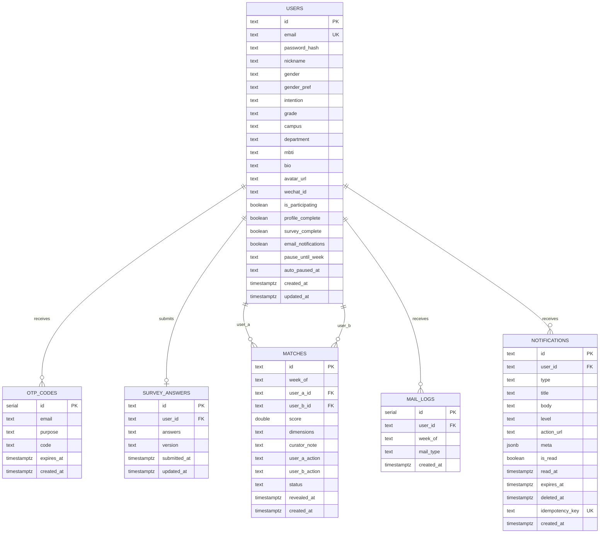

# ER 图 + 建表 SQL（用户主线与匹配子系统）

> 阶段：P3 详细设计  
> 小组：g1  
> 范围：用户、验证码、问卷、匹配、邮件幂等、站内消息中心

---

## 1. ER 图



---

## 2. 建表 SQL

以下 SQL 以 PostgreSQL 为目标。`users`、`otp_codes`、`survey_answers`、`matches`、`mail_logs` 已在当前迁移中存在；`notifications` 为站内消息中心建议新增表。

### 2.1 用户表

```sql
CREATE TABLE IF NOT EXISTS users (
  id TEXT PRIMARY KEY,
  email TEXT UNIQUE NOT NULL,
  password_hash TEXT,
  nickname TEXT,
  gender TEXT CHECK(gender IN ('male','female')),
  gender_pref TEXT CHECK(gender_pref IN ('male','female','any')),
  intention TEXT CHECK(intention IN ('friend','partner')),
  grade TEXT,
  campus TEXT CHECK(campus IN ('xianlin','gulou','suzhou','pukou')),
  department TEXT,
  mbti TEXT,
  bio TEXT,
  avatar_url TEXT,
  wechat_id TEXT,
  is_participating BOOLEAN DEFAULT TRUE,
  profile_complete BOOLEAN DEFAULT FALSE,
  survey_complete BOOLEAN DEFAULT FALSE,
  email_notifications BOOLEAN NOT NULL DEFAULT TRUE,
  pause_until_week TEXT,
  auto_paused_at TEXT,
  created_at TIMESTAMPTZ DEFAULT NOW(),
  updated_at TIMESTAMPTZ DEFAULT NOW()
);

CREATE INDEX IF NOT EXISTS idx_users_matching_eligibility
  ON users(is_participating, profile_complete, survey_complete);
```

索引说明：
- `idx_users_matching_eligibility` 用于每周匹配前筛选合格用户。
- `email` 唯一索引用于登录和注册查重。

隐私处理：
- `password_hash` 存储 bcrypt 哈希，不保存明文。
- `wechat_id` 属于联系方式，普通资料接口不直接暴露，仅在双方 `MUTUAL` 后返回。
- 注销账号时邮箱替换为 `deleted_<userId>@njumatch.invalid`，个人字段置空。

### 2.2 验证码表

```sql
CREATE TABLE IF NOT EXISTS otp_codes (
  id SERIAL PRIMARY KEY,
  email TEXT NOT NULL,
  purpose TEXT NOT NULL DEFAULT 'register'
    CHECK(purpose IN ('register','reset_password')),
  code TEXT NOT NULL,
  expires_at TIMESTAMPTZ NOT NULL,
  created_at TIMESTAMPTZ DEFAULT NOW()
);

CREATE INDEX IF NOT EXISTS idx_otp_email ON otp_codes(email);
CREATE INDEX IF NOT EXISTS idx_otp_email_purpose ON otp_codes(email, purpose);
CREATE INDEX IF NOT EXISTS idx_otp_email_created ON otp_codes(email, created_at);
```

设计说明：
- 按 `email + purpose` 查询有效验证码。
- 验证成功后删除同邮箱同用途验证码，避免重复使用。
- 发送频率限制在服务层完成。

### 2.3 问卷答案表

```sql
CREATE TABLE IF NOT EXISTS survey_answers (
  id TEXT PRIMARY KEY,
  user_id TEXT NOT NULL UNIQUE REFERENCES users(id),
  answers TEXT NOT NULL,
  version TEXT NOT NULL DEFAULT '1.0',
  submitted_at TIMESTAMPTZ DEFAULT NOW(),
  updated_at TIMESTAMPTZ DEFAULT NOW()
);

CREATE INDEX IF NOT EXISTS idx_survey_answers_version
  ON survey_answers(version);
```

设计说明：
- `user_id` 唯一，当前只保留用户最新一份答案。
- `version` 用于区分问卷版本，当前主匹配要求使用最新版本。
- `answers` 当前以 TEXT 存 JSON，后续可迁移为 JSONB 以支持更细粒度统计。

### 2.4 匹配结果表

```sql
CREATE TABLE IF NOT EXISTS matches (
  id TEXT PRIMARY KEY,
  week_of TEXT NOT NULL,
  user_a_id TEXT NOT NULL REFERENCES users(id),
  user_b_id TEXT NOT NULL REFERENCES users(id),
  score DOUBLE PRECISION NOT NULL,
  dimensions TEXT,
  curator_note TEXT,
  user_a_action TEXT CHECK(user_a_action IN ('ACCEPT','REJECT')),
  user_b_action TEXT CHECK(user_b_action IN ('ACCEPT','REJECT')),
  status TEXT NOT NULL DEFAULT 'LOCKED'
    CHECK(status IN ('LOCKED','REVEALED','MUTUAL','MISSED','EXPIRED')),
  revealed_at TIMESTAMPTZ,
  created_at TIMESTAMPTZ DEFAULT NOW()
);

CREATE UNIQUE INDEX IF NOT EXISTS idx_matches_week_user_a
  ON matches(week_of, user_a_id);

CREATE UNIQUE INDEX IF NOT EXISTS idx_matches_week_user_b
  ON matches(week_of, user_b_id);

CREATE INDEX IF NOT EXISTS idx_matches_week_status
  ON matches(week_of, status);

CREATE INDEX IF NOT EXISTS idx_matches_user_a_created
  ON matches(user_a_id, created_at);

CREATE INDEX IF NOT EXISTS idx_matches_user_b_created
  ON matches(user_b_id, created_at);
```

索引说明：
- 两个唯一索引保证同一用户同一周最多作为 A 或 B 出现一次。
- `week_of + status` 支持揭晓、过期、管理统计。
- `user_a/user_b + created_at` 支持历史记录分页查询。

### 2.5 邮件发送日志表

```sql
CREATE TABLE IF NOT EXISTS mail_logs (
  id SERIAL PRIMARY KEY,
  user_id TEXT NOT NULL REFERENCES users(id),
  week_of TEXT NOT NULL,
  mail_type TEXT NOT NULL,
  created_at TIMESTAMPTZ DEFAULT NOW()
);

CREATE UNIQUE INDEX IF NOT EXISTS idx_mail_logs_user_week_type
  ON mail_logs(user_id, week_of, mail_type);

CREATE INDEX IF NOT EXISTS idx_mail_logs_week_type
  ON mail_logs(week_of, mail_type);
```

设计说明：
- `user_id + week_of + mail_type` 保证同类邮件不重复发送。
- 若实际发送失败，服务层删除日志，允许后续重试。

### 2.6 站内消息表

```sql
CREATE TABLE IF NOT EXISTS notifications (
  id TEXT PRIMARY KEY,
  user_id TEXT NOT NULL REFERENCES users(id) ON DELETE CASCADE,
  type TEXT NOT NULL CHECK(type IN (
    'match_revealed',
    'match_no_result',
    'match_mutual_success',
    'match_expiring',
    'survey_update_required',
    'survey_incomplete',
    'policy_update',
    'system_announcement',
    'report_result'
  )),
  title TEXT NOT NULL,
  body TEXT NOT NULL,
  level TEXT NOT NULL DEFAULT 'info'
    CHECK(level IN ('info','success','warning','critical')),
  action_url TEXT,
  meta JSONB,
  is_read BOOLEAN NOT NULL DEFAULT FALSE,
  read_at TIMESTAMPTZ,
  expires_at TIMESTAMPTZ,
  deleted_at TIMESTAMPTZ,
  idempotency_key TEXT NOT NULL UNIQUE,
  created_at TIMESTAMPTZ DEFAULT NOW()
);

CREATE INDEX IF NOT EXISTS idx_notifications_user_created
  ON notifications(user_id, created_at DESC)
  WHERE deleted_at IS NULL;

CREATE INDEX IF NOT EXISTS idx_notifications_user_read_created
  ON notifications(user_id, is_read, created_at DESC)
  WHERE deleted_at IS NULL;

CREATE INDEX IF NOT EXISTS idx_notifications_type_created
  ON notifications(type, created_at DESC);
```

索引说明：
- `user_id + created_at` 支持消息列表。
- `user_id + is_read + created_at` 支持未读列表和未读数。
- `idempotency_key` 保证业务事件重复触发时不会重复写消息。

---

## 3. 范式检查

| 表 | 3NF 检查 |
|---|---|
| `users` | 用户基础属性依赖主键，无重复组 |
| `otp_codes` | 验证码独立于用户表，避免多用途验证码塞入用户字段 |
| `survey_answers` | 问卷答案与用户一对一，版本和提交时间依赖答案记录 |
| `matches` | 匹配状态、双方动作、分数都依赖匹配记录主键 |
| `mail_logs` | 邮件发送事实独立成表，用唯一索引表达幂等 |
| `notifications` | 消息状态与接收用户分离，支持按类型扩展 |

结论：核心设计满足第三范式。`answers`、`dimensions` 当前以 JSON 字符串存储，是为了适配动态问卷和维度结构；若需要跨题统计，可后续拆分问卷答案明细表。

---

## 4. AI 辅助审查记录

| 审查点 | AI 提示风险 | 修正结果 |
|---|---|---|
| 密码存储 | AI 初稿只写 `password` 字段 | 改为 `password_hash`，bcrypt 存储 |
| 验证码复用 | AI 初稿未区分注册和重置密码 | 增加 `purpose` 字段 |
| 匹配唯一性 | AI 初稿只加 `week_of` 索引 | 增加同周用户唯一约束 |
| 历史查询性能 | AI 初稿未考虑用户历史分页 | 增加 `user_a/user_b + created_at` 索引 |
| 通知重复写入 | AI 初稿未设计幂等 | 增加 `idempotency_key UNIQUE` |

