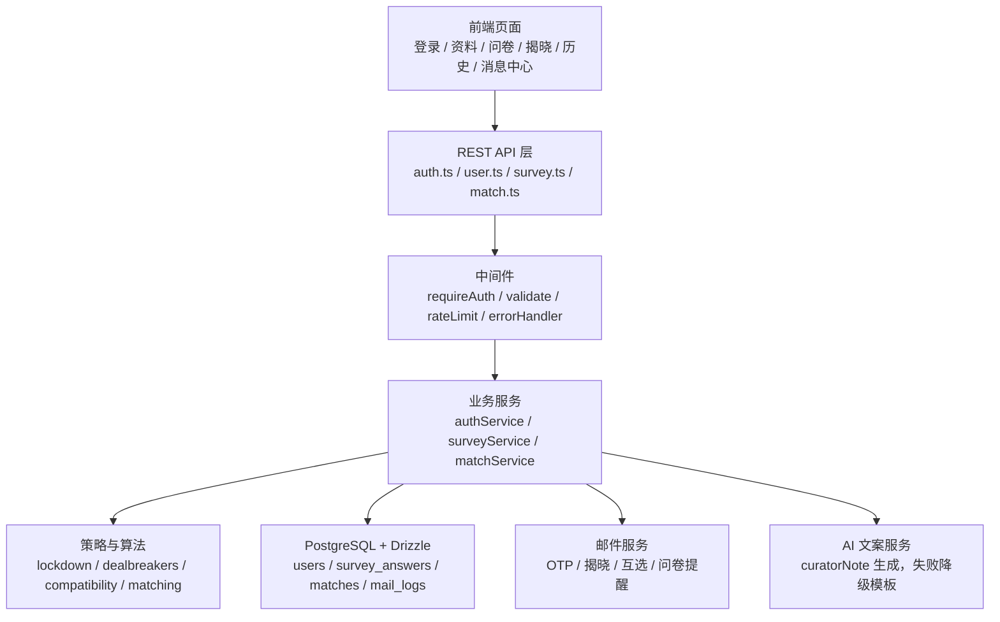
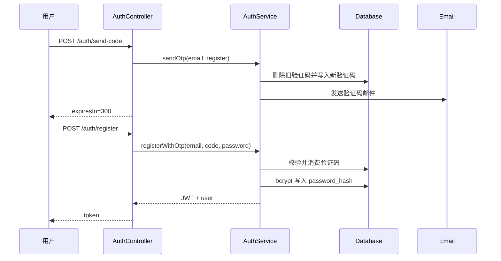
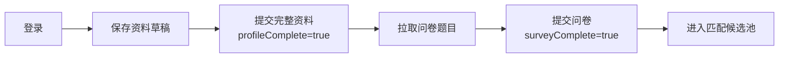
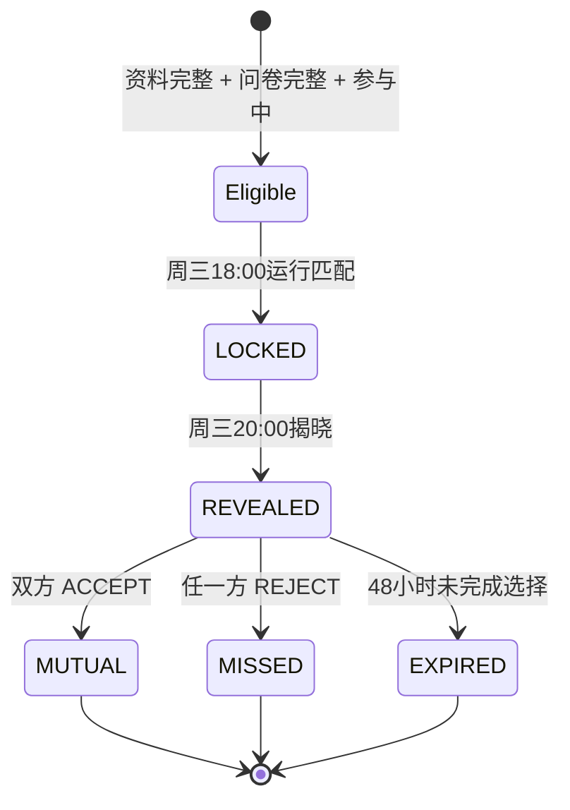
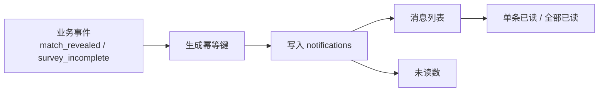

# 详细设计文档（用户主线与匹配子系统）

> 阶段：P3 详细设计  
> 小组：g1  
> 整合来源：
> - `1-类图.md`
> - `2-SOLID检查清单.md`
> - `3-API规范文档.md`
> - `4-ER图+建表SQL.md`

---

## 1. 设计目标与范围

### 1.1 设计目标

- 打通第一组核心主线：注册登录、资料建档、问卷提交、主匹配、揭晓、历史记录。
- 保证设计与当前仓库真实接口一致，明确“已实现”和“设计已定”的差异。
- 将匹配算法与业务流程分离，便于后续调整问卷权重和匹配策略。
- 为站内消息中心预留清晰数据模型和接口边界。

### 1.2 范围

- 认证与密码找回。
- 用户资料、参与状态、本周暂停、邮件提醒偏好。
- 灵魂问卷提交与版本管理。
- 主匹配算法、揭晓、双选结果、历史记录。
- 站内消息中心设计。

### 1.3 非范围

- 圈子、名片、好友、联系方式解锁，归 g2。
- 论坛、举报审核、后台治理、信用分规则，归 g3。
- `/user/report`、`/user/block` 虽在 `user.ts` 中，但治理规则主责为 g3，g1 只做前台入口消费。

---

## 2. 当前实现基线

以当前仓库为准：

| 前缀 | 状态 | 说明 |
|---|---|---|
| `/api/v1/auth` | 已实现 | 注册、登录、验证码、密码找回 |
| `/api/v1/user` | 已实现 | 用户资料、参与状态、邮件提醒、注销 |
| `/api/v1/survey` | 已实现 | 问卷题目、提交、答案回显 |
| `/api/v1/match` | 已实现 | 当前匹配、选择、双选结果、历史 |
| `/api/v1/notifications` | 设计已定 | 站内消息中心接口尚未注册 |

---

## 3. 分层设计

---

## 4. 核心流程设计

### 4.1 注册登录流程

关键规则：
- 邮箱必须为 `@smail.nju.edu.cn`。
- 验证码 5 分钟过期，60 秒内不能重复发送。
- 密码用 bcrypt 哈希，不能保存明文。

### 4.2 建档与问卷流程

关键规则：
- `PATCH /user/profile/draft` 不改变 `profileComplete`。
- `PUT /user/profile` 成功后才视为完整建档。
- 匹配锁定窗口内不能提交问卷或修改参与状态。

### 4.3 匹配与揭晓流程

候选人筛选：
- `isParticipating=true`
- `profileComplete=true`
- `surveyComplete=true`
- 未暂停本周匹配
- 问卷版本为当前要求版本

算法步骤：
1. 按意图和性别偏好划分候选池。
2. 过滤硬性不匹配条件。
3. 计算问卷、校区、院系、MBTI、兴趣等兼容度。
4. 加入未匹配补偿和连续不回应惩罚。
5. 用最大权重匹配生成本周配对。
6. 生成 `curatorNote`，失败时使用模板降级。

### 4.4 站内消息流程

站内消息中心当前为设计已定，最小闭环：

第一阶段消息类型：
- `match_revealed`
- `match_no_result`
- `match_mutual_success`
- `match_expiring`
- `survey_update_required`
- `survey_incomplete`
- `policy_update`
- `system_announcement`
- `report_result`

---

## 5. 类设计摘要

| 类/模块 | 职责 |
|---|---|
| `AuthController` | 接收认证相关 HTTP 请求 |
| `AuthService` | 验证码、密码哈希、JWT 签发 |
| `UserController` | 用户资料、状态、注销 |
| `SurveyController` | 问卷题目、提交、回显 |
| `SurveyService` | 问卷答案存储、版本标记 |
| `MatchController` | 当前匹配、选择、结果、历史 |
| `MatchService` | 匹配业务编排、揭晓、过期、邮件 |
| `MatchingAlgorithm` | 候选池、过滤、评分、配对策略 |
| `NotificationService` | 站内消息列表、未读、幂等写入 |
| `LockdownPolicy` | 匹配锁定窗口判断 |

---

## 6. SOLID 修正结论

AI 初稿最大问题是生成一个承担所有职责的 `UserMatchManager`。

修正后：
- 认证、用户、问卷、匹配、通知按边界拆分。
- 匹配算法使用策略化模块，避免写死在路由层。
- 邮件提醒与站内消息分离，不强行继承。
- 站内消息用 `type + meta + idempotency_key` 扩展。
- Controller 不直接处理复杂算法逻辑。

---

## 7. API 设计摘要

核心已实现接口：
- `POST /auth/send-code`
- `POST /auth/register`
- `POST /auth/login`
- `GET /user/profile`
- `PUT /user/profile`
- `PATCH /user/status`
- `PATCH /user/pause-week`
- `GET /survey/questions`
- `POST /survey/submit`
- `GET /survey/answers`
- `GET /match/current`
- `POST /match/action`
- `GET /match/result/:matchId`
- `GET /match/history`

设计已定接口：
- `GET /notifications`
- `GET /notifications/unread-count`
- `POST /notifications/:id/read`
- `POST /notifications/read-all`

---

## 8. 数据库设计摘要

核心表：
- `users`
- `otp_codes`
- `survey_answers`
- `matches`
- `mail_logs`
- `notifications`（建议新增）

关键索引：
- `users(is_participating, profile_complete, survey_complete)`：匹配候选筛选。
- `matches(week_of, user_a_id)` 与 `matches(week_of, user_b_id)`：同周唯一匹配。
- `matches(user_a_id, created_at)` 与 `matches(user_b_id, created_at)`：历史记录。
- `mail_logs(user_id, week_of, mail_type)`：邮件幂等。
- `notifications(user_id, is_read, created_at)`：消息列表和未读数。

---

## 9. 非功能设计

### 9.1 安全性

- 南大邮箱白名单。
- OTP 限流和错误次数限制。
- 密码 bcrypt 哈希。
- JWT 鉴权。
- 联系方式只在双方互选成功后返回。
- 注销账户进行 PII 匿名化。

### 9.2 可维护性

- 路由层只处理 HTTP 和参数。
- 匹配算法拆分为独立模块。
- 锁定窗口封装为统一策略。
- 消息中心与邮件通知使用不同模型。

### 9.3 可用性

- 匹配等待、未匹配、已揭晓、已过期都有明确状态。
- 历史记录包含未匹配周，避免用户误以为系统漏算。
- 邮件提醒与未来站内消息并存。

---

## 10. 风险与演进计划

| 风险 | 影响 | 演进方案 |
|---|---|---|
| `/notifications` 尚未注册 | 消息中心页面无法真实联调 | 新增 notifications 路由和表 |
| `survey_answers.answers` 为 TEXT | 后续统计不方便 | 迁移到 JSONB 或拆明细表 |
| 匹配算法策略仍是函数模块 | 做 A/B 实验时配置化不足 | 增加算法版本字段和配置表 |
| 邮件与站内消息未统一事件源 | 同一事件要分别写入 | 后续引入轻量事件分发 |
| 联系方式存在 `wechat_id` 历史命名 | 支持多平台时语义不清 | 后续拆为 `contact_platform/contact_id` |

---

## 11. 验收对照

- 类图：已覆盖认证、用户、问卷、匹配、通知核心类和关系。
- SOLID：已记录 AI 初稿 8 处问题和修正方案。
- API：已覆盖 10 个以上核心接口，并标注实现状态。
- ER + SQL：已给出核心表、索引、隐私处理和站内消息建议表。
- 设计模式：策略模式、状态模式、门面模式已说明。
- 反思日志：见 `6-AI协作反思日志 #3.md`。

