# 阶段 3：实体关系图与 SQL
## Circle 与关系链模块（第 2 组）

**版本：** 1.1（与当前代码实现对齐）
**日期：** 2026-05-15
**数据库：** PostgreSQL 16，使用 Drizzle ORM

---

## 1. 实体关系图（Mermaid）

```mermaid
erDiagram
    users ||--o{ circles : "creator_id"
    users ||--o{ circle_members : "member"
    users ||--o{ circle_member_roles : "role"
    users ||--o{ circle_join_requests : "applies"
    users ||--o{ circle_blacklist : "blocked_user"
    users ||--o{ circle_member_locations : "shares_location"
    users ||--o{ circle_chat_messages : "sends"
    users ||--o{ friendships : "circle_friend_pair"
    users ||--o{ global_friendships : "global_friend_pair"
    users ||--o{ friend_requests : "sender_or_receiver"
    users ||--o{ contact_unlock_requests : "requester_or_target"
    users ||--o{ g2_contact_secrets : "owns_secret"
    users ||--o{ user_circle_contacts : "configures"
    users ||--o{ teamups : "leader"
    users ||--o{ teamup_members : "joins"
    users ||--o{ teamup_applications : "applicant"
    users ||--o{ teamup_member_contacts : "provides"
    users ||--o{ notifications : "receives"
    users ||--o{ audit_logs : "operator"

    circles ||--o{ circle_members : "contains"
    circles ||--o{ circle_join_requests : "reviews"
    circles ||--o{ circle_blacklist : "blocks"
    circles ||--o{ circle_member_locations : "locates"
    circles ||--o{ circle_chat_messages : "chat_room"
    circles ||--o{ friendships : "scopes"
    circles ||--o{ friend_requests : "optional_scope"
    circles ||--o{ contact_unlock_requests : "circle_source"
    circles ||--o{ user_circle_contacts : "contact_scope"
    circles ||--o{ teamups : "hosts"

    contact_unlock_requests ||--o{ contact_unlock_grants : "approves_contacts"
    g2_contact_secrets ||--o{ user_circle_contacts : "secret_ref"
    user_circle_contacts ||--o{ contact_unlock_grants : "granted_contact"

    teamups ||--o{ teamup_members : "contains"
    teamups ||--o{ teamup_applications : "receives"
    teamups ||--o{ teamup_member_contacts : "stores_contact_refs"
    teamups ||--o{ teamup_forum_sync_jobs : "optional_sync"
    teamups ||--o{ teamup_chat_messages : "chat_room"
    teamup_chat_messages ||--o{ teamup_chat_read_states : "read_by"
    circle_chat_messages ||--o{ circle_chat_read_states : "read_by"

    users {
        text id PK
        text email UK
        text password_hash
        text nickname
        text avatar_url
        text wechat_id
        jsonb tags
        integer credit_score
        timestamp created_at
    }
    circles {
        text id PK
        text slug UK
        text name
        text creator_id FK
        text join_policy
        jsonb join_questions
        text invite_code_hash
        integer capacity_limit
        text status
    }
    circle_members {
        text id PK
        text circle_id FK
        text user_id FK
        text membership_status
        text answers
        boolean answers_complete
        boolean is_active
    }
    circle_join_requests {
        text id PK
        text circle_id FK
        text user_id FK
        jsonb application_answers
        text application_reason
        text status
        timestamp expires_at
    }
    circle_chat_messages {
        text id PK
        text circle_id FK
        text sender_id FK
        text client_message_id
        text content
        jsonb mentions
        text status
        timestamp deleted_at
    }
    friend_requests {
        text id PK
        text circle_id FK
        text source_type "circle|global"
        text sender_id FK
        text receiver_id FK
        text status
        timestamp expires_at
    }
    contact_unlock_requests {
        text id PK
        text circle_id FK
        text source_type "circle|address_book"
        text requester_id FK
        text target_id FK
        text field_key
        text status
        timestamp revoked_at
    }
    g2_contact_secrets {
        text id PK
        text owner_user_id FK
        text scope_type
        text scope_id
        text field_key
        text ciphertext
        text nonce
        text auth_tag
        text masked_value
    }
    user_circle_contacts {
        text id PK
        text user_id FK
        text circle_id FK
        text contact_secret_id FK
        text field_key
        text label
        boolean is_enabled
    }
    contact_unlock_grants {
        text id PK
        text request_id FK
        text requester_id FK
        text target_id FK
        text circle_id FK
        text contact_id FK
        text status
    }
    teamups {
        text id PK
        text circle_id FK
        text leader_id FK
        text title
        text teamup_type "short_term|long_term"
        text join_mode "direct|approval"
        integer max_members
        integer current_member_count
        text status
    }
    teamup_applications {
        text id PK
        text teamup_id FK
        text applicant_id FK
        text application_type "join|waitlist"
        text status
        jsonb card_snapshot
        jsonb contact_payload
        timestamp waitlist_joined_at
    }
    teamup_member_contacts {
        text id PK
        text teamup_id FK
        text user_id FK
        jsonb contacts "contactSecretId refs"
    }
    teamup_chat_messages {
        text id PK
        text teamup_id FK
        text circle_id FK
        text sender_id FK
        text client_message_id
        text content
        text status
    }
    notifications {
        text id PK
        text user_id FK
        text type
        text title
        text level
        boolean is_read
        text idempotency_key UK
    }
    audit_logs {
        serial id PK
        text operator_id FK
        text action
        text target
        text result
    }
```



> 上图已按 Mermaid 重制要求补齐关键字段、主外键和隐私存储关系；第 2 节 SQL Schema 是最终字段准绳。

### 1.1 当前核心实体字段清单

| 实体 | 主键 | 关键外键 | 关键属性 |
|---|---|---|---|
| `circles` | `id` | `creator_id -> users.id`, `reviewed_by -> users.id` | `slug`, `join_policy`, `join_questions`, `invite_code_hash`, `capacity_limit`, `keyword_rules`, `status` |
| `circle_members` | `id` | `circle_id -> circles.id`, `user_id -> users.id` | `membership_status`, `answers`, `answers_complete`, `is_active` |
| `circle_join_requests` | `id` | `circle_id -> circles.id`, `user_id -> users.id`, `reviewed_by -> users.id` | `application_answers`, `application_reason`, `status`, `expires_at` |
| `circle_blacklist` | `id` | `circle_id -> circles.id`, `user_id -> users.id`, `created_by -> users.id` | `reason`, `created_at` |
| `circle_member_locations` | `id` | `circle_id -> circles.id`, `user_id -> users.id` | `latitude`, `longitude`, `accuracy_meters`, `is_enabled`, `expires_at` |
| `circle_chat_messages` | `id` | `circle_id -> circles.id`, `sender_id -> users.id` | `client_message_id`, `content`, `mentions`, `status`, `deleted_at` |
| `teamup_chat_messages` | `id` | `teamup_id -> teamups.id`, `circle_id -> circles.id`, `sender_id -> users.id` | `client_message_id`, `content`, `mentions`, `status`, `deleted_at` |
| `friend_requests` | `id` | `circle_id -> circles.id`, `sender_id -> users.id`, `receiver_id -> users.id` | `source_type`, `card_snapshot`, `status`, `expires_at` |
| `contact_unlock_requests` | `id` | `circle_id -> circles.id`, `requester_id -> users.id`, `target_id -> users.id` | `source_type`, `field_key`, `status`, `expires_at`, `revoked_at` |
| `g2_contact_secrets` | `id` | `owner_user_id -> users.id` | `scope_type`, `scope_id`, `field_key`, `ciphertext`, `nonce`, `auth_tag`, `value_hash`, `masked_value` |
| `user_circle_contacts` | `id` | `user_id -> users.id`, `circle_id -> circles.id`, `contact_secret_id -> g2_contact_secrets.id` | `field_key`, `label`, `is_enabled`, `display_order` |
| `contact_unlock_grants` | `id` | `request_id -> contact_unlock_requests.id`, `contact_id -> user_circle_contacts.id` | `requester_id`, `target_id`, `circle_id`, `field_key`, `status` |
| `teamups` | `id` | `circle_id -> circles.id`, `leader_id -> users.id` | `teamup_type`, `join_mode`, `is_public`, `status`, `forum_sync_status`, `cancel_source` |
| `teamup_applications` | `id` | `teamup_id -> teamups.id`, `applicant_id -> users.id` | `application_type`, `card_snapshot_view`, `contact_payload`, `status`, `waitlist_joined_at` |
| `notifications` | `id` | `user_id -> users.id` | `type`, `title`, `body`, `level`, `action_url`, `meta`, `is_read`, `idempotency_key` |

---

## 2. SQL 模式（SQL Schema）

### 2.1 核心用户表

```sql
-- users 表：平台范围内的用户资料
CREATE TABLE users (
    id TEXT PRIMARY KEY,
    email TEXT NOT NULL UNIQUE,
    password_hash TEXT,
    nickname TEXT,
    gender TEXT CHECK (gender IN ('male', 'female')),
    gender_pref TEXT CHECK (gender_pref IN ('male', 'female', 'any')),
    intention TEXT CHECK (intention IN ('friend', 'partner')),
    grade TEXT,
    campus TEXT CHECK (campus IN ('xianlin', 'gulou', 'suzhou', 'pukou')),
    department TEXT,
    mbti TEXT CHECK (mbti ~ '^[A-Z]{4}$'),
    bio TEXT,
    signature TEXT,
    tags JSONB NOT NULL DEFAULT '[]'::jsonb,
    avatar_url TEXT,
    wechat_id TEXT,
    is_participating BOOLEAN DEFAULT true,
    pause_until_week TEXT,
    auto_paused_at TEXT,
    email_notifications BOOLEAN NOT NULL DEFAULT true,
    profile_complete BOOLEAN DEFAULT false,
    survey_complete BOOLEAN DEFAULT false,
    student_id_hash TEXT UNIQUE,
    student_id_verified_at TIMESTAMP WITH TIME ZONE,
    student_id_bind_source TEXT,
    student_id_last4 TEXT,
    heartbox_cooldown_until TIMESTAMP WITH TIME ZONE,
    credit_score INTEGER NOT NULL DEFAULT 100,
    credit_level TEXT NOT NULL DEFAULT 'normal'
        CHECK (credit_level IN ('normal', 'limited', 'banned')),
    merged_into_user_id TEXT REFERENCES users(id),
    merged_at TIMESTAMP WITH TIME ZONE,
    created_at TIMESTAMP WITH TIME ZONE DEFAULT CURRENT_TIMESTAMP,
    updated_at TIMESTAMP WITH TIME ZONE DEFAULT CURRENT_TIMESTAMP
);

CREATE INDEX idx_users_email ON users(email);
CREATE INDEX idx_users_created_at ON users(created_at);
```

---

### 2.2 Circle 与成员关系表

```sql
-- circles 表：社区容器
CREATE TABLE circles (
    id TEXT PRIMARY KEY,
    name TEXT NOT NULL,
    slug TEXT NOT NULL UNIQUE,
    description TEXT,
    category TEXT NOT NULL,
    tag TEXT NOT NULL DEFAULT '',
    tags JSONB NOT NULL DEFAULT '[]'::jsonb,
    join_policy TEXT NOT NULL DEFAULT 'public'
        CHECK (join_policy IN ('public', 'review', 'invite')),
    join_question TEXT,
    join_questions JSONB NOT NULL DEFAULT '[]'::jsonb,
    invite_code TEXT,
    invite_code_hash TEXT,
    capacity_limit INTEGER,
    keyword_rules JSONB NOT NULL DEFAULT '[]'::jsonb,
    icon_url TEXT,
    creator_id TEXT REFERENCES users(id) ON DELETE SET NULL,
    member_count INTEGER NOT NULL DEFAULT 0,
    is_active BOOLEAN NOT NULL DEFAULT true,
    status TEXT NOT NULL DEFAULT 'active'
        CHECK (status IN ('active', 'inactive', 'pending_review', 'rejected', 'banned', 'archived')),
    review_note TEXT,
    reviewed_by TEXT REFERENCES users(id) ON DELETE SET NULL,
    reviewed_at TIMESTAMP WITH TIME ZONE,
    created_at TIMESTAMP WITH TIME ZONE DEFAULT CURRENT_TIMESTAMP,
    updated_at TIMESTAMP WITH TIME ZONE DEFAULT CURRENT_TIMESTAMP
);

CREATE INDEX idx_circles_category ON circles(category);
CREATE INDEX idx_circles_status ON circles(status);
CREATE INDEX idx_circles_slug ON circles(slug);

-- circle_members 表：User-Circle 连接表
CREATE TABLE circle_members (
    id TEXT PRIMARY KEY,
    circle_id TEXT NOT NULL REFERENCES circles(id),
    user_id TEXT NOT NULL REFERENCES users(id),
    membership_status TEXT NOT NULL DEFAULT 'active'
        CHECK (membership_status IN ('pending', 'active')),
    answers TEXT, -- JSON：{ key: { value, importance? } }
    answers_complete BOOLEAN NOT NULL DEFAULT false,
    is_active BOOLEAN NOT NULL DEFAULT true,
    joined_at TIMESTAMP WITH TIME ZONE DEFAULT CURRENT_TIMESTAMP,
    updated_at TIMESTAMP WITH TIME ZONE DEFAULT CURRENT_TIMESTAMP,
    UNIQUE(circle_id, user_id)
);

CREATE INDEX idx_circle_members_circle ON circle_members(circle_id);
CREATE INDEX idx_circle_members_user ON circle_members(user_id);

-- circle_member_roles 表：circle 内的管理角色
CREATE TABLE circle_member_roles (
    id TEXT PRIMARY KEY,
    circle_id TEXT NOT NULL REFERENCES circles(id) ON DELETE CASCADE,
    user_id TEXT NOT NULL REFERENCES users(id) ON DELETE CASCADE,
    role TEXT NOT NULL CHECK (role IN ('owner', 'admin', 'moderator')),
    created_at TIMESTAMP WITH TIME ZONE DEFAULT CURRENT_TIMESTAMP,
    updated_at TIMESTAMP WITH TIME ZONE DEFAULT CURRENT_TIMESTAMP,
    UNIQUE(circle_id, user_id, role)
);

CREATE INDEX idx_circle_member_roles_circle_role ON circle_member_roles(circle_id, role);
CREATE INDEX idx_circle_member_roles_user ON circle_member_roles(user_id);

-- circle_join_requests 表：需要审核或邀请策略的入圈申请
CREATE TABLE circle_join_requests (
    id TEXT PRIMARY KEY,
    circle_id TEXT NOT NULL REFERENCES circles(id) ON DELETE CASCADE,
    user_id TEXT NOT NULL REFERENCES users(id) ON DELETE CASCADE,
    application_answer TEXT,
    application_answers JSONB,
    application_reason TEXT,
    status TEXT NOT NULL DEFAULT 'pending_review'
        CHECK (status IN ('pending_review', 'approved', 'rejected', 'expired', 'withdrawn')),
    reject_reason TEXT,
    reviewed_by TEXT REFERENCES users(id) ON DELETE SET NULL,
    reviewed_at TIMESTAMP WITH TIME ZONE,
    expires_at TIMESTAMP WITH TIME ZONE,
    created_at TIMESTAMP WITH TIME ZONE DEFAULT CURRENT_TIMESTAMP,
    updated_at TIMESTAMP WITH TIME ZONE DEFAULT CURRENT_TIMESTAMP
);

CREATE UNIQUE INDEX idx_circle_join_requests_pending
    ON circle_join_requests(circle_id, user_id)
    WHERE status = 'pending_review';
CREATE INDEX idx_circle_join_requests_circle_status
    ON circle_join_requests(circle_id, status, created_at);
CREATE INDEX idx_circle_join_requests_user_status
    ON circle_join_requests(user_id, status, created_at);

-- circle_blacklist 表：圈主管理黑名单
CREATE TABLE circle_blacklist (
    id TEXT PRIMARY KEY,
    circle_id TEXT NOT NULL REFERENCES circles(id) ON DELETE CASCADE,
    user_id TEXT NOT NULL REFERENCES users(id) ON DELETE CASCADE,
    reason TEXT,
    created_by TEXT REFERENCES users(id) ON DELETE SET NULL,
    created_at TIMESTAMP WITH TIME ZONE DEFAULT CURRENT_TIMESTAMP,
    UNIQUE(circle_id, user_id)
);

CREATE INDEX idx_circle_blacklist_user ON circle_blacklist(user_id);

-- circle_member_locations 表：圈内位置共享
CREATE TABLE circle_member_locations (
    id TEXT PRIMARY KEY,
    circle_id TEXT NOT NULL REFERENCES circles(id) ON DELETE CASCADE,
    user_id TEXT NOT NULL REFERENCES users(id) ON DELETE CASCADE,
    latitude DOUBLE PRECISION NOT NULL,
    longitude DOUBLE PRECISION NOT NULL,
    accuracy_meters INTEGER NOT NULL,
    is_enabled BOOLEAN NOT NULL DEFAULT true,
    captured_at TIMESTAMP WITH TIME ZONE,
    expires_at TIMESTAMP WITH TIME ZONE NOT NULL,
    created_at TIMESTAMP WITH TIME ZONE DEFAULT CURRENT_TIMESTAMP,
    updated_at TIMESTAMP WITH TIME ZONE DEFAULT CURRENT_TIMESTAMP,
    UNIQUE(circle_id, user_id)
);

CREATE INDEX idx_circle_member_locations_circle_enabled_expires
    ON circle_member_locations(circle_id, is_enabled, expires_at);
CREATE INDEX idx_circle_member_locations_circle_geo
    ON circle_member_locations(circle_id, is_enabled, latitude, longitude);
CREATE INDEX idx_circle_member_locations_user ON circle_member_locations(user_id);

-- circle_member_location_cooldowns 表：位置更新冷却
CREATE TABLE circle_member_location_cooldowns (
    id TEXT PRIMARY KEY,
    circle_id TEXT NOT NULL REFERENCES circles(id) ON DELETE CASCADE,
    user_id TEXT NOT NULL REFERENCES users(id) ON DELETE CASCADE,
    last_updated_at TIMESTAMP WITH TIME ZONE NOT NULL,
    created_at TIMESTAMP WITH TIME ZONE DEFAULT CURRENT_TIMESTAMP,
    updated_at TIMESTAMP WITH TIME ZONE DEFAULT CURRENT_TIMESTAMP,
    UNIQUE(circle_id, user_id)
);

-- circle_questions 表：circle 的问卷定义
CREATE TABLE circle_questions (
    id TEXT PRIMARY KEY,
    circle_id TEXT NOT NULL REFERENCES circles(id),
    key TEXT NOT NULL,
    type TEXT NOT NULL
        CHECK (type IN ('scale', 'single_choice', 'multi_choice', 'ranking')),
    prompt TEXT NOT NULL,
    options TEXT, -- 用于旧版选项配置的 JSON 数组
    weight REAL NOT NULL DEFAULT 1.0,
    display_order INTEGER NOT NULL DEFAULT 0,
    is_channel_tag BOOLEAN DEFAULT false
);

CREATE INDEX idx_circle_questions_circle ON circle_questions(circle_id);
CREATE UNIQUE INDEX idx_circle_questions_circle_key ON circle_questions(circle_id, key);
```

---

### 2.3 Circle 匹配表

```sql
-- circle_matches 表：circle 内的每周匹配结果
CREATE TABLE circle_matches (
    id TEXT PRIMARY KEY,
    circle_id TEXT NOT NULL REFERENCES circles(id),
    week_of TEXT NOT NULL, -- YYYY-MM-DD（星期三）
    user_a_id TEXT NOT NULL REFERENCES users(id),
    user_b_id TEXT NOT NULL REFERENCES users(id),
    score DOUBLE PRECISION NOT NULL CHECK (score >= 0.0 AND score <= 1.0),
    user_a_action TEXT CHECK (user_a_action IN ('ACCEPT', 'REJECT')),
    user_b_action TEXT CHECK (user_b_action IN ('ACCEPT', 'REJECT')),
    status TEXT NOT NULL DEFAULT 'LOCKED'
        CHECK (status IN ('LOCKED', 'REVEALED', 'MUTUAL', 'MISSED')),
    revealed_at TIMESTAMP WITH TIME ZONE,
    created_at TIMESTAMP WITH TIME ZONE DEFAULT CURRENT_TIMESTAMP,
    UNIQUE(circle_id, week_of, user_a_id),
    UNIQUE(circle_id, week_of, user_b_id)
);

CREATE INDEX idx_circle_matches_circle ON circle_matches(circle_id);
CREATE INDEX idx_circle_matches_week ON circle_matches(week_of);
```

---

### 2.3.1 实时聊天表

```sql
-- circle_chat_messages 表：circle 实时群聊消息
CREATE TABLE circle_chat_messages (
    id TEXT PRIMARY KEY,
    circle_id TEXT NOT NULL REFERENCES circles(id) ON DELETE CASCADE,
    sender_id TEXT NOT NULL REFERENCES users(id) ON DELETE CASCADE,
    client_message_id TEXT NOT NULL,
    content TEXT NOT NULL,
    mentions JSONB NOT NULL DEFAULT '[]'::jsonb,
    status TEXT NOT NULL DEFAULT 'visible'
        CHECK (status IN ('visible', 'deleted')),
    deleted_by TEXT REFERENCES users(id) ON DELETE SET NULL,
    deleted_at TIMESTAMP WITH TIME ZONE,
    created_at TIMESTAMP WITH TIME ZONE DEFAULT CURRENT_TIMESTAMP,
    updated_at TIMESTAMP WITH TIME ZONE DEFAULT CURRENT_TIMESTAMP,
    UNIQUE(circle_id, sender_id, client_message_id)
);

CREATE INDEX idx_circle_chat_messages_circle_created
    ON circle_chat_messages(circle_id, created_at);
CREATE INDEX idx_circle_chat_messages_sender_created
    ON circle_chat_messages(sender_id, created_at);

-- circle_chat_read_states 表：circle 聊天已读状态
CREATE TABLE circle_chat_read_states (
    id TEXT PRIMARY KEY,
    user_id TEXT NOT NULL REFERENCES users(id) ON DELETE CASCADE,
    circle_id TEXT NOT NULL REFERENCES circles(id) ON DELETE CASCADE,
    last_read_message_id TEXT REFERENCES circle_chat_messages(id) ON DELETE SET NULL,
    last_read_at TIMESTAMP WITH TIME ZONE DEFAULT CURRENT_TIMESTAMP,
    updated_at TIMESTAMP WITH TIME ZONE DEFAULT CURRENT_TIMESTAMP,
    UNIQUE(user_id, circle_id)
);

CREATE INDEX idx_circle_chat_read_states_user_updated
    ON circle_chat_read_states(user_id, updated_at);

```

---

### 2.4 用户卡片系统表

```sql
-- user_cards 表：公开资料展示
CREATE TABLE user_cards (
    id TEXT PRIMARY KEY,
    user_id TEXT NOT NULL UNIQUE REFERENCES users(id) ON DELETE CASCADE,
    modules JSONB NOT NULL DEFAULT '[]'::jsonb,
    -- modules 结构：[{moduleKey, value, visibilityLevel, displayOrder}, ...]
    updated_at TIMESTAMP WITH TIME ZONE DEFAULT CURRENT_TIMESTAMP
);

-- user_base_cards 表：包含系统组件的基础卡片
CREATE TABLE user_base_cards (
    user_id TEXT PRIMARY KEY REFERENCES users(id) ON DELETE CASCADE,
    is_active BOOLEAN NOT NULL DEFAULT true,
    components JSONB NOT NULL DEFAULT '[]'::jsonb,
    -- components：[{key, name, value, topLeft[x,y], width, height, status}, ...]
    updated_at TIMESTAMP WITH TIME ZONE DEFAULT CURRENT_TIMESTAMP
);

-- user_card_preferences 表：卡片可见性设置
CREATE TABLE user_card_preferences (
    user_id TEXT PRIMARY KEY REFERENCES users(id) ON DELETE CASCADE,
    hidden_preview_mode TEXT NOT NULL DEFAULT 'titles_only'
        CHECK (hidden_preview_mode IN ('titles_only', 'fully_hidden')),
    created_at TIMESTAMP WITH TIME ZONE DEFAULT CURRENT_TIMESTAMP,
    updated_at TIMESTAMP WITH TIME ZONE DEFAULT CURRENT_TIMESTAMP
);

-- user_circle_cards 表：circle 专属卡片自定义
CREATE TABLE user_circle_cards (
    id TEXT PRIMARY KEY,
    user_id TEXT NOT NULL REFERENCES users(id) ON DELETE CASCADE,
    circle_id TEXT NOT NULL REFERENCES circles(id) ON DELETE CASCADE,
    is_active BOOLEAN NOT NULL DEFAULT true,
    components JSONB NOT NULL DEFAULT '[]'::jsonb,
    -- components：与 user_base_cards 相同的结构
    updated_at TIMESTAMP WITH TIME ZONE DEFAULT CURRENT_TIMESTAMP,
    UNIQUE(user_id, circle_id)
);

CREATE INDEX idx_user_circle_cards_circle ON user_circle_cards(circle_id);

-- user_circle_custom_cards 表：每个 circle 的附加自定义卡片
CREATE TABLE user_circle_custom_cards (
    id TEXT PRIMARY KEY,
    user_id TEXT NOT NULL REFERENCES users(id) ON DELETE CASCADE,
    circle_id TEXT NOT NULL REFERENCES circles(id) ON DELETE CASCADE,
    label TEXT NOT NULL,
    value TEXT NOT NULL,
    display_order INTEGER NOT NULL DEFAULT 0,
    top_left_x INTEGER NOT NULL DEFAULT 0,
    top_left_y INTEGER NOT NULL DEFAULT 0,
    width INTEGER NOT NULL DEFAULT 1,
    height INTEGER NOT NULL DEFAULT 1,
    visibility_level TEXT NOT NULL DEFAULT 'public'
        CHECK (visibility_level IN ('public', 'friends', 'hidden')),
    status TEXT NOT NULL DEFAULT 'pending'
        CHECK (status IN ('pending', 'approved', 'rejected')),
    review_note TEXT,
    reviewed_at TIMESTAMP WITH TIME ZONE,
    created_at TIMESTAMP WITH TIME ZONE DEFAULT CURRENT_TIMESTAMP,
    updated_at TIMESTAMP WITH TIME ZONE DEFAULT CURRENT_TIMESTAMP
);

CREATE INDEX idx_user_circle_custom_cards_user_circle
    ON user_circle_custom_cards(user_id, circle_id);
CREATE INDEX idx_user_circle_custom_cards_status_circle
    ON user_circle_custom_cards(status, circle_id);

-- circle_card_overrides 表：按 circle 配置的字段级可见性覆盖
CREATE TABLE circle_card_overrides (
    id TEXT PRIMARY KEY,
    user_id TEXT NOT NULL REFERENCES users(id) ON DELETE CASCADE,
    circle_id TEXT NOT NULL REFERENCES circles(id) ON DELETE CASCADE,
    overrides JSONB NOT NULL DEFAULT '{}'::jsonb,
    -- overrides：{fieldKey: {value?, visibilityLevel?}, ...}
    UNIQUE(user_id, circle_id)
);

CREATE INDEX idx_circle_card_overrides_circle ON circle_card_overrides(circle_id);
```

---

### 2.5 社交关系表

```sql
-- friendships 表：circle 作用域内的好友关系
CREATE TABLE friendships (
    id TEXT PRIMARY KEY,
    circle_id TEXT NOT NULL REFERENCES circles(id) ON DELETE CASCADE,
    user_a_id TEXT NOT NULL REFERENCES users(id) ON DELETE CASCADE,
    user_b_id TEXT NOT NULL REFERENCES users(id) ON DELETE CASCADE,
    created_at TIMESTAMP WITH TIME ZONE DEFAULT CURRENT_TIMESTAMP,
    UNIQUE(circle_id, user_a_id, user_b_id)
    -- 注意：为保证唯一性，关系对按 user_a_id < user_b_id 存储
);

CREATE INDEX idx_friendships_user_a_circle ON friendships(user_a_id, circle_id);
CREATE INDEX idx_friendships_user_b_circle ON friendships(user_b_id, circle_id);

-- global_friendships 表：平台范围内的好友关系
CREATE TABLE global_friendships (
    id TEXT PRIMARY KEY,
    user_a_id TEXT NOT NULL REFERENCES users(id) ON DELETE CASCADE,
    user_b_id TEXT NOT NULL REFERENCES users(id) ON DELETE CASCADE,
    source_type TEXT NOT NULL DEFAULT 'circle'
        CHECK (source_type IN ('circle', 'global')),
    created_at TIMESTAMP WITH TIME ZONE DEFAULT CURRENT_TIMESTAMP,
    UNIQUE(user_a_id, user_b_id)
    -- 注意：为保证唯一性，关系对按 user_a_id < user_b_id 存储
);

CREATE INDEX idx_global_friendships_user_a ON global_friendships(user_a_id);
CREATE INDEX idx_global_friendships_user_b ON global_friendships(user_b_id);

-- friend_requests 表：待处理的好友请求
CREATE TABLE friend_requests (
    id TEXT PRIMARY KEY,
    circle_id TEXT REFERENCES circles(id) ON DELETE CASCADE,
    source_type TEXT NOT NULL DEFAULT 'circle'
        CHECK (source_type IN ('circle', 'global')),
    sender_id TEXT NOT NULL REFERENCES users(id) ON DELETE CASCADE,
    receiver_id TEXT NOT NULL REFERENCES users(id) ON DELETE CASCADE,
    card_snapshot JSONB,
    message TEXT,
    status TEXT NOT NULL DEFAULT 'pending'
        CHECK (status IN ('pending', 'accepted', 'rejected', 'withdrawn', 'expired')),
    expires_at TIMESTAMP WITH TIME ZONE DEFAULT (NOW() + INTERVAL '7 days'),
    created_at TIMESTAMP WITH TIME ZONE DEFAULT CURRENT_TIMESTAMP,
    updated_at TIMESTAMP WITH TIME ZONE DEFAULT CURRENT_TIMESTAMP
);

CREATE UNIQUE INDEX idx_friend_requests_circle_sender_receiver
    ON friend_requests(circle_id, sender_id, receiver_id)
    WHERE status = 'pending' AND source_type = 'circle';
CREATE UNIQUE INDEX idx_friend_requests_circle_pair_pending
    ON friend_requests(circle_id, LEAST(sender_id, receiver_id), GREATEST(sender_id, receiver_id))
    WHERE status = 'pending' AND source_type = 'circle';
CREATE UNIQUE INDEX idx_friend_requests_global_sender_receiver
    ON friend_requests(sender_id, receiver_id)
    WHERE status = 'pending' AND source_type = 'global';
CREATE UNIQUE INDEX idx_friend_requests_global_pair_pending
    ON friend_requests(LEAST(sender_id, receiver_id), GREATEST(sender_id, receiver_id))
    WHERE status = 'pending' AND source_type = 'global';
CREATE INDEX idx_friend_requests_receiver_status_circle
    ON friend_requests(receiver_id, status, circle_id);
CREATE INDEX idx_friend_requests_receiver_status_source
    ON friend_requests(receiver_id, status, source_type, circle_id);
```

---

### 2.6 Contact Unlock 表

```sql
-- contact_unlock_requests 表：敏感字段的权限请求
CREATE TABLE contact_unlock_requests (
    id TEXT PRIMARY KEY,
    circle_id TEXT REFERENCES circles(id) ON DELETE CASCADE,
    requester_id TEXT NOT NULL REFERENCES users(id) ON DELETE CASCADE,
    target_id TEXT NOT NULL REFERENCES users(id) ON DELETE CASCADE,
    source_type TEXT NOT NULL DEFAULT 'circle',
    field_key TEXT NOT NULL DEFAULT 'contact_primary',
    card_snapshot JSONB,
    message TEXT,
    status TEXT NOT NULL DEFAULT 'pending'
        CHECK (status IN ('pending', 'approved', 'rejected', 'withdrawn', 'expired', 'revoked')),
    expires_at TIMESTAMP WITH TIME ZONE DEFAULT (NOW() + INTERVAL '7 days'),
    revoked_at TIMESTAMP WITH TIME ZONE,
    created_at TIMESTAMP WITH TIME ZONE DEFAULT CURRENT_TIMESTAMP,
    updated_at TIMESTAMP WITH TIME ZONE DEFAULT CURRENT_TIMESTAMP
);

CREATE UNIQUE INDEX idx_contact_unlock_requests_circle_pending
    ON contact_unlock_requests(requester_id, target_id, circle_id)
    WHERE status = 'pending' AND source_type = 'circle';
CREATE UNIQUE INDEX idx_contact_unlock_requests_address_book_pending
    ON contact_unlock_requests(requester_id, target_id)
    WHERE status = 'pending' AND source_type = 'address_book';
CREATE INDEX idx_contact_unlock_requests_target_status_circle
    ON contact_unlock_requests(target_id, status, circle_id);
CREATE INDEX idx_contact_unlock_requests_rejected_field
    ON contact_unlock_requests(requester_id, target_id, field_key, status, updated_at);

-- g2_contact_secrets 表：G2 联系方式密文存储
CREATE TABLE g2_contact_secrets (
    id TEXT PRIMARY KEY,
    owner_user_id TEXT NOT NULL REFERENCES users(id) ON DELETE CASCADE,
    scope_type TEXT NOT NULL,
    scope_id TEXT NOT NULL,
    field_key TEXT NOT NULL,
    contact_type TEXT NOT NULL,
    label TEXT NOT NULL,
    ciphertext TEXT NOT NULL,
    nonce TEXT NOT NULL,
    auth_tag TEXT NOT NULL,
    key_version TEXT NOT NULL,
    value_hash TEXT NOT NULL,
    masked_value TEXT NOT NULL,
    created_at TIMESTAMP WITH TIME ZONE DEFAULT CURRENT_TIMESTAMP,
    updated_at TIMESTAMP WITH TIME ZONE DEFAULT CURRENT_TIMESTAMP
);

CREATE UNIQUE INDEX idx_g2_contact_secrets_unique_scope
    ON g2_contact_secrets(owner_user_id, scope_type, scope_id, field_key, contact_type);
CREATE INDEX idx_g2_contact_secrets_owner_scope
    ON g2_contact_secrets(owner_user_id, scope_type, scope_id);
CREATE INDEX idx_g2_contact_secrets_value_hash
    ON g2_contact_secrets(value_hash);

-- user_circle_contacts 表：用户在某 circle 下可选择开放的联系方式
CREATE TABLE user_circle_contacts (
    id TEXT PRIMARY KEY,
    user_id TEXT NOT NULL REFERENCES users(id) ON DELETE CASCADE,
    circle_id TEXT NOT NULL REFERENCES circles(id) ON DELETE CASCADE,
    field_key TEXT NOT NULL,
    label TEXT NOT NULL,
    value TEXT,
    contact_secret_id TEXT REFERENCES g2_contact_secrets(id) ON DELETE SET NULL,
    is_enabled BOOLEAN NOT NULL DEFAULT true,
    display_order INTEGER NOT NULL DEFAULT 0,
    created_at TIMESTAMP WITH TIME ZONE DEFAULT CURRENT_TIMESTAMP,
    updated_at TIMESTAMP WITH TIME ZONE DEFAULT CURRENT_TIMESTAMP,
    UNIQUE(user_id, circle_id, field_key)
);

CREATE INDEX idx_user_circle_contacts_user_circle
    ON user_circle_contacts(user_id, circle_id, display_order);
CREATE INDEX idx_user_circle_contacts_secret
    ON user_circle_contacts(contact_secret_id);

-- contact_unlock_grants 表：一次 approved request 可授权多个具体联系方式
CREATE TABLE contact_unlock_grants (
    id TEXT PRIMARY KEY,
    request_id TEXT NOT NULL REFERENCES contact_unlock_requests(id) ON DELETE CASCADE,
    requester_id TEXT NOT NULL REFERENCES users(id) ON DELETE CASCADE,
    target_id TEXT NOT NULL REFERENCES users(id) ON DELETE CASCADE,
    circle_id TEXT NOT NULL REFERENCES circles(id) ON DELETE CASCADE,
    contact_id TEXT NOT NULL REFERENCES user_circle_contacts(id) ON DELETE CASCADE,
    field_key TEXT NOT NULL,
    status TEXT NOT NULL DEFAULT 'active'
        CHECK (status IN ('active', 'revoked')),
    created_at TIMESTAMP WITH TIME ZONE DEFAULT CURRENT_TIMESTAMP,
    updated_at TIMESTAMP WITH TIME ZONE DEFAULT CURRENT_TIMESTAMP,
    revoked_at TIMESTAMP WITH TIME ZONE,
    UNIQUE(requester_id, target_id, circle_id, contact_id)
);

CREATE INDEX idx_contact_unlock_grants_request
    ON contact_unlock_grants(request_id);
CREATE INDEX idx_contact_unlock_grants_lookup
    ON contact_unlock_grants(requester_id, target_id, circle_id, status);
```

---

### 2.7 Teamup 表

```sql
-- teamups 表：circle 内的活动小组
CREATE TABLE teamups (
    id TEXT PRIMARY KEY,
    circle_id TEXT NOT NULL REFERENCES circles(id) ON DELETE CASCADE,
    leader_id TEXT NOT NULL REFERENCES users(id) ON DELETE CASCADE,
    title TEXT NOT NULL,
    description TEXT NOT NULL,
    description_preview TEXT NOT NULL,
    max_members INTEGER NOT NULL CHECK (max_members >= 2),
    current_member_count INTEGER NOT NULL DEFAULT 1,
    deadline_at TIMESTAMP WITH TIME ZONE NOT NULL,
    end_at TIMESTAMP WITH TIME ZONE NOT NULL,
    teamup_type TEXT NOT NULL DEFAULT 'short_term'
        CHECK (teamup_type IN ('short_term', 'long_term')),
    join_mode TEXT NOT NULL CHECK (join_mode IN ('direct', 'approval')),
    is_public BOOLEAN NOT NULL DEFAULT false,
    status TEXT NOT NULL DEFAULT 'recruiting'
        CHECK (status IN ('recruiting', 'full', 'cancelled')),
    cancel_source TEXT CHECK (cancel_source IN ('leader', 'admin')),
    cancel_reason TEXT,
    cancelled_by TEXT REFERENCES users(id) ON DELETE SET NULL,
    cancelled_at TIMESTAMP WITH TIME ZONE,
    forum_post_id TEXT,
    forum_post_author_id TEXT REFERENCES users(id) ON DELETE SET NULL,
    forum_sync_status TEXT NOT NULL DEFAULT 'none'
        CHECK (forum_sync_status IN ('none', 'pending', 'synced', 'failed')),
    forum_sync_error TEXT,
    created_at TIMESTAMP WITH TIME ZONE DEFAULT CURRENT_TIMESTAMP,
    updated_at TIMESTAMP WITH TIME ZONE DEFAULT CURRENT_TIMESTAMP
);

CREATE INDEX idx_teamups_circle_status_end
    ON teamups(circle_id, status, end_at);
CREATE INDEX idx_teamups_circle_type
    ON teamups(circle_id, teamup_type);
CREATE INDEX idx_teamups_circle_public
    ON teamups(circle_id, is_public, forum_sync_status);
CREATE INDEX idx_teamups_leader ON teamups(leader_id, created_at);
CREATE INDEX idx_teamups_forum_post ON teamups(forum_post_id);

-- teamup_members 表：teamup 中的成员关系
CREATE TABLE teamup_members (
    id TEXT PRIMARY KEY,
    teamup_id TEXT NOT NULL REFERENCES teamups(id) ON DELETE CASCADE,
    user_id TEXT NOT NULL REFERENCES users(id) ON DELETE CASCADE,
    member_role TEXT NOT NULL CHECK (member_role IN ('leader', 'member')),
    membership_status TEXT NOT NULL DEFAULT 'active'
        CHECK (membership_status IN ('active', 'left', 'cancelled')),
    joined_at TIMESTAMP WITH TIME ZONE DEFAULT CURRENT_TIMESTAMP,
    left_at TIMESTAMP WITH TIME ZONE,
    created_at TIMESTAMP WITH TIME ZONE DEFAULT CURRENT_TIMESTAMP,
    updated_at TIMESTAMP WITH TIME ZONE DEFAULT CURRENT_TIMESTAMP,
    UNIQUE(teamup_id, user_id)
);

CREATE INDEX idx_teamup_members_teamup_status
    ON teamup_members(teamup_id, membership_status);
CREATE INDEX idx_teamup_members_user_status
    ON teamup_members(user_id, membership_status);

-- teamup_member_contacts 表：teamup 成员的联系方式信息
CREATE TABLE teamup_member_contacts (
    id TEXT PRIMARY KEY,
    teamup_id TEXT NOT NULL REFERENCES teamups(id) ON DELETE CASCADE,
    user_id TEXT NOT NULL REFERENCES users(id) ON DELETE CASCADE,
    contacts JSONB NOT NULL,
    -- contacts：[{contactSecretId?, type, label?, maskedValue?}, ...]
    -- 明文值存储在 g2_contact_secrets 中，进入可见窗口后由 service 解密。
    created_at TIMESTAMP WITH TIME ZONE DEFAULT CURRENT_TIMESTAMP,
    updated_at TIMESTAMP WITH TIME ZONE DEFAULT CURRENT_TIMESTAMP,
    UNIQUE(teamup_id, user_id)
);

-- teamup_applications 表：加入 teamup 的成员申请
CREATE TABLE teamup_applications (
    id TEXT PRIMARY KEY,
    teamup_id TEXT NOT NULL REFERENCES teamups(id) ON DELETE CASCADE,
    applicant_id TEXT NOT NULL REFERENCES users(id) ON DELETE CASCADE,
    application_type TEXT NOT NULL DEFAULT 'join'
        CHECK (application_type IN ('join', 'waitlist')),
    application_note TEXT NOT NULL,
    card_snapshot JSONB NOT NULL,
    card_snapshot_view TEXT NOT NULL CHECK (card_snapshot_view IN ('public', 'friend')),
    card_snapshot_relationship TEXT NOT NULL
        CHECK (card_snapshot_relationship IN ('not_friend', 'friend')),
    contact_payload JSONB NOT NULL,
    -- contact_payload：[{contactSecretId?, type, label?, maskedValue?}, ...]
    status TEXT NOT NULL DEFAULT 'pending'
        CHECK (status IN ('pending', 'approved', 'rejected', 'withdrawn')),
    reviewed_by TEXT REFERENCES users(id) ON DELETE SET NULL,
    review_note TEXT,
    reviewed_at TIMESTAMP WITH TIME ZONE,
    waitlist_joined_at TIMESTAMP WITH TIME ZONE,
    created_at TIMESTAMP WITH TIME ZONE DEFAULT CURRENT_TIMESTAMP,
    updated_at TIMESTAMP WITH TIME ZONE DEFAULT CURRENT_TIMESTAMP
);

CREATE UNIQUE INDEX idx_teamup_applications_pending
    ON teamup_applications(teamup_id, applicant_id)
    WHERE status = 'pending';
CREATE UNIQUE INDEX idx_teamup_applications_active_waitlist
    ON teamup_applications(teamup_id, applicant_id)
    WHERE application_type = 'waitlist'
      AND status IN ('pending', 'approved')
      AND waitlist_joined_at IS NULL;
CREATE INDEX idx_teamup_applications_teamup_status
    ON teamup_applications(teamup_id, status);
CREATE INDEX idx_teamup_applications_applicant_status
    ON teamup_applications(applicant_id, status);
CREATE INDEX idx_teamup_applications_waitlist_queue
    ON teamup_applications(teamup_id, application_type, status, created_at);

-- teamup_forum_sync_jobs 表：公开组队与 forum 同步的异步任务
CREATE TABLE teamup_forum_sync_jobs (
    id TEXT PRIMARY KEY,
    teamup_id TEXT NOT NULL REFERENCES teamups(id) ON DELETE CASCADE,
    action TEXT NOT NULL CHECK (action IN ('create', 'update', 'archive')),
    payload JSONB NOT NULL,
    status TEXT NOT NULL DEFAULT 'pending'
        CHECK (status IN ('pending', 'processing', 'succeeded', 'failed')),
    attempt_count INTEGER NOT NULL DEFAULT 0,
    next_retry_at TIMESTAMP WITH TIME ZONE,
    last_error TEXT,
    created_at TIMESTAMP WITH TIME ZONE DEFAULT CURRENT_TIMESTAMP,
    updated_at TIMESTAMP WITH TIME ZONE DEFAULT CURRENT_TIMESTAMP
);

CREATE INDEX idx_teamup_forum_sync_jobs_status_retry
    ON teamup_forum_sync_jobs(status, next_retry_at);
CREATE INDEX idx_teamup_forum_sync_jobs_teamup
    ON teamup_forum_sync_jobs(teamup_id, created_at);

-- teamup_chat_messages 表：teamup 实时群聊消息
CREATE TABLE teamup_chat_messages (
    id TEXT PRIMARY KEY,
    teamup_id TEXT NOT NULL REFERENCES teamups(id) ON DELETE CASCADE,
    circle_id TEXT NOT NULL REFERENCES circles(id) ON DELETE CASCADE,
    sender_id TEXT NOT NULL REFERENCES users(id) ON DELETE CASCADE,
    client_message_id TEXT NOT NULL,
    content TEXT NOT NULL,
    mentions JSONB NOT NULL DEFAULT '[]'::jsonb,
    status TEXT NOT NULL DEFAULT 'visible'
        CHECK (status IN ('visible', 'deleted')),
    deleted_by TEXT REFERENCES users(id) ON DELETE SET NULL,
    deleted_at TIMESTAMP WITH TIME ZONE,
    created_at TIMESTAMP WITH TIME ZONE DEFAULT CURRENT_TIMESTAMP,
    updated_at TIMESTAMP WITH TIME ZONE DEFAULT CURRENT_TIMESTAMP,
    UNIQUE(teamup_id, sender_id, client_message_id)
);

CREATE INDEX idx_teamup_chat_messages_teamup_created
    ON teamup_chat_messages(teamup_id, created_at);
CREATE INDEX idx_teamup_chat_messages_circle_created
    ON teamup_chat_messages(circle_id, created_at);
CREATE INDEX idx_teamup_chat_messages_sender_created
    ON teamup_chat_messages(sender_id, created_at);

-- teamup_chat_read_states 表：teamup 聊天已读状态
CREATE TABLE teamup_chat_read_states (
    id TEXT PRIMARY KEY,
    user_id TEXT NOT NULL REFERENCES users(id) ON DELETE CASCADE,
    teamup_id TEXT NOT NULL REFERENCES teamups(id) ON DELETE CASCADE,
    last_read_message_id TEXT REFERENCES teamup_chat_messages(id) ON DELETE SET NULL,
    last_read_at TIMESTAMP WITH TIME ZONE DEFAULT CURRENT_TIMESTAMP,
    updated_at TIMESTAMP WITH TIME ZONE DEFAULT CURRENT_TIMESTAMP,
    UNIQUE(user_id, teamup_id)
);

CREATE INDEX idx_teamup_chat_read_states_user_updated
    ON teamup_chat_read_states(user_id, updated_at);
```

---

### 2.8 安全与审计表

```sql
-- audit_logs 表：系统范围内的审计轨迹
CREATE TABLE audit_logs (
    id SERIAL PRIMARY KEY,
    operator_id TEXT REFERENCES users(id) ON DELETE SET NULL,
    action TEXT NOT NULL,
    target TEXT,
    detail TEXT, -- 用于上下文的 JSON blob
    ip TEXT,
    result TEXT NOT NULL DEFAULT 'success'
        CHECK (result IN ('success', 'failure')),
    created_at TIMESTAMP WITH TIME ZONE DEFAULT CURRENT_TIMESTAMP
);

CREATE INDEX idx_audit_logs_operator ON audit_logs(operator_id, created_at);
CREATE INDEX idx_audit_logs_action ON audit_logs(action, created_at);

-- user_blocks 表：拉黑关系
CREATE TABLE user_blocks (
    id TEXT PRIMARY KEY,
    blocker_id TEXT NOT NULL REFERENCES users(id) ON DELETE CASCADE,
    blocked_id TEXT NOT NULL REFERENCES users(id) ON DELETE CASCADE,
    created_at TIMESTAMP WITH TIME ZONE DEFAULT CURRENT_TIMESTAMP,
    UNIQUE(blocker_id, blocked_id)
);

CREATE INDEX idx_user_blocks_blocker ON user_blocks(blocker_id);
CREATE INDEX idx_user_blocks_blocked ON user_blocks(blocked_id);

-- user_reports 表：用于审核的用户举报
CREATE TABLE user_reports (
    id TEXT PRIMARY KEY,
    reporter_id TEXT NOT NULL REFERENCES users(id) ON DELETE CASCADE,
    reported_id TEXT NOT NULL REFERENCES users(id) ON DELETE CASCADE,
    reason TEXT NOT NULL,
    detail TEXT,
    status TEXT NOT NULL DEFAULT 'pending'
        CHECK (status IN ('pending', 'reviewed', 'warn_update', 'dismissed')),
    admin_note TEXT,
    reviewed_at TIMESTAMP WITH TIME ZONE,
    created_at TIMESTAMP WITH TIME ZONE DEFAULT CURRENT_TIMESTAMP
);

CREATE INDEX idx_user_reports_reported_status
    ON user_reports(reported_id, status);
CREATE INDEX idx_user_reports_status ON user_reports(status, created_at);

-- notifications 表：统一消息中心
CREATE TABLE notifications (
    id TEXT PRIMARY KEY,
    user_id TEXT NOT NULL REFERENCES users(id) ON DELETE CASCADE,
    type TEXT NOT NULL,
    title TEXT NOT NULL,
    body TEXT NOT NULL,
    level TEXT NOT NULL DEFAULT 'info'
        CHECK (level IN ('info', 'success', 'warning', 'critical')),
    action_url TEXT,
    meta JSONB DEFAULT '{}'::jsonb,
    is_read BOOLEAN NOT NULL DEFAULT false,
    read_at TIMESTAMP WITH TIME ZONE,
    expires_at TIMESTAMP WITH TIME ZONE,
    deleted_at TIMESTAMP WITH TIME ZONE,
    created_at TIMESTAMP WITH TIME ZONE DEFAULT CURRENT_TIMESTAMP,
    idempotency_key TEXT NOT NULL UNIQUE
);

CREATE INDEX idx_notifications_user_read
    ON notifications(user_id, is_read, created_at);
CREATE INDEX idx_notifications_user_type
    ON notifications(user_id, type, created_at);
CREATE INDEX idx_notifications_created_at
    ON notifications(created_at);

-- broadcast_tasks 表：批量消息任务
CREATE TABLE broadcast_tasks (
    id TEXT PRIMARY KEY,
    type TEXT NOT NULL,
    title TEXT NOT NULL,
    body TEXT NOT NULL,
    level TEXT NOT NULL DEFAULT 'info',
    action_url TEXT,
    target_user_ids JSONB,
    idempotency_scope TEXT NOT NULL UNIQUE,
    status TEXT NOT NULL DEFAULT 'pending'
        CHECK (status IN ('pending', 'running', 'completed', 'failed')),
    created_count INTEGER DEFAULT 0,
    skipped_count INTEGER DEFAULT 0,
    total_estimate INTEGER DEFAULT 0,
    started_at TIMESTAMP WITH TIME ZONE,
    finished_at TIMESTAMP WITH TIME ZONE,
    expires_at TIMESTAMP WITH TIME ZONE,
    created_by TEXT REFERENCES users(id) ON DELETE SET NULL,
    created_at TIMESTAMP WITH TIME ZONE DEFAULT CURRENT_TIMESTAMP
);

-- user_notifications 表：forum legacy 通知表
CREATE TABLE user_notifications (
    id TEXT PRIMARY KEY,
    user_id TEXT NOT NULL REFERENCES users(id) ON DELETE CASCADE,
    type TEXT NOT NULL,
    title TEXT NOT NULL,
    content TEXT NOT NULL,
    meta JSONB,
    is_read BOOLEAN NOT NULL DEFAULT false,
    created_at TIMESTAMP WITH TIME ZONE DEFAULT CURRENT_TIMESTAMP
);
```

---

## 3. 关键设计决策

### 3.1 隐私与可见性

**规范化策略：**
- 隐私规则**不在数据库层强制执行**；它们在应用层（service 函数）中进行评估
- 数据库存储所有字段可见性级别，但不会阻止查询访问隐藏数据
- 安全性通过 API 和 service 层强制执行，而不是通过约束实现

**卡片可见性字段：**
- card modules 中的 `visibility_level`：`public | friends | hidden`
- `circle_card_overrides` 允许对基础卡片可见性设置按 circle 的例外
- `user_card_preferences.hidden_preview_mode`：控制未认证预览的可见性

### 3.2 关系建模

**好友关系对规范化：**
- 所有好友关系对都以 `user_a_id < user_b_id` 的方式存储，以确保唯一性
- 防止重复并简化查询（无需检查两个方向）
- `socialGraphService` 提供规范化后的关系对查询

**Circle 作用域关系 vs 全局关系：**
- `friendships` = circle 作用域内的好友关系
- `global_friendships` = 平台范围内的好友关系
- `friend_requests.source_type` 区分 `circle` 与 `global`；circle 请求绑定 `circle_id`，global 请求 `circle_id` 为 null
- `contact_unlock_requests.source_type` 区分 `circle` 与 `address_book`；circle 请求可授权多个 `user_circle_contacts`，address_book 请求沿用全局联系方式交换

### 3.3 多态联系方式类型

**联系方式密文与引用：**
- 圈内联系方式、Teamup 成员联系方式和 Teamup 申请联系方式均不直接依赖明文 `value` 持久化
- `g2_contact_secrets` 保存密文、nonce、auth tag、key version、value hash 和 masked value
- `user_circle_contacts`、`teamup_member_contacts.contacts`、`teamup_applications.contact_payload` 保存 `contactSecretId`、`type`、`label`、`maskedValue` 等引用信息
- 灵活 JSONB payload 允许未来增加联系方式类型，无需进行 schema migration
- 示例结构：
  ```json
  [
    { "contactSecretId": "uuid", "type": "wechat", "maskedValue": "we***", "label": "队长" },
    { "contactSecretId": "uuid", "type": "phone", "maskedValue": "138****0000", "label": "备用" }
  ]
  ```

### 3.4 状态机与状态转换

**Match 状态**（circle 与平台）：
- `LOCKED` → `REVEALED` → (`MUTUAL` | `MISSED`) | `EXPIRED`

**Teamup 状态：**
- `recruiting` → (`full` | `cancelled`)

**Application 状态：**
- `pending` → (`approved` | `rejected` | `withdrawn`)

**FriendRequest 状态：**
- `pending` → (`accepted` | `rejected` | `withdrawn` | `expired`)

**ContactUnlockRequest 状态：**
- `pending` → (`approved` | `rejected` | `withdrawn` | `expired`)
- `approved` → `revoked`

### 3.5 审计与合规

**分布式审计日志记录：**
- 当敏感操作发生时，services 直接插入 `audit_logs`
- 日志记录没有单独的事务边界；日志是业务事务的一部分
- 记录的操作包括：好友请求处理、contact unlock 审批、teamup 成员关系变更

---

## 4. 迁移（Migration）说明

该 schema 假设使用 PostgreSQL 16 与 Drizzle ORM。初始化方式如下：

```bash
# 根据 schema 定义生成 migrations
drizzle-kit generate:pg

# 将 migrations 应用到生产数据库
drizzle-kit migrate:pg
```

**初始化示例：**
```sql
-- 创建 schema
psql -U postgres -d nju_date_db -f schema.sql

-- 创建索引（由 ORM 自动生成）
psql -U postgres -d nju_date_db -f indexes.sql

-- 填充系统 circles（手动或通过 app 初始化）
INSERT INTO circles (id, name, slug, category, creator_id, is_active)
VALUES ('circle-sports', '体育', 'sports', 'sports', NULL, true);
```

---

## 5. 性能考虑

### 已索引列：
- User 查询：`email`、`created_at`
- Circle 查询：`category`、`status`、`slug`、`creator_id`
- Member 查询：`circle_id`、`user_id`，并在二者上建立复合索引
- Friendship 查询：在 `(circle_id|null, user_a_id, user_b_id)` 上建立复合索引
- Teamup 查询：在 `(circle_id, status, end_at)` 上建立复合索引
- Chat 查询：在 `(circle_id, created_at)`、`(teamup_id, created_at)` 和 `(sender_id, created_at)` 上建立索引
- 通知查询：在 `(user_id, is_read, created_at)`、`(user_id, type, created_at)` 上建立索引

### JSONB 列（推荐使用 GIN 索引）：
- `users.tags` 与 `circles.tags`
- circle_members 和 survey_answers 中的 `answers`
- user_cards 及其变体中的 `modules`
- applications/requests 中的 `card_snapshot`
- circle_card_overrides 中的 `overrides`
- notifications 中的 `meta`

**推荐 JSONB 索引：**
```sql
CREATE INDEX idx_user_cards_modules ON user_cards USING GIN (modules);
CREATE INDEX idx_circle_card_overrides ON circle_card_overrides USING GIN (overrides);
```

---

## 6. 数据保留策略

| 表 | 保留期限 | 备注 |
|-------|-----------|-------|
| audit_logs | 90+ 天 | 法律合规，不可变 |
| matches | 永久 | Match 历史面向用户 |
| circle_matches | 永久 | Circle 历史面向用户 |
| friend_requests | 7-30 天 | pending 请求可过期为 `expired`，用户也可撤回为 `withdrawn` |
| contact_unlock_requests | 7-30 天 | pending 请求可过期，approved 授权可被撤销为 `revoked` |
| teamup_applications | Teamup 结束后归档 | 为历史记录保留 |
| circle_chat_messages / teamup_chat_messages | 按产品策略保留 | 删除采用 `status=deleted` 软删除语义 |
| notifications | 按 `expires_at` 或用户删除策略清理 | 保留未读消息和审计相关通知 |
| users | 永久，直到账户删除请求 | 支持 GDPR 账户删除 |
