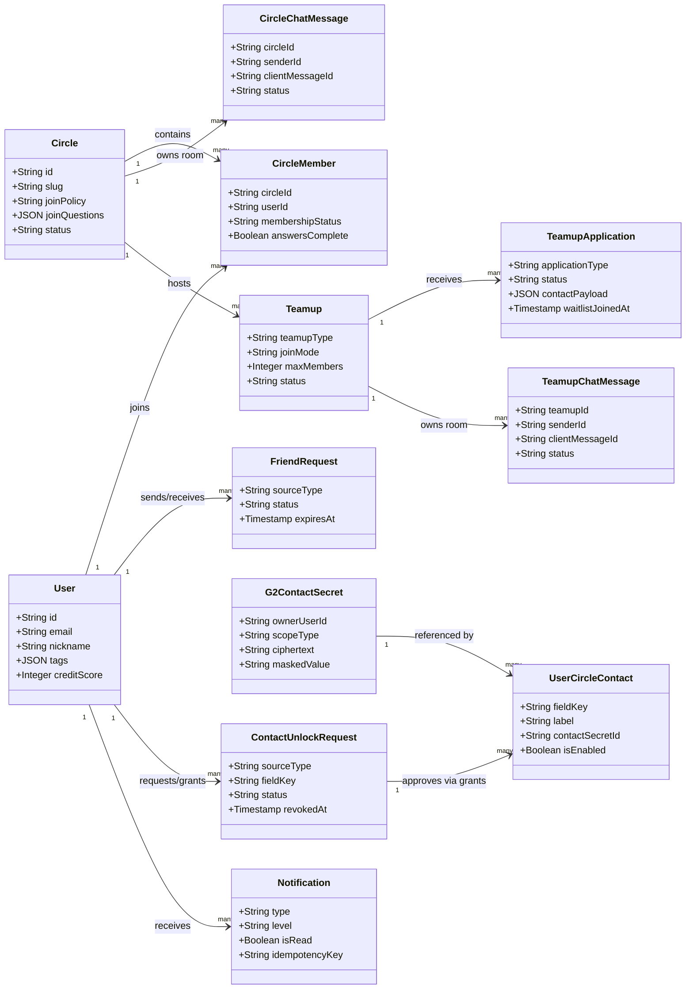
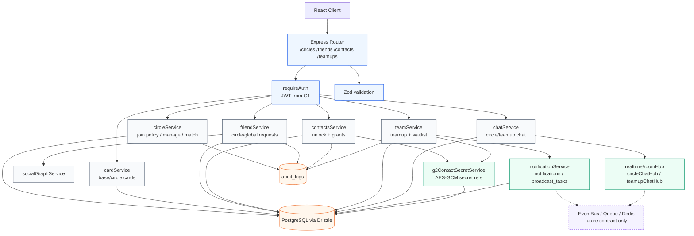
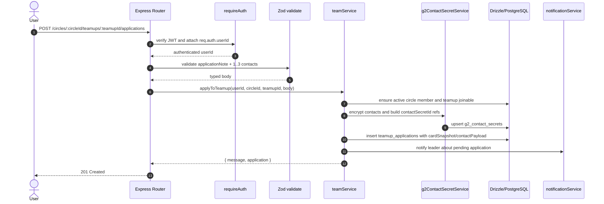
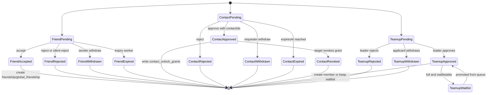
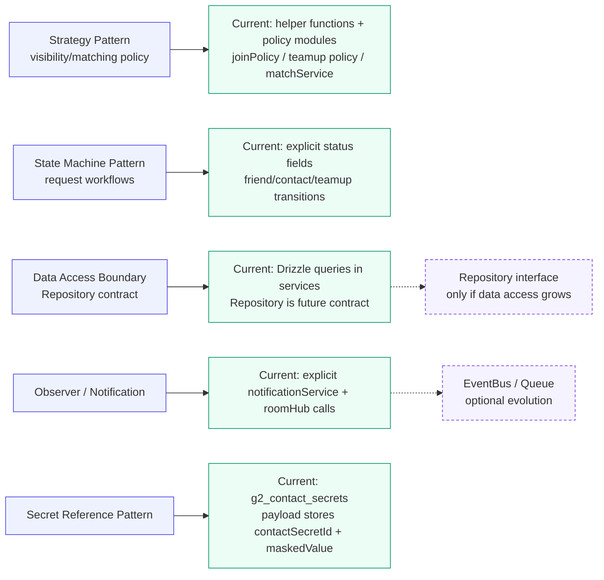
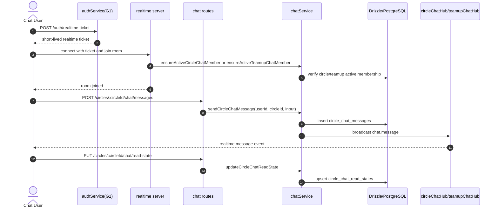

# P3 详细设计 —— Mermaid 图表源码汇总

> **说明：** 本文件汇总重制后的 Mermaid 图表源码。图表按“少而精、可审查”的方式拆分，避免上帝类图；字段、路由与状态均对齐当前代码。
> **共计 7 张图**：详细 ER 图 × 1，类图/架构/时序/状态/设计模式/聊天流程 × 6。
> **配套产物：** 本文件提供完整 Mermaid 源码；单图源码位于 `mermaid源码汇总/`，生成图片位于 `mermaid图像汇总/`，两者按图名一一对应。

---

## 图 1：详细 ER 图（含关键字段）

- **用途：** 展示当前 G2 相关核心表、主外键和关键属性，补足原 ER 图只有表名和连线的问题。

```mermaid
erDiagram
    users ||--o{ circles : "creator_id"
    users ||--o{ circle_members : "member"
    users ||--o{ circle_member_roles : "role"
    users ||--o{ circle_join_requests : "applies"
    users ||--o{ circle_blacklist : "blocked_user"
    users ||--o{ circle_member_locations : "shares_location"
    users ||--o{ circle_chat_messages : "sends"
    users ||--o{ friendships : "circle_friend_pair"
    users ||--o{ global_friendships : "global_friend_pair"
    users ||--o{ friend_requests : "sender_or_receiver"
    users ||--o{ contact_unlock_requests : "requester_or_target"
    users ||--o{ g2_contact_secrets : "owns_secret"
    users ||--o{ user_circle_contacts : "configures"
    users ||--o{ teamups : "leader"
    users ||--o{ teamup_members : "joins"
    users ||--o{ teamup_applications : "applicant"
    users ||--o{ teamup_member_contacts : "provides"
    users ||--o{ notifications : "receives"
    users ||--o{ audit_logs : "operator"

    circles ||--o{ circle_members : "contains"
    circles ||--o{ circle_join_requests : "reviews"
    circles ||--o{ circle_blacklist : "blocks"
    circles ||--o{ circle_member_locations : "locates"
    circles ||--o{ circle_chat_messages : "chat_room"
    circles ||--o{ friendships : "scopes"
    circles ||--o{ friend_requests : "optional_scope"
    circles ||--o{ contact_unlock_requests : "circle_source"
    circles ||--o{ user_circle_contacts : "contact_scope"
    circles ||--o{ teamups : "hosts"

    contact_unlock_requests ||--o{ contact_unlock_grants : "approves_contacts"
    g2_contact_secrets ||--o{ user_circle_contacts : "secret_ref"
    user_circle_contacts ||--o{ contact_unlock_grants : "granted_contact"

    teamups ||--o{ teamup_members : "contains"
    teamups ||--o{ teamup_applications : "receives"
    teamups ||--o{ teamup_member_contacts : "stores_contact_refs"
    teamups ||--o{ teamup_forum_sync_jobs : "optional_sync"
    teamups ||--o{ teamup_chat_messages : "chat_room"
    teamup_chat_messages ||--o{ teamup_chat_read_states : "read_by"
    circle_chat_messages ||--o{ circle_chat_read_states : "read_by"

    users {
        text id PK
        text email UK
        text password_hash
        text nickname
        text avatar_url
        text wechat_id
        jsonb tags
        integer credit_score
        timestamp created_at
    }
    circles {
        text id PK
        text slug UK
        text name
        text creator_id FK
        text join_policy
        jsonb join_questions
        text invite_code_hash
        integer capacity_limit
        text status
    }
    circle_members {
        text id PK
        text circle_id FK
        text user_id FK
        text membership_status
        text answers
        boolean answers_complete
        boolean is_active
    }
    circle_join_requests {
        text id PK
        text circle_id FK
        text user_id FK
        jsonb application_answers
        text application_reason
        text status
        timestamp expires_at
    }
    circle_chat_messages {
        text id PK
        text circle_id FK
        text sender_id FK
        text client_message_id
        text content
        jsonb mentions
        text status
        timestamp deleted_at
    }
    friend_requests {
        text id PK
        text circle_id FK
        text source_type "circle|global"
        text sender_id FK
        text receiver_id FK
        text status
        timestamp expires_at
    }
    contact_unlock_requests {
        text id PK
        text circle_id FK
        text source_type "circle|address_book"
        text requester_id FK
        text target_id FK
        text field_key
        text status
        timestamp revoked_at
    }
    g2_contact_secrets {
        text id PK
        text owner_user_id FK
        text scope_type
        text scope_id
        text field_key
        text ciphertext
        text nonce
        text auth_tag
        text masked_value
    }
    user_circle_contacts {
        text id PK
        text user_id FK
        text circle_id FK
        text contact_secret_id FK
        text field_key
        text label
        boolean is_enabled
    }
    contact_unlock_grants {
        text id PK
        text request_id FK
        text requester_id FK
        text target_id FK
        text circle_id FK
        text contact_id FK
        text status
    }
    teamups {
        text id PK
        text circle_id FK
        text leader_id FK
        text title
        text teamup_type "short_term|long_term"
        text join_mode "direct|approval"
        integer max_members
        integer current_member_count
        text status
    }
    teamup_applications {
        text id PK
        text teamup_id FK
        text applicant_id FK
        text application_type "join|waitlist"
        text status
        jsonb card_snapshot
        jsonb contact_payload
        timestamp waitlist_joined_at
    }
    teamup_member_contacts {
        text id PK
        text teamup_id FK
        text user_id FK
        jsonb contacts "contactSecretId refs"
    }
    teamup_chat_messages {
        text id PK
        text teamup_id FK
        text circle_id FK
        text sender_id FK
        text client_message_id
        text content
        text status
    }
    notifications {
        text id PK
        text user_id FK
        text type
        text title
        text level
        boolean is_read
        text idempotency_key UK
    }
    audit_logs {
        serial id PK
        text operator_id FK
        text action
        text target
        text result
    }
```

---

## 图 2：领域模型类图

- **用途：** 只展示实体和值对象关系，不混入 Service/Controller，避免上帝类图。

---

## 图 3：当前架构分层与依赖图

- **用途：** 展示 Express Router、函数式 service、Drizzle、通知、加密和 realtime hub 的当前落地依赖。

---

## 图 4：Teamup 申请核心交互时序图

- **用途：** 对齐当前 Teamup application 路由和 service 调用链。

---

## 图 5：请求类状态机图

- **用途：** 同时覆盖 FriendRequest、ContactUnlockRequest、TeamupApplication 的状态流转。

---

## 图 6：设计模式可视化

- **用途：** 把文字中的 Strategy、State Machine、Data Access Boundary、Observer/Notification、Secret Reference 可视化，并标注当前实现与未来契约的边界。

---

## 图 7：实时聊天链路图

- **用途：** 补充 Circle/Teamup Chat 的实时票据、成员校验、消息持久化、广播和已读状态链路。

