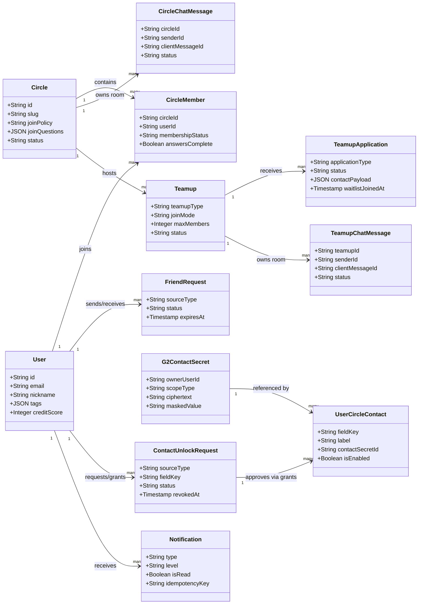
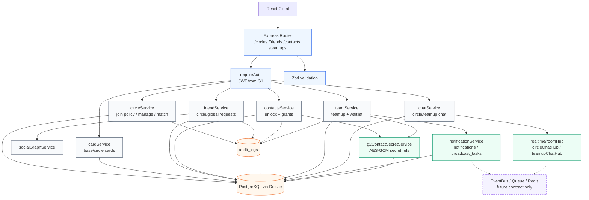
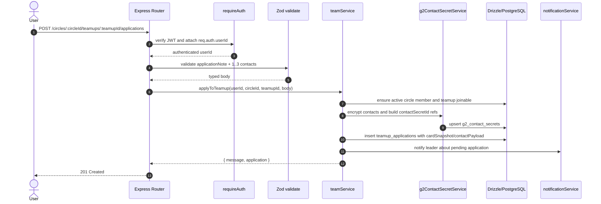
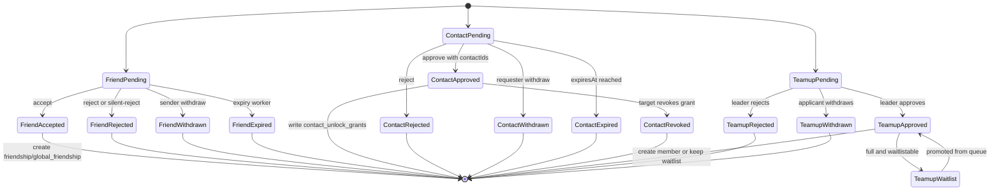
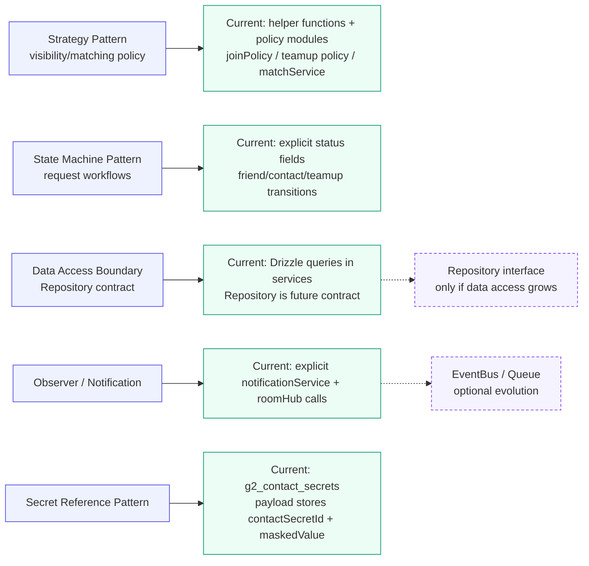
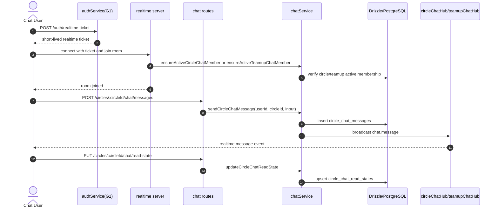

# 阶段 3：类图设计
## Circle 与关系链模块（第 2 组）

**版本：** 2.1（与当前代码实现对齐）
**日期：** 2026-05-15
**范围：** 实体类、服务模块、Controller Handler（控制器处理器）、Circle/Teamup 实时聊天

**重要实现说明：**

实际后端代码库使用的是**函数式编程模式**，而不是 OOP：
- **Services：** 从模块文件导出的 async 函数（例如 `circleService.ts` 导出 `listCircles()`、`joinCircle()` 等），而不是类方法
- **Controllers：** Express Router handlers（处理器）是内联函数，不是类方法
- **Data Access：** Drizzle ORM 查询直接嵌入 service 函数中（没有显式 Repository 类）

本文档呈现的是**使用 UML 类表示法的逻辑设计**（标准软件工程实践），并映射到实际的函数式实现。此处展示的职责边界和关系通过以下方式实现：
1. 封装业务逻辑的服务函数（service functions）
2. 用于组织数据契约的类型定义（TypeScript interfaces/types）
3. 实现实体持久化的 Drizzle ORM schema 定义（schema definitions）
4. 处理 HTTP 请求/响应（requests/responses）的 Express Router patterns（模式）

这种混合方式——用 OOP 术语进行设计，但用函数式方式实现——在现代 Node.js/TypeScript 项目中很常见，同时提供了教学上的清晰性（基于 UML 的文档）和实践上的简洁性（函数式模块）。

---

## 1. 类模型概览

### 1.1 核心实体类

| 类名 | 职责 | 关键属性 | 基数 |
|-----------|----------------|-----------------|------------|
| User | 用户资料与基本信息 | id, email, nickname, gender, mbti, bio, avatarUrl | 1 |
| Circle | 社区容器 | id, name, slug, description, category, creatorId, memberCount, status | 1:N |
| CircleMember | 用户在 circle 中的成员关系 | id, circleId, userId, membershipStatus, joinedAt | N:N |
| CircleMemberRole | 用户在 circle 中的角色 | id, circleId, userId, role（owner/admin/moderator） | N:N |
| UserCard | 用户公开资料卡片 | userId, modules, visibilityLevel, updatedAt | 1:1 |
| CardField | 带隐私设置的单个卡片字段 | fieldKey, userId, visibilityLevel, value | N:1 |
| FriendRequest | 待处理好友连接 | id, sourceType, circleId, senderId, receiverId, status, expiresAt | N:N |
| Friendship | 已建立的好友关系 | id, userAId, userBId, createdAt | N:N |
| GlobalFriendship | 平台范围内的好友关系 | id, userAId, userBId, createdAt | N:N |
| ContactUnlockRequest | 权限解锁申请 | id, sourceType, requesterId, targetId, fieldKey, status, expiresAt | N:N |
| G2ContactSecret | G2 联系方式密文 | id, ownerUserId, scopeType, scopeId, ciphertext, maskedValue | N:1 |
| UserCircleContact | 圈内可授权联系方式 | id, userId, circleId, fieldKey, contactSecretId, isEnabled | N:N |
| ContactUnlockGrant | 已批准联系方式授权 | id, requestId, requesterId, targetId, contactId, status | N:N |
| UserBlock | 拉黑关系 | id, blockerId, blockedId, createdAt | N:N |
| Teamup | Circle 活动小组 | id, circleId, leaderId, title, teamupType, joinMode, maxMembers, status, deadlineAt, endAt | 1:N |
| TeamupMember | teamup 中的成员 | id, teamupId, userId, memberRole, membershipStatus | N:N |
| TeamupApplication | 加入或候补 teamup 的成员申请 | id, teamupId, applicantId, applicationType, status, cardSnapshot, waitlistJoinedAt | N:N |
| CircleChatMessage | Circle 实时群聊消息 | id, circleId, senderId, clientMessageId, content, mentions, status | N:1 |
| TeamupChatMessage | Teamup 实时群聊消息 | id, teamupId, circleId, senderId, clientMessageId, content, mentions, status | N:1 |
| Notification | 统一消息中心通知 | id, userId, type, title, body, level, isRead, idempotencyKey | N:1 |
| CircleQuestion | circle 内的问卷问题 | id, circleId, key, type, prompt, weight, displayOrder | 1:N |
| CircleMatch | circle 内的匹配结果 | id, circleId, weekOf, userAId, userBId, score, status | 1:N |
| AuditLog | 系统操作审计轨迹 | id, operatorId, action, target, detail, ip, result, createdAt | 1 |

---

## 2. Mermaid 图表（重制版）

> 本节已按“Mermaid 语法重制”的拆图风格改造：不再把实体、服务、控制器和基础设施塞进一张上帝类图，而是拆成领域模型、架构依赖、核心交互、状态机、设计模式和实时聊天 6 张小图。所有接口与字段以当前代码和 API/ER 文档为准。

### 2.1 领域模型类图



### 2.2 当前架构分层与依赖图



### 2.3 Teamup 申请核心交互时序图



### 2.4 请求类状态机图



### 2.5 设计模式可视化



### 2.6 实时聊天链路图



### 2.7 当前代码路由对照

| Controller | 当前代码路由要点 |
|---|---|
| `CircleController` | `/circles`, `/circles/my`, `/circles/:circleId`, `/circles/:circleId/join`, `/circles/:circleId/join-policy`, `/circles/:circleId/join-requests/*`, `/circles/:circleId/location/*` |
| `FriendController` | `/friends`, `/friends/grouped`, `/friends/request`, `/friends/global/requests`, `/friends/requests/:requestId`, `/friends/requests/:requestId/withdraw`, `/friends/requests/:requestId/silent-reject` |
| `ContactUnlockController` | `/contacts/circles/:circleId/settings`, `/contacts/unlock-request`, `/contacts/unlock-requests/:requestId`, `/contacts/unlock-requests/:requestId/withdraw`, `/contacts/unlock-requests/:requestId/revoke`, `/contacts/status/:userId`, `/contacts/:userId` |
| `TeamupController` | `/circles/:circleId/teamups`, `/circles/:circleId/teamups/:teamupId`, `/circles/:circleId/teamups/:teamupId/applications`, `/circles/:circleId/teamups/:teamupId/members/me`, `/circles/:circleId/teamups/:teamupId/contacts`, `/teamups/applications/replies` |
| `ChatController` | `/circles/:circleId/chat/messages`, `/circles/:circleId/chat/read-state`, `/circles/:circleId/teamups/:teamupId/chat/messages`, `/circles/:circleId/teamups/:teamupId/chat/read-state` |

---

## 3. 详细类定义

### 3.1 实体类

#### User
```
类：User
类型：实体 / 持久化
范围：平台范围内的用户资料

属性：
  - id: String [PK, UUID]
  - email: String [UK, NotNull]
  - nickname: String
  - gender: String [Enum: male, female]
  - genderPref: String [Enum: male, female, any]
  - intention: String [Enum: friend, partner]
  - grade: String [Enum: 2023级, 2024级, ...]
  - campus: String [Enum: xianlin, gulou, suzhou, pukou]
  - department: String
  - mbti: String [Length: 4]
  - bio: Text
  - avatarUrl: String
  - wechatId: String
  - isParticipating: Boolean [Default: true]
  - profileComplete: Boolean [Default: false]
  - surveyComplete: Boolean [Default: false]
  - createdAt: Timestamp [Auto, WithTimezone]
  - updatedAt: Timestamp [Auto, WithTimezone]

关键方法：
  + updateProfile(profile: Map): void
    带校验地更新用户资料字段
  + getVisibleCard(viewerId: String): UserCard
    根据隐私规则返回 viewerId 可见的卡片
  + getTotalFriendCount(): int
    返回平台范围内的好友总数
  + getCircleCount(): int
    返回用户加入的 circles 数量
```

#### Circle
```
类：Circle
类型：实体 / 持久化
范围：社区容器与元数据

属性：
  - id: String [PK, UUID]
  - name: String [NotNull, MaxLength: 100]
  - slug: String [UK, NotNull]
  - description: Text
  - category: String [Enum: sports, academic, arts, professional, lifestyle]
  - tags: List<String> [JSONB, MaxItems: 10]
  - iconUrl: String
  - creatorId: String [FK → User.id, OnDelete: SET_NULL]
  - memberCount: int [Default: 0]
  - isActive: Boolean [Default: true]
  - status: String [Enum: active, inactive, pending_review, rejected, banned, archived]
  - createdAt: Timestamp [Auto]

关键方法：
  + addMember(user: User): CircleMember
    向 circle 添加新成员（检查加入模式）
  + removeMember(userId: String): void
    移除成员并级联处理相关数据
  + getMembers(limit: int, offset: int): List<CircleMember>
    返回经过可见性过滤的分页成员列表
  + updateInfo(info: CircleUpdateDTO): void
    带校验地更新 circle 元数据
  + archiveCircle(): void
    软删除 circle，保留历史数据
```

#### CircleMember
```
类：CircleMember
类型：实体 / 持久化 / 连接表
范围：用户在特定 circle 中的成员关系

属性：
  - id: String [PK, UUID]
  - circleId: String [FK → Circle.id, NotNull]
  - userId: String [FK → User.id, NotNull]
  - membershipStatus: String [Enum: pending, active, Default: active]
  - answers: Text [JSON, Optional] # Circle 专属问卷答案
  - answersComplete: Boolean [Default: false]
  - isActive: Boolean [Default: true]
  - joinedAt: Timestamp [Auto]
  - updatedAt: Timestamp [Auto]
  - [UK: (circleId, userId)]

关键方法：
  + updateAnswers(answers: Map): void
    保存此 circle 的问卷答案
  + leave(): void
    将自己从 circle 中移除并触发级联处理
  + getProfile(): UserCard
    返回用户在此 circle 上下文中可见的卡片
```

#### UserCard
```
类：UserCard
类型：实体 / 持久化 / Value Object（值对象）
范围：用户公开资料展示

属性：
  - userId: String [PK, FK → User.id, OneToOne]
  - modules: List<CardModule> [JSONB, NotNull, Default: []]
    # 每个 module：{ moduleKey, value, visibilityLevel, displayOrder }
  - updatedAt: Timestamp [Auto]

关键方法：
  + addModule(module: CardModule): void
    向 profile 追加新的 card module
  + removeModule(moduleKey: String): void
    按 key 移除 module，并触发隐私清理
  + updateModule(moduleKey: String, value: any): void
    更新已有 module 值
  + getVisibleModules(viewerId: String): List<CardModule>
    返回 viewerId 可见的 modules
    # 使用 PrivacyEngine 进行可见性解析
```

#### FriendRequest
```
类：FriendRequest
类型：实体 / 持久化 / 状态机
范围：待处理的双向好友连接

属性：
  - id: String [PK, UUID]
  - senderId: String [FK → User.id, NotNull]
  - receiverId: String [FK → User.id, NotNull]
  - circleId: String [FK → Circle.id, Optional]
  - message: Text [MaxLength: 300]
  - sourceType: String [Enum: circle, global, Default: circle]
  - status: String [Enum: pending, accepted, rejected, withdrawn, expired, Default: pending]
  - expiresAt: Timestamp [Default: +7 days]
  - cardSnapshot: JSONB [Optional]
  - createdAt: Timestamp [Auto]
  - updatedAt: Timestamp [Auto]
  - [UK: circle pending pair 或 global pending pair]

关键方法：
  + approve(): void
    接收者接受请求，创建 Friendship，并更新隐私规则
  + reject(silent: Boolean): void
    接收者拒绝请求，可选择跳过通知
  + withdraw(): void
    发送者取消待处理请求
  + isExpired(): Boolean
    如果 pending 超过 30 天则返回 true
```

#### Friendship
```
类：Friendship
类型：实体 / 持久化 / 无向边
范围：已建立的双向关系（circle 专属）

属性：
  - id: String [PK, UUID]
  - circleId: String [FK → Circle.id, NotNull]
  - userAId: String [FK → User.id, NotNull]
  - userBId: String [FK → User.id, NotNull]
  - createdAt: Timestamp [Auto]
  - [UK: (circleId, userAId, userBId)]

关键方法：
  + remove(): void
    删除好友关系，并撤销提升后的隐私访问权限
  + getSharedCircles(): List<Circle>
    返回两个用户共同所在的 circles
```

#### ContactUnlockRequest
```
类：ContactUnlockRequest
类型：实体 / 持久化 / 状态机
范围：敏感卡片字段的权限解锁

属性：
  - id: String [PK, UUID]
  - requesterId: String [FK → User.id, NotNull]
  - targetId: String [FK → User.id, NotNull]
  - fieldKey: String [NotNull, Default: contact_primary] # 例如 contact_primary / contact_circle
  - circleId: String [FK → Circle.id, Optional]
  - sourceType: String [Enum: circle, address_book, Default: circle]
  - message: Text [MaxLength: 300]
  - status: String [Enum: pending, approved, rejected, withdrawn, expired, revoked, Default: pending]
  - expiresAt: Timestamp [Default: +7 days]
  - revokedAt: Timestamp [Optional]
  - createdAt: Timestamp [Auto]
  - updatedAt: Timestamp [Auto]
  - [UK: circle/address_book pending request]

关键方法：
  + approve(): void
    目标用户授予字段访问权限，并记录到 audit log
  + reject(): void
    目标用户拒绝，并通知请求者
  + revoke(): void
    目标用户撤回此前授予的访问权限
  + isGranted(): Boolean
    如果 status='approved' 且未过期，则返回 true
```

#### Teamup
```
类：Teamup
类型：实体 / 持久化 / 聚合根
范围：Circle 活动小组/组队

属性：
  - id: String [PK, UUID]
  - circleId: String [FK → Circle.id, NotNull]
  - leaderId: String [FK → User.id, NotNull]
  - title: String [NotNull, MaxLength: 60]
  - description: Text [MaxLength: 2000, NotNull]
  - descriptionPreview: String [MaxLength: 200]
  - maxMembers: int [Min: 2, NotNull]
  - currentMemberCount: int [Default: 1, Calculated]
  - deadlineAt: Timestamp [NotNull]
  - endAt: Timestamp [NotNull]
  - teamupType: String [Enum: short_term, long_term, Default: short_term]
  - joinMode: String [Enum: direct, approval, Default: approval]
  - isPublic: Boolean [Default: false]
  - status: String [Enum: recruiting, full, cancelled, Default: recruiting]
  - cancelSource: String [Enum: leader, admin, Optional]
  - cancelReason: Text
  - forumPostId: String [FK → ForumPost.id, Optional]
  - forumSyncStatus: String [Enum: none, pending, synced, failed, Default: none]
  - createdAt: Timestamp [Auto]
  - updatedAt: Timestamp [Auto]

关键方法：
  + addMember(userId: String): TeamupMember
    直接加入或基于审批添加
  + approveMember(applicationId: String): void
    批准待处理申请，创建 TeamupMember
  + rejectApplication(applicationId: String): void
    拒绝申请，并通知申请人
  + removeMember(userId: String): void
    移除成员，并检查 leader 状态
  + cancel(reason: String): void
    取消 teamup，并通知所有成员
  + getMembers(): List<TeamupMember>
    返回 active 成员
  + getApplications(): List<TeamupApplication>
    返回 pending 申请
  + isFull(): Boolean
    返回 currentMemberCount >= maxMembers
```

#### TeamupMember
```
类：TeamupMember
类型：实体 / 持久化 / 连接表
范围：用户在特定 teamup 中的成员关系

属性：
  - id: String [PK, UUID]
  - teamupId: String [FK → Teamup.id, NotNull]
  - userId: String [FK → User.id, NotNull]
  - memberRole: String [Enum: leader, member, Default: member]
  - membershipStatus: String [Enum: active, left, cancelled, Default: active]
  - joinedAt: Timestamp [Auto]
  - leftAt: Timestamp [Optional]
  - createdAt: Timestamp [Auto]
  - updatedAt: Timestamp [Auto]
  - [UK: (teamupId, userId)]

关键方法：
  + leave(): void
    成员主动退出，并更新状态
  + getUser(): User
    返回关联的 User 实体
```

#### TeamupApplication
```
类：TeamupApplication
类型：实体 / 持久化 / 状态机
范围：加入团队的成员申请

属性：
  - id: String [PK, UUID]
  - teamupId: String [FK → Teamup.id, NotNull]
  - applicantId: String [FK → User.id, NotNull]
  - applicationType: String [Enum: join, waitlist, Default: join]
  - applicationNote: Text [NotNull, MaxLength: 300]
  - cardSnapshot: JSONB [NotNull]
  - cardSnapshotView: String [Enum: public, friend]
  - cardSnapshotRelationship: String [Enum: not_friend, friend]
  - contactPayload: JSONB [NotNull] # { type, value, label }
  - status: String [Enum: pending, approved, rejected, withdrawn, Default: pending]
  - reviewedBy: String [FK → User.id, Optional]
  - reviewNote: Text
  - reviewedAt: Timestamp [Optional]
  - waitlistJoinedAt: Timestamp [Optional]
  - createdAt: Timestamp [Auto]
  - updatedAt: Timestamp [Auto]
  - [UK: (teamupId, applicantId) WHERE status='pending']

关键方法：
  + approve(): void
    Leader 批准，并创建 TeamupMember
  + reject(note: String): void
    Leader 拒绝，并可附带可选原因
  + withdraw(): void
    申请人撤回申请
```

#### CircleQuestion
```
类：CircleQuestion
类型：实体 / 持久化
范围：Circle 专属问卷配置

属性：
  - id: String [PK, UUID]
  - circleId: String [FK → Circle.id, NotNull]
  - key: String [NotNull] # 在 circle 内唯一，例如 'skill_level'
  - type: String [Enum: scale, single_choice, multi_choice, ranking]
  - prompt: Text [NotNull]
  - options: Text [JSON, Optional] # 选项数组
  - weight: Float [Default: 1.0]
  - displayOrder: int [Default: 0]
  - isChannelTag: Boolean [Default: false]

关键方法：
  + getOptions(): List<String>
    解析并返回选项
  + validate(answer: any): Boolean
    根据问题类型校验答案
```

#### CircleMatch
```
类：CircleMatch
类型：实体 / 持久化
范围：Circle 上下文内的匹配结果

属性：
  - id: String [PK, UUID]
  - circleId: String [FK → Circle.id, NotNull]
  - weekOf: String [NotNull] # YYYY-MM-DD（星期三）
  - userAId: String [FK → User.id, NotNull]
  - userBId: String [FK → User.id, NotNull]
  - score: Double [Min: 0.0, Max: 1.0, NotNull]
  - userAAction: String [Enum: ACCEPT, REJECT, Optional]
  - userBAction: String [Enum: ACCEPT, REJECT, Optional]
  - status: String [Enum: LOCKED, REVEALED, MUTUAL, MISSED, Default: LOCKED]
  - revealedAt: Timestamp [Optional]
  - createdAt: Timestamp [Auto]
  - [UK: (circleId, weekOf, userAId)]
  - [UK: (circleId, weekOf, userBId)]

关键方法：
  + getScore(): Double
    返回兼容性分数
  + recordAction(userId: String, action: String): void
    记录用户的 accept/reject 决策
  + isMatched(): Boolean
    如果双方用户都接受则返回 true
```

#### AuditLog
```
类：AuditLog
类型：实体 / 持久化 / 事件记录
范围：敏感操作的系统级审计轨迹

属性：
  - id: int [PK, Serial, AutoIncrement]
  - operatorId: String [FK → User.id, Optional, OnDelete: SET_NULL]
  - action: String [NotNull] # 例如 trigger_matching, approve_request, revoke_access
  - target: String [Optional] # 目标实体 id
  - detail: Text [JSON, Optional] # 上下文与 payload
  - ip: String [Optional]
  - result: String [Enum: success, failure, Default: success]
  - createdAt: Timestamp [Auto, WithTimezone]

关键方法：
  + getActionDetail(): String
    返回人类可读的操作描述
```

---

### 3.2 Service 类（业务逻辑层）

#### circleService.ts
```
模块：circleService
类型：函数式 Service 模块
职责：Circle 生命周期管理、成员操作、问卷、匹配

关键导出函数：
  + listCircles(userId: String, category?: String): Promise<Circle[]>
    列出用户可用的 circles，并按 category 过滤
  + getCircleDetail(circleId: String, userId: String): Promise<CircleDetail>
    返回完整 circle 详情以及成员状态
  + getChannelMembers(viewerId: String, circleId: String, page: int, limit: int): Promise<Page<Member>>
    带可见性过滤的 circle 成员分页列表
  + getMyCircles(userId: String): Promise<Circle[]>
    返回用户已加入的 circles
  + joinCircle(circleId: String, userId: String): Promise<CircleMember>
    将用户添加到 circle，并初始化 card components
  + leaveCircle(circleId: String, userId: String): Promise<void>
    将用户从 circle 中移除，并级联处理相关数据
  + createCircle(data: CircleCreateInput): Promise<Circle>
    创建新 circle [仅 ADMIN 或特殊角色]
  + updateCircle(circleId: String, data: CircleUpdateInput): Promise<Circle>
    更新 circle 元数据 [仅 Admin]
  + getQuestionnaire(circleId: String, userId: String): Promise<Questions[]>
    返回用户的 circle 专属问卷
  + submitQuestionnaire(circleId: String, userId: String, answers: Map): Promise<void>
    存储用户用于 circle matching 的答案
  + getCurrentCircleMatch(circleId: String, userId: String): Promise<CircleMatch>
    返回用户当前在 circle 中未处理的 match
  + recordCircleAction(matchId: String, userId: String, action: String): Promise<void>
    记录用户对 match 的 ACCEPT/REJECT 决策
  + getCircleMatchHistory(circleId: String, userId: String, page: int, limit: int): Promise<Page<CircleMatch>>
    返回分页历史 matches
  + runCircleMatchingPipeline(circleId?: String): Promise<void>
    触发匹配算法 [CRON/ADMIN]
```

#### cardService.ts
```
模块：cardService
类型：函数式 Service 模块
职责：用户卡片（profile）展示、组件管理、可见性控制

关键导出函数：
  + getBaseCardComponents(userId: String): Promise<CardComponent[]>
    返回为用户配置的 card components
  + getMyBaseCard(userId: String): Promise<CardPayload>
    返回用户自己的 base card 及其所有 components
  + updateMyBaseCard(userId: String, cardData: GroupedComponentsInput): Promise<void>
    更新 card components，并保留已有未修改 components
  + getMyCardPublicPreference(userId: String): Promise<HiddenPreviewMode>
    返回 public card 预览模式（titles_only | fully_hidden）
  + updateMyCardPublicPreference(userId: String, mode: HiddenPreviewMode): Promise<void>
    设置 public card 预览模式
  + getMyCircleCard(userId: String, circleId: String): Promise<CardPayload>
    返回为特定 circle 自定义的 card
  + updateMyCircleCard(userId: String, circleId: String, cardData: GroupedComponentsInput): Promise<void>
    更新 circle 专属 card 自定义内容
  + getPublicCard(userId: String, viewerId: String?): Promise<CardSnapshotPreview>
    返回无需认证即可见的 card（public preview）
  + getFriendCard(userId: String, viewerId: String): Promise<CardSnapshotPreview>
    返回已认证好友可见的 card
  + getMyCircleCustomCards(userId: String, circleId: String): Promise<CustomCard[]>
    返回为 circle 创建的附加 custom cards
  + createMyCircleCustomCard(userId: String, circleId: String, data: CustomCardInput): Promise<CustomCard>
    为 circle 创建附加 custom profile card

隐私说明：隐私规则分布在各处——cardService 不执行权限检查；这是调用方的职责。
```

#### friendService.ts
```
模块：friendService
类型：函数式 Service 模块
职责：好友关系生命周期、请求管理、好友关系查询

关键导出函数：
  + getFriends(userId: String): Promise<{ friends: Friend[] }>
    返回用户完整好友列表（平台范围 + 每个 circle）
  + getGroupedFriends(userId: String): Promise<{ globalFriends: Friend[], circleFriends: Map<String, Friend[]> }>
    返回按 global friendship 和每个 circle friendship 分组的好友
  + sendFriendRequest(senderId: String, receiverId: String, circleId?: String, message?: String): Promise<FriendRequest>
    发送好友请求，可选限定在 circle 作用域
  + sendGlobalFriendRequest(senderId: String, receiverId: String, message?: String): Promise<FriendRequest>
    发送平台范围好友请求
  + getFriendRequests(userId: String): Promise<FriendRequest[]>
    返回收到的 pending 请求和已处理回复
  + handleFriendRequest(userId: String, requestId: String, action: accept|reject): Promise<HandleResult>
    接收者批准或拒绝请求，批准后创建 circle/global 好友关系
  + closeFriendRequest(userId: String, requestId: String, action: withdraw|silent-reject): Promise<CloseResult>
    发送者撤回，或接收者静默拒绝
  + deleteFriend(userId: String, friendId: String, circleId: String): Promise<void>
    删除指定 circle 内好友关系
  + deleteAllFriends(userId: String, friendId: String): Promise<void>
    删除平台范围与所有 circle 内好友关系
```

#### contactsService.ts
```
模块：contactsService
类型：函数式 Service 模块
职责：联系方式/权限解锁请求生命周期、访问控制

关键导出函数：
  + listMyCircleContacts(userId: String, circleId: String): Promise<CircleContact[]>
    返回用户在 circle 内配置的可授权联系方式
  + upsertMyCircleContact(userId: String, circleId: String, input: CircleContactInput): Promise<CircleContact>
    新增或更新圈内联系方式，并写入 g2_contact_secrets 密文表
  + updateMyCircleContact(userId: String, circleId: String, contactId: String, patch: CircleContactPatch): Promise<CircleContact>
    修改联系方式标签、值或启用状态
  + deleteMyCircleContact(userId: String, circleId: String, contactId: String): Promise<void>
    删除圈内联系方式和关联密文
  + sendContactUnlockRequest(requesterId: String, targetId: String, options: UnlockRequestInput): Promise<ContactUnlockRequest>
    提交联系方式授权请求（circle 或 address_book 来源）
  + getContactUnlockRequests(userId: String): Promise<ContactUnlockRequest[]>
    返回用户收到的 pending 请求和自己发出的回复状态
  + handleContactUnlockRequest(userId: String, requestId: String, action: approve|reject, contactIds?: String[]): Promise<HandleResult>
    目标用户批准或拒绝；批准时选择要授权的 contactIds 并写入 grants
  + withdrawContactUnlockRequest(userId: String, requestId: String): Promise<void>
    请求者撤回待处理申请
  + revokeContactUnlockRequest(userId: String, requestId: String): Promise<void>
    目标用户撤销已批准授权
  + getFriendContactAvailabilityMap(userId: String): Promise<Map<String, ContactAvailability>>
    返回好友联系方式的可用状态（available/pending/denied）
  + getContactUnlockStatus(requesterId: String, targetId: String, options?: { circleId?: String }): Promise<ContactUnlockState>
    检查 requester 是否可以查看 targetId 的联系方式（idle | sent | granted）
  + getUnlockedContacts(requesterId: String, targetId: String, options?: { circleId?: String }): Promise<UnlockedContacts>
    返回已授权联系方式；明文来自 g2_contact_secrets 解密
```

#### teamService.ts
```
模块：teamService
类型：函数式 Service 模块 / Aggregate Handler
职责：Teamup（活动小组）生命周期、申请、成员、forum 同步

关键导出函数：
  + createTeamup(circleId: String, leaderId: String, teamupInfo: CreateTeamupInput): Promise<Teamup>
    创建新的 teamup 活动，并用 leader 初始化
  + updateTeamup(teamupId: String, userId: String, updates: UpdateTeamupInput): Promise<Teamup>
    更新 teamup 详情 [仅 leader]
  + cancelTeamup(teamupId: String, userId: String, reason: String): Promise<void>
    取消 teamup，通知成员，并更新状态
  + getTeamupDetail(teamupId: String, userId: String?): Promise<TeamupDetail>
    返回完整 teamup 详情及成员列表 [需要 Auth]
  + getPublicTeamupSummary(teamupId: String): Promise<TeamupSummary>
    返回无需 auth 的 public teamup 信息 [Public endpoint]
  + listTeamups(circleId: String, filters: TeamupFilterDTO, pagination: PaginationDTO): Promise<Page<Teamup>>
    列出 circle 中的 teamups，支持过滤和分页
  + listMyTeamupHistory(userId: String, circleId: String, pagination: PaginationDTO): Promise<Page<Teamup>>
    返回用户在该 circle 中参与过的 teamup 历史
  + applyToTeamup(userId: String, teamupId: String, application: TeamupApplicationInput): Promise<TeamupApplication>
    提交成员申请，包含 card snapshot 和联系方式密文引用
  + joinTeamupDirect(userId: String, circleId: String, teamupId: String, contacts: Contact[]): Promise<TeamupMember>
    直接加入 [当 joinMode=direct 时]；满员且可候补时创建 waitlist application
  + listTeamupApplications(teamupId: String, userId: String): Promise<TeamupApplication[]>
    列出 pending 申请 [仅 leader]
  + listMyTeamupApplicationReplies(userId: String): Promise<TeamupApplication[]>
    返回我发出的申请及审核回复
  + reviewTeamupApplication(userId: String, circleId: String, teamupId: String, applicationId: String, action: String, note?: String): Promise<ReviewResult>
    Leader 批准/拒绝申请，必要时从 waitlist 晋升
  + withdrawTeamupApplication(userId: String, circleId: String, teamupId: String, applicationId: String): Promise<void>
    申请人撤回 pending 申请
  + leaveTeamup(userId: String, circleId: String, teamupId: String): Promise<void>
    成员自愿离开 teamup
  + getTeamupContacts(userId: String, circleId: String, teamupId: String): Promise<TeamupContacts>
    报名截止后、活动结束前向 active 成员返回解密联系方式

Forum 同步：当前表结构支持 `teamup_forum_sync_jobs`，但代码中 `TEAMUP_FORUM_SYNC_ENABLED=false` 时不会实际同步。
```

#### chatService.ts
```
模块：chatService
类型：函数式 Service 模块
职责：Circle/Teamup 实时聊天、历史消息、软删除和已读状态

关键导出函数：
  + listCircleChatMessages(userId: String, circleId: String, query): Promise<Page<ChatMessage>>
    返回 circle 聊天历史
  + sendCircleChatMessage(userId: String, circleId: String, input): Promise<ChatMessage>
    写入 circle_chat_messages 并通过 circleChatHub 广播
  + deleteCircleChatMessage(userId: String, circleId: String, messageId: String): Promise<void>
    将消息标记为 deleted 并广播删除事件
  + updateCircleChatReadState(userId: String, circleId: String, input): Promise<ReadState>
    更新用户在 circle 房间的已读位置
  + listTeamupChatMessages(userId: String, circleId: String, teamupId: String, query): Promise<Page<ChatMessage>>
    返回 teamup 聊天历史
  + sendTeamupChatMessage(userId: String, circleId: String, teamupId: String, input): Promise<ChatMessage>
    写入 teamup_chat_messages 并通过 teamupChatHub 广播
  + deleteTeamupChatMessage(userId: String, circleId: String, teamupId: String, messageId: String): Promise<void>
    将 teamup 消息标记为 deleted
  + updateTeamupChatReadState(userId: String, circleId: String, teamupId: String, input): Promise<ReadState>
    更新用户在 teamup 房间的已读位置
```

#### socialGraphService.ts
```
模块：socialGraphService
类型：函数式 Service 模块 / Query Helper
职责：关系查询、好友关系校验、图检查

关键导出函数：
  + areUsersGlobalFriends(userAId: String, userBId: String): Promise<Boolean>
    检查平台范围内的好友关系状态
  + areUsersCircleFriends(circleId: String, userAId: String, userBId: String): Promise<Boolean>
    检查 circle 作用域内的好友关系状态
  + ensureGlobalFriendship(userAId: String, userBId: String): Promise<Friendship>
    如果好友关系不存在则创建；如果已存在则返回现有关系
  + listCircleFriendshipsForTargets(circleId: String, targetIds: String[]): Promise<Friendship[]>
    批量检查 circle 中多个目标的好友关系
  + buildCircleFriendPairCondition(circleId: String, userAId: String, userBId: String): QueryCondition
    为 circle 好友关系对查询构建 SQL 条件
  + buildGlobalFriendPairCondition(userAId: String, userBId: String): QueryCondition
    为 global 好友关系对查询构建 SQL 条件
  + normalizeFriendPair(userAId: String, userBId: String): { min: String, max: String }
    为对称查询规范化关系对（min < max）

设计说明：封装贯穿各 services 使用的关系查询。支持隐私与可见性检查。
```

#### matchService.ts
```
模块：matchService
类型：函数式 Service 模块
职责：平台范围内的每周匹配、兼容性评分、match 生命周期

关键导出函数：
  + getCurrentMatch(userId: String): Promise<Match>
    返回用户当前未处理的平台级 match
  + recordMatchAction(matchId: String, userId: String, action: String): Promise<void>
    记录用户的 ACCEPT/REJECT 决策
  + getMatchHistory(userId: String, page: int, limit: int): Promise<Page<Match>>
    返回分页历史 matches
  + triggerWeeklyMatching(): Promise<void>
    为所有用户运行每周匹配算法 [CRON]
  + unlockMatches(): Promise<void>
    将 pending matches 转换为 revealed 状态 [CRON]

算法：
  - Gale-Shapley 稳定匹配（backend/src/matching/galeShapley.ts）
  - 兼容性评分（backend/src/matching/compatibility.ts）
  - dealbreaker 评估（backend/src/matching/dealbreakers.ts）
```

#### 其他核心 Services

**surveyService.ts**
- 平台范围内的问卷管理与答案收集
- 管理 survey 版本、问题和用户响应
- 导出：submitSurvey()、getSurveyAnswers()、listSurveyVersions()

**authService.ts**
- 用户认证、注册、OTP 校验、JWT 签发和实时连接票据
- 该模块由第 1 组主责；G2 文档只说明 `requireAuth` 与 `/auth/realtime-ticket` 的依赖，不展开登录/注册业务细节
- 当前导出：sendOtp()、registerWithOtp()、loginWithPassword()、sendResetPasswordCode()、resetPasswordWithOtp()、verifyOtp()

**cardJoinInitializationService.ts**
- 加入 circle 时初始化用户 card components（卡片组件）
- 为每个 circle 设置默认 card layout（卡片布局）
- 导出：initializeCardsOnCircleJoin()

**aiService.ts**
- AI 驱动功能（例如通过 Gemini API 生成 match insights（匹配洞察）、curator notes（策展备注））
- 基于用户数据生成个性化内容
- 导出：generateMatchInsights()、generateCuratorNote()

#### 审计日志架构

与理论上的 AuditService 类不同，实际代码中的 audit logging（审计日志） 是**分布式的**：
- Services 在记录敏感操作时直接调用 `db.insert(auditLogs).values({ ... })`
- 没有单独的 AuditService 类；logging 嵌入在 service functions（服务函数） 中
- 记录的示例操作：contact unlock 审批、friend request 操作、teamup 成员关系变更

这种方式使 audit record（审计记录）s（审计记录） 与触发它们的业务逻辑保持绑定。

---

### 3.3 Controller 类（HTTP API 层）

#### CircleController
```
类：CircleController
类型：Controller / HTTP Handler
范围：circle 操作的 REST endpoints
认证：需要 JWT token（discovery endpoints 除外）

依赖：
  - circleService: CircleService [Dependency Injection]
  - authMiddleware: AuthMiddleware [Aspect]
  - validationMiddleware: ValidationMiddleware [Aspect]

端点：
  + GET /circles (discoveryFilter, pagination) → Page<CircleDto>
    Handler： GET_discoverCircles
  + POST /circles (circleCreateDto) → CircleDto
    Handler： POST_createCircle [需要 Auth]
  + GET /circles/{circleId} → CircleDetailDto
    Handler： GET_circleDetail
  + POST /circles/{circleId}/join (message?) → CircleMemberDto
    Handler： POST_joinCircle [需要 Auth]
  + DELETE /circles/{circleId} → void
    Handler： DELETE_leaveCircle [需要 Auth]
  + GET /circles/{circleId}/members (filters, pagination) → Page<CircleMemberDto>
    Handler： GET_circleMembers
  + POST /circles/{circleId}/members/{userId}/approve → void
    Handler： POST_approveMembership [Auth Required, Circle Owner]
  + POST /circles/{circleId}/members/{userId}/reject → void
    Handler： POST_rejectMembership [Auth Required, Circle Owner]

关键方法：
  + GET_discoverCircles(request: HttpRequest): Response
  + POST_createCircle(request: HttpRequest): Response
  + GET_circleDetail(circleId: String): Response
  + POST_joinCircle(circleId: String): Response
  + DELETE_leaveCircle(circleId: String): Response
  + GET_circleMembers(circleId: String, filters: Map): Response
  + POST_approveMembership(circleId: String, userId: String): Response
  + POST_rejectMembership(circleId: String, userId: String): Response
```

#### CardController
```
类：CardController
类型：Controller / HTTP Handler
范围：card/profile 展示与编辑的 REST endpoints
认证：需要 JWT token

依赖：
  - cardService: CardService [Dependency Injection]
  - authMiddleware: AuthMiddleware [Aspect]

端点：
  + GET /card/{userId} → CardDto
    Handler： GET_card
  + GET /card/me → CardDto
    Handler： GET_myCard [需要 Auth]
  + PATCH /card/field/{fieldKey} (value, visibilityLevel) → void
    Handler： PATCH_updateField [需要 Auth]
  + PATCH /card/field/{fieldKey}/visibility (visibilityLevel) → void
    Handler： PATCH_setFieldVisibility [需要 Auth]

关键方法：
  + GET_card(userId: String, viewerId: String?): Response
  + PATCH_updateField(fieldKey: String, updateDto: CardFieldUpdateDto): Response
  + PATCH_setFieldVisibility(fieldKey: String, visibilityDto: VisibilityDto): Response
  + GET_myCard(): Response
```

#### FriendController
```
类：FriendController
类型：Controller / HTTP Handler
范围：friend 管理的 REST endpoints
认证：需要 JWT token

依赖：
  - friendService: FriendService [Dependency Injection]
  - authMiddleware: AuthMiddleware [Aspect]

端点：
  + POST /friends/request (targetUserId, circleId, message) → RequestResult
    Handler： POST_sendRequest [需要 Auth]
  + POST /friends/global/requests (targetUserId, message) → RequestResult
    Handler： POST_sendGlobalRequest [需要 Auth]
  + PUT /friends/requests/{requestId} (action) → HandleResult
    Handler： PUT_handleRequest [需要 Auth]
  + PUT /friends/requests/{requestId}/withdraw → CloseResult
    Handler： PUT_withdrawRequest [需要 Auth]
  + PUT /friends/requests/{requestId}/silent-reject → CloseResult
    Handler： PUT_silentRejectRequest [需要 Auth]
  + GET /friends → List<FriendDto>
    Handler： GET_friendList [需要 Auth]
  + GET /friends/grouped → GroupedFriendDto
    Handler： GET_groupedFriends [需要 Auth]
  + DELETE /friends/{friendId}?circleId=... → DeleteResult
    Handler： DELETE_deleteFriend [需要 Auth]
  + DELETE /friends/{friendId}/all → DeleteAllResult
    Handler： DELETE_deleteAllFriends [需要 Auth]

关键方法：
  + POST_sendRequest(targetUserId: String, circleId: String, message: String?): Response
  + POST_sendGlobalRequest(targetUserId: String, message: String?): Response
  + PUT_handleRequest(requestId: String, action: accept|reject): Response
  + PUT_closeRequest(requestId: String, action: withdraw|silent-reject): Response
  + GET_friendList(): Response
  + GET_groupedFriends(): Response
  + DELETE_deleteFriend(friendId: String, circleId: String): Response
  + DELETE_deleteAllFriends(friendId: String): Response
```

#### ContactUnlockController
```
类：ContactUnlockController
类型：Controller / HTTP Handler
范围：contact/field unlock 请求的 REST endpoints
认证：需要 JWT token

依赖：
  - unlockService: ContactUnlockService [Dependency Injection]
  - authMiddleware: AuthMiddleware [Aspect]

端点：
  + GET /contacts/circles/{circleId}/settings → List<CircleContactDto>
    Handler： GET_circleContactSettings [需要 Auth]
  + POST /contacts/circles/{circleId}/settings (fieldKey, label, value) → CircleContactDto
    Handler： POST_upsertCircleContact [需要 Auth]
  + PATCH /contacts/circles/{circleId}/settings/{contactId} (patch) → CircleContactDto
    Handler： PATCH_updateCircleContact [需要 Auth]
  + DELETE /contacts/circles/{circleId}/settings/{contactId} → DeleteResult
    Handler： DELETE_circleContact [需要 Auth]
  + POST /contacts/unlock-request (targetUserId, circleId?, sourceType, message) → RequestResult
    Handler： POST_requestAccess [需要 Auth]
  + PUT /contacts/unlock-requests/{requestId} (action, contactIds?) → HandleResult
    Handler： PUT_handleRequest [需要 Auth]
  + PUT /contacts/unlock-requests/{requestId}/withdraw → WithdrawResult
    Handler： PUT_withdrawAccess [需要 Auth]
  + POST /contacts/unlock-requests/{requestId}/revoke → RevokeResult
    Handler： POST_revokeAccess [需要 Auth]
  + GET /contacts/unlock-requests → List<ContactUnlockRequestDto>
    Handler： GET_requests [需要 Auth]
  + GET /contacts/status/{userId}?circleId=... → UnlockStatusDto
    Handler： GET_status [需要 Auth]
  + GET /contacts/{userId}?circleId=... → UnlockedContactsDto
    Handler： GET_unlockedContacts [需要 Auth]

关键方法：
  + POST_requestAccess(targetUserId: String, source: UnlockSource): Response
  + PUT_handleRequest(requestId: String, action: approve|reject, contactIds?: String[]): Response
  + PUT_withdrawAccess(requestId: String): Response
  + POST_revokeAccess(requestId: String): Response
  + GET_requests(): Response
  + GET_status(targetUserId: String, circleId?: String): Response
  + GET_unlockedContacts(targetUserId: String, circleId?: String): Response
```

#### TeamupController
```
类：TeamupController
类型：Controller / HTTP Handler
范围：teamup（活动小组）管理的 REST endpoints
认证：需要 JWT token

依赖：
  - teamupService: TeamupService [Dependency Injection]
  - authMiddleware: AuthMiddleware [Aspect]

端点：
  + POST /circles/{circleId}/teamups (teamupCreateDto) → TeamupDto
    Handler： POST_createTeamup [需要 Auth]
  + GET /circles/{circleId}/teamups (status, pagination) → Page<TeamupDto>
    Handler： GET_listTeamups
  + GET /circles/{circleId}/teamups/{teamupId} → TeamupDetailDto
    Handler： GET_teamupDetail
  + PATCH /circles/{circleId}/teamups/{teamupId} (updates) → UpdateResult
    Handler： PATCH_updateTeamup [Auth Required, Leader]
  + POST /circles/{circleId}/teamups/{teamupId}/applications (applicationNote, contacts) → TeamupApplicationDto
    Handler： POST_applyToTeamup [需要 Auth]
  + PATCH /circles/{circleId}/teamups/{teamupId}/applications/{applicationId} (action, reviewNote?) → ReviewResult
    Handler： PATCH_reviewApplication [Auth Required, Leader]
  + PUT /circles/{circleId}/teamups/{teamupId}/applications/{applicationId}/withdraw → WithdrawResult
    Handler： PUT_withdrawApplication [需要 Auth]
  + POST /circles/{circleId}/teamups/{teamupId}/join (contacts) → JoinResult
    Handler： POST_joinTeamupDirect [需要 Auth]
  + DELETE /circles/{circleId}/teamups/{teamupId}/members/me → LeaveResult
    Handler： DELETE_leaveTeamup [需要 Auth]
  + POST /circles/{circleId}/teamups/{teamupId}/cancel (reason, confirmCancel) → CancelResult
    Handler： POST_cancelTeamup [Auth Required, Leader/Admin]
  + GET /circles/{circleId}/teamups/{teamupId}/contacts → TeamupContactsDto
    Handler： GET_teamupContacts [Active Member + 可见窗口]

关键方法：
  + POST_createTeamup(circleId: String, createDto: TeamupCreateDto): Response
  + GET_listTeamups(circleId: String, filters: Map, pagination: PaginationDto): Response
  + GET_teamupDetail(circleId: String, teamupId: String): Response
  + POST_applyToTeamup(circleId: String, teamupId: String, applicationDto: TeamupApplicationDto): Response
  + PATCH_reviewApplication(circleId: String, teamupId: String, applicationId: String): Response
  + PUT_withdrawApplication(circleId: String, teamupId: String, applicationId: String): Response
  + DELETE_leaveTeamup(circleId: String, teamupId: String): Response
  + POST_cancelTeamup(circleId: String, teamupId: String, reason: String): Response
  + GET_teamupContacts(circleId: String, teamupId: String): Response
```

---

## 4. 应用的设计模式

### 4.1 策略模式（Strategy Pattern）：PrivacyEngine
**问题：** 隐私规则会随关系类型、circle 上下文和字段类型而变化。
**解决方案：** 使用 PrivacyEngine 作为策略评估器，并配合可插拔 strategy rules（策略规则）。
**收益：** 无需修改 controllers/services（控制器/服务）即可添加新的隐私策略。

### 4.2 观察者模式（Observer Pattern）：通知与实时广播
**问题：** 多个操作会触发通知（friend request（好友请求）、unlock approval（解锁批准）等）。
**解决方案：** 当前代码在 service 内显式调用 `notificationService`、`auditLogs` 和 `circleChatHub/teamupChatHub`；通用 EventBus 是 SOLID 审查后的未来演进契约。
**收益：** 已落地部分保持可追踪、可调试；后续若通知渠道增多，可把显式副作用迁移到事件订阅模型。

### 4.3 数据访问边界（Repository Contract / Drizzle Data Access）
**问题：** 业务逻辑不应被数据库细节污染，但课程项目也不适合强行引入厚重 Repository class。
**解决方案：** 当前代码直接在 service 函数中使用 Drizzle ORM 查询，并用模块 helper 聚合复用查询；`IRepository<T>` 仅作为 AI 设计审查中的未来契约。
**收益：** 保持实现轻量、类型安全，同时保留未来抽象仓储层的空间。

### 4.4 状态机模式（State Machine Pattern）：Request 工作流
**问题：** FriendRequest、ContactUnlockRequest、TeamupApplication 具有复杂状态转换。
**解决方案：** 建模为带显式有效转换的状态机。
**收益：** 防止无效状态组合，并集中状态逻辑。

---

## 5. 关系总结

### 依赖关系

| 来源 | 目标 | 类型 | 基数 | 描述 |
|------|----|----|------------|-------------|
| CircleService | Drizzle ORM / circle helpers | 依赖 | 1:N | 当前通过模块函数和 Drizzle 查询进行数据访问 |
| CardService | PrivacyEngine | 组合 | 1:1 | 用于可见性规则 |
| FriendService | NotificationService | 组合 | 1:1 | 发布通知事件 |
| TeamupService | auditLogs / notificationService / roomHub | 显式调用 | 1:N | 记录状态变更、通知与实时广播 |
| CircleController | CircleService | 依赖注入 | 1:1 | 调用业务逻辑 |
| User | CircleMember | 关联 | 1:N | User 通过 membership 加入 circles |
| Circle | Teamup | 组合 | 1:N | Circle 包含多个 teamups |
| Teamup | TeamupMember | 组合 | 1:N | Teamup 包含成员 |
| FriendRequest | Friendship | 状态转换 | 1:1 | Request 升级为 friendship |

### 继承关系
- 核心设计中没有直接继承（根据 SOLID 更偏好组合）
- 所有请求类型（request types：FriendRequest、ContactUnlockRequest、TeamupApplication）遵循相同的 State Machine pattern（状态机模式）

---

## 6. 质量属性

### 内聚性
- **高：** 每个类都有单一且清晰的职责
- Services 委托给领域 helper、Drizzle ORM、notificationService、realtime roomHub
- Controllers 只关注 HTTP 关注点

### 耦合性
- **低：** 模块边界和显式 helper 降低耦合
- Drizzle ORM 提供类型安全数据访问，Repository class 暂作为未来契约
- 通知、审计和 realtime 广播由专门 service/helper 承接

### 可扩展性
- 新隐私规则：添加到 PrivacyEngine policy registry（策略注册表）
- 新 card modules（卡片模块）：扩展 CardModule，无需修改 service
- 新请求类型（request types）：实现 State Machine pattern（状态机模式）

### 可测试性
- 当前代码以模块函数和 Drizzle 查询为主，测试通过 service 层输入/输出、数据库测试夹具和 helper 函数覆盖关键路径
- Controllers 通过 Express handler、Zod schema 和 service mock/fixture 测试
- Matching、contact 加密、teamup policy、notification 等复杂逻辑拆为 helper/module，便于单元测试

---

## 7. 关键接口与抽象

### 7.1 核心接口（设计契约）

> 本节是 AI 设计稿经过 SOLID 审查后的职责边界说明，不表示当前代码已经逐一实现这些 OOP interface。当前实现以 `backend/src/modules/*` 的函数式 service、Drizzle schema、helper 函数和显式副作用调用为准。

#### IRepository<T>
```
Interface: IRepository<T>
类型：数据访问抽象
Purpose: 用于 CRUD 操作的通用 repository pattern（仓储模式）

方法：
  + findById(id: String): Promise<T>
  + findAll(filter?: Filter): Promise<T[]>
  + create(entity: T): Promise<T>
  + update(id: String, entity: Partial<T>): Promise<T>
  + delete(id: String): Promise<void>
  + query(queryBuilder: QueryBuilder): Promise<T[]>
  + transaction(callback: (repo: IRepository<T>) => Promise<void>): Promise<void>

当前实现：
  - 没有显式 CircleRepository/UserRepository 类
  - 各 service 直接使用 Drizzle ORM 和模块 helper 完成查询
  - IRepository<T> 仅作为未来拆分数据访问层时的契约参考
```

#### IPrivacyEngine
```
Interface: IPrivacyEngine
类型：可见性与权限策略引擎
Purpose: 评估用户 A 是否能看到用户 B 的字段 X

方法：
  + canViewCard(viewerId: String, cardOwnerId: String, cardType：String): Promise<Boolean>
  + canAccessField(viewerId: String, ownerId: String, fieldKey: String, circleId?: String): Promise<Boolean>
  + filterVisibleFields(userId: String, targetCard: Card, viewerContext: ViewerContext): Card
  + getFieldVisibility(userId: String, fieldKey: String, circleId?: String): Promise<VisibilityLevel>
  + overrideFieldVisibility(userId: String, fieldKey: String, circleId: String, level: VisibilityLevel): Promise<void>

规则：
  - Public 字段对所有人可见
  - Friends-only 仅对已确认好友可见
  - Circle-only 仅在该 circle 内可见
  - Hidden 字段对任何人都不可见
  - Admin 可以覆盖隐私设置
  - 审计所有访问违规
```

#### IMatchingAlgorithm
```
Interface: IMatchingAlgorithm
类型：可插拔匹配策略
Purpose: 可以替换不同匹配算法

方法：
  + computeCompatibility(userA: User, userB: User): Promise<Double>
  + validate(userA: User, userB: User): Promise<ValidationResult>
  + rank(candidates: User[], preferences: User): Promise<RankedList>
  + generateMatches(allUsers: User[]): Promise<Match[]>

实现：
  - GaleShapleyMatching (stable matching)
  - HungarianMatching (assignment problem)
  - RandomMatching (fallback for testing)
  - AIRecommendationMatching (future: ML-based)
```

#### INotificationService
```
Interface: INotificationService
类型：通知分发契约
Purpose: 多渠道通知投递；当前实现是 notificationService 写入 notifications/broadcast_tasks

方法：
  + notify(recipient: User, notification: Notification): Promise<void>
  + notifyBatch(recipients: User[], notification: Notification): Promise<void>
  + schedule(recipient: User, notification: Notification, delayMs: Number): Promise<void>

渠道：
  - EmailChannel (SMTP)
  - InAppChannel (Database)
  - SMSChannel (optional)
  - PushChannel (optional)
  - WebSocketChannel (real-time)

监听器：
  - onFriendRequestReceived()
  - onFriendshipEstablished()
  - onContactUnlockApproved()
  - onTeamupApplicationReviewed()
  - onMatchRevealed()
  - onCircleChatMessageSent()
  - onTeamupChatMessageSent()
```

#### IEventBus
```
Interface: IEventBus
类型：事件发布与订阅
Purpose: 通过事件驱动架构解耦 services

方法：
  + publish(event: DomainEvent): Promise<void>
  + subscribe(eventType：String, handler: EventHandler): void
  + unsubscribe(eventType：String, handler: EventHandler): void
  + waitFor(eventType：String, timeout?: Number): Promise<DomainEvent>

Event Types:
  - UserRegisteredEvent
  - UserProfileUpdatedEvent
  - CircleCreatedEvent
  - UserJoinedCircleEvent
  - FriendRequestSentEvent
  - FriendshipEstablishedEvent
  - ContactUnlockRequestedEvent
  - ContactUnlockApprovedEvent
  - TeamupCreatedEvent
  - TeamupCancelledEvent
  - MatchComputedEvent
  - MatchRevealedEvent
```

#### ICacheService
```
Interface: ICacheService
类型：分布式缓存抽象
Purpose: 降低数据库负载并提升性能

方法：
  + get<T>(key: String): Promise<T>
  + set<T>(key: String, value: T, ttl?: Number): Promise<void>
  + delete(key: String): Promise<void>
  + invalidate(pattern: String): Promise<void>
  + getOrCompute<T>(key: String, loader: () => Promise<T>, ttl?: Number): Promise<T>

Cache Strategies:
  - User profile cache（TTL：5 分钟）
  - Circle metadata cache（TTL：10 分钟）
  - Friend list cache（TTL：1 小时）
  - Match history cache（TTL：24 小时）
  - Card field visibility cache（TTL：5 分钟，更新时失效）
```

---

## 8. 基础设施 Services 层

> 当前代码已落地的基础设施包括 `g2ContactSecretService`、`notificationService`、`realtime/roomHub`、`authService`、Drizzle ORM 与分布式 audit log 写入。下面的 Cache/EventBus/MessageQueue 是设计层演进方案，不声明为当前代码已实现。

### 8.1 Caching Service（缓存 Service，可选演进）

```
类：CacheService
类型：基础设施 Service
Implementation: 当前未落地；未来可用 Redis（production）或 In-Memory（test）

职责：用于性能优化的分布式缓存

方法：
  + getUserProfile(userId: String): Promise<User>
    Cache key: user:{userId}, TTL: 300s
  + getCircleMetadata(circleId: String): Promise<Circle>
    Cache key: circle:{circleId}, TTL: 600s
  + getFriendList(userId: String): Promise<Friend[]>
    Cache key: friends:{userId}, TTL: 3600s
  + getUserVisibleCards(userId: String, viewerId: String): Promise<Card>
    Cache key: card:{userId}:viewer:{viewerId}, TTL: 300s
  + invalidateUserProfile(userId: String): Promise<void>
    删除 user:{userId}
  + invalidateCircleCache(circleId: String): Promise<void>
    使 circle:{circleId}:* pattern 失效
  + warmCache(userId: String): Promise<void>
    主动加载高频访问数据

配置：
  - Redis URL：process.env.REDIS_URL
  - 默认 TTL：300 秒
  - 最大并发连接数：50
  - cache miss 时回退到数据库
```

### 8.2 Event Bus Service（事件总线 Service，可选演进）

```
类：EventBusService
类型：基础设施 Service
Implementation: 当前未落地；未来可用 Node.js EventEmitter（简单）或 RabbitMQ（分布式）

职责：在通知、审计、实时广播进一步复杂时，通过事件驱动架构解耦 services

方法：
  + publish(event: DomainEvent): Promise<void>
    向所有订阅者发布事件
  + subscribe(eventType：String, handler: Handler): Unsubscribe
    注册事件 handler
  + publishAsync(event: DomainEvent, delayMs?: Number): Promise<void>
    延迟后发布（用于最终一致性）

核心事件：
  1. UserRegisteredEvent
     - userId, email, registeredAt
     - 触发：Email 验证、初始 survey

  2. UserProfileUpdatedEvent
     - userId, changedFields, updatedAt
     - 触发：使缓存失效、重新计算推荐

  3. CircleCreatedEvent
     - circleId, creatorId, name
     - 触发：初始化 circle 设置、添加创建者

  4. FriendshipEstablishedEvent
     - userAId, userBId, circleId?
     - 触发：更新缓存、允许更高等级 card 可见性

  5. ContactUnlockApprovedEvent
     - granterId, requesterid, fieldKey
     - 触发：发送通知、audit log

  6. MatchComputedEvent
     - matchId, weekOf, userAId, userBId, score
     - 触发：存入数据库、reveal 时通知

  7. TeamupCancelledEvent
     - teamupId, cancelledBy, reason
     - 触发：通知成员、退还押金、清理

保证：
  - 至少一次投递
  - 按 aggregate 保持事件顺序
  - 为失败 handlers（处理器） 提供 dead letter queue
  - 使用指数退避重试
```

### 8.3 Message Queue Service（消息队列 Service，部分演进）

```
类：MessageQueueService
类型：基础设施 Service
Implementation: 当前没有通用队列；通知广播用 `broadcast_tasks`，teamup/forum 同步用 `teamup_forum_sync_jobs` 表记录待处理任务

职责：异步任务处理与最终一致性；通用 Redis Queue / RabbitMQ / Bull 是未来扩展

任务类型：
  1. GenerateWeeklyMatchesJob
     - 每周三 00:00 由 CRON 触发
     - 处理：所有用户、Gale-Shapley matching

  2. RevealMatchesJob
     - 每周五 20:00 由 CRON 触发
     - 处理：将 LOCKED 转换为 REVEALED

  3. SyncTeamupToForumJob
     - teamup 状态变化时写入 teamup_forum_sync_jobs
     - 当前 TEAMUP_FORUM_SYNC_ENABLED=false 时不实际创建 forum post

  4. BroadcastNotificationJob
     - 写入 broadcast_tasks 后由 broadcastWorker 分批创建 notifications

  5. CleanupExpiredDataJob
     - 清理过期通知、过期请求或软删除数据

  6. GenerateAIInsightsJob（可选）
     - 每周为每个用户触发
     - 处理：调用 Gemini API、存储 insights

配置：
  - 当前以数据库任务表和定时任务为主
  - 通用队列、dead letter queue 和 worker pool 是后续扩容方案
```

### 8.4 Encryption Service（加密 Service）

```
类：g2ContactSecretService
类型：基础设施 Service
职责：加密/解密 G2 联系方式密文，生成脱敏展示值和盲索引

方法：
  + buildG2ContactSecretRecord(input: G2PlainContactInput): G2ContactSecretRecord
    使用 AES-256-GCM 加密
  + decryptG2ContactSecret(row: G2ContactSecretRow): String
    在业务授权通过后解密联系方式
  + upsertG2ContactSecret(client, input): Promise<G2ContactSecret>
    写入或更新圈内联系方式密文
  + maskG2ContactValue(contactType: String, value: String): String
    返回 maskedValue，供列表和未授权场景展示

加密字段：
  - g2_contact_secrets.ciphertext / nonce / auth_tag
  - user_circle_contacts.contact_secret_id 引用密文，不保存可直接展示的明文
  - teamup_member_contacts.contacts 优先保存 contactSecretId、maskedValue 等引用信息
  - users.password_hash 由 authService 使用 bcrypt 处理，归第 1 组认证模块负责

密钥轮换：
  - Master key：process.env.ENCRYPTION_KEY
  - 轮换策略：存储 key version，访问时 rehash
  - 合规：遵循 OWASP 数据保护指南
```

---

## 9. 安全与认证层

> 登录、注册、OTP 和 JWT 签发由第 1 组主责，G2 模块只依赖统一的 `requireAuth` 中间件、用户 id 上下文和 `/auth/realtime-ticket` 实时连接票据。因此本节只标注跨组接口依赖，不展开登录/注册详细设计。

### 9.1 Authentication Service（认证 Service）

```
类：AuthenticationService
类型：安全 Service
职责：JWT token 管理、用户验证、实时连接票据

方法：
  + sendOtp(email: String, purpose: register|reset_password): Promise<void>
    发送注册/重置密码验证码
  + registerWithOtp(email: String, code: String, password: String): Promise<AuthResult>
    使用 OTP 完成注册
  + loginWithPassword(email: String, password: String): Promise<AuthResult>
    邮箱密码登录并签发 JWT
  + verifyAccessToken(token: String): Promise<TokenPayload>
    校验签名和过期时间
  + verifyOtp(email: String, code: String): Promise<AuthResult>
    校验一次性验证码
  + issueRealtimeTicket(userId: String): Promise<RealtimeTicket>
    REST 端为 WebSocket 登录签发短期票据

Token 结构（JWT）：
  {
    "sub": "userId",
    "email": "user@nju.edu.cn",
    "roles": ["user", "circle_owner"],
    "iat": 1234567890,
    "exp": 1234568790,
    "iss": "nju-date-api"
  }

安全：
  - JWT 使用 HS256 算法（对称）
  - OTP、密码 hash、登录失败保护由 authService 负责
  - G2 route 通过 requireAuth 获得 req.user.id
  - WebSocket 连接先获取 /auth/realtime-ticket，再进入 circle/teamup chat room
```

### 9.2 Authorization Service（授权 Service，RBAC）

```
类：AuthorizationService
类型：安全 Service
职责：基于角色、成员身份和资源归属的访问控制

方法：
  + requireAuth(req): AuthenticatedRequest
    从 JWT 解析 userId
  + ensureCircleMember(userId: String, circleId: String): Promise<void>
    Circle/chat/card/teamup 访问前校验成员身份
  + ensureCircleManager(userId: String, circleId: String): Promise<void>
    管理 circle、审核加入申请、黑名单等管理操作前校验 owner/admin
  + ensureTeamupLeader(userId: String, teamupId: String): Promise<void>
    更新、取消 teamup 或审核申请前校验 leader
  + ensureTeamupActiveMember(userId: String, teamupId: String): Promise<void>
    查看 teamup 联系方式或进入 teamup chat 前校验 active 成员

角色：
  - USER：默认角色，所有已认证用户
  - CIRCLE_OWNER：可以创建和管理 circles
  - CIRCLE_ADMIN：可以审核 circle 内成员
  - MODERATOR：可以审核内容
  - ADMIN：平台范围内管理

权限：
  - view_profile：查看用户 profiles
  - edit_profile：编辑自己的 profile
  - create_circle：创建新 circles
  - invite_users：发送好友请求
  - unlock_contact：请求联系方式访问权限
  - create_teamup：创建 team 活动
  - review_applications：审核 teamup applications
  - trigger_matching：运行匹配算法 [仅 ADMIN]
  - view_audit_logs：访问 audit logs [仅 ADMIN]

资源级访问：
  - Circle：只有成员可查看，owner 可管理
  - Card：可见性由 PrivacyEngine 决定
  - Contact：只有授权通过的 requester 可解密目标联系方式
  - Teamup：circle 成员可浏览，leader 可管理，active 成员可在可见窗口查看联系方式
  - Chat：circle active 成员进入 circle chat；teamup active 成员进入 teamup chat
  - AuditLog：circle 管理者查看本 circle 审计日志
```

---

## 10. 监控与日志层

> 本节是运行期治理的设计建议。当前代码已包含错误处理、审计日志表和业务通知记录；ELK、Prometheus、Grafana、DataDog 等属于后续部署与课程外扩展，不作为当前 G2 代码已实现项。

### 10.1 Logging Service（日志 Service）

```
类：LoggerService
类型：基础设施 Service
职责：用于调试和监控的结构化日志

级别：
  - DEBUG：用于调试的详细信息
  - INFO：一般信息性消息
  - WARN：潜在问题的警告消息
  - ERROR：失败错误消息
  - FATAL：严重故障

方法：
  + debug(message: String, context?: Object): void
  + info(message: String, context?: Object): void
  + warn(message: String, context?: Object): void
  + error(message: String, error?: Error, context?: Object): void
  + fatal(message: String, error: Error): void

日志聚合：
  - 格式：JSON（用于机器解析）
  - 目标：ELK Stack（Elasticsearch、Logstash、Kibana）
  - 保留期：90 天
  - 采样：ERRORS 100%，INFOS 10%

日志事件示例：
  - Service 初始化
  - API 请求/响应
  - 数据库操作耗时
  - Cache 命中/未命中
  - 认证/授权决策
  - 敏感数据访问（unlock、contact info）
  - 错误与异常
```

### 10.2 Metrics 与 Monitoring（指标与监控）

```
类：MetricsService
类型：基础设施 Service
职责：收集并暴露性能指标

收集的指标：
  1. API 指标
     - 按 endpoint 统计请求数
     - 响应时间分布
     - 按 endpoint 统计错误率
     - 请求大小分布

  2. 数据库指标
     - 按 query type 统计查询数
     - 查询执行时间
     - 连接池使用情况
     - 慢查询日志（>100ms）

  3. Cache 指标
     - Cache 命中率
     - Cache 未命中率
     - Key 驱逐数量
     - 内存使用量

  4. 业务指标
     - 用户注册数（每日）
     - 每周生成 matches 数
     - active circles 数量
     - teamup 创建率

  5. Queue 指标
     - Job queue 深度
     - Job 失败率
     - Job 处理时间
     - Dead letter queue 大小

工具：
  - Prometheus 用于指标收集
  - Grafana 用于可视化
  - DataDog 用于告警

SLOs（Service Level Objectives，服务级别目标）：
  - 99.9% API 可用性
  - P99 API 响应时间 < 200ms
  - 99% job 处理成功率
```

---

## 11. 完整系统架构图

> 本图已改为当前代码落地架构：Express Router、函数式 service modules、Drizzle ORM、notificationService、g2ContactSecretService 和 realtime roomHub。Repository/EventBus/Queue/Redis 只作为未来演进契约，不画成当前已实现依赖。


---

## 12. 可扩展性与未来增强

### 12.1 水平扩展策略

```
当前状态：
- 单个后端实例
- 集中式数据库
- 未引入通用分布式缓存层，主要依赖数据库索引、Drizzle 查询和局部 helper

阶段 1：负载均衡（当前 → 3-6 个月）
- 添加负载均衡器（nginx/HAProxy）
- 水平扩展到 N 个 API 实例
- 使用 Redis 进行分布式缓存
- 用于分析的数据库读副本

阶段 2：Microservices（微服务）（6-12 个月）
- 按领域拆分：Auth、Circles、Matching、Teamup
- 使用 Service mesh（Istio）进行服务间通信
- 使用事件驱动架构实现松耦合
- 每个 service 一个数据库（如需要）

阶段 3：Event Sourcing（12+ 个月）
- 为所有状态变更建立 event store
- 使用 CQRS pattern 实现读写分离
- 时间回溯调试能力
```

### 12.2 性能优化路线图

```
数据库：
- [ ] 为分析查询添加读副本
- [ ] 实现连接池（pgBouncer）
- [ ] 针对超大 circles 按 circle_id 分片
- [ ] 每月归档旧 audit logs

缓存：
- [ ] 为热门 profiles 实现 cache warming
- [ ] 为匹配结果添加 cache-aside pattern
- [ ] 分布式缓存失效策略

API:
- [ ] 用于灵活查询的 GraphQL 层
- [ ] API versioning（v1, v2）
- [ ] 响应压缩（gzip）
- [ ] HTTP/2 server push

搜索：
- [ ] 使用 Elasticsearch 进行全文搜索（circles、users）
- [ ] 使用 Typesense 实现自动补全
- [ ] 用于推荐的搜索分析
```

---

## 13. 设计原则总结

| 原则 | 应用方式 | 示例 |
|-----------|-----------|---------|
| **单一职责（Single Responsibility）** | 一个 service = 一个领域 | circleService 只处理 circles |
| **开闭原则（Open/Closed）** | 用 strategies 表示行为 | PrivacyEngine、MatchingAlgorithm 可插拔 |
| **里氏替换（Liskov Substitution）** | 避免不必要继承 | 当前代码少用继承，主要用函数和数据结构 |
| **接口隔离（Interface Segregation）** | 聚焦接口 | 通知、隐私、联系方式授权分别成边界 |
| **依赖倒置（Dependency Inversion）** | 轻量显式依赖 | 当前使用模块 helper；DI/EventBus 是未来契约 |
| **DRY** | 共享 helper | socialGraphService、g2ContactSecretService、policy helpers |
| **YAGNI** | 最小化猜测 | 只实现需要的 patterns（模式） |
| **KISS** | 函数式优于 OOP | Services 是函数，不是类 |

---


**文档结束 - 版本 2.1（与当前代码实现对齐）**
