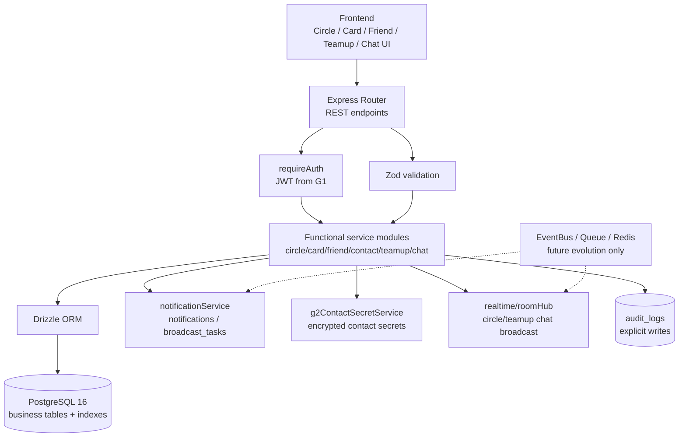

# 阶段 3：详细设计文档（整合版）
## Circle 与关系链模块（第 2 组）

**版本：** 1.1（与当前代码实现对齐）
**日期：** 2026-05-15
**整合来源：** 类图、API 规范、ER 图与建表 SQL、SOLID 检查清单、AI 协作反思日志
**范围：** circles、cards、friendships、contact unlock、teamups、circle/teamup chat、circle matching、G2 相关通知与审计设计

---

## 1. 设计目标与范围

本整合版文档面向 NJU-Date 后端第 2 组负责的 Circle 与关系链模块，目标是把阶段 3 中已经拆分的类图、API、数据库、SOLID 检查和 AI 协作反思合并为一份完整的详细设计。

本模块覆盖以下业务能力：

| 领域 | 主要职责 |
|---|---|
| Circle | 社区发现、成员关系、问卷、circle 内匹配 |
| Cards | 用户 base card、circle card、custom card 与可见性控制 |
| Friendships | 好友请求、circle 作用域好友关系、global friendship |
| Contact Unlock | 敏感联系方式字段的权限解锁请求与审批 |
| Teamup | Circle 内活动小组创建、申请、加入、审核、退出 |
| Chat | Circle 实时群聊、Teamup 实时群聊、消息已读状态和删除广播 |
| Notifications | 好友、联系方式、Teamup 等 G2 事件的站内通知 |
| Audit / Security | 敏感操作审计、JWT 认证、RBAC 授权 |

### 1.1 实现风格

实际后端代码库采用**函数式模块风格**，不是传统 OOP 类层次：

- **Services：** 从模块文件导出的 async 函数，例如 `circleService.ts` 导出 `listCircles()`、`joinCircle()`。
- **Controllers：** Express Router handlers 是内联函数，不是类方法。
- **Data Access：** Drizzle ORM 查询直接嵌入 service 函数，没有强制引入显式 Repository 类。

类图文档中的类、接口和关系是逻辑设计表示，用于说明职责边界、实体关系和架构意图；实际实现通过 TypeScript types、service functions、Express Router 和 Drizzle schema 落地。

---

## 2. 总体架构

### 2.1 分层结构



> 上图已改为当前代码落地架构；EventBus / Queue / Redis 仅保留为未来演进契约。

### 2.2 关键架构原则

| 原则 | 本模块中的落实方式 |
|---|---|
| 职责分离 | Controller 只处理 HTTP，Service 处理业务，PrivacyEngine 处理可见性，数据库只保存事实数据 |
| 函数式实现 | 业务逻辑以 service functions 组织，避免过深类继承 |
| 设计契约优先 | 类图中的 `IRepository<T>`、`IPrivacyEngine`、`IEventBus` 等是 AI 设计审查产物和未来演进契约；当前代码以模块函数、Drizzle 查询和显式 helper 落地 |
| 事件副作用显式化 | 当前代码直接调用 notification service、audit log、realtime hub；EventBus / MessageQueue 是 SOLID 审查后的演进方向，不声明为已落地基础设施 |
| 隐私优先 | 可见性规则在 service / PrivacyEngine 层评估，不依赖数据库约束直接阻断查询 |
| 可扩展 | 匹配算法、通知渠道、缓存实现、队列实现均保留替换空间 |

---

## 3. 领域模型设计

### 3.1 核心实体

| 实体 | 职责 | 关键字段 |
|---|---|---|
| `User` | 用户资料与基本信息 | `id`, `email`, `nickname`, `gender`, `mbti`, `bio`, `avatarUrl`, `wechatId` |
| `Circle` | 社区容器 | `id`, `name`, `slug`, `description`, `category`, `creatorId`, `memberCount`, `status` |
| `CircleMember` | 用户在 circle 中的成员关系 | `id`, `circleId`, `userId`, `membershipStatus`, `answers`, `joinedAt` |
| `CircleMemberRole` | 用户在 circle 中的管理角色 | `id`, `circleId`, `userId`, `role` |
| `UserCard` | 用户公开资料卡片 | `userId`, `modules`, `visibilityLevel`, `updatedAt` |
| `CardField` | 带隐私设置的单个卡片字段 | `fieldKey`, `userId`, `visibilityLevel`, `value` |
| `FriendRequest` | 待处理好友请求 | `id`, `sourceType`, `circleId`, `senderId`, `receiverId`, `status`, `expiresAt` |
| `Friendship` | circle 作用域内好友关系 | `id`, `circleId`, `userAId`, `userBId`, `createdAt` |
| `GlobalFriendship` | 平台范围内好友关系 | `id`, `userAId`, `userBId`, `createdAt` |
| `ContactUnlockRequest` | 敏感字段访问权限申请 | `id`, `sourceType`, `requesterId`, `targetId`, `fieldKey`, `status`, `expiresAt`, `revokedAt` |
| `G2ContactSecret` | G2 联系方式密文 | `id`, `ownerUserId`, `scopeType`, `scopeId`, `ciphertext`, `nonce`, `authTag`, `maskedValue` |
| `UserCircleContact` | 圈内可授权联系方式 | `id`, `userId`, `circleId`, `fieldKey`, `contactSecretId`, `isEnabled` |
| `ContactUnlockGrant` | 已批准联系方式授权明细 | `id`, `requestId`, `requesterId`, `targetId`, `contactId`, `status` |
| `UserBlock` | 拉黑关系 | `id`, `blockerId`, `blockedId`, `createdAt` |
| `Teamup` | Circle 内活动小组 | `id`, `circleId`, `leaderId`, `title`, `teamupType`, `joinMode`, `status`, `deadlineAt`, `endAt` |
| `TeamupMember` | Teamup 成员 | `id`, `teamupId`, `userId`, `memberRole`, `membershipStatus` |
| `TeamupApplication` | 加入或候补 teamup 的申请 | `id`, `teamupId`, `applicantId`, `applicationType`, `status`, `cardSnapshot`, `waitlistJoinedAt` |
| `CircleChatMessage` | Circle 实时群聊消息 | `id`, `circleId`, `senderId`, `clientMessageId`, `content`, `mentions`, `status` |
| `TeamupChatMessage` | Teamup 实时群聊消息 | `id`, `teamupId`, `circleId`, `senderId`, `clientMessageId`, `content`, `mentions`, `status` |
| `Notification` | 统一消息中心通知 | `id`, `userId`, `type`, `title`, `body`, `level`, `isRead`, `idempotencyKey` |
| `CircleQuestion` | Circle 内问卷问题 | `id`, `circleId`, `key`, `type`, `prompt`, `weight`, `displayOrder` |
| `CircleMatch` | Circle 内匹配结果 | `id`, `circleId`, `weekOf`, `userAId`, `userBId`, `score`, `status` |
| `AuditLog` | 系统操作审计轨迹 | `id`, `operatorId`, `action`, `target`, `detail`, `ip`, `result`, `createdAt` |

### 3.2 主要关系

- `User` 可以加入多个 `Circle`，通过 `CircleMember` 建立 N:N 关系。
- `Circle` 拥有多个 `CircleQuestion`、`CircleMatch`、`Teamup`、`CircleMemberRole`。
- `FriendRequest` 通过 `sourceType=circle|global` 区分圈内好友申请和全局好友申请；审批通过后形成 `Friendship` 和/或 `GlobalFriendship`。
- `ContactUnlockRequest` 通过 `sourceType=circle|address_book` 区分圈内联系方式授权和同窗名录联系方式交换。
- `G2ContactSecret` 存储联系方式密文，`UserCircleContact`、`TeamupMemberContact` 与 `TeamupApplication.contactPayload` 仅保存密文引用和脱敏展示信息。
- `Teamup` 包含多个 `TeamupMember`，并接收多个 `TeamupApplication`。
- `CircleChatMessage` / `TeamupChatMessage` 通过各自 read state 表记录已读状态，并通过 realtime hub 广播新增/删除事件。
- `UserCard`、`user_base_cards`、`user_circle_cards`、`user_circle_custom_cards` 共同支撑卡片系统。

### 3.3 状态机

| 对象 | 状态转换 |
|---|---|
| Match / CircleMatch | `LOCKED` → `REVEALED` → (`MUTUAL` \| `MISSED`) \| `EXPIRED` |
| Teamup | `recruiting` → (`full` \| `cancelled`) |
| TeamupApplication | `pending` → (`approved` \| `rejected` \| `withdrawn`) |
| FriendRequest | `pending` → (`accepted` \| `rejected` \| `withdrawn` \| `expired`) |
| ContactUnlockRequest | `pending` → (`approved` \| `rejected` \| `withdrawn` \| `expired`)，`approved` → `revoked` |
| CustomCard 审核 | `pending` → (`approved` \| `rejected`) |
| ChatMessage | `visible` → `deleted` |

---

## 4. Service 设计

### 4.1 `circleService.ts`

**职责：** Circle 生命周期管理、成员操作、问卷、circle 内匹配。

| 函数 | 说明 |
|---|---|
| `listCircles(userId, category?)` | 列出用户可用的 circles，并按 `category` 过滤 |
| `getCircleDetail(circleId, userId)` | 返回 circle 详情、成员状态和相关组件信息 |
| `getChannelMembers(viewerId, circleId, page, limit)` | 返回带可见性过滤的 circle 成员分页列表 |
| `getMyCircles(userId)` | 返回用户已加入的 circles |
| `createCustomCircle(userId, data)` | 创建自定义 circle 并进入审核/管理流程 |
| `joinCircle(circleId, userId, input)` | 根据 `public|review|invite` 策略加入或提交入圈申请 |
| `leaveCircle(circleId, userId)` | 将用户从 circle 中移除，并级联处理相关数据 |
| `reviewCircleJoinRequest(circleId, requestId, reviewerId, data)` | 圈主/管理员审核入圈申请 |
| `updateCircleLocation(circleId, userId, location)` | 更新圈内位置共享 |
| `getQuestionnaire(circleId, userId)` | 返回 circle 专属问卷 |
| `submitQuestionnaire(circleId, userId, answers)` | 存储用户用于 circle matching 的答案 |
| `getCurrentCircleMatch(circleId, userId)` | 返回用户当前在 circle 中未处理的 match |
| `recordCircleAction(matchId, userId, action)` | 记录用户对 match 的 `ACCEPT` / `REJECT` 决策 |
| `getCircleMatchHistory(circleId, userId, page, limit)` | 返回分页历史 matches |
| `runCircleMatchingPipeline(circleId?)` | 触发 circle 匹配算法，供 CRON / ADMIN 调用 |

### 4.2 `cardService.ts`

**职责：** 用户卡片展示、组件管理、可见性设置。

| 函数 | 说明 |
|---|---|
| `getBaseCardComponents(userId)` | 返回用户配置的 card components |
| `getMyBaseCard(userId)` | 返回用户自己的 base card 及全部 components |
| `updateMyBaseCard(userId, cardData)` | 更新 base card components，并保留未修改 components |
| `getMyCardPublicPreference(userId)` | 返回 public card 预览模式：`titles_only` 或 `fully_hidden` |
| `updateMyCardPublicPreference(userId, mode)` | 设置 public card 预览模式 |
| `getMyCircleCard(userId, circleId)` | 返回特定 circle 下的自定义 card |
| `updateMyCircleCard(userId, circleId, cardData)` | 更新 circle 专属 card 内容 |
| `getPublicCard(userId, viewerId?)` | 返回无需认证即可见的 public preview |
| `getFriendCard(userId, viewerId)` | 返回已认证好友可见的 card |
| `getMyCircleCustomCards(userId, circleId)` | 返回 circle 附加 custom cards |
| `createMyCircleCustomCard(userId, circleId, data)` | 创建 circle 附加 custom profile card |

隐私检查不直接由数据库执行；卡片字段可见性由调用方与 `PrivacyEngine` 共同约束。

### 4.3 `friendService.ts`

**职责：** 好友关系生命周期、请求管理、好友关系查询。

| 函数 | 说明 |
|---|---|
| `getFriends(userId)` | 返回用户完整好友列表 |
| `getGroupedFriends(userId)` | 返回 global friendship 与 circle friendship 分组结果 |
| `sendFriendRequest(senderId, receiverId, circleId?, message?)` | 发送好友请求，可选限定在 circle 作用域 |
| `getFriendRequests(userId)` | 返回用户 pending 好友请求 |
| `approveFriendRequest(requestId)` | 批准请求并创建 friendship |
| `rejectFriendRequest(requestId)` | 拒绝请求 |
| `deleteFriend(userAId, userBId)` | 双向移除好友关系 |
| `getCommonFriends(userAId, userBId)` | 返回两个用户之间共同好友 |

### 4.4 `contactsService.ts`

**职责：** 联系方式字段解锁请求生命周期、访问控制、审计。

| 函数 | 说明 |
|---|---|
| `sendContactUnlockRequest(requesterId, targetId, source)` | 提交联系方式交换请求，支持 `sourceType=circle|address_book` |
| `listMyCircleContacts(userId, circleId)` | 返回我的圈内联系方式设置 |
| `upsertMyCircleContact(userId, circleId, input)` | 新增或更新圈内联系方式，并写入 `g2_contact_secrets` |
| `handleContactUnlockRequest(userId, requestId, action, { contactIds })` | 目标用户批准/拒绝字段访问，并在批准时写入 `contact_unlock_grants` |
| `withdrawContactUnlockRequest(userId, requestId)` | 请求方撤回 pending 申请 |
| `revokeContactUnlockRequest(userId, requestId)` | 授权方撤回已授予的访问权限 |
| `getContactUnlockRequests(userId)` | 返回用户作为目标或请求者的 pending unlock 请求 |
| `getFriendContactAvailabilityMap(userId)` | 返回好友联系方式可用状态：`available` / `pending` / `denied` |
| `checkContactUnlockStatus(requesterId, targetId, circleId?)` | 检查 requester 是否可以查看 target 联系方式 |

### 4.5 `teamService.ts`

**职责：** Teamup 生命周期、申请、成员、forum 同步。

| 函数 | 说明 |
|---|---|
| `createTeamup(circleId, leaderId, teamupInfo)` | 创建新的 teamup，并用 leader 初始化 |
| `updateTeamup(teamupId, userId, updates)` | 更新 teamup 详情，仅 leader 可操作 |
| `cancelTeamup(teamupId, userId, reason)` | 取消 teamup，通知成员，并更新状态 |
| `getTeamupDetail(teamupId, userId?)` | 返回完整 teamup 详情和成员列表 |
| `listTeamups(circleId, filters, pagination)` | 列出 circle 中 teamups，支持过滤与分页 |
| `applyToTeamup(userId, teamupId, application)` | 提交成员申请，包含 card snapshot 和联系方式 |
| `joinTeamupDirect(userId, teamupId, contacts)` | 在 `joinMode=direct` 时直接加入 |
| `listTeamupApplications(teamupId, userId)` | 列出 pending 申请，仅 leader 可查看 |
| `reviewTeamupApplication(teamupId, applicationId, action, note?)` | leader 审核申请或候补申请 |
| `withdrawTeamupApplication(userId, teamupId, applicationId)` | 申请人撤回 pending 或候补申请 |
| `leaveTeamup(userId, teamupId)` | 成员自愿离开 teamup |
| `getTeamupContacts(viewerId, circleId, teamupId)` | 在报名截止后、活动结束前向 active 成员展示解密联系方式 |
| `getTeamupMembers(teamupId)` | 返回 teamup active 成员 |

### 4.6 `chatService.ts`

**职责：** Circle 与 Teamup 实时聊天、历史消息、删除消息和已读状态。

| 函数 | 说明 |
|---|---|
| `listCircleChatMessages(userId, circleId, { before, limit })` | 返回 circle 聊天历史消息 |
| `sendCircleChatMessage(userId, circleId, input)` | 写入 circle 消息并由 `circleChatHub` 广播 |
| `deleteCircleChatMessage(userId, circleId, messageId)` | 软删除 circle 消息并广播 `chat.deleted` |
| `updateCircleChatReadState(userId, circleId, input)` | 更新 circle 聊天已读位置 |
| `listTeamupChatMessages(userId, circleId, teamupId, query)` | 返回 teamup 聊天历史 |
| `sendTeamupChatMessage(userId, circleId, teamupId, input)` | 写入 teamup 消息并由 `teamupChatHub` 广播 |
| `deleteTeamupChatMessage(userId, circleId, teamupId, messageId)` | 软删除 teamup 消息 |
| `updateTeamupChatReadState(userId, circleId, teamupId, input)` | 更新 teamup 聊天已读状态 |

### 4.7 `socialGraphService.ts`

**职责：** 关系查询、好友关系校验、图检查。

- `areUsersGlobalFriends(userAId, userBId)`：检查平台范围好友关系。
- `areUsersCircleFriends(circleId, userAId, userBId)`：检查 circle 作用域好友关系。
- `ensureGlobalFriendship(userAId, userBId)`：不存在则创建，存在则返回现有关系。
- `listCircleFriendshipsForTargets(circleId, targetIds)`：批量检查 circle 中多个目标好友关系。
- `normalizeFriendPair(userAId, userBId)`：将对称关系对规范化为 `min < max`。

### 4.8 `matchService.ts`

**职责：** 平台范围每周匹配、兼容性评分、match 生命周期。

- `getCurrentMatch(userId)`：返回用户当前未处理的平台级 match。
- `recordMatchAction(matchId, userId, action)`：记录用户 `ACCEPT` / `REJECT` 决策。
- `getMatchHistory(userId, page, limit)`：返回分页历史 matches。
- `triggerWeeklyMatching()`：每周运行匹配算法。
- `unlockMatches()`：将 pending / locked matches 转换为 revealed 状态。

匹配算法使用 Gale-Shapley 稳定匹配，兼容性评分与 dealbreaker 评估拆分到独立模块。

### 4.9 其他核心 Services

- `surveyService.ts`：管理 survey 版本、问题和用户响应。
- `authService.ts`：用户认证、注册、OTP 校验、token 管理和实时票据由第 1 组主责；G2 仅依赖 `requireAuth` 与 `/auth/realtime-ticket`。
- `cardJoinInitializationService.ts`：用户加入 circle 后初始化 card components 与默认 card layout。
- `aiService.ts`：通过 Gemini API 生成 match insights、curator notes 等 AI 驱动内容。

### 4.10 审计日志架构

本设计不引入集中式 `AuditService` 作为所有审计操作的唯一入口。实际代码中 audit logging 是分布式的：敏感操作发生时，相关 service 直接调用 `db.insert(auditLogs).values({ ... })`。这保证 audit record 与触发它的业务上下文保持绑定。

记录的典型操作包括：

- contact unlock 审批
- friend request 操作
- teamup membership changes
- 敏感字段访问
- 认证/授权相关决策

---

## 5. 核心接口与基础设施

### 5.1 核心接口与当前实现关系

以下接口来自 AI 初稿和 SOLID 审查后的逻辑设计，用于表达职责边界与未来演进方向；当前代码并未强制实现这些 OOP 接口，而是以 TypeScript 模块函数、Drizzle schema、helper service 和显式调用落地。

| 接口 | 类型 | 目的 |
|---|---|---|
| `IRepository<T>` | 设计契约 | 用于说明数据访问可被隔离；当前实现直接在 service 函数中使用 Drizzle 查询 |
| `IPrivacyEngine` | 设计契约 | 用于说明可见性与权限策略边界；当前实现分布在 card/contact/friend/teamup service helper 中 |
| `IMatchingAlgorithm` | 可插拔匹配策略 | 支持替换 Gale-Shapley、Hungarian、Random 等匹配算法 |
| `INotificationService` | 当前部分落地 | 当前代码已有 `notificationService`、`notifications`、`user_notifications` 表；多渠道策略是未来扩展 |
| `IEventBus` | 未来演进契约 | 当前未落地通用 EventBus；实时聊天通过 room hub，业务通知通过显式 service 调用 |
| `ICacheService` | 未来演进契约 | 当前未引入 Redis 缓存层 |

### 5.2 当前基础设施 Services

| Service | 主要职责 | 实现/配置 |
|---|---|---|
| `g2ContactSecretService` | G2 联系方式加密、脱敏、hash 和解密 | `g2_contact_secrets`，AES-GCM 风格密文字段 |
| `notificationService` | 站内通知写入、批量通知、幂等控制 | `notifications`、`broadcast_tasks`、legacy `user_notifications` |
| `realtime/roomHub` | WebSocket 房间广播 | `circleChatHub`、`teamupChatHub` |
| `authService` | JWT、OTP、注册/登录、实时票据 | 由第 1 组主责，G2 使用 `requireAuth` 和 `/auth/realtime-ticket` |
| `auditLogs` | 敏感操作审计 | 各 service 在业务事务内直接写入 |
| `Drizzle ORM` | 类型安全数据访问 | 当前没有显式 Repository class |

### 5.3 关键事件与副作用

当前代码没有通用 `EventBusService`，但以下业务事件以“service 内显式调用 notification/audit/realtime”的方式落地：

- `UserJoinedCircleEvent`
- `FriendRequestSentEvent`
- `FriendshipEstablishedEvent`
- `ContactUnlockRequestedEvent`
- `ContactUnlockApprovedEvent`
- `TeamupCreatedEvent`
- `TeamupCancelledEvent`
- `TeamupApplicationReviewedEvent`
- `CircleChatMessageSentEvent`
- `TeamupChatMessageSentEvent`

这些事件当前表现为通知写入、审计日志写入、Teamup waitlist promotion、forum sync job 记录、实时聊天广播等副作用。EventBus 是 SOLID 审查后的可选演进方案。

### 5.4 队列任务

| Job | 触发方式 | 处理内容 |
|---|---|---|
| `GenerateWeeklyMatchesJob` | 每周三 00:00 CRON | 为用户运行 Gale-Shapley matching |
| `RevealMatchesJob` | 每周五 20:00 CRON | 将 `LOCKED` 转换为 `REVEALED` |
| `SyncTeamupToForumJob` | teamup 状态变化 | 当前有 `teamup_forum_sync_jobs` 表和同步字段；代码开关 `TEAMUP_FORUM_SYNC_ENABLED=false` 时不实际对外同步 |
| `CleanupExpiredDataJob` | 每周 CRON | 归档旧消息、清理 audit logs |

---

## 6. API 详细设计

### 6.1 通用约定

- 所有需要认证的端点都使用 `Authorization: Bearer <token>` header。
- 当前 API 版本为 `v1`，路径前缀为 `/api/v1`。
- 默认分页参数：`page=1`，`limit=20`；最大 `limit=50`。
- 错误响应统一格式：

```json
{
  "error": "ErrorType",
  "message": "人类可读的错误消息",
  "details": {}
}
```

常见 HTTP 状态码：

| 状态码 | 错误类型 | 含义 |
|---|---|---|
| 400 | `ValidationError` | 请求参数或 body 无效 |
| 401 | `Unauthorized` | 缺少 authentication token 或 token 无效 |
| 403 | `ForbiddenError` | 用户缺少资源权限 |
| 404 | `NotFoundError` | 资源不存在 |
| 409 | `ConflictError` | 资源状态冲突 |
| 500 | `ServerError` | 内部服务器错误 |

### 6.2 Circle API

| 功能 | 方法 | 路径 |
|---|---|---|
| 列出所有 circles | GET | `/circles` |
| 创建自定义 circle | POST | `/circles` |
| 获取我的 circles | GET | `/circles/my` |
| 获取我创建的 circles | GET | `/circles/my-created` |
| 获取 circle 详情 | GET | `/circles/:circleId` |
| 获取 circle 成员 | GET | `/circles/:circleId/channel` |
| 加入 circle | POST | `/circles/:circleId/join` |
| 退出 circle | DELETE | `/circles/:circleId/leave` |
| 更新入圈策略 | PUT | `/circles/:circleId/join-policy` |
| 审核入圈申请 | PUT | `/circles/:circleId/join-requests/:requestId` |
| 更新位置共享 | PUT | `/circles/:circleId/location` |
| 获取 circle 问卷 | GET | `/circles/:circleId/questionnaire` |
| 提交 circle 问卷 | POST | `/circles/:circleId/questionnaire` |
| 获取当前 circle match | GET | `/circles/:circleId/match/current` |
| 记录 circle match 操作 | POST | `/circles/:circleId/match/action` |
| 获取 circle match 历史 | GET | `/circles/:circleId/match/history` |

### 6.3 Friend API

| 功能 | 方法 | 路径 |
|---|---|---|
| 获取好友列表 | GET | `/friends` |
| 获取分组好友 | GET | `/friends/grouped` |
| 发送好友请求 | POST | `/friends/request` |
| 发送全局好友请求 | POST | `/friends/global/requests` |
| 获取待处理好友请求 | GET | `/friends/requests` |
| 处理好友请求 | PUT | `/friends/requests/:requestId` |
| 撤回好友请求 | PUT | `/friends/requests/:requestId/withdraw` |
| 忽略好友请求 | PUT | `/friends/requests/:requestId/silent-reject` |
| 删除好友 | DELETE | `/friends/:friendId` |
| 删除所有好友关系 | DELETE | `/friends/:friendId/all` |

### 6.4 Contact Unlock API

| 功能 | 方法 | 路径 |
|---|---|---|
| 获取圈内联系方式设置 | GET | `/contacts/circles/:circleId/settings` |
| 新增/更新圈内联系方式 | POST | `/contacts/circles/:circleId/settings` |
| 修改圈内联系方式 | PATCH | `/contacts/circles/:circleId/settings/:contactId` |
| 删除圈内联系方式 | DELETE | `/contacts/circles/:circleId/settings/:contactId` |
| 发送联系方式解锁请求 | POST | `/contacts/unlock-request` |
| 获取待处理联系方式解锁请求 | GET | `/contacts/unlock-requests` |
| 处理联系方式解锁请求 | PUT | `/contacts/unlock-requests/:requestId` |
| 撤回联系方式申请 | PUT | `/contacts/unlock-requests/:requestId/withdraw` |
| 撤销联系方式授权 | POST | `/contacts/unlock-requests/:requestId/revoke` |
| 获取联系方式解锁状态 | GET | `/contacts/status/:userId` |
| 获取已解锁联系方式 | GET | `/contacts/:userId` |

### 6.5 Teamup API

| 功能 | 方法 | 路径 |
|---|---|---|
| 创建 teamup | POST | `/circles/:circleId/teamups` |
| 列出 circle 中的 teamups | GET | `/circles/:circleId/teamups` |
| 我的 teamup 历史 | GET | `/circles/:circleId/teamups/my/history` |
| 获取 teamup 详情 | GET | `/circles/:circleId/teamups/:teamupId` |
| 更新 teamup | PATCH | `/circles/:circleId/teamups/:teamupId` |
| 申请加入 teamup | POST | `/circles/:circleId/teamups/:teamupId/applications` |
| 直接加入 teamup | POST | `/circles/:circleId/teamups/:teamupId/join` |
| 列出 teamup 的申请 | GET | `/circles/:circleId/teamups/:teamupId/applications` |
| 审核 teamup 申请 | PATCH | `/circles/:circleId/teamups/:teamupId/applications/:applicationId` |
| 撤回 teamup 申请 | PUT | `/circles/:circleId/teamups/:teamupId/applications/:applicationId/withdraw` |
| 离开 teamup | DELETE | `/circles/:circleId/teamups/:teamupId/members/me` |
| 取消 teamup | POST | `/circles/:circleId/teamups/:teamupId/cancel` |
| 查看 teamup 联系方式 | GET | `/circles/:circleId/teamups/:teamupId/contacts` |
| 查看我发出的申请回复 | GET | `/teamups/applications/replies` |
| 公开 teamup 摘要 | GET | `/teamups/public/:teamupId` |

### 6.6 Chat API

| 功能 | 方法 | 路径 |
|---|---|---|
| 获取 circle 聊天消息 | GET | `/circles/:circleId/chat/messages` |
| 发送 circle 聊天消息 | POST | `/circles/:circleId/chat/messages` |
| 删除 circle 聊天消息 | DELETE | `/circles/:circleId/chat/messages/:messageId` |
| 更新 circle 已读状态 | PUT | `/circles/:circleId/chat/read-state` |
| 获取 teamup 聊天消息 | GET | `/circles/:circleId/teamups/:teamupId/chat/messages` |
| 发送 teamup 聊天消息 | POST | `/circles/:circleId/teamups/:teamupId/chat/messages` |
| 删除 teamup 聊天消息 | DELETE | `/circles/:circleId/teamups/:teamupId/chat/messages/:messageId` |
| 更新 teamup 已读状态 | PUT | `/circles/:circleId/teamups/:teamupId/chat/read-state` |

### 6.7 Global Match API

| 功能 | 方法 | 路径 |
|---|---|---|
| 获取当前平台 match | GET | `/match/current` |
| 记录平台 match 操作 | POST | `/match/action` |
| 获取平台 match 历史 | GET | `/match/history` |

---

## 7. 数据库详细设计

### 7.1 数据库环境

- 数据库：PostgreSQL 16
- ORM：Drizzle ORM
- 结构化字段：常规列、外键、唯一约束、复合索引
- 灵活配置字段：JSONB

### 7.2 表结构分组

| 分组 | 表 |
|---|---|
| 用户核心 | `users` |
| Circle 与成员 | `circles`, `circle_members`, `circle_member_roles`, `circle_questions`, `circle_join_requests`, `circle_blacklist`, `circle_member_locations`, `circle_member_location_cooldowns` |
| Circle 匹配 | `circle_matches` |
| 实时聊天 | `circle_chat_messages`, `circle_chat_read_states`, `teamup_chat_messages`, `teamup_chat_read_states` |
| 卡片系统 | `user_cards`, `user_base_cards`, `user_card_preferences`, `user_circle_cards`, `user_circle_custom_cards`, `circle_card_overrides` |
| 社交关系 | `friendships`, `global_friendships`, `friend_requests`, `user_blocks` |
| Contact Unlock | `contact_unlock_requests`, `contact_unlock_grants`, `user_circle_contacts`, `g2_contact_secrets` |
| Teamup | `teamups`, `teamup_members`, `teamup_member_contacts`, `teamup_applications`, `teamup_forum_sync_jobs` |
| 通知 | `notifications`, `broadcast_tasks`, `user_notifications` |
| 安全与审计 | `user_reports`, `audit_logs` |

### 7.3 ER 关系摘要

```mermaid
erDiagram
    users ||--o{ circles : "creator_id"
    users ||--o{ circle_members : "member"
    users ||--o{ circle_member_roles : "role"
    users ||--o{ circle_join_requests : "applies"
    users ||--o{ circle_blacklist : "blocked_user"
    users ||--o{ circle_member_locations : "shares_location"
    users ||--o{ circle_chat_messages : "sends"
    users ||--o{ friendships : "circle_friend_pair"
    users ||--o{ global_friendships : "global_friend_pair"
    users ||--o{ friend_requests : "sender_or_receiver"
    users ||--o{ contact_unlock_requests : "requester_or_target"
    users ||--o{ g2_contact_secrets : "owns_secret"
    users ||--o{ user_circle_contacts : "configures"
    users ||--o{ teamups : "leader"
    users ||--o{ teamup_members : "joins"
    users ||--o{ teamup_applications : "applicant"
    users ||--o{ teamup_member_contacts : "provides"
    users ||--o{ notifications : "receives"
    users ||--o{ audit_logs : "operator"

    circles ||--o{ circle_members : "contains"
    circles ||--o{ circle_join_requests : "reviews"
    circles ||--o{ circle_blacklist : "blocks"
    circles ||--o{ circle_member_locations : "locates"
    circles ||--o{ circle_chat_messages : "chat_room"
    circles ||--o{ friendships : "scopes"
    circles ||--o{ friend_requests : "optional_scope"
    circles ||--o{ contact_unlock_requests : "circle_source"
    circles ||--o{ user_circle_contacts : "contact_scope"
    circles ||--o{ teamups : "hosts"

    contact_unlock_requests ||--o{ contact_unlock_grants : "approves_contacts"
    g2_contact_secrets ||--o{ user_circle_contacts : "secret_ref"
    user_circle_contacts ||--o{ contact_unlock_grants : "granted_contact"

    teamups ||--o{ teamup_members : "contains"
    teamups ||--o{ teamup_applications : "receives"
    teamups ||--o{ teamup_member_contacts : "stores_contact_refs"
    teamups ||--o{ teamup_forum_sync_jobs : "optional_sync"
    teamups ||--o{ teamup_chat_messages : "chat_room"
    teamup_chat_messages ||--o{ teamup_chat_read_states : "read_by"
    circle_chat_messages ||--o{ circle_chat_read_states : "read_by"

    users {
        text id PK
        text email UK
        text password_hash
        text nickname
        text avatar_url
        text wechat_id
        jsonb tags
        integer credit_score
        timestamp created_at
    }
    circles {
        text id PK
        text slug UK
        text name
        text creator_id FK
        text join_policy
        jsonb join_questions
        text invite_code_hash
        integer capacity_limit
        text status
    }
    circle_members {
        text id PK
        text circle_id FK
        text user_id FK
        text membership_status
        text answers
        boolean answers_complete
        boolean is_active
    }
    circle_join_requests {
        text id PK
        text circle_id FK
        text user_id FK
        jsonb application_answers
        text application_reason
        text status
        timestamp expires_at
    }
    circle_chat_messages {
        text id PK
        text circle_id FK
        text sender_id FK
        text client_message_id
        text content
        jsonb mentions
        text status
        timestamp deleted_at
    }
    friend_requests {
        text id PK
        text circle_id FK
        text source_type "circle|global"
        text sender_id FK
        text receiver_id FK
        text status
        timestamp expires_at
    }
    contact_unlock_requests {
        text id PK
        text circle_id FK
        text source_type "circle|address_book"
        text requester_id FK
        text target_id FK
        text field_key
        text status
        timestamp revoked_at
    }
    g2_contact_secrets {
        text id PK
        text owner_user_id FK
        text scope_type
        text scope_id
        text field_key
        text ciphertext
        text nonce
        text auth_tag
        text masked_value
    }
    user_circle_contacts {
        text id PK
        text user_id FK
        text circle_id FK
        text contact_secret_id FK
        text field_key
        text label
        boolean is_enabled
    }
    contact_unlock_grants {
        text id PK
        text request_id FK
        text requester_id FK
        text target_id FK
        text circle_id FK
        text contact_id FK
        text status
    }
    teamups {
        text id PK
        text circle_id FK
        text leader_id FK
        text title
        text teamup_type "short_term|long_term"
        text join_mode "direct|approval"
        integer max_members
        integer current_member_count
        text status
    }
    teamup_applications {
        text id PK
        text teamup_id FK
        text applicant_id FK
        text application_type "join|waitlist"
        text status
        jsonb card_snapshot
        jsonb contact_payload
        timestamp waitlist_joined_at
    }
    teamup_member_contacts {
        text id PK
        text teamup_id FK
        text user_id FK
        jsonb contacts "contactSecretId refs"
    }
    teamup_chat_messages {
        text id PK
        text teamup_id FK
        text circle_id FK
        text sender_id FK
        text client_message_id
        text content
        text status
    }
    notifications {
        text id PK
        text user_id FK
        text type
        text title
        text level
        boolean is_read
        text idempotency_key UK
    }
    audit_logs {
        serial id PK
        text operator_id FK
        text action
        text target
        text result
    }
```



### 7.4 关键建模决策

#### 隐私与可见性

- 隐私规则不在数据库层强制执行，而是在 service 函数与 `PrivacyEngine` 中评估。
- 数据库存储字段可见性级别，但不会阻止底层查询访问隐藏数据。
- `card modules` 中的 `visibility_level` 支持 `public | friends | hidden`。
- `circle_card_overrides` 支持按 circle 覆盖基础卡片可见性。
- `user_card_preferences.hidden_preview_mode` 控制未认证预览可见性。

#### 好友关系对规范化

- 所有好友关系对按 `user_a_id < user_b_id` 存储，保证唯一性。
- `friendships` 表示 circle 作用域好友关系。
- `global_friendships` 表示平台范围好友关系。
- `friend_requests.source_type` 区分 `circle` 与 `global`；circle 申请绑定 `circle_id`，global 申请 `circle_id` 为 null。
- `contact_unlock_requests.source_type` 区分 `circle` 与 `address_book`；circle 申请批准后写入 `contact_unlock_grants`，可以一次授权多个具体联系方式。

#### Teamup 联系方式与申请载荷

Teamup 联系方式与申请中的联系人信息使用 JSONB 数组保存密文引用，以支持多种联系方式类型：

```json
[
  { "contactSecretId": "uuid", "type": "wechat", "maskedValue": "we***", "label": "队长" },
  { "contactSecretId": "uuid", "type": "phone", "maskedValue": "138****0000", "label": "备用" }
]
```

明文值由 `g2_contact_secrets` 加密保存。Teamup 详情不会直接返回联系方式；只有报名截止后、活动结束前，active 成员才能通过独立 contacts 接口触发解密读取。

#### 审计与合规

- 敏感操作发生时，services 直接插入 `audit_logs`。
- 审计日志是业务事务的一部分，不单独使用独立事务边界。
- 记录操作包括好友请求处理、contact unlock 审批、teamup 成员关系变更。

### 7.5 索引与性能

| 查询类型 | 索引建议 |
|---|---|
| User 查询 | `email`, `created_at` |
| Circle 查询 | `category`, `status`, `slug`, `creator_id` |
| Member 查询 | `circle_id`, `user_id` 及二者复合索引 |
| Friendship 查询 | `(circle_id|null, user_a_id, user_b_id)` 复合索引 |
| Teamup 查询 | `(circle_id, status, end_at)` 复合索引 |
| Chat 查询 | `(circle_id, created_at)`, `(teamup_id, created_at)`, `(sender_id, created_at)` |
| Notification 查询 | `(user_id, is_read, created_at)`, `(user_id, type, created_at)` |
| JSONB 查询 | 对 `modules`, `overrides`, `answers`, `card_snapshot` 使用 GIN 索引 |

推荐 JSONB 索引：

```sql
CREATE INDEX idx_user_cards_modules ON user_cards USING GIN (modules);
CREATE INDEX idx_circle_card_overrides ON circle_card_overrides USING GIN (overrides);
```

### 7.6 迁移与初始化

```bash
# 根据 schema 定义生成 migrations
drizzle-kit generate:pg

# 将 migrations 应用到生产数据库
drizzle-kit migrate:pg
```

初始化示例：

```sql
INSERT INTO circles (id, name, slug, category, creator_id, is_active)
VALUES ('circle-sports', '体育', 'sports', 'sports', NULL, true);
```

### 7.7 数据保留策略

| 表 | 保留期限 | 备注 |
|---|---|---|
| `audit_logs` | 90+ 天 | 法律合规，不可变 |
| `matches` | 永久 | Match 历史面向用户 |
| `circle_matches` | 永久 | Circle 历史面向用户 |
| `friend_requests` | 30 天 | pending 请求可过期为 `expired`，发送方也可撤回为 `withdrawn` |
| `contact_unlock_requests` | 30 天 | 自动过期 pending 请求，approved 授权可被 revoked |
| `teamup_applications` | Teamup 结束后归档 | 为历史记录保留 |
| `circle_chat_messages`, `teamup_chat_messages` | 按产品策略保留 | 删除使用 `status=deleted` 软删除语义 |
| `notifications` | 按 `expires_at` 或用户删除策略清理 | 保留未读和审计相关通知 |
| `users` | 永久，直到账户删除请求 | 支持 GDPR 账户删除 |

---

## 8. 关键业务流程

### 8.1 加入 Circle

1. 用户通过 `POST /circles/:circleId/join` 发送加入请求。
2. Controller 执行认证、参数校验和错误处理。
3. `circleService.joinCircle()` 根据 `joinPolicy=public|review|invite` 决定直接创建 `circle_members`，或写入 `circle_join_requests`。
4. 对 review/invite 场景，圈主通过 `PUT /circles/:circleId/join-requests/:requestId` 审核。
5. 加入成功后初始化 card components；如有问卷要求，用户通过 `GET /circles/:circleId/questionnaire` 与 `POST /circles/:circleId/questionnaire` 完成答案提交。
6. 后续匹配由 circle matching pipeline 读取问卷答案和成员数据。

### 8.2 好友请求

1. 发送方调用 `POST /friends/request` 或 `POST /friends/global/requests`。
2. `friendService.sendFriendRequest()` 创建 `friend_requests` 记录。
3. 接收方通过 `GET /friends/requests` 获取 pending 请求。
4. 接收方调用 `PUT /friends/requests/:requestId` 批准或拒绝。
5. 批准后创建 `friendships`，必要时更新 `global_friendships`。
6. 发送方可用 `/withdraw` 撤回 pending 请求；接收方可用 `/silent-reject` 忽略。

### 8.3 联系方式解锁

1. 请求者通过 `POST /contacts/unlock-request` 请求访问目标用户敏感字段。
2. 请求前必须已是全局好友；circle 场景还要求双方共享该 circle，并检查拉黑、重复 pending 和已授权情况。
3. 目标用户通过 `GET /contacts/unlock-requests` 查看请求，并在同意时选择 `contactIds`。
4. 目标用户调用 `PUT /contacts/unlock-requests/:requestId` 批准或拒绝。
5. 批准后写入 `contact_unlock_grants`；请求者通过 `GET /contacts/:userId?circleId=...` 获取已授权联系方式。
6. 发送方可撤回 pending 请求，授权方可 revoke approved 授权；敏感操作写入 `audit_logs`。

### 8.4 Teamup 生命周期

1. leader 调用 `POST /circles/:circleId/teamups` 创建 teamup，必须提供 `teamupType`、`joinMode` 和 1-3 个联系方式。
2. 用户通过 `GET /circles/:circleId/teamups` 或 `GET /circles/:circleId/teamups/:teamupId` 查看列表和详情。
3. 若 `joinMode=approval`，用户调用 `POST /circles/:circleId/teamups/:teamupId/applications` 提交申请；满员但仍可候补时进入 waitlist。
4. leader 调用 `GET /circles/:circleId/teamups/:teamupId/applications` 查看申请。
5. leader 调用 `PATCH /circles/:circleId/teamups/:teamupId/applications/:applicationId` 审核申请。
6. 若 `joinMode=direct`，用户调用 `POST /circles/:circleId/teamups/:teamupId/join` 直接加入；满员候补时创建 approved waitlist application。
7. 成员可调用 `DELETE /circles/:circleId/teamups/:teamupId/members/me` 离开；leader 需要取消组队。
8. 报名截止后、活动结束前，active 成员通过 `/contacts` 独立接口查看解密联系方式。

### 8.5 实时聊天流程

1. 客户端使用第 1 组认证模块的 `/auth/realtime-ticket` 获取实时连接票据。
2. 用户调用 `GET /circles/:circleId/chat/messages` 或 Teamup 对应接口加载历史。
3. 发送消息时，REST handler 写入 `circle_chat_messages` / `teamup_chat_messages`，再通过 `circleChatHub` / `teamupChatHub` 广播 `chat.message`。
4. 删除消息时，服务端将 `status` 标记为 `deleted`，广播 `chat.deleted`。
5. 客户端用 read-state 接口更新最后已读消息，支持未读计数与下次进入时定位。

### 8.6 Match 流程

1. 系统通过 CRON 触发 `GenerateWeeklyMatchesJob`。
2. `matchService.triggerWeeklyMatching()` 或 circle matching pipeline 读取候选用户。
3. Gale-Shapley 算法、兼容性评分和 dealbreaker 共同生成 match。
4. 初始状态为 `LOCKED`。
5. `RevealMatchesJob` 将 match 转换为 `REVEALED`。
6. 用户调用 `POST /match/action` 或 `POST /circles/:circleId/match/action` 记录 `ACCEPT` / `REJECT`。
7. 双方接受则进入 `MUTUAL`，否则进入 `MISSED` 或其他终态。

---

## 9. SOLID 审查记录

### 9.1 审查对象与口径

本节记录的是对 **AI 生成类图/架构草稿** 的 SOLID 审查，不是对当前最终代码架构的机械评分。当前代码采用函数式 service + Express Router + Drizzle ORM，并未强制落地 Repository class、通用 EventBus 或 DI Container；这些内容在 SOLID 文档中作为“初始 AI 设计问题”和“未来可演进契约”进行讨论。

### 9.2 总体评分

| 原则 | 合规性 | 修正状态 |
|---|---|---|
| Single Responsibility | ✅ 已改进 | 将 God Service 拆为 circle/card/friend/contact/teamup/chat 等模块职责 |
| Open/Closed | ✅ 已改进 | 匹配算法、隐私规则、通知渠道作为设计契约保留扩展点 |
| Liskov Substitution | ✅ 无主要问题 | 当前代码少用继承，避免了 AI 初稿中的继承替换风险 |
| Interface Segregation | ✅ 已改进 | 避免过大 `IUserService`，按业务模块拆分 |
| Dependency Inversion | ✅ 当前取轻量方案 | 不引入重 DI；通过模块 helper、Drizzle 和显式依赖调用降低复杂度 |

审查结论为：AI 初稿中发现 **8 个 SOLID/过度设计相关问题**，经人工调整后，作为 P3 设计稿已无未处理的 SOLID 违反项。

### 9.3 已识别并修正的问题

| 问题 | 初始风险 | 修正方式 |
|---|---|---|
| Controller 混合 HTTP、校验、授权和业务逻辑 | 违反 SRP | 使用 Middleware 和 handler 分层 |
| Service 混合业务与缓存、通知、审计 | 违反 SRP | 通过 EventBus 与基础设施 services 分离 |
| 匹配算法硬编码 | 违反 OCP | 抽取 `IMatchingAlgorithm` strategy |
| 通知渠道硬编码 | 违反 OCP / ISP | 抽取 `INotificationService` 与 channel plugins |
| `IUserService` 过大 | 违反 ISP | 拆分为 cardService、friendService、matchService、teamService 等 |
| 直接依赖数据库或具体基础设施 | 违反 DIP | 使用 Drizzle ORM 抽象、接口注入和依赖传递 |
| 过度工程化 DI Container | 增加 MVP 复杂度 | 当前使用手动依赖传递，生产阶段可升级 |
| Repository 继承层次过重 | 违反 OCP / LSP | 使用接口和 service 自有查询，组合优于继承 |

### 9.4 设计成熟度

- 适合学术提交：架构清晰、边界明确、文档完整。
- 适合生产演进：支持扩展、监控、缓存、审计和安全控制。
- 适合团队协作：API、数据库、类图和 SOLID 检查保持一致命名。
- 适合长期维护：低耦合、高内聚、状态转换清晰。

---

## 10. 质量属性与未来增强

### 10.1 内聚性

- 每个 service 聚焦一个业务领域。
- 当前代码将隐私、联系方式授权、拉黑校验和成员可见性分布在对应业务 helper 中，避免出现单个全能服务。
- `authService` 与 `requireAuth` 由第 1 组主责，G2 侧只消费认证结果。
- 实时聊天通过 `roomHub` 处理广播，消息持久化由 chat 模块负责。

### 10.2 耦合性

- Controller 依赖 Service，不直接操作数据库。
- Service 通过 Drizzle ORM 和领域 helper 隔离底层实现。
- 当前通知、审计、实时广播是显式副作用调用；EventBus/队列是未来演进方向。

### 10.3 可扩展性

未来可以扩展：

- 新匹配算法：增加新的 `IMatchingAlgorithm` 实现。
- 新通知渠道：增加新的 channel plugin。
- 新隐私规则：将 card/contact/friend/teamup 中的 visibility helper 逐步收敛为策略注册表。
- 新 card modules：扩展 `CardModule` 结构和渲染逻辑。
- 新 request types：沿用状态机模式。
- 新聊天能力：沿用 `*_chat_messages` + `*_chat_read_states` 的房间模型。

### 10.4 性能路线图

| 方向 | 计划 |
|---|---|
| 数据库 | 读副本、连接池 pgBouncer、按 `circle_id` 分片、归档旧 audit logs |
| 缓存 | 热门 profiles cache warming、match result cache-aside、分布式缓存失效 |
| API | GraphQL 层、API versioning、gzip、HTTP/2 server push |
| 搜索 | Elasticsearch 全文搜索、Typesense 自动补全、搜索分析 |

### 10.5 水平扩展路线

| 阶段 | 目标 |
|---|---|
| 当前 | 单后端实例、集中式数据库、内存缓存 |
| 3-6 个月 | 增加 load balancer，扩展到多个 API 实例，必要时为 session/cache/realtime fanout 引入 Redis |
| 6-12 个月 | 按 Auth、Circles、Matching、Teamup 拆分 microservices |
| 12+ 个月 | 引入 Event Sourcing 与 CQRS，支持读写分离和时间回溯调试 |


---

## 11. 结论

第 2 组 Circle 与关系链模块的详细设计已经覆盖实体模型、服务边界、REST API、数据库 schema、隐私策略、实时聊天、消息通知、审计日志、SOLID 检查和 AI 协作反思。最终设计采用函数式 service 模块作为实现方式，用 UML 和接口表达逻辑边界，兼顾课程项目的可实现性和未来扩展性。

最终设计结论：

- 模块职责清晰，业务边界明确。
- API、类图和数据库字段保持一致命名。
- 隐私与联系方式解锁逻辑在 card/contact/friend/teamup service helper 中约束，联系方式明文通过 `g2_contact_secrets` 加密保存。
- 实时聊天已覆盖 circle 与 teamup 两类房间，并有消息持久化、软删除、已读状态与实时广播。
- 数据库使用 PostgreSQL 16 + Drizzle ORM，支持索引、JSONB 和审计。
- SOLID 检查定位为 AI 生成设计稿审查：初始 8 个问题已在设计层修正，不等同于要求当前代码实现 Repository/EventBus/DI。
- 设计可作为 P3 详细设计提交的整合版文档。
