# 类图

## 1.1 核心类图

### 1.1.1 设计范围（P0）
- 论坛主链路：发帖、列表、详情、评论、软删除
- 论坛互动链路：点赞、收藏、热榜、匿名/私密、图片、语音评论、公告、留言板、个人论坛聚合
- 论坛增强链路：本地草稿、评论置顶、帖内投票、推荐排序、热度分刷新
- 社交沟通链路：关注关系、私信资格判断、私信会话与消息读取
- 治理主链路：用户举报、论坛内容举报、拉黑、管理员审核、信用分扣减、审计日志
- 信用约束：低信用分用户发帖/评论限制，审核通过后的信用分流水记录
- 组队联动：`squad` 当前作为普通帖子标签，组队主流程不纳入本组类图范围

### 1.1.2 核心类图

```mermaid
classDiagram

class ForumController {
  -forumService: ForumService
  -forumGovernanceService: ForumGovernanceService
  +listPosts(userId, query)
  +createPost(userId, dto)
  +getPostDetail(userId, postId)
  +createComment(userId, postId, dto)
  +deletePost(userId, postId)
  +deleteComment(userId, commentId)
  +likePost(userId, postId)
  +favoritePost(userId, postId)
  +pinComment(userId, postId, commentId)
  +votePostPoll(userId, postId, optionId)
  +submitReport(userId, dto)
}

class SocialController {
  -socialService: SocialService
  +getFollowRelation(userId, targetUserId)
  +followUser(userId, targetUserId)
  +unfollowUser(userId, targetUserId)
  +listDirectMessageConversations(userId, query)
  +getDirectMessageConversation(userId, targetUserId, query)
  +sendDirectMessage(userId, targetUserId, content)
  +updateMessagePrivacy(userId, setting)
}

class UserGovernanceController {
  -governanceService: GovernanceService
  +blockUser(userId, targetId)
  +unblockUser(userId, targetId)
  +reportUser(userId, targetId, dto)
}

class AdminGovernanceController {
  -governanceService: GovernanceService
  -forumGovernanceService: ForumGovernanceService
  -auditService: AuditService
  +listReports(query)
  +reviewReport(adminId, reportId, dto)
  +listForumReports(query)
  +reviewForumReport(adminId, reportId, dto)
  +pinPost(adminId, postId)
  +removePost(adminId, postId)
  +manageAnnouncement(dto)
  +hideGuestbookMessage(messageId)
}

class ForumService {
  -postRepo: IPostRepository
  -commentRepo: ICommentRepository
  -interactionRepo: IForumInteractionRepository
  -pollRepo: IForumPollRepository
  -notificationRepo: INotificationRepository
  -policyService: ForumPolicyService
  +listPosts(userId, options)
  +listRecommendedPosts(userId, options)
  +createPost(userId, input)
  +getPostDetail(userId, postId)
  +createComment(userId, postId, input)
  +deletePost(userId, postId)
  +deleteComment(userId, commentId)
  +likePost(userId, postId)
  +favoritePost(userId, postId)
  +pinComment(userId, postId, commentId)
  +unpinComment(userId, postId)
  +votePostPoll(userId, postId, optionId)
  +getHotRanking(options)
  +listMessages(userId, page)
}

class SocialService {
  -followRepo: IUserFollowRepository
  -messageRepo: IDirectMessageRepository
  -blockRepo: IUserBlockRepository
  +getFollowRelation(userId, targetUserId)
  +followUser(userId, targetUserId)
  +unfollowUser(userId, targetUserId)
  +getMessagePrivacySetting(userId)
  +updateMessagePrivacySetting(userId, setting)
  +getDirectMessageEligibility(userId, targetUserId)
  +listConversations(userId, page)
  +getConversation(userId, targetUserId, page)
  +sendMessage(senderId, receiverId, content)
}

class ForumRecommendationService {
  +scoreCandidate(userId, post)
  +computeProfileMatch(userId, post)
  +computeInteractionAffinity(userId, post)
  +rankCandidates(userId, candidates)
}

class ForumPolicyService {
  +ensurePostVisible(userId, post)
  +ensurePostWritable(userId, postType)
  +ensureCreditAllowsForumAction(userId)
  +ensureOwner(userId, resource)
  +ensurePinnedCommentAllowed(userId, post, comment)
  +ensurePollVoteAllowed(userId, post, option)
}

class GovernanceService {
  -reportRepo: IUserReportRepository
  -auditRepo: IAuditRepository
  -creditService: CreditService
  +blockUser(blockerId, blockedId)
  +unblockUser(blockerId, blockedId)
  +reportUser(reporterId, reportedId, reasons, detail)
  +reviewReport(adminId, reportId, decision, note, penaltyScore)
}

class ForumGovernanceService {
  -forumReportRepo: IForumReportRepository
  -postRepo: IPostRepository
  -commentRepo: ICommentRepository
  -creditService: CreditService
  +submitForumReport(input)
  +reviewForumReport(input)
  +listForumReports(query)
  +listForumCreditUsers(query)
}

class CreditService {
  -creditLogRepo: ICreditLogRepository
  +adjustScore(userId, delta, reason, source)
  +resolveLevel(score)
  +ensureForumAllowed(userId)
}

class AuditService {
  -auditRepo: IAuditRepository
  +logAdminAction(operatorId, action, target, detail, ip, result)
}

class ContentModerationService {
  -sensitiveTerms: string[]
  -maxContentLength: int
  +normalize(text)
  +scan(text)
  +decide(hitTerms)
}

class IPostRepository {
  <<interface>>
  +findList(filter, page)
  +findById(postId)
  +save(post)
  +softDelete(postId)
  +togglePin(postId, isPinned)
}

class ICommentRepository {
  <<interface>>
  +findByPost(postId)
  +findById(commentId)
  +save(comment)
  +softDelete(commentId)
}

class IForumInteractionRepository {
  <<interface>>
  +likePost(userId, postId)
  +favoritePost(userId, postId)
  +recordView(userId, postId)
  +likeComment(userId, commentId)
  +updateHotScore(postId)
}

class IForumPollRepository {
  <<interface>>
  +createOptions(postId, options)
  +findOptionsByPost(postId)
  +vote(userId, postId, optionId)
  +findUserVote(userId, postId)
}

class IForumReportRepository {
  <<interface>>
  +save(report)
  +findById(reportId)
  +list(status, page)
  +updateStatus(reportId, status, adminNote)
}

class IUserReportRepository {
  <<interface>>
  +save(report)
  +findById(reportId)
  +list(status, page)
  +updateStatus(reportId, status, adminNote)
}

class ICreditLogRepository {
  <<interface>>
  +save(log)
  +listByUser(userId)
}

class INotificationRepository {
  <<interface>>
  +save(notification)
  +listByUser(userId, page)
  +deleteByUser(userId, notificationId)
}

class IUserFollowRepository {
  <<interface>>
  +findRelation(userId, targetUserId)
  +follow(userId, targetUserId)
  +unfollow(userId, targetUserId)
  +listByTab(userId, tab)
}

class IDirectMessageRepository {
  <<interface>>
  +findOrCreateConversation(userAId, userBId)
  +listConversations(userId, page)
  +listMessages(conversationId, before, limit)
  +saveMessage(conversationId, senderId, receiverId, content)
  +markRead(conversationId, receiverId)
}

class IUserBlockRepository {
  <<interface>>
  +isBlockedBetween(userAId, userBId)
}

class IAuditRepository {
  <<interface>>
  +save(log)
}

class DrizzlePostRepository {
  -db: DrizzleDatabase
  +findList(filter, page)
  +findById(postId)
  +save(post)
  +softDelete(postId)
}
class DrizzleCommentRepository {
  -db: DrizzleDatabase
  +findByPost(postId)
  +findById(commentId)
  +save(comment)
  +softDelete(commentId)
}
class DrizzleForumReportRepository {
  -db: DrizzleDatabase
  +save(report)
  +findById(reportId)
  +list(status, page)
  +updateStatus(reportId, status, adminNote)
}
class DrizzleAuditRepository {
  -db: DrizzleDatabase
  +save(log)
}

class User {
  +id: UUID
  +nickname: string
  +profileComplete: boolean
  +creditScore: int
  +creditLevel: CreditLevel
  +isProfileComplete()
}

class ForumPost {
  +id: UUID
  +userId: UUID
  +circleId: UUID?
  +title: string
  +content: string
  +type: ForumPostType
  +isAnonymous: boolean
  +visibility: ForumVisibility
  +isPinned: boolean
  +pinnedCommentId: UUID?
  +likeCount: int
  +favoriteCount: int
  +commentCount: int
  +viewCount: int
  +hotScore: double
  +hasPoll: boolean
  +deletedAt: datetime?
  +markDeleted()
  +pin()
  +unpin()
  +pinComment(commentId)
  +unpinComment()
  +attachPoll(options)
}

class ForumComment {
  +id: UUID
  +postId: UUID
  +userId: UUID
  +content: string?
  +commentType: ForumCommentType
  +voiceUrl: string?
  +transcript: string?
  +parentCommentId: UUID?
  +rootCommentId: UUID?
  +likeCount: int
  +deletedAt: datetime?
  +markDeleted()
}

class ForumPollOption {
  +id: UUID
  +postId: UUID
  +optionText: string
  +displayOrder: int
  +voteCount: int
}

class ForumPollVote {
  +id: UUID
  +postId: UUID
  +optionId: UUID
  +userId: UUID
  +createdAt: datetime
  +isSameVoter(postId, userId)
}

class UserFollow {
  +id: UUID
  +followerId: UUID
  +followeeId: UUID
  +createdAt: datetime
}

class UserMessageSetting {
  +userId: UUID
  +allowDirectMessagesFrom: MessagePrivacy
  +updatedAt: datetime
}

class DirectMessageConversation {
  +id: UUID
  +userAId: UUID
  +userBId: UUID
  +lastMessageAt: datetime
  +contains(userId)
}

class DirectMessage {
  +id: UUID
  +conversationId: UUID
  +senderId: UUID
  +receiverId: UUID
  +content: string
  +createdAt: datetime
  +readAt: datetime?
  +markRead()
}

class ForumReport {
  +id: UUID
  +reporterId: UUID
  +reportedUserId: UUID
  +targetType: ForumReportTargetType
  +postId: UUID?
  +commentId: UUID?
  +reason: string
  +detail: string?
  +status: ForumReportStatus
  +adminNote: string?
  +reviewedAt: datetime?
  +approve(penaltyScore)
  +reject(note)
}

class UserReport {
  +id: UUID
  +reporterId: UUID
  +reportedId: UUID
  +reason: string
  +detail: string?
  +status: ReportStatus
  +adminNote: string?
  +markReviewed(status, adminNote)
}

class UserBlock {
  +id: UUID
  +blockerId: UUID
  +blockedId: UUID
  +equalsPair(blockerId, blockedId)
}

class CreditScoreLog {
  +id: UUID
  +userId: UUID
  +delta: int
  +reason: string
  +sourceType: string
  +sourceId: string?
}

class ForumAnnouncement {
  +id: UUID
  +title: string
  +content: string
  +isActive: boolean
  +priority: int
}

class ForumGuestbookMessage {
  +id: UUID
  +userId: UUID
  +content: string
  +status: string
}

class AuditLog {
  +id: int
  +operatorId: UUID?
  +action: string
  +target: string?
  +detail: string?
  +ip: string?
  +result: string
  +isSuccess()
}

class ForumPostType {
  <<enumeration>>
  general
  squad
  help
  trade
  activity
}

class ForumVisibility {
  <<enumeration>>
  public
  private
}

class ForumCommentType {
  <<enumeration>>
  text
  voice
}

class MessagePrivacy {
  <<enumeration>>
  all
  following
  mutual
  none
}

class ForumReportStatus {
  <<enumeration>>
  pending
  approved
  rejected
}

class ForumReportTargetType {
  <<enumeration>>
  post
  comment
}

class ReportStatus {
  <<enumeration>>
  pending
  reviewed
  warn_update
  dismissed
}

class CreditLevel {
  <<enumeration>>
  normal
  limited
  banned
}

ForumController --> ForumService
ForumController --> ForumGovernanceService
SocialController --> SocialService
UserGovernanceController --> GovernanceService
AdminGovernanceController --> GovernanceService
AdminGovernanceController --> ForumGovernanceService
AdminGovernanceController --> AuditService

ForumService --> ForumPolicyService
ForumService --> ForumRecommendationService
ForumService --> IPostRepository
ForumService --> ICommentRepository
ForumService --> IForumInteractionRepository
ForumService --> IForumPollRepository
ForumService --> INotificationRepository
SocialService --> IUserFollowRepository
SocialService --> IDirectMessageRepository
SocialService --> IUserBlockRepository
GovernanceService --> IUserReportRepository
GovernanceService --> IAuditRepository
GovernanceService --> CreditService
ForumGovernanceService --> IForumReportRepository
ForumGovernanceService --> IPostRepository
ForumGovernanceService --> ICommentRepository
ForumGovernanceService --> CreditService
AuditService --> IAuditRepository
CreditService --> ICreditLogRepository

DrizzlePostRepository ..|> IPostRepository
DrizzleCommentRepository ..|> ICommentRepository
DrizzleForumReportRepository ..|> IForumReportRepository
DrizzleAuditRepository ..|> IAuditRepository

ForumPost "1" *-- "0..*" ForumComment : 组合
ForumPost "1" *-- "0..*" ForumPollOption : 投票选项
ForumPollOption "1" o-- "0..*" ForumPollVote : 被投票
ForumPost "1" o-- "0..*" ForumReport : 被举报
ForumComment "1" o-- "0..*" ForumReport : 被举报
ForumPost "0..*" --> "1" User : 作者
ForumComment "0..*" --> "1" User : 评论者
ForumReport "0..*" --> "1" User : reporter
ForumReport "0..*" --> "1" User : reported
UserReport "0..*" --> "1" User : reporter
UserReport "0..*" --> "1" User : reported
UserBlock "0..*" --> "1" User : blocker
UserBlock "0..*" --> "1" User : blocked
UserFollow "0..*" --> "1" User : follower
UserFollow "0..*" --> "1" User : followee
UserMessageSetting "1" --> "1" User : owner
DirectMessageConversation "0..*" --> "1" User : userA
DirectMessageConversation "0..*" --> "1" User : userB
DirectMessage "0..*" --> "1" DirectMessageConversation : belongs_to
DirectMessage "0..*" --> "1" User : sender
DirectMessage "0..*" --> "1" User : receiver
CreditScoreLog "0..*" --> "1" User : user
ForumAnnouncement "0..*" --> "1" User : createdBy
ForumGuestbookMessage "0..*" --> "1" User : author
```

### 1.1.3 与当前实现对齐说明
- 已实现（代码可见）：`ForumService`、`ForumGovernanceService`、论坛路由、用户举报/拉黑。
- 已实现（代码可见）：评论置顶、帖内投票、推荐排序、关注关系和私信路由；发帖草稿为前端本地状态，不建后端实体。
- 当前实现中多数数据访问仍直接以 Drizzle 查询编排；文档中的 Repository 接口是详细设计层的解耦表达，便于后续测试与演进。

---

## 2. 类模型概览

### 2.1 核心实体类

| 类名 | 职责 | 关键属性 | 基数/关系 |
|---|---|---|---|
| `User` | 用户基础资料与信用状态引用 | `id`、`nickname`、`profileComplete`、`creditScore`、`creditLevel` | 1 个用户可创建多篇帖子、评论、举报与信用日志 |
| `ForumPost` | 论坛帖子聚合根 | `id`、`userId`、`title`、`content`、`type`、`visibility`、`likeCount`、`commentCount`、`deletedAt` | 1 篇帖子包含 0..N 条评论 |
| `ForumComment` | 帖子评论与楼中楼回复 | `id`、`postId`、`userId`、`commentType`、`parentCommentId`、`rootCommentId`、`deletedAt` | 归属于 1 篇帖子，可自关联形成回复树 |
| `ForumPollOption` | 帖内投票选项 | `postId`、`optionText`、`displayOrder`、`voteCount` | 1 篇帖子可包含 2..4 个投票选项 |
| `ForumPollVote` | 用户投票记录 | `postId`、`optionId`、`userId`、`createdAt` | 同一用户对同一帖子最多 1 条投票 |
| `ForumReport` | 论坛内容举报工单 | `reporterId`、`reportedUserId`、`targetType`、`postId`、`commentId`、`status` | 指向 1 个帖子或 1 条评论 |
| `UserReport` | 用户维度举报工单 | `reporterId`、`reportedId`、`reason`、`status`、`adminNote` | 连接举报人与被举报人 |
| `UserBlock` | 用户拉黑关系 | `blockerId`、`blockedId`、`createdAt` | 用户之间的 N:N 约束关系 |
| `UserFollow` | 用户关注关系 | `followerId`、`followeeId`、`createdAt` | 支撑关注列表和私信权限 |
| `UserMessageSetting` | 私信隐私配置 | `userId`、`allowDirectMessagesFrom` | 1 个用户对应 1 条私信设置 |
| `DirectMessageConversation` | 私信会话 | `userAId`、`userBId`、`lastMessageAt` | 用户对唯一会话 |
| `DirectMessage` | 私信消息 | `conversationId`、`senderId`、`receiverId`、`content`、`readAt` | 归属于 1 个会话 |
| `CreditScoreLog` | 信用分变化流水 | `userId`、`delta`、`reason`、`sourceType`、`sourceId` | 1 个用户对应多条信用变更 |
| `ForumAnnouncement` | 论坛公告 | `title`、`content`、`isActive`、`priority` | 管理侧创建，用户侧读取 |
| `ForumGuestbookMessage` | 留言板消息 | `userId`、`content`、`status` | 用户创建，管理侧可隐藏 |
| `AuditLog` | 管理与治理动作审计 | `operatorId`、`action`、`target`、`detail`、`result` | 记录关键治理动作 |

### 2.2 服务类与控制器职责

| 层级 | 类/模块 | 主要职责 | 代码映射 |
|---|---|---|---|
| Controller | `ForumController` | 论坛用户侧 HTTP 请求入口 | `backend/src/routes/forum.ts` |
| Controller | `SocialController` | 关注与私信 HTTP 请求入口 | `backend/src/routes/social.ts` |
| Controller | `UserGovernanceController` | 用户举报、拉黑入口 | `backend/src/routes/user.ts` |
| Controller | `AdminGovernanceController` | 管理端举报审核、帖子治理、公告/留言板治理入口 | `backend/src/routes/admin.ts` |
| Service | `ForumService` | 发帖、列表、详情、评论、互动、消息聚合 | `backend/src/services/forumService.ts` |
| Service | `SocialService` | 关注、私信资格、会话与消息读写 | `backend/src/services/socialService.ts` |
| Service | `ForumRecommendationService` | 推荐排序评分与候选集排序，当前以 `forumService.ts` 内部函数承接 | 设计抽象 |
| Service | `ForumGovernanceService` | 论坛举报提交、审核、内容处置、信用分扣减 | `backend/src/services/forumGovernanceService.ts` |
| Service | `CreditService` | 信用分规则抽象，当前部分逻辑分散在治理服务中 | 设计抽象 |
| Service | `AuditService` | 审计写入抽象，当前由管理端辅助函数落库 | 设计抽象 |

### 2.3 实现风格说明

当前后端代码主要采用 TypeScript 函数式模块组织，而不是严格 OOP 类实现：
- `routes/*.ts` 中以 Express Router handler 承接 Controller 职责。
- `services/*.ts` 中以导出函数承接 Service 职责。
- `schema.ts` 中以 Drizzle table 定义承接实体持久化结构。
- 本文档使用 UML 类图表达逻辑职责边界，目的是让类、属性、方法和关系在详细设计阶段更清晰。

---

## 3. 详细类定义

### 3.1 `ForumPost`

职责：
- 表示论坛帖子聚合根。
- 聚合帖子正文、互动计数、可见性、匿名状态与软删除状态。
- 聚合评论置顶引用、投票开关与推荐/热度排序所需的统计字段。

关键属性：
- `id`：帖子唯一标识。
- `userId`：作者用户 ID。
- `title/content/type`：帖子标题、正文和类型。
- `isAnonymous/visibility`：匿名与公开/私密状态。
- `likeCount/favoriteCount/commentCount/viewCount/hotScore`：互动与排序指标。
- `pinnedCommentId`：当前置顶评论引用。
- `hasPoll`：是否包含帖内投票。
- `deletedAt`：软删除时间。

关键方法：
- `markDeleted()`：软删除帖子。
- `pin()/unpin()`：管理端置顶/取消置顶。
- `pinComment(commentId)/unpinComment()`：置顶或取消置顶一级评论。
- `attachPoll(options)`：发帖时绑定投票选项。

### 3.2 `ForumComment`

职责：
- 表示帖子下的评论或二级回复。
- 支持文字评论和语音评论。

关键属性：
- `postId`：所属帖子。
- `parentCommentId/rootCommentId`：楼中楼结构。
- `commentType`：`text` 或 `voice`。
- `voiceUrl/transcript/transcriptStatus`：语音评论与转写状态。

关键方法：
- `markDeleted()`：软删除评论；违规评论可替换为统一提示文案。
- 被 `ForumPost.pinnedCommentId` 引用时，详情页优先展示；评论软删除后展示层必须忽略置顶状态。

### 3.3 `ForumReport`

职责：
- 表示针对帖子或评论的论坛举报工单。
- 连接举报人、被举报人、被举报内容与审核状态。

关键属性：
- `targetType`：`post` 或 `comment`。
- `postId/commentId`：二选一目标。
- `status`：`pending/approved/rejected`。
- `adminNote/reviewedAt`：审核记录。

关键方法：
- `approve(penaltyScore)`：审核通过并进入违规内容处置和扣分流程。
- `reject(note)`：审核驳回并记录管理员备注。

### 3.4 `CreditScoreLog`

职责：
- 记录信用分变化来源，支持后台追溯。

关键属性：
- `delta`：分数变化值，论坛举报通过时为负数。
- `reason`：扣分原因，如论坛举报通过等级。
- `sourceType/sourceId`：来源类型与来源工单。

### 3.5 `AuditLog`

职责：
- 记录管理员治理动作。

关键属性：
- `action`：动作名称，如审核举报、管理删帖、公告管理。
- `target/detail/result`：目标、上下文与执行结果。

补充实体说明：
- `ForumPollOption` 与 `ForumPollVote` 将投票选项和投票行为拆分，避免把多值选项塞入帖子正文。
- `UserFollow`、`UserMessageSetting`、`DirectMessageConversation`、`DirectMessage` 属于社交沟通链路，与论坛作者入口联动，但不混入论坛帖子聚合根。
- 发帖草稿当前由前端 `localStorage` 保存，属于 UI 状态对象，不进入后端类模型和治理审计链路。

---

## 4. 关系总结

### 4.1 组合关系
- `ForumPost *-- ForumComment`：帖子作为聚合根，评论生命周期依赖帖子。
- `ForumPost *-- ForumPollOption`：投票选项随帖子创建和删除。
- `DirectMessageConversation *-- DirectMessage`：消息生命周期依赖会话。

### 4.2 聚合关系
- `ForumPost o-- ForumReport`：帖子可被多次举报，但举报工单可独立记录审核状态。
- `ForumComment o-- ForumReport`：评论可被举报并进入同一治理流程。
- `ForumPost o-- ForumComment`：帖子通过 `pinnedCommentId` 聚合当前置顶评论引用，但评论本身仍属于评论集合。

### 4.3 关联关系
- `User --> ForumPost/ForumComment`：用户作为作者或评论者。
- `User --> ForumReport/UserReport/UserBlock`：用户参与举报、被举报与拉黑关系。
- `User --> CreditScoreLog`：信用分变化归属于用户。
- `User --> UserFollow/DirectMessageConversation/DirectMessage`：用户参与关注关系和私信收发。
- `AdminGovernanceController --> AuditService`：管理端动作需要审计。

### 4.4 接口实现关系
- `DrizzlePostRepository ..|> IPostRepository`
- `DrizzleCommentRepository ..|> ICommentRepository`
- `DrizzleForumReportRepository ..|> IForumReportRepository`
- `DrizzleAuditRepository ..|> IAuditRepository`

### 4.5 继承关系说明
- 当前设计没有使用传统父类继承。
- 可替换性主要通过接口实现关系表达，更符合当前 TypeScript 服务模块的实际实现方式。

---

## 5. 质量属性

### 5.1 内聚性
- 论坛读写、论坛治理、用户治理、信用、审计分别归入不同服务抽象。
- 避免把发帖、举报、扣分、公告管理混入单一管理类。

### 5.2 耦合性
- Controller 只依赖服务入口，不直接依赖数据库表结构。
- Repository 是设计层解耦目标，当前实现中直接 Drizzle 查询的部分可逐步迁移。

### 5.3 可扩展性
- 新增帖子类型时主要扩展枚举和校验逻辑。
- 新增举报原因时主要扩展举报原因枚举与前端展示映射。
- 新增信用处置等级时优先扩展 `CreditService` 和治理策略。
- 新增推荐因子时优先扩展 `ForumRecommendationService`，避免修改 Controller。
- 新增私信隐私策略时优先扩展 `SocialService` 的资格判断，不影响论坛主链路。

### 5.4 可测试性
- 发帖/评论/互动可按 `ForumService` 入口做单元测试。
- 评论置顶、投票和推荐排序可分别按策略输入构造边界测试。
- 私信资格判断可按拉黑、关注关系、隐私设置组合做矩阵测试。
- 举报审核可按 `ForumGovernanceService.reviewForumReport()` 做事务级测试。
- 信用分变化可通过 `credit_score_logs` 断言。
