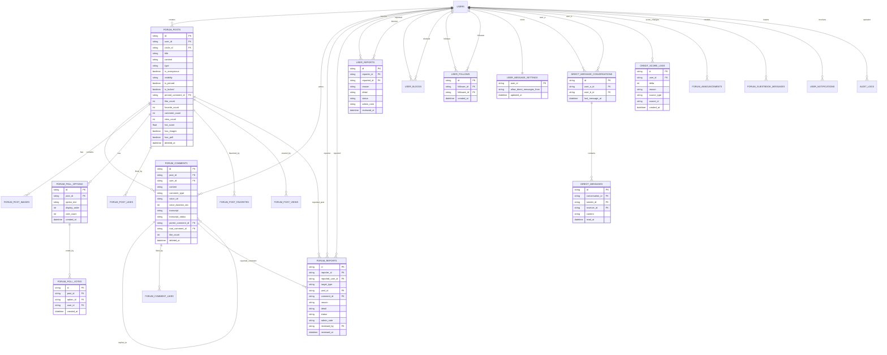

# 数据库设计

> 边界说明：本文只覆盖论坛与治理域，不覆盖圈子主域、组队主流程、好友/名片等其他模块。


## 1. 核心实体
- `users`（引用，非本组主建模）：用户主表，已包含 `credit_score`、`credit_level`
- `forum_posts`：论坛帖子
- `forum_comments`：论坛评论（含楼中楼、文字/语音）
- `forum_post_images`：帖子图片
- `forum_poll_options`：帖内投票选项
- `forum_poll_votes`：帖内投票记录
- `forum_post_likes`：帖子点赞关系
- `forum_post_favorites`：帖子收藏关系
- `forum_post_views`：帖子浏览去重记录
- `forum_comment_likes`：评论点赞关系
- `forum_announcements`：论坛公告
- `forum_guestbook_messages`：论坛留言板
- `user_notifications`：论坛消息通知
- `forum_reports`：论坛内容举报工单
- `user_reports`：用户举报工单
- `user_blocks`：用户拉黑关系
- `user_follows`：用户关注关系
- `user_message_settings`：私信隐私设置
- `direct_message_conversations`：私信会话
- `direct_messages`：私信消息
- `credit_score_logs`：信用分变更日志
- `audit_logs`：治理与管理操作审计日志
- 发帖草稿：当前为前端 `localStorage` 本地状态，不建后端表

## 2. 实体关系说明
- `users (1) -> (N) forum_posts`
- `users (1) -> (N) forum_comments`
- `forum_posts (1) -> (N) forum_comments`
- `forum_comments (1) -> (N) forum_comments`（自关联，父评论/根评论）
- `forum_posts (1) -> (N) forum_post_images`
- `forum_posts (1) -> (N) forum_poll_options`
- `forum_poll_options (1) -> (N) forum_poll_votes`
- `forum_posts (1) -> (N) forum_post_likes/forum_post_favorites/forum_post_views`
- `forum_comments (1) -> (N) forum_comment_likes`
- `users (1) -> (N) forum_reports`（reporter / reported）
- `forum_reports (N) -> (1) forum_posts/forum_comments`（按 targetType 二选一）
- `users (1) -> (N) user_reports`（reporter / reported）
- `users (1) -> (N) user_blocks`（blocker / blocked）
- `users (1) -> (N) user_follows`（follower / followee）
- `users (1) -> (1) user_message_settings`
- `users (1) -> (N) direct_message_conversations`（user_a / user_b）
- `direct_message_conversations (1) -> (N) direct_messages`
- `users (1) -> (N) credit_score_logs`
- `users (1) -> (N) forum_announcements`（createdBy，可空）
- `users (1) -> (N) forum_guestbook_messages`
- `users (1) -> (N) user_notifications`
- `users (1) -> (N) audit_logs`（operator，可空，`ON DELETE SET NULL`）

## 3. ER 图（Mermaid）




## 建表 SQL

> 说明：以下 SQL 以 PostgreSQL 语法编写；与当前项目 Drizzle schema 对齐，省略非本组主域表的完整建表。

```sql
-- =========================
-- 0) 引用表（简化示意）
-- =========================
-- 实际项目中 users/circles 已存在，本段仅为外键上下文说明。
-- users 已包含：
--   credit_score INTEGER NOT NULL DEFAULT 100
--   credit_level TEXT NOT NULL DEFAULT 'normal'

-- =========================
-- 1) forum_posts
-- =========================
CREATE TABLE IF NOT EXISTS forum_posts (
  id                    TEXT PRIMARY KEY,
  user_id               TEXT NOT NULL REFERENCES users(id) ON DELETE CASCADE,
  circle_id             TEXT REFERENCES circles(id) ON DELETE CASCADE,
  title                 TEXT NOT NULL,
  content               TEXT NOT NULL,
  type                  TEXT NOT NULL DEFAULT 'general',
  is_anonymous          BOOLEAN NOT NULL DEFAULT FALSE,
  anonymous_cancelled_at TIMESTAMPTZ,
  visibility            TEXT NOT NULL DEFAULT 'public',
  is_pinned             BOOLEAN DEFAULT FALSE,
  is_locked             BOOLEAN DEFAULT FALSE,
  pinned_comment_id     TEXT,
  like_count            INTEGER NOT NULL DEFAULT 0,
  favorite_count        INTEGER NOT NULL DEFAULT 0,
  comment_count         INTEGER NOT NULL DEFAULT 0,
  view_count            INTEGER DEFAULT 0,
  hot_score             DOUBLE PRECISION NOT NULL DEFAULT 0,
  last_interaction_at   TIMESTAMPTZ,
  has_images            BOOLEAN NOT NULL DEFAULT FALSE,
  summary               TEXT,
  cover_image_url       TEXT,
  has_poll              BOOLEAN NOT NULL DEFAULT FALSE,
  created_at            TIMESTAMPTZ DEFAULT NOW(),
  updated_at            TIMESTAMPTZ DEFAULT NOW(),
  deleted_at            TIMESTAMPTZ
);

-- =========================
-- 2) forum_comments
-- =========================
CREATE TABLE IF NOT EXISTS forum_comments (
  id                  TEXT PRIMARY KEY,
  post_id             TEXT NOT NULL REFERENCES forum_posts(id) ON DELETE CASCADE,
  user_id             TEXT NOT NULL REFERENCES users(id) ON DELETE CASCADE,
  content             TEXT,
  comment_type        TEXT NOT NULL DEFAULT 'text',
  voice_url           TEXT,
  voice_duration_sec  INTEGER,
  transcript          TEXT,
  transcript_status   TEXT NOT NULL DEFAULT 'none',
  parent_comment_id   TEXT REFERENCES forum_comments(id) ON DELETE CASCADE,
  root_comment_id     TEXT REFERENCES forum_comments(id) ON DELETE CASCADE,
  like_count          INTEGER NOT NULL DEFAULT 0,
  created_at          TIMESTAMPTZ DEFAULT NOW(),
  updated_at          TIMESTAMPTZ DEFAULT NOW(),
  deleted_at          TIMESTAMPTZ
);

DO $$
BEGIN
  IF NOT EXISTS (
    SELECT 1 FROM pg_constraint WHERE conname = 'fk_forum_posts_pinned_comment'
  ) THEN
    ALTER TABLE forum_posts
      ADD CONSTRAINT fk_forum_posts_pinned_comment
      FOREIGN KEY (pinned_comment_id) REFERENCES forum_comments(id) ON DELETE SET NULL;
  END IF;
END $$;

-- =========================
-- 3) forum interactions
-- =========================
CREATE TABLE IF NOT EXISTS forum_post_images (
  id             TEXT PRIMARY KEY,
  post_id        TEXT NOT NULL REFERENCES forum_posts(id) ON DELETE CASCADE,
  image_url      TEXT NOT NULL,
  image_width    INTEGER,
  image_height   INTEGER,
  display_order  INTEGER NOT NULL DEFAULT 0,
  created_at     TIMESTAMPTZ DEFAULT NOW()
);

CREATE TABLE IF NOT EXISTS forum_post_likes (
  id          TEXT PRIMARY KEY,
  post_id     TEXT NOT NULL REFERENCES forum_posts(id) ON DELETE CASCADE,
  user_id     TEXT NOT NULL REFERENCES users(id) ON DELETE CASCADE,
  created_at  TIMESTAMPTZ DEFAULT NOW()
);

CREATE TABLE IF NOT EXISTS forum_post_favorites (
  id          TEXT PRIMARY KEY,
  post_id     TEXT NOT NULL REFERENCES forum_posts(id) ON DELETE CASCADE,
  user_id     TEXT NOT NULL REFERENCES users(id) ON DELETE CASCADE,
  created_at  TIMESTAMPTZ DEFAULT NOW()
);

CREATE TABLE IF NOT EXISTS forum_post_views (
  id         TEXT PRIMARY KEY,
  post_id    TEXT NOT NULL REFERENCES forum_posts(id) ON DELETE CASCADE,
  user_id    TEXT NOT NULL REFERENCES users(id) ON DELETE CASCADE,
  viewed_at  TIMESTAMPTZ NOT NULL DEFAULT NOW()
);

CREATE TABLE IF NOT EXISTS forum_comment_likes (
  id          TEXT PRIMARY KEY,
  comment_id  TEXT NOT NULL REFERENCES forum_comments(id) ON DELETE CASCADE,
  user_id     TEXT NOT NULL REFERENCES users(id) ON DELETE CASCADE,
  created_at  TIMESTAMPTZ DEFAULT NOW()
);

CREATE TABLE IF NOT EXISTS forum_poll_options (
  id             TEXT PRIMARY KEY,
  post_id        TEXT NOT NULL REFERENCES forum_posts(id) ON DELETE CASCADE,
  option_text    TEXT NOT NULL,
  display_order  INTEGER NOT NULL DEFAULT 0,
  vote_count     INTEGER NOT NULL DEFAULT 0,
  created_at     TIMESTAMPTZ DEFAULT NOW()
);

CREATE TABLE IF NOT EXISTS forum_poll_votes (
  id          TEXT PRIMARY KEY,
  post_id     TEXT NOT NULL REFERENCES forum_posts(id) ON DELETE CASCADE,
  option_id   TEXT NOT NULL REFERENCES forum_poll_options(id) ON DELETE CASCADE,
  user_id     TEXT NOT NULL REFERENCES users(id) ON DELETE CASCADE,
  created_at  TIMESTAMPTZ DEFAULT NOW()
);

-- =========================
-- 4) forum announcements / guestbook / notifications
-- =========================
CREATE TABLE IF NOT EXISTS forum_announcements (
  id          TEXT PRIMARY KEY,
  title       TEXT NOT NULL,
  content     TEXT NOT NULL,
  created_by  TEXT REFERENCES users(id),
  is_active   BOOLEAN NOT NULL DEFAULT TRUE,
  priority    INTEGER NOT NULL DEFAULT 0,
  starts_at   TIMESTAMPTZ,
  ends_at     TIMESTAMPTZ,
  created_at  TIMESTAMPTZ DEFAULT NOW()
);

CREATE TABLE IF NOT EXISTS forum_guestbook_messages (
  id          TEXT PRIMARY KEY,
  user_id     TEXT NOT NULL REFERENCES users(id) ON DELETE CASCADE,
  content     TEXT NOT NULL,
  status      TEXT NOT NULL DEFAULT 'visible',
  created_at  TIMESTAMPTZ DEFAULT NOW()
);

CREATE TABLE IF NOT EXISTS user_notifications (
  id          TEXT PRIMARY KEY,
  user_id     TEXT NOT NULL REFERENCES users(id) ON DELETE CASCADE,
  type        TEXT NOT NULL,
  title       TEXT NOT NULL,
  content     TEXT NOT NULL,
  meta        JSONB,
  is_read     BOOLEAN NOT NULL DEFAULT FALSE,
  created_at  TIMESTAMPTZ DEFAULT NOW()
);

-- =========================
-- 5) forum_reports
-- =========================
CREATE TABLE IF NOT EXISTS forum_reports (
  id                TEXT PRIMARY KEY,
  reporter_id       TEXT NOT NULL REFERENCES users(id) ON DELETE CASCADE,
  reported_user_id  TEXT NOT NULL REFERENCES users(id) ON DELETE CASCADE,
  target_type       TEXT NOT NULL,
  post_id           TEXT REFERENCES forum_posts(id) ON DELETE CASCADE,
  comment_id        TEXT REFERENCES forum_comments(id) ON DELETE CASCADE,
  reason            TEXT NOT NULL,
  detail            TEXT,
  status            TEXT NOT NULL DEFAULT 'pending',
  admin_note        TEXT,
  reviewed_by       TEXT REFERENCES users(id) ON DELETE SET NULL,
  reviewed_at       TIMESTAMPTZ,
  created_at        TIMESTAMPTZ DEFAULT NOW(),
  updated_at        TIMESTAMPTZ DEFAULT NOW()
);

-- =========================
-- 6) user_reports
-- =========================
CREATE TABLE IF NOT EXISTS user_reports (
  id           TEXT PRIMARY KEY,
  reporter_id  TEXT NOT NULL REFERENCES users(id) ON DELETE CASCADE,
  reported_id  TEXT NOT NULL REFERENCES users(id) ON DELETE CASCADE,
  reason       TEXT NOT NULL,
  detail       TEXT,
  status       TEXT NOT NULL DEFAULT 'pending',
  admin_note   TEXT,
  reviewed_at  TIMESTAMPTZ,
  created_at   TIMESTAMPTZ DEFAULT NOW()
);

-- =========================
-- 7) user_blocks
-- =========================
CREATE TABLE IF NOT EXISTS user_blocks (
  id          TEXT PRIMARY KEY,
  blocker_id  TEXT NOT NULL REFERENCES users(id) ON DELETE CASCADE,
  blocked_id  TEXT NOT NULL REFERENCES users(id) ON DELETE CASCADE,
  created_at  TIMESTAMPTZ DEFAULT NOW()
);

-- =========================
-- 8b) follows and direct messages
-- =========================
CREATE TABLE IF NOT EXISTS user_follows (
  id           TEXT PRIMARY KEY,
  follower_id  TEXT NOT NULL REFERENCES users(id) ON DELETE CASCADE,
  followee_id  TEXT NOT NULL REFERENCES users(id) ON DELETE CASCADE,
  created_at   TIMESTAMPTZ DEFAULT NOW(),
  CHECK (follower_id <> followee_id)
);

CREATE TABLE IF NOT EXISTS user_message_settings (
  user_id                     TEXT PRIMARY KEY REFERENCES users(id) ON DELETE CASCADE,
  allow_direct_messages_from  TEXT NOT NULL DEFAULT 'all',
  created_at                  TIMESTAMPTZ DEFAULT NOW(),
  updated_at                  TIMESTAMPTZ DEFAULT NOW(),
  CHECK (allow_direct_messages_from IN ('all', 'following', 'mutual', 'none'))
);

CREATE TABLE IF NOT EXISTS direct_message_conversations (
  id               TEXT PRIMARY KEY,
  user_a_id         TEXT NOT NULL REFERENCES users(id) ON DELETE CASCADE,
  user_b_id         TEXT NOT NULL REFERENCES users(id) ON DELETE CASCADE,
  created_at        TIMESTAMPTZ DEFAULT NOW(),
  updated_at        TIMESTAMPTZ DEFAULT NOW(),
  last_message_at   TIMESTAMPTZ DEFAULT NOW(),
  CHECK (user_a_id < user_b_id),
  CHECK (user_a_id <> user_b_id)
);

CREATE TABLE IF NOT EXISTS direct_messages (
  id               TEXT PRIMARY KEY,
  conversation_id  TEXT NOT NULL REFERENCES direct_message_conversations(id) ON DELETE CASCADE,
  sender_id         TEXT NOT NULL REFERENCES users(id) ON DELETE CASCADE,
  receiver_id       TEXT NOT NULL REFERENCES users(id) ON DELETE CASCADE,
  content           TEXT NOT NULL,
  created_at        TIMESTAMPTZ DEFAULT NOW(),
  read_at           TIMESTAMPTZ
);

-- =========================
-- 8) credit_score_logs
-- =========================
CREATE TABLE IF NOT EXISTS credit_score_logs (
  id           TEXT PRIMARY KEY,
  user_id      TEXT NOT NULL REFERENCES users(id) ON DELETE CASCADE,
  delta        INTEGER NOT NULL,
  reason       TEXT NOT NULL,
  source_type  TEXT NOT NULL,
  source_id    TEXT,
  created_at   TIMESTAMPTZ DEFAULT NOW()
);

-- =========================
-- 9) audit_logs
-- =========================
CREATE TABLE IF NOT EXISTS audit_logs (
  id           SERIAL PRIMARY KEY,
  operator_id  TEXT REFERENCES users(id) ON DELETE SET NULL,
  action       TEXT NOT NULL,
  target       TEXT,
  detail       TEXT,
  ip           TEXT,
  result       TEXT NOT NULL DEFAULT 'success',
  created_at   TIMESTAMPTZ DEFAULT NOW()
);
```


## 4. 索引设计与理由

```sql
-- forum_posts: 列表页按未删除 + 置顶 + 时间倒序
CREATE INDEX IF NOT EXISTS idx_forum_posts_active_sort
  ON forum_posts (is_pinned DESC, created_at DESC)
  WHERE deleted_at IS NULL;

-- forum_posts: 类型筛选 + 时间倒序
CREATE INDEX IF NOT EXISTS idx_forum_posts_type_created
  ON forum_posts (type, created_at DESC)
  WHERE deleted_at IS NULL;

-- forum_posts: 热榜排序
CREATE INDEX IF NOT EXISTS idx_forum_posts_hot_score
  ON forum_posts (hot_score DESC, last_interaction_at DESC)
  WHERE deleted_at IS NULL;

-- forum_posts: 评论置顶快速定位
CREATE INDEX IF NOT EXISTS idx_forum_posts_pinned_comment
  ON forum_posts (pinned_comment_id)
  WHERE pinned_comment_id IS NOT NULL;

-- forum_comments: 帖子详情拉评论树
CREATE INDEX IF NOT EXISTS idx_forum_comments_post_created
  ON forum_comments (post_id, created_at)
  WHERE deleted_at IS NULL;

-- forum_comments: 楼中楼查询
CREATE INDEX IF NOT EXISTS idx_forum_comments_parent
  ON forum_comments (parent_comment_id)
  WHERE parent_comment_id IS NOT NULL;

-- interaction: 防重复点赞/收藏/浏览
CREATE UNIQUE INDEX IF NOT EXISTS idx_forum_post_likes_post_user
  ON forum_post_likes (post_id, user_id);

CREATE UNIQUE INDEX IF NOT EXISTS idx_forum_post_favorites_post_user
  ON forum_post_favorites (post_id, user_id);

CREATE UNIQUE INDEX IF NOT EXISTS idx_forum_post_views_post_user
  ON forum_post_views (post_id, user_id);

CREATE UNIQUE INDEX IF NOT EXISTS idx_forum_comment_likes_comment_user
  ON forum_comment_likes (comment_id, user_id);

-- poll: 投票选项顺序和一人一票
CREATE INDEX IF NOT EXISTS idx_forum_poll_options_post_order
  ON forum_poll_options (post_id, display_order);

CREATE UNIQUE INDEX IF NOT EXISTS idx_forum_poll_votes_post_user
  ON forum_poll_votes (post_id, user_id);

CREATE INDEX IF NOT EXISTS idx_forum_poll_votes_option
  ON forum_poll_votes (option_id);

CREATE INDEX IF NOT EXISTS idx_forum_poll_votes_user_created
  ON forum_poll_votes (user_id, created_at DESC);

-- social: 关注关系和私信会话
CREATE UNIQUE INDEX IF NOT EXISTS idx_user_follows_unique
  ON user_follows (follower_id, followee_id);

CREATE INDEX IF NOT EXISTS idx_user_follows_follower
  ON user_follows (follower_id, created_at DESC);

CREATE INDEX IF NOT EXISTS idx_user_follows_followee
  ON user_follows (followee_id, created_at DESC);

CREATE UNIQUE INDEX IF NOT EXISTS idx_direct_message_conversations_users
  ON direct_message_conversations (user_a_id, user_b_id);

CREATE INDEX IF NOT EXISTS idx_direct_message_conversations_user_a
  ON direct_message_conversations (user_a_id, last_message_at DESC);

CREATE INDEX IF NOT EXISTS idx_direct_message_conversations_user_b
  ON direct_message_conversations (user_b_id, last_message_at DESC);

CREATE INDEX IF NOT EXISTS idx_direct_messages_conversation_created
  ON direct_messages (conversation_id, created_at ASC);

CREATE INDEX IF NOT EXISTS idx_direct_messages_receiver_read
  ON direct_messages (receiver_id, read_at, created_at DESC);

-- forum_reports: 管理端按状态+时间分页
CREATE INDEX IF NOT EXISTS idx_forum_reports_status_created
  ON forum_reports (status, created_at);

CREATE INDEX IF NOT EXISTS idx_forum_reports_reporter
  ON forum_reports (reporter_id, created_at);

CREATE INDEX IF NOT EXISTS idx_forum_reports_reported
  ON forum_reports (reported_user_id, created_at);

-- user_reports: 管理端按状态+时间分页
CREATE INDEX IF NOT EXISTS idx_user_reports_status_created
  ON user_reports (status, created_at DESC);

-- credit_score_logs: 用户信用分流水
CREATE INDEX IF NOT EXISTS idx_credit_score_logs_user_created
  ON credit_score_logs (user_id, created_at);

CREATE INDEX IF NOT EXISTS idx_credit_score_logs_source
  ON credit_score_logs (source_type, source_id);

-- audit_logs: 按动作与时间检索审计
CREATE INDEX IF NOT EXISTS idx_audit_logs_action_created
  ON audit_logs (action, created_at DESC);
```

索引理由：
- 论坛列表/详情是高频读，优先保证 `posts`、`comments` 的过滤与排序性能。
- 点赞、收藏、浏览、评论点赞使用唯一索引保证幂等与防重复。
- 投票使用 `post_id + user_id` 唯一索引保证一人一票。
- 关注关系使用 `follower_id + followee_id` 唯一索引保证幂等。
- 私信会话使用规范化用户对唯一索引，保证任意两名用户只有一个会话。
- 热榜依赖 `hot_score` 与最近互动时间排序。
- 推荐排序依赖公开未删除帖子候选集、互动计数、热度分、用户画像和互动关系；当前以查询组合实现，后续可引入缓存或物化视图。
- 举报管理页按状态分页是典型后台查询路径。
- 信用分流水按用户与来源追溯，支撑管理端信用用户列表与申诉核对。
- 审计日志按动作追溯是治理合规关键路径。


## 5. 范式与隐私说明

### 5.1 第三范式（3NF）检查
- 每个表均以单一主键标识实体。
- 非主属性均直接依赖主键，无传递依赖。
- 多值关系拆分为独立表（如点赞、收藏、拉黑、举报、信用分流水），避免重复组。
- 投票选项、投票记录、关注关系和私信消息均拆分为独立表，避免在帖子或用户表中存储重复组。
- 论坛举报通过 `target_type + post_id/comment_id` 表达二选一目标，未把帖子/评论内容冗余进举报主表。

结论：核心表满足 3NF。

### 5.2 隐私与安全
- 密码不在本组表中存储（由认证域处理哈希）。
- 审计日志仅记录必要治理上下文，不存明文敏感凭证。
- 举报 `detail`、管理备注、违规处理结果需在展示层做最小可见原则。
- 私密帖仅作者和管理侧在必要治理场景下可处理，普通列表与公开主页不展示。
- 推荐流和热榜必须过滤私密、已删除和不符合可见性边界的帖子。
- 私信内容仅会话双方可见，发送前必须校验拉黑关系与接收方私信隐私设置。
- 发帖草稿存储在用户浏览器本地，不进入后端数据库；若后续改为云草稿，需要单独设计加密、生命周期和删除策略。
- 论坛举报通过后对评论内容替换为统一违规删除提示，避免违规内容继续传播。


## 6. AI 审查结论（人工复核后）

### 6.1 AI 初稿常见问题
- 把圈子、组队、好友等非 本组 数据表混入 ER 图（责任越界）。
- 索引只给主键，缺少业务查询索引。
- 忽略软删除场景下的部分索引（partial index）。
- 没有体现当前已实现的论坛互动表、论坛举报表、信用分日志和公告/留言板表。

### 6.2 本次修正
- 严格收敛到论坛与治理域，并只将 `users`、`circles` 作为引用上下文。
- 补充论坛增强实体：点赞、收藏、浏览、图片、公告、留言板、通知、论坛举报、信用分流水。
- 补充评论置顶、帖内投票、关注关系、私信隐私、私信会话与私信消息实体。
- 为列表、热榜、评论树、举报分页、信用分追溯、审计检索补全关键索引。
- 为投票幂等、关注幂等、会话唯一化和私信未读检索补全关键索引。
- 明确当前实现状态与可选约束，避免与线上历史数据冲突。

---

## 7. 关键设计决策

### 7.1 软删除优先

论坛帖子和评论采用 `deleted_at` 软删除：
- 保留治理证据链，便于举报审核和申诉复核。
- 列表和详情默认过滤已删除内容。
- 管理端可按状态筛选正常/已删除/全部帖子。

### 7.2 论坛举报目标建模

`forum_reports` 使用 `target_type + post_id/comment_id` 表达举报目标：
- `target_type='post'` 时，`post_id` 有值，`comment_id` 为空。
- `target_type='comment'` 时，`comment_id` 有值。
- 这样避免把帖子举报和评论举报拆成两套表，也避免把帖子/评论内容冗余进举报表。

### 7.3 信用分流水独立建模

信用分变化不直接覆盖历史，而是写入 `credit_score_logs`：
- `users.credit_score` 保存当前分。
- `credit_score_logs.delta` 保存变化量。
- `source_type/source_id` 关联来源，如论坛举报工单。
- 管理端可以追溯每一次扣分来源。

### 7.4 互动关系拆表

点赞、收藏、浏览、评论点赞均拆成独立关系表：
- 支持唯一索引防重复。
- 支持用户侧“我的点赞/我的收藏”聚合查询。
- 支持热榜和互动计数维护。
- 帖内投票同样拆成 `forum_poll_options` 与 `forum_poll_votes`，选项负责展示与计数，投票记录负责一人一票与用户已投状态。
- 评论置顶不复制评论内容，只在 `forum_posts.pinned_comment_id` 保存引用，避免评论内容与置顶展示状态不一致。

### 7.5 公告与留言板治理

公告和留言板独立建模：
- 公告支持 `is_active`、`priority`、起止时间，便于管理端控制展示。
- 留言板使用 `status=visible/hidden`，管理端隐藏不直接删除用户内容。
- 关注与私信虽然可从论坛作者入口触发，但数据独立于论坛帖子，避免帖子删除影响用户间正常会话。

---

## 8. 迁移（Migration）说明

### 8.1 迁移原则

- 新增表优先使用 `CREATE TABLE IF NOT EXISTS`。
- 新增索引优先使用 `CREATE INDEX IF NOT EXISTS`。
- 对已有枚举/状态字段增加约束时，需要先检查历史数据。
- 涉及信用分字段时，默认值应保证老用户可平滑迁移：`credit_score=100`、`credit_level='normal'`。

### 8.2 推荐迁移顺序

1. 增加用户信用字段和 `credit_score_logs`。
2. 增加论坛互动表：图片、点赞、收藏、浏览、评论点赞。
3. 增加公告、留言板、通知表。
4. 增加 `forum_reports`。
5. 增加索引和唯一约束。
6. 回归验证发帖、评论、举报审核、扣分链路。
7. 增加评论置顶字段、投票表、关注表、私信设置表和私信会话/消息表。
8. 回归验证投票、评论置顶、推荐排序和私信链路。

### 8.3 回滚注意事项

- 论坛举报和信用分日志属于治理证据，不建议在生产环境直接删除。
- 若迁移失败，应优先回滚新增索引或新增接口开关，不应破坏已有帖子和评论数据。
- 已产生的 `credit_score_logs` 应保留，避免信用分来源不可追溯。

---

## 9. 性能考虑

### 9.1 高频读路径

| 查询场景 | 相关表 | 关键索引 |
|---|---|---|
| 论坛首页列表 | `forum_posts` | `idx_forum_posts_active_sort` |
| 类型筛选 | `forum_posts` | `idx_forum_posts_type_created` |
| 热榜 | `forum_posts` | `idx_forum_posts_hot_score` |
| 推荐流 | `forum_posts`、`forum_post_likes`、`forum_post_favorites` | 公开未删除候选集 + 互动关系索引 |
| 帖内投票 | `forum_poll_options`、`forum_poll_votes` | `idx_forum_poll_options_post_order`、`idx_forum_poll_votes_post_user` |
| 帖子详情评论树 | `forum_comments` | `idx_forum_comments_post_created`、`idx_forum_comments_parent` |
| 评论置顶 | `forum_posts`、`forum_comments` | `idx_forum_posts_pinned_comment` |
| 我的点赞/收藏 | `forum_post_likes`、`forum_post_favorites` | 唯一索引中的 `user_id` 可配合查询 |
| 关注列表 | `user_follows` | `idx_user_follows_follower`、`idx_user_follows_followee` |
| 私信会话 | `direct_message_conversations`、`direct_messages` | `idx_direct_message_conversations_user_a/b`、`idx_direct_messages_conversation_created` |
| 举报管理 | `forum_reports` | `idx_forum_reports_status_created` |
| 信用分追溯 | `credit_score_logs` | `idx_credit_score_logs_user_created` |

### 9.2 计数维护

- `forum_posts.like_count/favorite_count/comment_count/view_count` 作为冗余计数字段，服务端在互动操作时维护。
- `forum_poll_options.vote_count` 作为投票选项冗余计数字段，服务端在投票成功后维护。
- 计数字段减少列表页聚合成本。
- 唯一关系表仍作为事实来源，可用于异常修复和重算。

### 9.3 JSON 与文本字段

- `user_notifications.meta` 使用 JSONB 存储扩展上下文。
- 举报详情、审计详情为文本字段，展示时应控制可见范围。

---

## 10. 数据保留策略

| 数据 | 保留策略 | 理由 |
|---|---|---|
| 帖子/评论 | 软删除保留 | 支持治理追溯 |
| 论坛举报 | 保留审核记录 | 支持申诉和复盘 |
| 用户举报 | 保留审核记录 | 支持平台秩序治理 |
| 信用分日志 | 长期保留 | 支持信用分来源解释 |
| 审计日志 | 长期保留 | 支持管理员操作追溯 |
| 留言板隐藏记录 | 保留 `hidden` 状态 | 支持管理复核 |
| 通知消息 | 用户可移除 | 降低用户侧消息噪音 |
| 投票记录 | 随帖子级联保留/删除 | 支持投票结果展示和幂等校验 |
| 私信消息 | 会话内保留 | 支持双方沟通上下文和未读状态 |
| 本地草稿 | 浏览器本地保存 | 不进入后端数据保留范围 |

---

## 11. 数据一致性约束

- 同一用户对同一帖子只能点赞一次。
- 同一用户对同一帖子只能收藏一次。
- 同一用户对同一帖子只保留一条浏览记录。
- 同一用户对同一评论只能点赞一次。
- 同一用户对同一帖子只能投票一次。
- 同一用户对同一目标只能关注一次。
- 同一用户对不能关注自己、不能私信自己。
- 任意两个用户只能有一个规范化私信会话。
- 同一举报工单只能从 `pending` 进入终态。
- 论坛举报通过后，同一目标不应再次产生有效通过扣分。
- 信用分扣减必须同时写当前分与流水记录。
