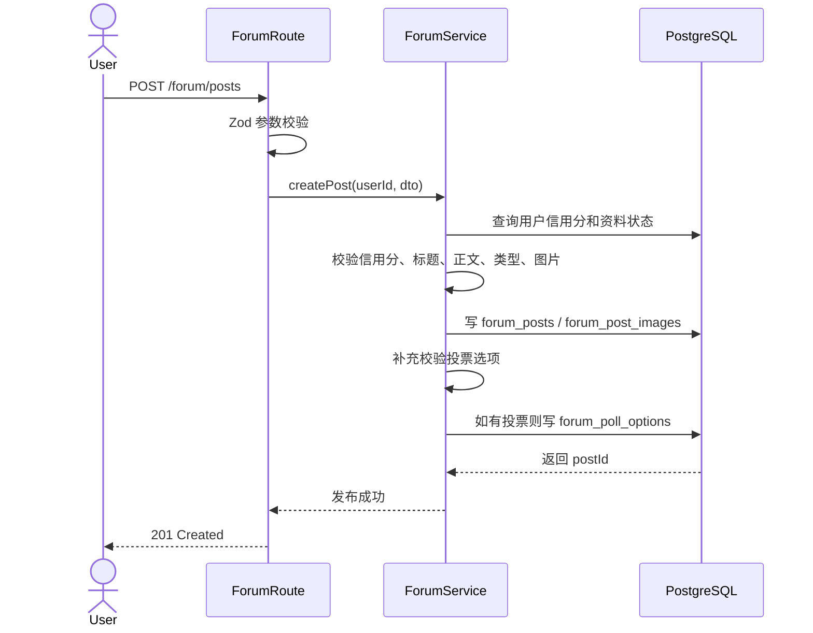
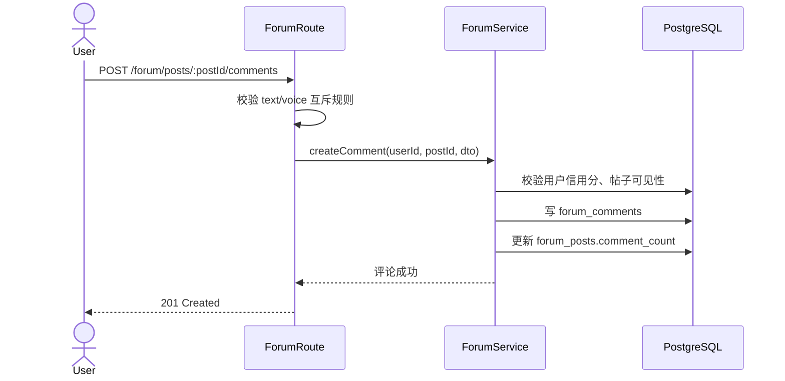
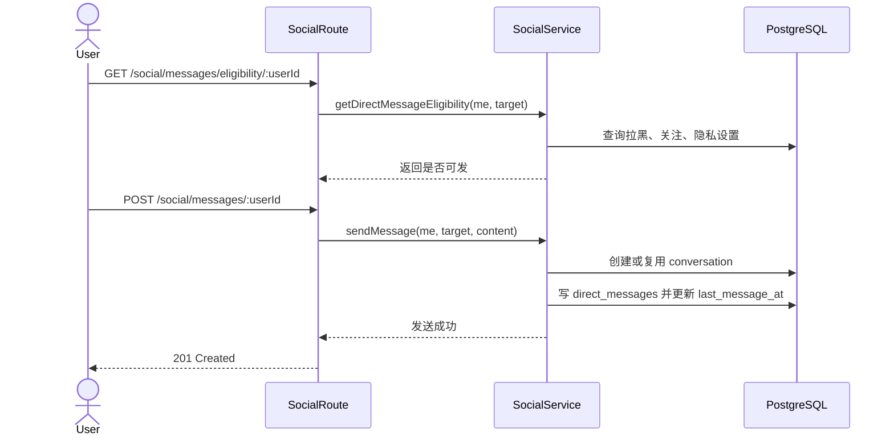
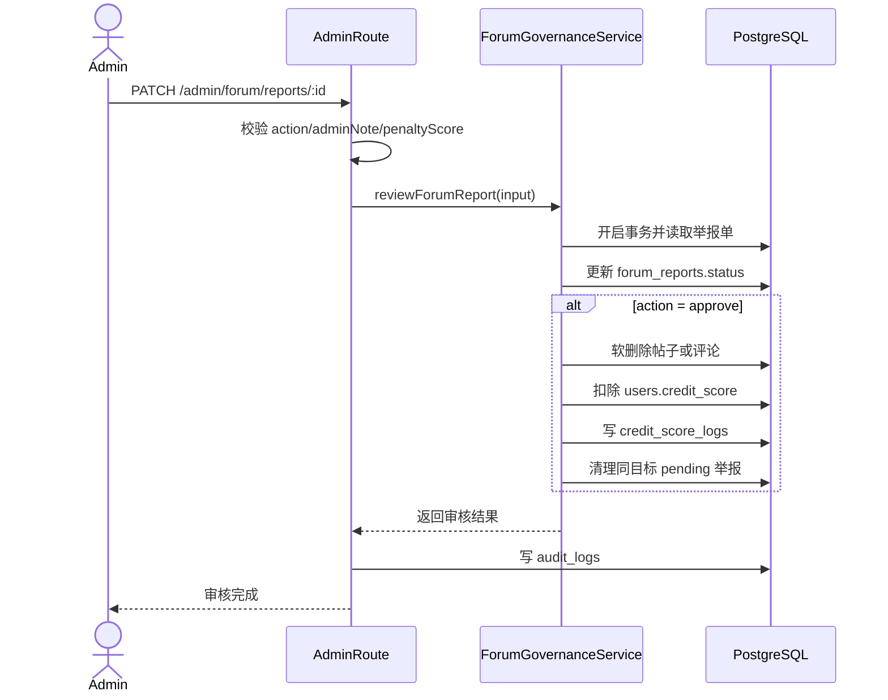
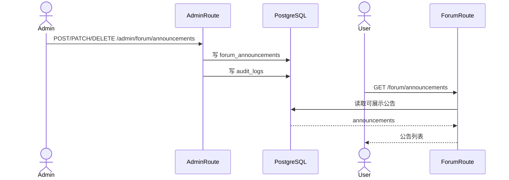

# 详细设计文档（论坛与治理子系统）

> 阶段：P3 详细设计
>
> 整合来源：
> - `1- 类图.md`
> - `2-SOLID检查清单.md`
> - `3-API规范文档.md`
> - `4-ER图+建表SQL.md`
>
> 文档边界：仅覆盖论坛与治理，不覆盖圈子主流程、组队主流程、好友/名片等。

---

## 1. 设计目标与范围

### 1.1 设计目标
- 打通论坛核心链路：发帖、列表、详情、评论、软删除。
- 完成论坛增强链路：点赞、收藏、热榜、匿名/私密、图片、语音评论、公告、留言板、个人论坛聚合。
- 完成论坛增强链路补充：推荐排序、评论置顶、帖内投票。
- 完成前端编辑体验：发帖本地草稿保存与恢复，避免未发布内容丢失。
- 完成社交沟通链路：关注关系、私信隐私、私信资格、会话列表、消息收发。
- 完成治理核心链路：用户举报、论坛内容举报、拉黑、管理端审核、信用分扣减、审计追踪。
- 保证设计与当前代码基线一致，避免“文档已完成但接口不可用”偏差。
- 为后续拆分 `ForumPolicy`、`Repository`、`Moderation` 提供演进路径。

### 1.2 范围
- 用户侧：论坛交互、用户举报、论坛内容举报、拉黑。
- 用户侧补充：关注与私信。
- 管理侧：用户举报审核、论坛举报审核、论坛删帖/置顶、公告管理、留言板隐藏、信用用户查看。
- 数据侧：论坛与治理相关核心表及索引。

### 1.3 非范围
- 圈子业务主流程。
- 组队业务主流程。
- 联系方式解锁、好友链路。
- 云端草稿同步；当前草稿仅作为浏览器本地编辑状态。

---

## 2. 当前实现基线（代码校准）

以当前仓库代码为准：
- 已可联调：
  - `POST /api/v1/user/report/:targetId`
  - `POST/GET/DELETE /api/v1/user/block/:targetId`
  - `GET /api/v1/admin/reports`
  - `PATCH /api/v1/admin/reports/:id`
  - `/api/v1/forum/*` 已在 `backend/src/index.ts` 挂载
  - `GET/POST/DELETE/PATCH /api/v1/forum/posts*`
  - `POST/DELETE /api/v1/forum/posts/:postId/like`
  - `POST/DELETE /api/v1/forum/posts/:postId/favorite`
  - `GET /api/v1/forum/ranking/hot`
  - `GET /api/v1/forum/announcements*`
  - `GET/POST/DELETE /api/v1/forum/guestbook/messages*`
  - `PUT/DELETE /api/v1/forum/posts/:postId/pinned-comment`
  - `POST /api/v1/forum/posts/:postId/poll/vote`
  - `GET/POST/DELETE /api/v1/social/follows*`
  - `GET/PUT /api/v1/social/messages/privacy`
  - `GET/POST /api/v1/social/messages*`
  - `POST /api/v1/forum/reports`
  - `GET/PATCH /api/v1/admin/forum/reports*`
  - `GET /api/v1/admin/forum/credit-users*`
  - `GET/DELETE/PUT /api/v1/admin/forum/posts*`
  - `GET/POST/PATCH/DELETE /api/v1/admin/forum/announcements*`
  - `GET/DELETE /api/v1/admin/forum/guestbook/messages*`
- 论坛接口现状：
  - `backend/src/routes/forum.ts` 已实现并挂载。
  - 论坛主流程已去圈子化，`circleId` 保留为兼容字段。
  - `squad` 当前作为普通帖子类型标签。
  - 发帖支持投票选项；详情返回投票数据和置顶评论状态。
  - `sort=recommended` 已作为推荐排序入口，候选集限定公开未删除全站帖。
  - 发帖草稿由前端本地保存，不新增后端草稿表。
- 管理论坛接口现状：
  - `admin.ts` 内含 `/admin/forum/posts*`、`/admin/forum/reports*`、`/admin/forum/credit-users*`、公告与留言板管理接口。
  - 当前不存在全局关闭中间件。
- 信用治理现状：
  - 用户表包含 `creditScore`、`creditLevel`。
  - 论坛举报审核通过时扣 `1/3/5` 分，并写 `credit_score_logs`。
  - 信用分 `<=85` 时后端禁止发帖与评论。

结论：本设计采用“**已实现能力 + 演进能力**”双层表达，但接口可用性按当前代码重新校准。

---

## 3. 系统架构设计

### 3.1 分层设计
- 接口层：`routes/forum.ts`、`routes/user.ts`、`routes/admin.ts`
- 接口层补充：`routes/social.ts` 承接关注和私信接口。
- 服务层：`forumService`、`forumGovernanceService` + `Governance/Audit/Moderation/Repository`（设计演进）
- 服务层补充：`socialService` + `Recommendation`（设计演进）
- 持久层：PostgreSQL + Drizzle schema

### 3.2 核心职责拆分
- `ForumController`：处理帖子、评论、互动、公告、留言板等 HTTP 请求与参数。
- `ForumController` 补充：处理评论置顶、帖内投票、推荐排序参数。
- `SocialController`：处理关注关系、私信隐私、会话读取和消息发送。
- `ForumService`：论坛业务编排（查询、发帖、评论、互动、个人聚合、软删除）。
- `ForumService` 补充：推荐、投票、评论置顶。
- `SocialService`：关注关系、私信资格、会话幂等创建、消息读写和已读状态。
- `ForumRecommendationService`：推荐排序评分、候选集过滤和权重配置（演进目标；当前可由 `ForumService` 内部函数承接）。
- `ForumGovernanceService`：论坛内容举报、审核、违规内容处置、信用分扣减。
- `GovernanceService`：用户举报、拉黑、用户举报审核动作聚合门面（演进目标）。
- `CreditService`：信用分阈值、扣分、恢复与流水记录（演进目标；当前部分逻辑分散在服务中）。
- `AuditService`：治理与管理动作审计落库。
- `ContentModerationService`：内容规范化与策略化审核（演进目标）。

### 3.3 关键业务规则
- 帖子与评论删除采用软删除（`deleted_at`）。
- 私密帖仅作者可见；管理侧对私密帖限制置顶和下线操作。
- 推荐流和热榜只返回公开、未删除、符合可见性边界的帖子。
- 评论置顶只允许帖主置顶未删除一级评论；评论删除后展示层忽略置顶引用。
- 帖内投票随帖子创建，投票记录以 `postId + userId` 保证一人一票。
- 私信发送必须校验双方拉黑关系、接收方隐私设置和不能私信自己。
- 草稿不进入后端状态机，不参与审核、审计、推荐或治理。
- 举报审核必须可追溯（`audit_logs`）。
- 用户举报 `request_evidence` 是动作，不改变工单状态。
- 论坛举报审核通过必须选择 `1/3/5` 扣分档。
- 同一帖子/评论只能有一次“通过举报”处置，已通过目标下的其他待处理举报会被清理。
- 信用分 `<=90` 影响匹配参与，`<=85` 禁止论坛发帖与评论。

---

## 4. 类设计（整合版）

### 4.1 核心类关系
- Controller 依赖 Service。
- Service 依赖 Repository 抽象（当前实现中部分仍直接使用 Drizzle，Repository 是演进方向）。
- `ForumPost` 与 `ForumComment` 为组合关系。
- `ForumPost` 与 `ForumPollOption` 为组合关系，`ForumPollVote` 记录用户投票。
- `DirectMessageConversation` 与 `DirectMessage` 为组合关系。
- `ForumReport` 关联帖子或评论，并关联举报人、被举报人。
- `CreditScoreLog` 记录信用分变更来源，与论坛举报审核结果关联。

### 4.2 关键类清单
- 控制器：
  - `ForumController`
  - `SocialController`
  - `UserGovernanceController`
  - `AdminGovernanceController`
- 服务：
  - `ForumService`
  - `SocialService`
  - `ForumRecommendationService`（演进）
  - `ForumGovernanceService`
  - `ForumPolicyService`（演进）
  - `GovernanceService`（演进）
  - `CreditService`（演进）
  - `AuditService`
  - `ContentModerationService`（演进）
- 仓储接口：
  - `IPostRepository`
  - `ICommentRepository`
  - `IForumInteractionRepository`
  - `IForumPollRepository`
  - `IUserFollowRepository`
  - `IDirectMessageRepository`
  - `IUserBlockRepository`
  - `IForumReportRepository`
  - `IUserReportRepository`
  - `ICreditLogRepository`
  - `IAuditRepository`

### 4.3 设计模式落点
1. Repository 模式
- 使用位置：`IPostRepository`、`ICommentRepository`、`IForumReportRepository`、`IUserReportRepository`、`ICreditLogRepository`、`IAuditRepository` 及其 Drizzle 实现类。
- 使用理由：将 Service 业务编排与 SQL/ORM 细节解耦，便于单元测试、替换持久层实现和演进数据访问策略。
- 不使用后果：Service 将直接耦合查询细节，导致测试困难、重构成本上升、跨模块复用差。

2. 策略模式（Strategy）
- 使用位置：`ContentModerationService` 对审核结果做 `block / replace / review` 策略决策；论坛举报审核对帖子/评论处置和扣分档位做策略化分支。
- 使用理由：把易变化的审核规则和信用规则从主流程中分离，后续新增风险等级、恢复规则或按场景差异化治理时无需修改核心发帖/评论流程。
- 不使用后果：审核分支会散落在多个入口方法中，规则重复且容易出现不一致。

3. 门面模式（Facade）
- 使用位置：`ForumGovernanceService` 作为论坛举报、审核、内容处置、信用扣分的统一业务入口；`GovernanceService` 作为用户举报、拉黑、审核、审计写入的统一业务入口。
- 使用理由：为 Controller 提供稳定且简化的调用面，减少接口层编排复杂度，集中治理流程的事务与校验逻辑。
- 不使用后果：Controller 需要直接编排多个底层对象，重复逻辑增加，错误处理、扣分和审计一致性难以保证。

---

## 5. SOLID 检查与修正

### 5.1 AI 初稿缺陷
AI 初稿将“论坛 + 举报 + 拉黑 + 信用分 + 审计 + 公告 + 留言板 + 同步”塞入单类 `ForumManager`，并直接依赖 ORM。

### 5.2 检查结论
- S：违反（职责过载）
- O：违反（扩展需改核心类）
- L：抽象缺失（不可替换）
- I：违反（接口过胖）
- D：违反（高层依赖具体实现）

### 5.3 修正策略
- 职责拆分：Forum / ForumGovernance / Governance / Credit / Audit / Moderation。
- 新增职责拆分：Recommendation / Social / Poll，避免推荐算法、私信和投票写入污染论坛基础读写。
- 依赖倒置：引入 Repository 接口。
- 扩展点抽象：内容审核与信用治理策略化。

---

## 6. API 详细设计

### 6.1 通用约定
- Base URL：`/api/v1`
- 用户鉴权：`Authorization: Bearer <token>`
- 管理鉴权：`x-admin-key`
- 错误结构统一：`{ error: { code, message, details? } }`

### 6.2 用户治理接口
- `POST /user/report/:targetId`
- `POST /user/block/:targetId`
- `GET /user/block/:targetId`
- `DELETE /user/block/:targetId`

关键约束：
- 不能举报/拉黑自己。
- 举报 reasons：1~5 个枚举值。
- 重复 pending 举报采用更新而非重复插入。

### 6.3 管理治理接口
- `GET /admin/reports`
- `PATCH /admin/reports/:id`

关键约束：
- `status` 支持 `reviewed/dismissed/warn_update/request_evidence`。
- 非 `request_evidence` 仅允许处理 `pending` 工单。
- 审核通过时管理员选择 `1/3/5` 扣分。
- 动作写入审计日志并触发通知。

### 6.4 论坛接口
- `GET /forum/posts`
- `POST /forum/posts`
- `GET /forum/posts/:postId`
- `PATCH /forum/posts/:postId/anonymity`
- `PATCH /forum/posts/:postId/privacy`
- `POST/DELETE /forum/posts/:postId/like`
- `POST/DELETE /forum/posts/:postId/favorite`
- `PUT/DELETE /forum/posts/:postId/pinned-comment`
- `POST /forum/posts/:postId/poll/vote`
- `POST /forum/posts/:postId/comments`
- `GET /forum/comments/:rootCommentId/replies`
- `POST/DELETE /forum/comments/:commentId/like`
- `POST /forum/comments/:commentId/transcript`
- `DELETE /forum/posts/:postId`
- `DELETE /forum/comments/:commentId`
- `GET /forum/ranking/hot`
- `GET /forum/announcements*`
- `GET/POST/DELETE /forum/guestbook/messages*`
- `GET /forum/me/posts`
- `GET /forum/me/liked-posts`
- `GET /forum/me/favorited-posts`
- `GET /forum/me/messages`
- `GET /forum/users/:targetUserId/profile`
- `GET /forum/users/:targetUserId/posts`
- `POST /forum/reports`

关键约束：
- `type`：`general/squad/help/trade/activity`
- `sort`：`latest/hot/recommended`
- `title`：1~30
- `content`：帖子 1~10000；文字评论 1~2000；留言 1~200
- `pollOptions`：2~4 个选项，每项 1~15 字；不传则不创建投票
- 评论类型：`text/voice`，文字与语音互斥
- 图片最多9张
- 信用分 `<=85` 禁止发帖与评论
- 评论置顶目标必须为本帖未删除一级评论
- 投票同一用户同一帖子只能投一次

社交接口：
- `GET /social/follows/:userId`
- `GET /social/follows`
- `POST /social/follows/:userId`
- `DELETE /social/follows/:userId`
- `GET /social/messages/privacy`
- `PUT /social/messages/privacy`
- `GET /social/messages`
- `GET /social/messages/eligibility/:userId`
- `GET /social/messages/:userId`
- `POST /social/messages/:userId`

社交约束：
- 私信内容最长 800。
- 隐私设置支持 `all/following/mutual/none`。
- 会话按用户对唯一化。
- 拉黑关系优先于关注关系和隐私设置。

### 6.5 管理论坛接口
- `GET /admin/forum/posts`
- `DELETE /admin/forum/posts/:postId`
- `PUT /admin/forum/posts/:postId/pin`
- `GET /admin/forum/reports`
- `PATCH /admin/forum/reports/:id`
- `GET /admin/forum/credit-users`
- `GET /admin/forum/credit-users/:userId/reports`
- `GET/POST/PATCH/DELETE /admin/forum/announcements*`
- `GET/DELETE /admin/forum/guestbook/messages*`

关键约束：
- 管理删帖与置顶不处理私密帖或已删除帖。
- 论坛举报通过时必须提交 `penaltyScore=1|3|5`。
- 论坛举报通过后按目标类型软删除帖子或评论，并写信用分日志和审计日志。

---

## 7. 数据库详细设计

### 7.1 核心表
- `forum_posts`
- `forum_comments`
- `forum_post_images`
- `forum_poll_options`
- `forum_poll_votes`
- `forum_post_likes`
- `forum_post_favorites`
- `forum_post_views`
- `forum_comment_likes`
- `forum_announcements`
- `forum_guestbook_messages`
- `user_notifications`
- `forum_reports`
- `user_reports`
- `user_blocks`
- `user_follows`
- `user_message_settings`
- `direct_message_conversations`
- `direct_messages`
- `credit_score_logs`
- `audit_logs`

### 7.2 关键关系
- `users -> forum_posts/forum_comments/forum_reports/user_reports/user_blocks/credit_score_logs/audit_logs`
- `users -> user_follows/user_message_settings/direct_message_conversations/direct_messages`
- `forum_posts -> forum_comments/forum_post_images/forum_post_likes/forum_post_favorites/forum_post_views/forum_reports`
- `forum_posts -> forum_poll_options`
- `forum_poll_options -> forum_poll_votes`
- `forum_comments -> forum_comments/forum_comment_likes/forum_reports`
- `forum_reports -> forum_posts/forum_comments`（按 `targetType` 二选一）

### 7.3 索引策略
- 论坛列表：`idx_forum_posts_active_sort`
- 类型筛选：`idx_forum_posts_type_created`
- 热榜排序：`idx_forum_posts_hot_score`
- 推荐排序：复用公开未删除帖子候选集、互动关系索引和热度分字段
- 评论树：`idx_forum_comments_post_created` + `idx_forum_comments_parent`
- 互动幂等：帖子点赞/收藏/浏览、评论点赞唯一索引
- 投票幂等：`idx_forum_poll_votes_post_user`
- 关注幂等：`idx_user_follows_unique`
- 私信会话：`idx_direct_message_conversations_users` + 双向用户会话列表索引
- 私信消息：`idx_direct_messages_conversation_created` + `idx_direct_messages_receiver_read`
- 论坛举报管理：`idx_forum_reports_status_created`
- 用户举报管理：`idx_user_reports_status_created`
- 信用分追溯：`idx_credit_score_logs_user_created` + `idx_credit_score_logs_source`
- 审计追踪：`idx_audit_logs_action_created`

### 7.4 范式与一致性
- 核心表满足 3NF。
- 多值关系拆表（点赞、收藏、拉黑、举报、信用分流水）。
- 多值关系补充拆表（投票选项、投票记录、关注关系、私信消息）。
- 软删除、信用分日志与审计可并存，满足可追溯性。

---

## 8. 非功能设计

### 8.1 安全性
- 参数校验：Zod
- 身份认证：JWT / Admin Key
- 权限校验：作者权限、私密帖可见性、管理端操作鉴权
- 推荐/热榜可见性过滤：公开、未删除、非越权内容
- 私信权限校验：拉黑关系、关注关系、接收方隐私设置
- 信用限制：后端硬拦截低信用分发帖/评论

### 8.2 可维护性
- 通过 Repository 抽象减少业务-存储耦合
- 通过策略模式降低治理规则和信用规则变更成本
- 通过推荐策略抽象降低排序权重调整成本
- 通过 `SocialService` 隔离私信能力，避免论坛服务继续膨胀
- 通过统一错误码降低前后端协作成本

### 8.3 可观测性
- 治理关键动作审计落库
- 信用分变化写 `credit_score_logs`
- 推荐与热度异常可通过互动关系表和计数字段重算定位
- 私信未读状态可通过 `direct_messages.read_at` 追踪
- 错误统一归口 `errorHandler`

---

## 9. 风险与演进计划

### 9.1 当前风险
- Repository 接口层尚未完全独立落地，部分服务仍直接编排 Drizzle 查询。
- 内容审核策略类尚未独立落地，当前主要依赖举报与管理审核闭环。
- 信用恢复规则涉及跨模块匹配参与状态，需继续保持论坛治理与匹配调度的一致性。
- 论坛功能已去圈子化，但历史字段 `circleId` 仍保留，需要避免新代码误把圈子权限作为论坛主流程依赖。
- 推荐排序当前仍依赖实时查询和权重计算，请求量上升后可能需要缓存或异步刷新。
- 私信内容需要继续补充更细的反垃圾、敏感词和频率限制策略。
- 本地草稿无法跨设备恢复，属于当前体验层取舍。

### 9.2 演进步骤
1. 将 `ForumService` 中复杂查询逐步收敛到 Repository 实现类。
2. 抽象 `CreditService`，统一信用分扣减、恢复、等级计算与跨模块约束。
3. 独立 `ContentModerationService`，承接敏感词和分级处置策略。
4. 增加论坛治理接口联调测试与回归测试。
5. 将推荐排序抽象为独立策略服务，并补充冷启动与权重回归测试。
6. 将私信资格判断整理为独立策略，补充拉黑/关注/隐私组合测试。
7. 如需跨设备草稿，再单独设计云草稿表、生命周期和删除策略。

---

## 10. 验收对照

- 类图：已覆盖论坛与治理核心类、关系、方法。
- SOLID：已记录 AI 违规点与修正方案。
- API：已覆盖核心治理、论坛增强、论坛举报、信用治理契约，并标注实现状态。
- ER + SQL：已给出核心实体、可执行建表 SQL、索引与 3NF 说明。
- 设计模式：Repository、策略、门面已给出落点与理由。
- 新增能力：草稿、评论置顶、帖内投票、推荐算法、私信已同步到类图、API、ER/SQL、流程和测试口径。

---

## 11. 附录
- 类图详见：`1- 类图.md`
- SOLID 清单详见：`2-SOLID检查清单.md`
- API 详见：`3-API规范文档.md`
- ER/SQL 详见：`4-ER图+建表SQL.md`

---

## 12. Service 设计

### 12.1 `ForumService`

职责：
- 论坛内容读写：发帖、列表、详情、删除。
- 评论读写：文字评论、语音评论、二级回复、删除。
- 互动维护：点赞、收藏、浏览、评论点赞。
- 论坛辅助能力：热榜、公告、留言板、个人聚合、论坛消息。
- 论坛增强能力：推荐排序、评论置顶、帖内投票。

核心输入：
- 当前用户 ID。
- 帖子/评论 ID。
- 分页、排序、筛选参数。
- 发帖、评论、互动 DTO。
- 投票 DTO、置顶评论 DTO、推荐排序参数。

核心输出：
- 帖子 DTO、评论 DTO、列表分页结果。
- 操作结果消息。

关键约束：
- 发帖和评论前检查信用分。
- 私密帖访问需要服务端校验。
- 删除采用软删除。
- 点赞、收藏使用唯一关系保证幂等。
- 投票使用 `postId + userId` 唯一关系保证一人一票。
- 评论置顶只允许帖主操作一级未删除评论。
- 推荐排序不能绕过私密、删除、圈子边界和审核状态过滤。

补充说明：
- 发帖草稿由前端本地保存，`ForumService` 不接收草稿持久化请求。

补充服务：`SocialService`

职责：
- 关注与取消关注。
- 私信隐私设置读取与更新。
- 私信资格判断。
- 私信会话列表、会话详情和消息发送。

核心输入：
- 当前用户 ID。
- 目标用户 ID。
- 分页参数、`before` 游标。
- 私信内容与隐私设置。

核心输出：
- 关注关系 DTO。
- 私信资格 DTO。
- 会话列表与消息列表。
- 发送结果消息。

关键约束：
- 不允许关注或私信自己。
- 拉黑关系优先阻断私信。
- 接收方隐私设置决定可发送范围。
- 会话通过规范化用户对唯一化。

### 12.2 `ForumGovernanceService`

职责：
- 接收论坛内容举报。
- 校验举报目标存在性和可访问性。
- 防止重复举报和重复通过。
- 管理员审核举报。
- 审核通过时处置内容、扣信用分、写信用分日志。

核心事务：
1. 锁定/读取举报工单。
2. 校验工单仍为 `pending`。
3. 更新举报状态。
4. 若通过，软删除目标内容。
5. 若通过，更新被举报人信用分。
6. 若通过，写入 `credit_score_logs`。
7. 返回审核结果。

### 12.3 `GovernanceService`

职责：
- 用户维度举报。
- 用户拉黑与取消拉黑。
- 管理员处理用户举报。

边界：
- 不处理帖子/评论内容目标。
- 不负责论坛举报表。
- 与论坛治理共享信用分和审计原则，但实体不同。

### 12.4 `CreditService`（演进抽象）

职责：
- 统一信用分阈值。
- 统一扣分、恢复、等级计算。
- 统一生成信用分日志。

当前实现说明：
- 论坛举报审核通过的扣分逻辑已落地。
- 独立服务抽象仍是后续演进方向。

### 12.5 `AuditService`（演进抽象）

职责：
- 标准化管理端操作日志。
- 记录操作者、动作、目标、详情、IP 与结果。

当前实现说明：
- 管理端关键动作已写入审计。
- 后续可将散落的审计写入统一封装。

---

## 13. 核心业务流程

### 13.1 发帖流程

补充流程：
1. 用户关闭编辑器时，前端可将标题、正文、类型、匿名/可见性、图片和投票选项保存到本地草稿。
2. 用户再次打开编辑器时，前端恢复本地草稿。
3. 发布成功后清理本地草稿。

### 13.2 评论流程

评论置顶与投票流程：
1. 帖主调用 `PUT /forum/posts/:postId/pinned-comment`，后端校验评论属于该帖、未删除且为一级评论。
2. 后端更新 `forum_posts.pinned_comment_id`，详情页将该评论优先展示。
3. 用户调用 `POST /forum/posts/:postId/poll/vote`，后端校验选项属于该帖。
4. 后端写入 `forum_poll_votes` 并更新 `forum_poll_options.vote_count`，通过唯一约束保证一人一票。

私信流程：

### 13.3 论坛举报审核流程

### 13.4 公告与留言板治理流程

---

## 14. 数据库设计

### 14.1 表结构分组

| 分组 | 表 | 说明 |
|---|---|---|
| 内容 | `forum_posts`、`forum_comments`、`forum_post_images` | 论坛主体内容 |
| 互动 | `forum_post_likes`、`forum_post_favorites`、`forum_post_views`、`forum_comment_likes` | 用户与内容互动 |
| 互动补充 | `forum_poll_options`、`forum_poll_votes` | 帖内投票选项与投票记录 |
| 治理 | `forum_reports`、`user_reports`、`user_blocks` | 举报与拉黑 |
| 社交 | `user_follows`、`user_message_settings`、`direct_message_conversations`、`direct_messages` | 关注与私信 |
| 信用 | `credit_score_logs`、`users.credit_score`、`users.credit_level` | 信用分当前态与历史 |
| 管理 | `forum_announcements`、`forum_guestbook_messages`、`audit_logs` | 公告、留言板、审计 |
| 通知 | `user_notifications` | 论坛消息聚合 |

### 14.2 关键建模决策

- 论坛内容删除不物理删除，保留 `deleted_at`。
- 论坛举报不冗余目标内容全文，仅关联目标 ID。
- 信用分当前值在 `users`，变化历史在 `credit_score_logs`。
- 点赞、收藏、浏览拆表，确保查询和幂等控制清晰。
- 投票选项与投票记录拆表，确保投票展示和一人一票约束清晰。
- 评论置顶使用帖子表上的引用字段，不复制评论内容。
- 私信会话按规范化用户对唯一化，避免双方产生重复会话。
- 草稿不建后端表，避免未发布内容进入治理和审计范围。

---

## 15. 测试与验收

### 15.1 功能测试点

| 模块 | 测试点 |
|---|---|
| 发帖 | 标题长度、正文长度、图片数量、匿名、私密、低信用分拦截 |
| 发帖 | 草稿恢复、投票选项数量、投票选项长度、发布后草稿清理 |
| 评论 | 文字评论、语音评论、二级回复、低信用分拦截 |
| 评论补充 | 评论置顶 |
| 互动 | 点赞、取消点赞、收藏、取消收藏、重复操作幂等 |
| 互动补充 | 投票、一人一票 |
| 推荐 | 最新、热门、推荐排序；私密/删除内容不进入推荐 |
| 私信 | 关注关系、隐私设置、私信资格、发送消息、会话列表、已读状态 |
| 举报 | 举报帖子、举报评论、重复举报、自举报拦截 |
| 审核 | 通过、驳回、重复审核、扣分、软删除、审计写入 |
| 公告 | 新增、修改、删除、用户侧展示 |
| 留言板 | 发布、删除自己的留言、管理端隐藏 |

### 15.2 非功能测试点

- 分页参数边界：`page < 1`、`limit` 超上限。
- 权限边界：非作者删除、访问私密帖、非管理员访问管理接口。
- 数据一致性：互动计数与关系表一致。
- 数据一致性：投票计数与投票记录一致，私信会话用户对唯一。
- 推荐安全：推荐流和热榜不泄露私密、删除或不可见内容。
- 私信安全：拉黑和隐私设置可阻断发送。
- 审计一致性：管理端治理动作均可在 `audit_logs` 追溯。
- 信用一致性：扣分后 `users.credit_score` 与 `credit_score_logs` 一致。

---

## 16. 质量属性与未来增强

### 16.1 内聚性
- 论坛内容、论坛治理、用户治理、信用、审计分层表达，降低模块混杂。

### 16.2 耦合性
- 当前代码中 Drizzle 查询仍在 service 内较多，后续可通过 Repository 降低耦合。

### 16.3 可扩展性
- 举报原因、扣分等级、公告展示规则均可通过策略扩展。
- 推荐排序权重、投票权限和私信隐私规则均可通过策略扩展。
- 通知表 `meta` 使用 JSONB，便于增加消息上下文。

### 16.4 性能路线图
1. 对热榜计算引入定时刷新或缓存。
2. 对列表页增加组合索引或物化视图。
3. 对管理端举报列表增加状态与时间窗口筛选。
4. 对审计日志按时间归档。
5. 对推荐候选集和私信未读数增加缓存。

### 16.5 安全路线图
1. 增加举报提交频率限制。
2. 增加管理端操作二次确认。
3. 对审计详情进行敏感字段脱敏。
4. 对语音与图片资源增加访问鉴权。
5. 对私信内容增加敏感词与反垃圾策略。
6. 如引入云端草稿，对草稿内容增加生命周期和删除机制。
