# 演示说明

**团队名称：** 第二组
**阶段：** Phase 4 - 编码开发

## 1. 运行方式

> 以下步骤基于项目根目录执行，使用第二组专用的 `docker-compose.g2-demo.yml` 启动演示环境。该 compose 使用独立容器、独立数据库 volume，并在 PostgreSQL 首次初始化时自动导入项目根目录 `init.sql`。

```bash
# 1. 重建 G2 演示环境（清理旧 volume，避免旧密钥/旧密文影响演示）
docker compose -f docker-compose.g2-demo.yml down -v

# 2. 构建并启动 G2 演示环境
docker compose -f docker-compose.g2-demo.yml up -d --build
# PostgreSQL 首次启动会自动导入 init.sql
# 后端容器：nju-date-g2-demo-backend，内部端口 3000
# 前端访问地址：http://localhost:8080

# 3. 查看启动状态（可选）
docker compose -f docker-compose.g2-demo.yml ps
```

## 2. 演示账号与测试数据

| 角色 | 邮箱（用户名） | 密码 | 备注 |
|------|--------------|------|------|
| 测试账号 A（阿球） | `circle.seed@smail.nju.edu.cn` | `NJUdate123` | 主演示账号；可单账号覆盖圈子详情、论坛、聊天、直接加入组队、队长审核、联系方式窗口、候补申请、候补补位触发和圈主管理 |
| 测试账号 B（北苑杀球王） | `circle.peer@smail.nju.edu.cn` | `NJUdate123` | "羽毛球夜场研究所"管理员、"午夜观影会"圈主；作为多条组队样例的队长、成员或申请人，用于支撑账号 A 的单账号演示 |
| 测试账号 C（候补小拍） | `circle.waitlist@smail.nju.edu.cn` | `NJUdate123` | 候补演示专用数据账号；已加入"羽毛球夜场研究所"，既作为满员组队成员，也作为候补补位触发样例中的预置候补人 |

> **测试数据说明：**
> - 数据来源：项目根目录 `init.sql` 内置数据，三个账号均为正式测试账号。
> - "羽毛球夜场研究所"中，账号 A 是 owner，账号 B 是 admin，账号 C 是 active member。
> - "候补演示：周日晚场双打"初始状态为 2/2 已满，成员为账号 B 和账号 C；账号 A 不在队伍中，可从外部点击申请候补。
> - "候补补位触发：周六晨练双打"初始状态为 2/2 已满，成员为账号 B 和账号 A；账号 C 有一条已批准、尚未补位的候补申请。账号 A 退出该组队后，可触发候补自动补位。
> - 若数据库中没有上述三个账号，说明初始化流程错误，需要重建 Postgres volume（`docker compose down -v`）并重新导入 `init.sql`。
> - 本轮演示不使用 Mock 账号、不使用 `/api/v1/auth/dev-token`、不使用 Admin impersonate；登录证据来自真实后端 `/api/v1/auth/login`。

> **组队种子数据对照：**
> - `本周五仙林双打补位`：账号 B 发起，direct 加入，1/4 招募中；账号 A 可直接加入。
> - `周末新手友好练球`：账号 A 发起，approval 加入，账号 B 已有一条待审核申请；账号 A 可在队长视角审核。
> - `联系方式窗口测试局`：账号 A、B 均为 active member，招募已截止但活动未结束，可演示成员联系方式在窗口期内展示。
> - `候补补位触发：周六晨练双打`：账号 B 发起，账号 B、A 已入列，账号 C 已在候补队列；账号 A 退出后可触发 C 自动补位。
> - `候补演示：周日晚场双打`：账号 B 发起，账号 B、C 已入列，2/2 满员；账号 A 可申请候补。

> **2026-06-07 测试数据复核：**
> - `init.sql` 中仍包含上述 3 个正式测试账号与 5 条组队种子数据，账号、密码和演示路径与本文档一致。
> - 当前 schema 已补齐圈子审核元数据字段（`review_note`、`reviewed_by`、`reviewed_at`），本地复跑 DB 集成测试前已执行项目迁移对齐 schema；G2 演示环境由后端启动流程自动执行 migration。

## 3. 核心演示路径

请按以下顺序进行演示：

### 3.1 登录与 Dashboard 入口
- **操作步骤：** 打开 `http://localhost:8080/login`，使用账号 A（`circle.seed@smail.nju.edu.cn` / `NJUdate123`）登录。
- **预期结果：** 登录成功后进入 Dashboard，展示真实用户资料、圈子大厅入口和消息入口。
- **协作边界：** 登录页、统一认证流程、Dashboard 基础承载页和入口导航由第一组提供；第二组演示从 Dashboard 中进入圈子与关系链业务流程。

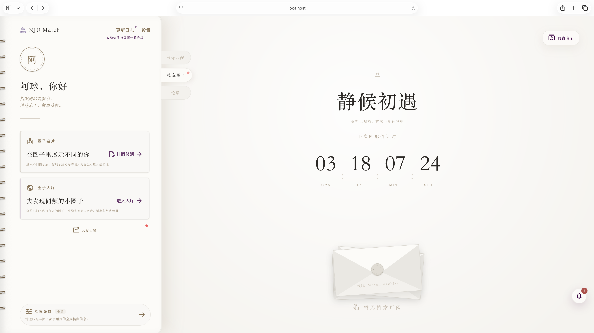

*图 3.1：登录后 Dashboard - 使用测试账号 A 进入圈子、交际信笺和全站消息入口*

### 3.2 进入圈子大厅与圈子详情
- **操作步骤：** 从 Dashboard 点击"圈子大厅"，进入破冰频道，打开"羽毛球夜场研究所"圈子。
- **预期结果：** 圈子大厅展示待处理入圈申请和圈子卡片；圈子详情展示圈子名称、成员信息、定制同好名片、圈主管理、圈内联系方式、退出圈子、圈内论坛、同游邀约和圈内茶话入口。账号 A 作为圈主可看到"圈主管理"入口，并可进入圈聊和组队入口。

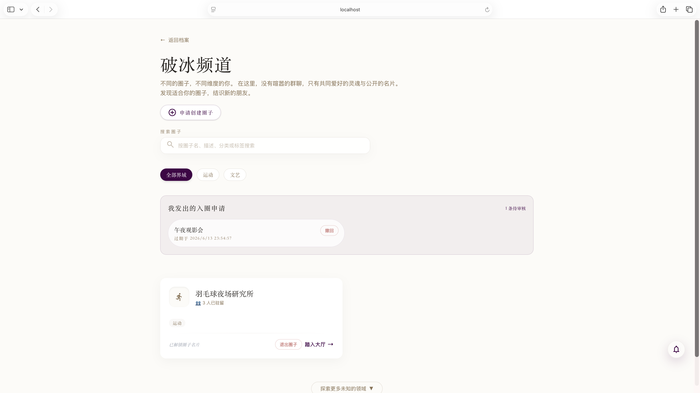

*图 3.2-1：圈子大厅 - 展示破冰频道、入圈申请和圈子卡片*

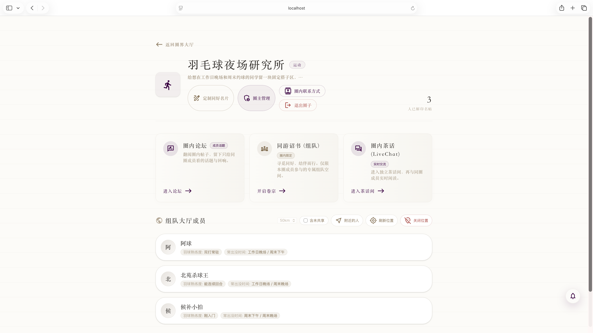

*图 3.2-2：圈子详情页 - 展示圈子入口、成员信息和圈主管理入口*

### 3.3 圈内论坛发帖（含同步开关）
- **操作步骤：** 在圈子详情进入圈内论坛，查看圈内帖子；点击"新建圈内帖"，填写帖子类型、标题、正文，观察"同步至总论坛"开关视觉。
- **预期结果：** 圈内论坛只向本圈成员开放，列表展示圈内帖子与互动计数；发帖弹窗展示帖子类型、标题、正文、图片上传、匿名/私密开关，以及视觉修正后的"同步至总论坛"紧凑 toggle。
- **协作边界：** 论坛帖子、评论、点赞、收藏等基础论坛后端能力由第三组提供；第二组负责圈子上下文内的论坛入口、圈内帖子同步策略和本组演示数据衔接。

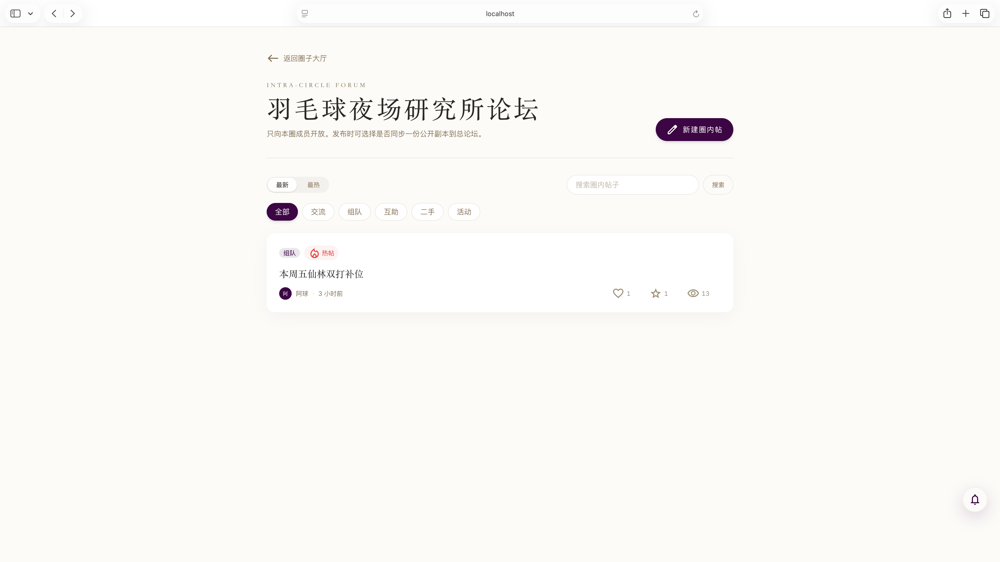

*图 3.3-1：圈内论坛 - 展示圈内帖子列表、分类筛选和新建圈内帖入口*

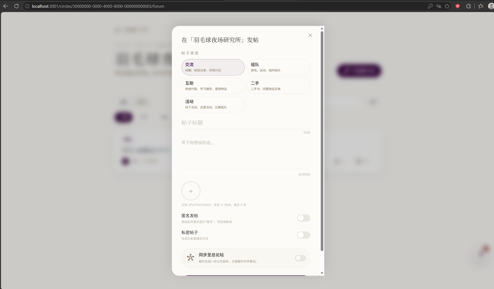

*图 3.3-2：圈内论坛发帖弹窗 - 包含视觉优化后的"同步至总论坛"开关*

### 3.4 圈内实时聊天
- **操作步骤：** 使用账号 A 进入"羽毛球夜场研究所"，点击圈内实时聊天入口，或直接访问 `/circles/30000000-0000-4000-8000-000000000003/livechat`。
- **预期结果：** 圈聊页面加载成功，展示圈子名称、实时聊天面板和历史消息入口；只有圈内成员可进入，WebSocket 使用一次性 ticket 鉴权。

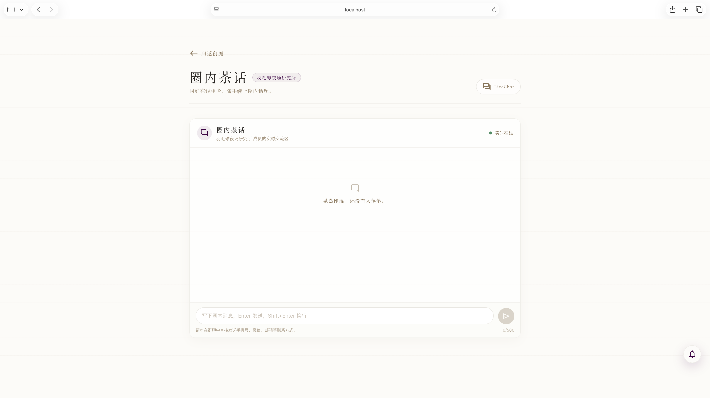

*图 3.4：圈内实时聊天 - 展示圈聊入口、消息面板和真实后端连接状态*

### 3.5 组队大厅
- **操作步骤：** 使用账号 A 进入"羽毛球夜场研究所"的"同游邀约"入口，或直接访问 `/circles/30000000-0000-4000-8000-000000000003/teamups`。
- **预期结果：** 组队大厅展示 `本周五仙林双打补位`、`周末新手友好练球`、`联系方式窗口测试局`、`候补补位触发：周六晨练双打`、`候补演示：周日晚场双打` 等种子组队；列表区分招募中、已满员、已截止等状态，并展示候补数量、人数上限、加入方式和组队类型。

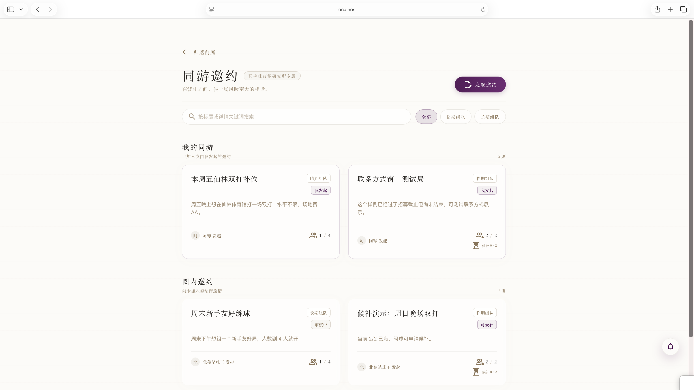

*图 3.5：组队大厅 - 展示不同状态、不同加入模式的组队卡片*

### 3.6 组队详情与联系方式窗口
- **操作步骤：**
  - 使用账号 A 查看 `联系方式窗口测试局`，点击"展开联络名录"。
  - 使用账号 A 查看 `周末新手友好练球`，进入队长视角审核账号 B 的待处理申请。
  - 使用账号 A 查看 `本周五仙林双打补位`，填写联系方式并测试 direct 加入。
- **预期结果：** 截止后、结束前的组队可以展示成员联系方式；审核制组队在账号 A 的队长视角展示申请卡片；direct 组队允许账号 A 从非成员状态直接加入；已结束组队详情中，除自己外的同行成员会展示"举报"入口并提交至通用用户举报流程。

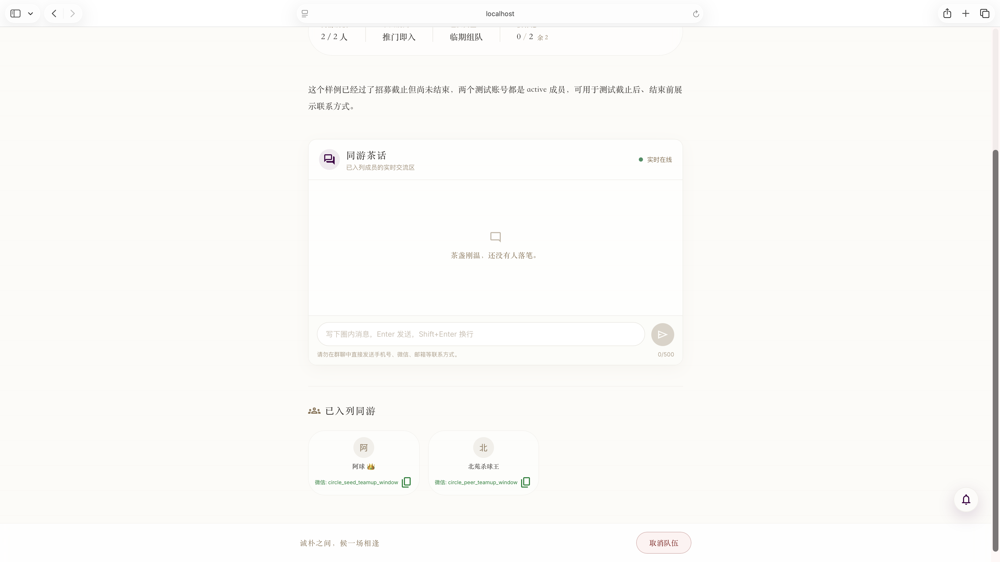

*图 3.6：组队详情 - 展示联系方式窗口期内的成员联络信息、队伍成员和状态信息*

### 3.7 候补流程专项
- **操作步骤：**
  1. 使用账号 A 进入 `候补演示：周日晚场双打`，填写联系方式并点击申请候补，验证满员组队的候补申请入口。
  2. 使用账号 A 进入 `候补补位触发：周六晨练双打`，点击退出组队，释放一个成员席位。
  3. 重新查看 `候补补位触发：周六晨练双打` 或通知中心，确认账号 C（候补小拍）被自动补位。
- **预期结果：** 账号 A 可在一个满员组队中申请候补，也可在另一个预置候补队列的组队中通过退出触发候补自动补位；主流程无需切换账号。

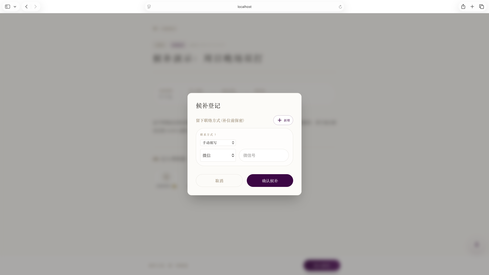

*图 3.7：候补流程 - 展示满员组队、申请候补和候补补位状态*

### 3.8 圈主管理页
- **操作步骤：** 使用账号 A 进入"羽毛球夜场研究所"，点击"管理圈子"，或直接访问 `/circles/30000000-0000-4000-8000-000000000003/manage`。
- **预期结果：** 圈主管理页展示成员管理、入圈门槛、入圈问答/关键词规则、待审核申请、转让圈主和解散圈子等能力。
- **可选破坏性演示：** 在"转让圈主"中选择账号 B（北苑杀球王）并确认转让。转让后账号 A 会离开圈主管理台，可继续以普通成员身份回到圈子详情页体验"退出圈子"流程。若后续还要复用账号 A 的圈主状态，请重建 G2 demo volume。

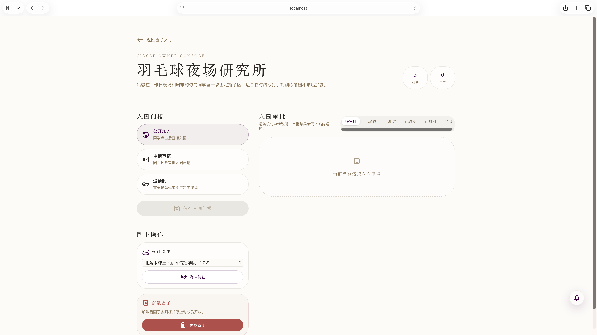

*图 3.8：圈主管理页 - 展示入圈策略、成员管理、圈主转让和退出圈子前置路径*

### 3.9 通知中心与业务消息
- **操作步骤：** 在 Dashboard 打开交际信笺/通知抽屉，查看待处理交际申请、好友申请回音和同游申请。
- **预期结果：** 通知抽屉展示各类申请，卡片上有"翻阅附带名片""前往卷宗""准入同游/婉言谢绝"等动作，状态标签正确（已通过的显示"已通过"，已撤回的显示"已撤回"，不会误判为成功）。

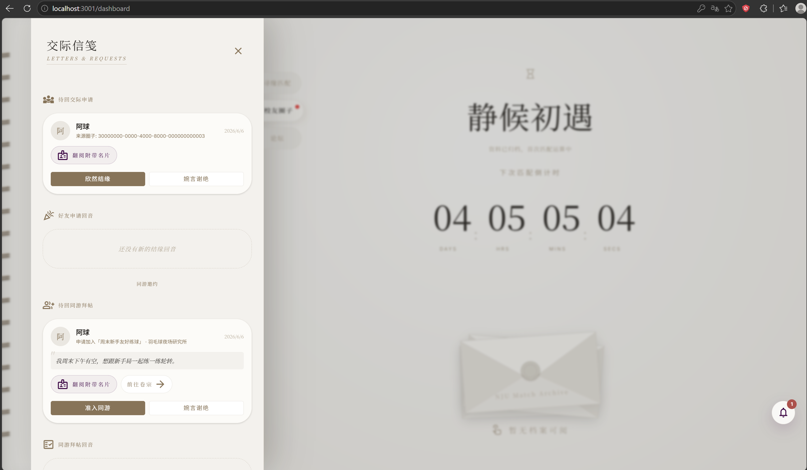

*图 3.9-1：通知中心 - 展示好友申请、联系方式申请、组队申请与候补补位等业务消息*

**全站消息中心补充流程：**
- **操作步骤：** 从页面右下角消息入口打开全站消息中心，查看系统消息、圈子消息、论坛消息、组队消息等跨页面聚合通知；点击消息中的业务入口返回对应详情页或处理入口。
- **预期结果：** 全站消息中心按消息类别和时间聚合展示，已读/未读状态可区分；来自圈子、论坛、同游邀约、联系方式和候补补位的消息能够跳转到对应业务页面。
- **协作边界：** 全站消息中心的统一入口、通知面板 UI 与基础展示框架由第一组提供；第二组负责将本组业务事件接入全站通知链路，包括组队申请、成员加入、候补补位等通知的后端生成、消息语义与跳转元数据维护。

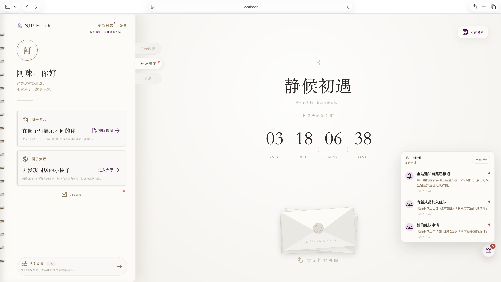

*图 3.9-2：全站消息中心 - 展示站内通知、未读状态和业务跳转入口*

### 3.10 查看好友详情
- **操作步骤：** 在 Dashboard 打开"同窗名录"，点击好友，打开好友详情弹窗。
- **预期结果：** 好友详情展示关系状态、联系印记、名片档案、同好圈子，并提供拉黑/举报/解除好友等动作。

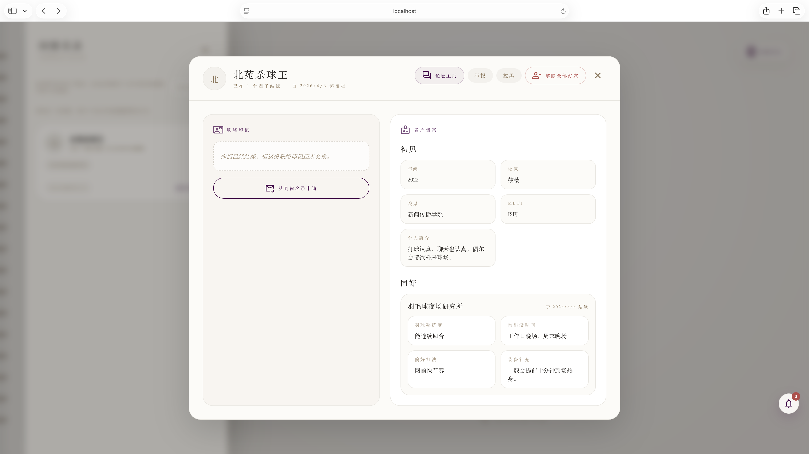

*图 3.10：好友详情弹窗 - 展示关系状态、联系方式申请、名片档案和同好圈子*

### 3.11 Settings 隐私管理页
- **操作步骤：** 访问 `http://localhost:8080/settings?tab=friends`，查看好友申请管理；切换到 `tab=privacy` 查看隐私申请管理。
- **预期结果：** "收到的好友申请"区块只提供同意/拒绝/忽略/拉黑，"我发出的好友申请"区块只提供撤回；两个区块动作权限正确，不混淆。

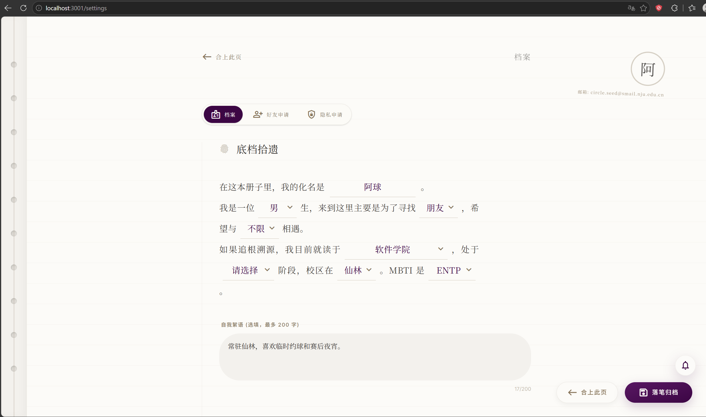

*图 3.11：Settings 隐私管理页 - 分为"收到的好友申请"和"我发出的好友申请"两个区块*

### 3.12 多用户交互验证（可选）
- **操作步骤：** 主演示可只使用账号 A 完成；如需复核权限隔离，可依次切换账号 A、B、C，验证好友申请、联系方式申请、组队申请/审核、候补补位和圈主转让后的权限变化。
- **预期结果：** 不同账号只能看到自己权限范围内的数据；组队、联系方式、圈主管理和通知状态随操作实时变化。

## 4. 注意事项
- 演示前请确保已执行 `docker compose -f docker-compose.g2-demo.yml down -v` 清理 G2 演示 volume，避免旧数据库或旧联系方式加密密钥导致演示数据异常。
- `docker-compose.g2-demo.yml` 已为 G2 演示环境配置 `G2_CONTACT_ENCRYPTION_KEY`、`G2_CONTACT_BLIND_INDEX_KEY` 等默认密钥；如手动覆盖这些密钥，同一份数据库数据生命周期内必须保持一致。
- G2 演示环境使用 `init.sql` 自动初始化测试数据，无需再手动 `docker cp` 导入。
- 后端启动时会自动执行数据库 migration，无需手动执行迁移脚本。
- G2 演示前端容器使用真实后端接口，不使用 Mock 数据。
- 网络请求可能有轻微延迟，请耐心等待页面加载完成。
