# 演示说明

**团队名称：** 第三组
**阶段：** Phase 4 - 编码开发

## 1. 运行方式：G3 演示环境一键启动

```bash
# 清理旧数据 + 完整启动（PostgreSQL + 后端自动迁移和种子 + Nginx 前端）
docker compose -f docker-compose.g3-demo.yml down -v
docker compose -f docker-compose.g3-demo.yml up -d --build


# 执行完上述两条后，直接进入下方前端访问地址即可开始使用，刚启动成功需要一些时间连接数据库，如果主页人数显示0请刷新几次。

# 前端访问地址：http://localhost:8080
# 后端 API：http://localhost:8080/api/v1
```

> 启动时自动执行 `seedForumDemo.ts`，该脚本内置数据库迁移和演示数据导入，无需手动执行迁移。使用独立 Compose 服务和独立 volume，不影响其他环境。容器名由 Docker Compose 自动生成，避免本机残留同名容器导致启动冲突。

> 如需重建演示数据：
> ```bash
> docker compose -f docker-compose.g3-demo.yml down -v    # 清数据库
> docker compose -f docker-compose.g3-demo.yml up -d      # 重新启动
> ```

---

## 2. 演示账号与测试数据

### 2.1 数据导入说明

Docker 演示环境启动时会自动执行数据导入，无需手动运行下面的命令。

如需在本地开发模式下单独重建演示数据，可执行：

```bash
cd backend
npx tsx src/db/seedForumDemo.ts
```

> 脚本内置 `runMigrations()`，无需单独执行迁移。每次运行先清旧数据再导入新数据，可反复使用。

### 2.2 演示账号

所有账号密码统一为 **`NJUdate2026!`**。

推荐演示账号：

| 角色 | 邮箱 | 昵称 | MBTI | 说明 |
|------|------|------|------|------|
| 主演示 | `linxi@smail.nju.edu.cn` | 林溪 | ENFP | 新闻传播学院，已发帖、评论、点赞、私信 |
| 辅助 | `muyang@smail.nju.edu.cn` | 沐阳 | INTJ | 计算机系，和"林溪"有私信对话和互关 |

完整账号列表（共 17 人）：

| 昵称 | 邮箱 | 学院 |
|------|------|------|
| 林溪 | `linxi@smail.nju.edu.cn` | 新闻传播学院 |
| 沐阳 | `muyang@smail.nju.edu.cn` | 计算机科学与技术系 |
| 小雨 | `xiaoyu@smail.nju.edu.cn` | 生命科学学院 |
| 陈一 | `chenyi@smail.nju.edu.cn` | 人工智能学院 |
| 苏荷 | `suhe@smail.nju.edu.cn` | 外国语学院 |
| 青舟 | `qingzhou@smail.nju.edu.cn` | 商学院 |
| 月半 | `yueban@smail.nju.edu.cn` | 历史学院 |
| 皓然 | `haoran@smail.nju.edu.cn` | 物理学院 |
| 宁安 | `ningan@smail.nju.edu.cn` | 法学院 |
| 子墨 | `zimo@smail.nju.edu.cn` | 软件学院 |
| 晚晴 | `wanqing@smail.nju.edu.cn` | 地理与海洋科学学院 |
| 开辰 | `kaichen@smail.nju.edu.cn` | 数学系 |
| 若曦 | `ruoxi@smail.nju.edu.cn` | 医学院 |
| 嘉宁 | `jianing@smail.nju.edu.cn` | 电子科学与工程学院 |
| 末末 | `momo@smail.nju.edu.cn` | 艺术学院 |
| 书亦 | `shuyi@smail.nju.edu.cn` | 文学院 |
| 论坛管理员 | `admin@smail.nju.edu.cn` | 平台运营组 |

> **测试数据说明：**
> - 所有用户均有完整个人资料（昵称、性别、MBTI、学院、Bio、签名、标签）、问卷和名片卡片。
> - 数据库迁移由 `seedForumDemo.ts` 内置执行，无需手动运行 `migrate.ts`。
> - 每类帖子（交流/组队/互助/二手/活动）各 9 篇，共 **45 篇全站帖子**，无圈子关联。
> - 帖子包含 1/3/6/9 张图片的不同规格、多篇投票帖（每帖 2-4 选项）。
> - 所有非管理员用户对每篇帖子都投了票，共计 45×16 = 720 票并有大量点赞/收藏/浏览数据。
> - 评论：每篇帖子 2 条文字评论 + 18 条二级回复。
> - 私信：8 个会话，每个 4 条消息，多对用户互相关注。
> - 留言板 7 条、公告 2 条、举报 2 条（1 待处理 + 1 已驳回）。
> - 管理员已有待处理举报和系统通知。

---

## 3. 核心演示路径

请按以下顺序进行演示：

### 3.1 登录与首页入口

- **操作步骤：** 打开登录页（Docker：`http://localhost:8080/login`，开发模式：`http://localhost:3001/login`），使用 `linxi@smail.nju.edu.cn` / `NJUdate2026!` 登录。
- **预期结果：** 登录成功后进入 Dashboard，展示"林溪"的个人资料、论坛入口、私信入口和消息中心入口。
- **协作边界：** 登录页、统一认证流程、Dashboard 基础承载页由第一组提供；本组演示从 Dashboard 进入论坛和私信等业务流程。

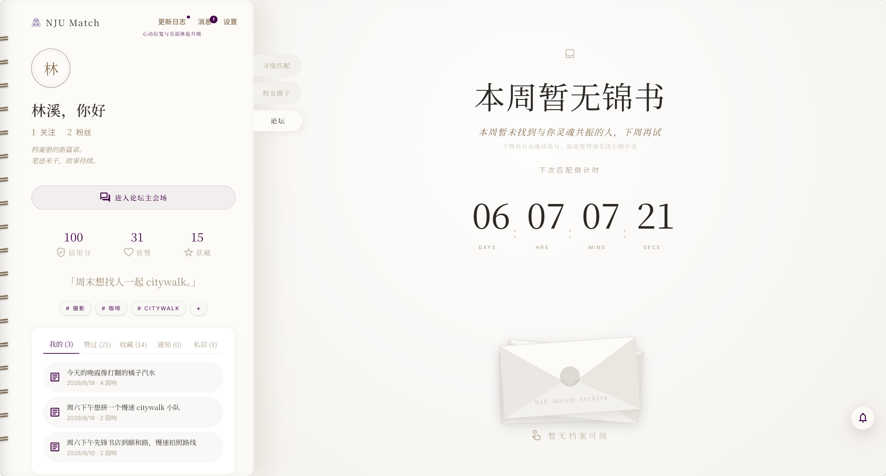

---

### 3.2 论坛帖子列表 — 浏览与筛选

- **操作步骤：** 从 Dashboard 点击导航栏"论坛"进入 `/forum`。
- **预期结果：** 展示 45 篇帖子，卡片采用知乎风格布局（标题置顶加粗、作者名内联摘要、标签在底部左下、时间+互动图标在底部右下）。顶部支持类型筛选 Tab（交流/组队/互助/二手/活动）和排序切换（推荐/最新/最热）。
- **演示要点：**
  - 首条「论坛演示指南」为管理员置顶帖
  - 点击筛选 Tab 切换帖子类型，每种类型 9 篇
  - 排序依次切换到"最新"、"最热"（多因子算法：MBTI + 兴趣画像 + 协同过滤 + 新鲜度 + 质量评分）、"推荐"
  - 默认排序为"最新"
  - 图片帖子在卡片摘要中展示缩略图

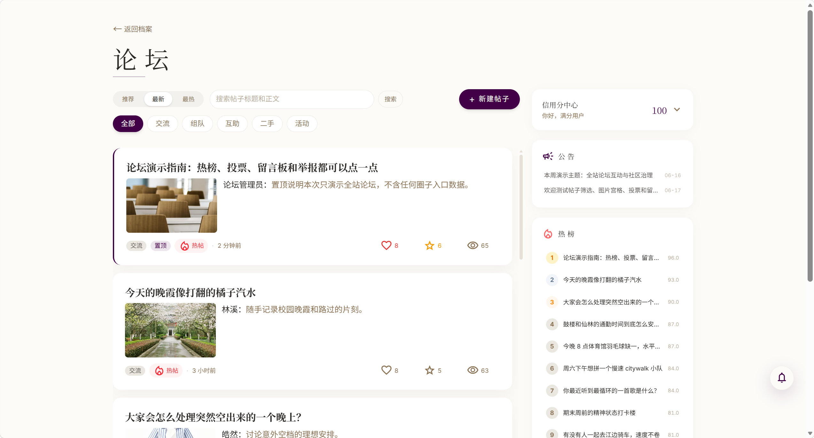

---

### 3.3 发帖 — 图片、匿名、投票

- **操作步骤：** 在论坛页点击"发帖"按钮，弹出 PostForm 弹窗。
- **预期结果：** 发帖弹窗包含：
  - 标题、正文、类型选择
  - 图片上传（最多 9 张，种子数据中有 9 图样例）
  - 匿名发布开关
  - 投票选项（2-4 个选项）

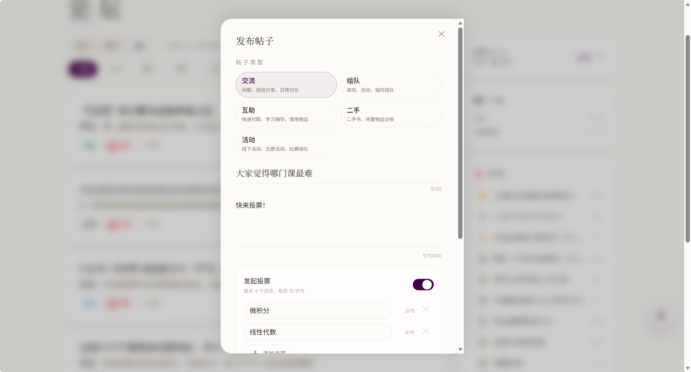
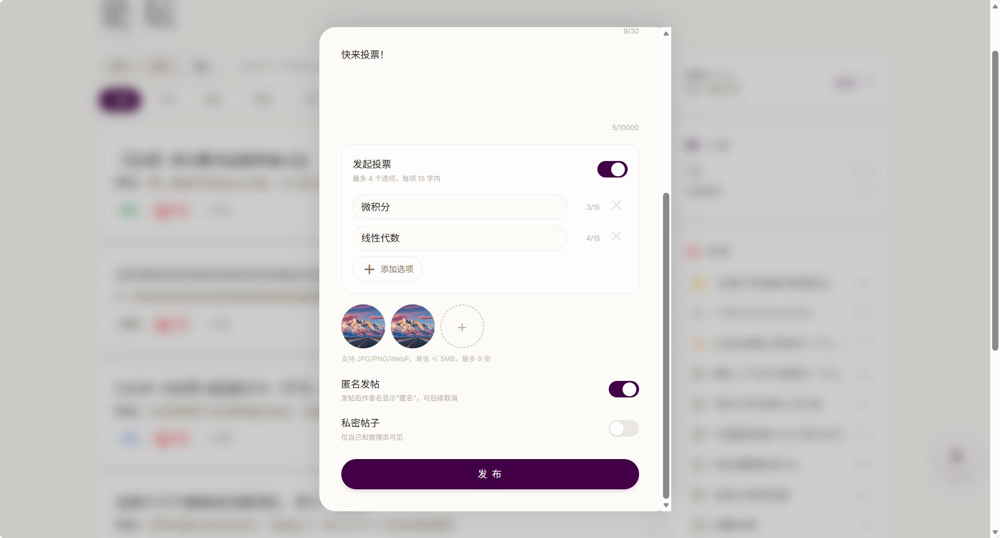

---

### 3.4 帖子详情 — 图片宫格 + 投票 + 评论

- **操作步骤：** 点击任意帖子标题进入详情页。推荐点击 activity 或 trade 类型的帖子（含 9 张图片样例）。
- **预期结果：** 帖子详情展示：
  - **图片宫格：** 1/3/6/9 张不同规格的图片排列
  - **投票组件：** 选项 + 百分比条 + 票数 + 已投票锁定状态
  - **文字评论：** 每帖 2 条 + 部分有二级回复
  - **评论点赞：** 已有评论点赞数据
  - **吸底磨砂发送栏：** 底部固定，85% 白底 + `backdrop-blur`，支持文字/图片/语音/Ctrl+Enter

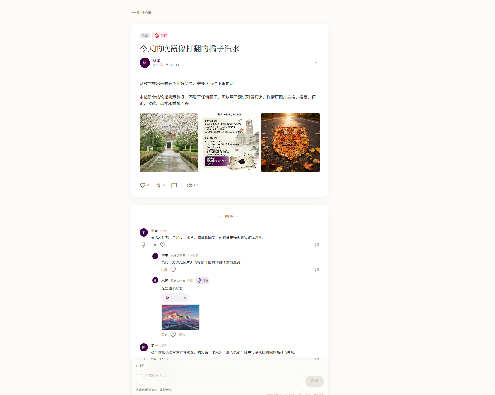
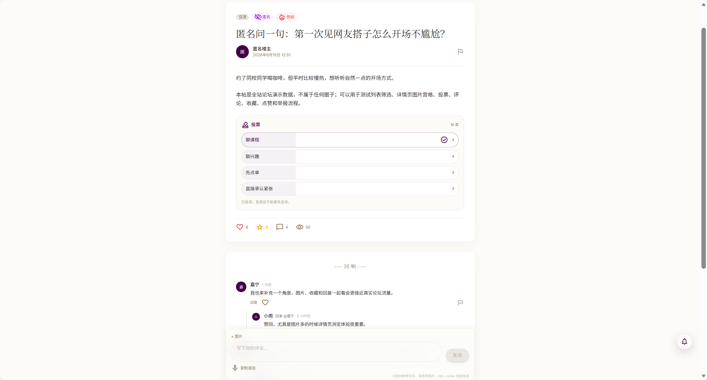

---

### 3.5 帖子互动 — 点赞、收藏

- **操作步骤：** 使用 `muyang@smail.nju.edu.cn` 登录，进入"林溪"发布的帖子详情。
- **预期结果：** 点赞和收藏按钮可点击切换状态，计数器实时更新。帖子作者收到通知。

---

### 3.6 热榜

- **操作步骤：** 
  1. 论坛主页右侧热榜侧边栏（日榜/周榜/月榜）
  2. 进入独立热榜页 `/forum/ranking`
- **预期结果：** 由于种子数据中每帖都有大量浏览、点赞和收藏，热榜排序有明显区分度。

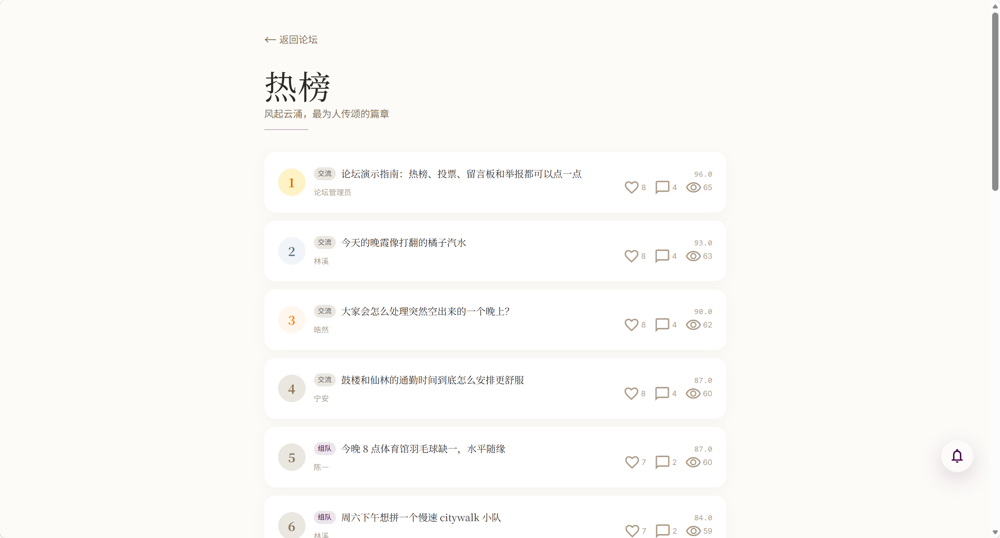

---

### 3.7 公告 + 留言板

- **操作步骤：** 
  1. 论坛页顶部查看公告栏（管理员发布 2 条演示公告）
  2. 进入留言板 `/forum/guestbook` 查看 7 条留言
- **预期结果：** 公告和留言均来自真实用户数据。

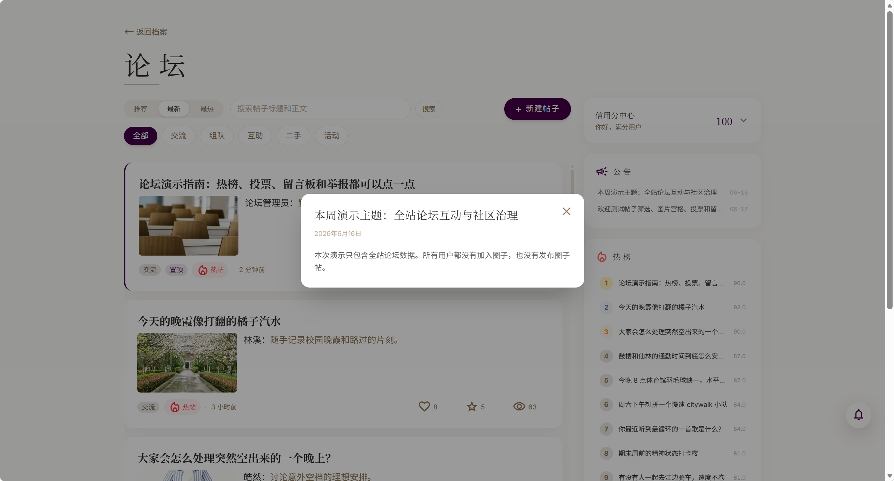
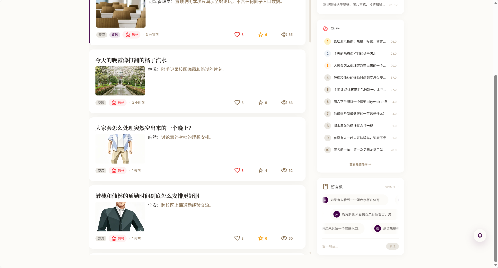
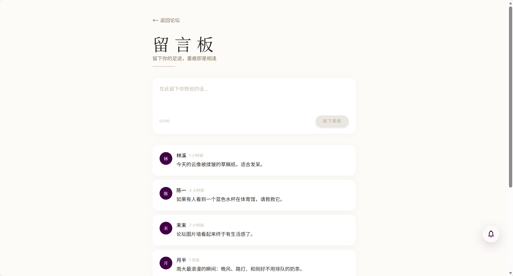

---

### 3.8 个人主页 — 论坛数据看板

- **操作步骤：** 使用"林溪"账号进入 Dashboard。
- **预期结果：** 论坛数据看板展示：
  - 我的帖子 / 赞过 / 收藏 / 消息四个 Tab
  - 个性签名和标签可编辑保存("周末想找人一起 citywalk。" / 摄影、咖啡、citywalk)

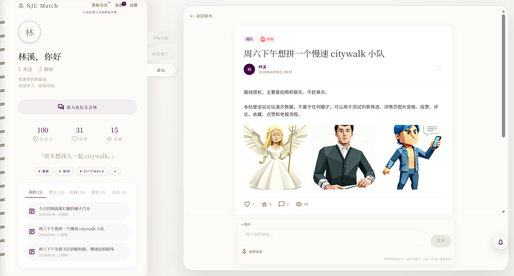

---

### 3.9 他人主页

- **操作步骤：** 在帖子列表点击作者名，或从 Dashboard 私信对象点击"查看主页"。
- **预期结果：** 进入 `/user/:userId`，展示用户资料、公开帖子列表、"发私信"入口。返回按钮为"返回上一页"。

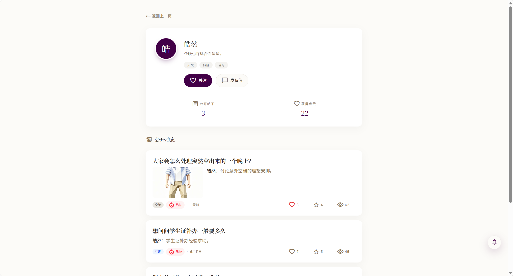

---

### 3.10 私信系统

- **操作步骤：** 
  1. 使用"林溪"登录，从 Dashboard 进入私信 `/messages`
  2. 选择与"沐阳"的会话（种子数据已有 4 条对话）
  3. 发送一条新文字消息、上传图片、录制语音
  4. Ctrl+Enter 快捷发送
- **预期结果：**
  - 左侧会话列表展示 8 个已有会话
  - 右侧聊天窗口展示消息气泡（自己：紫色靠右，对方：白色靠左）
  - 支持文字/图片/语音消息
  - 返回按钮为"返回上一页"

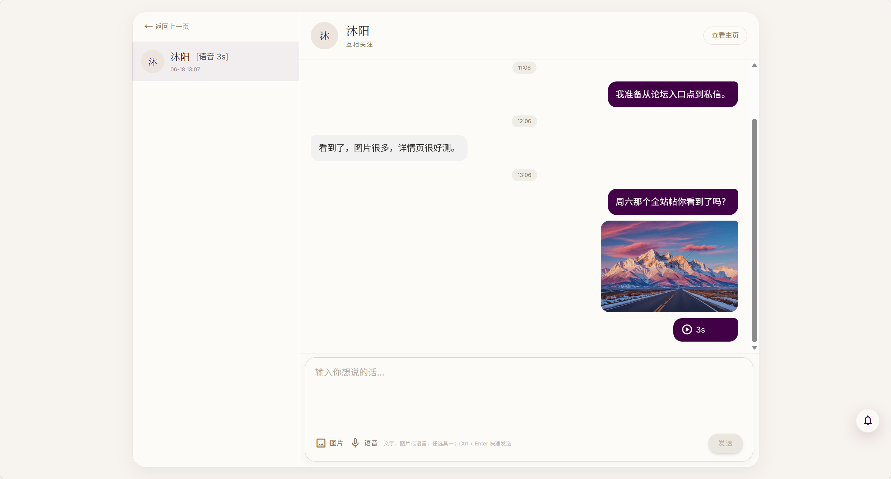


---

### 3.11 信用分治理 — 举报与审核

- **操作步骤：** 
  1. 使用任意用户登录，进入帖子详情点击"举报"
  2. 弹出 ReportDialog，选择举报原因并提交
  3. 进入 `/admin`输入密钥
  4. 查看论坛举报 Tab，处理待审核举报
  5. 审核通过 → 扣分 → 被举报人信用等级变化
- **预期结果：**
  - 种子数据有一条待处理举报（「出九成新 23.8 寸显示器」被举报"可疑信息"）
  - 有一条已驳回举报可查看处理记录
  - 重复举报被拦截，扣分写入审计日志

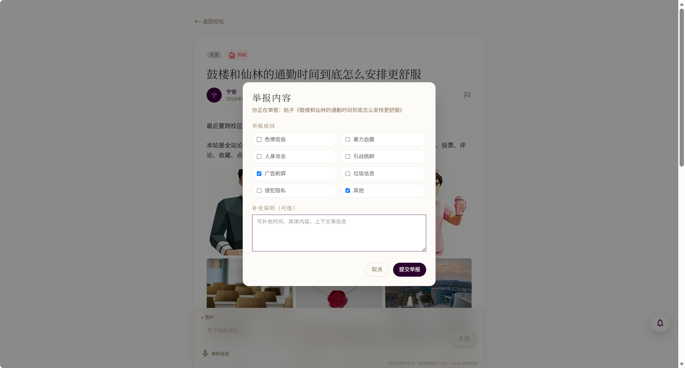
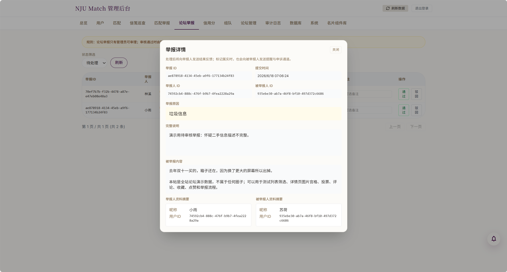
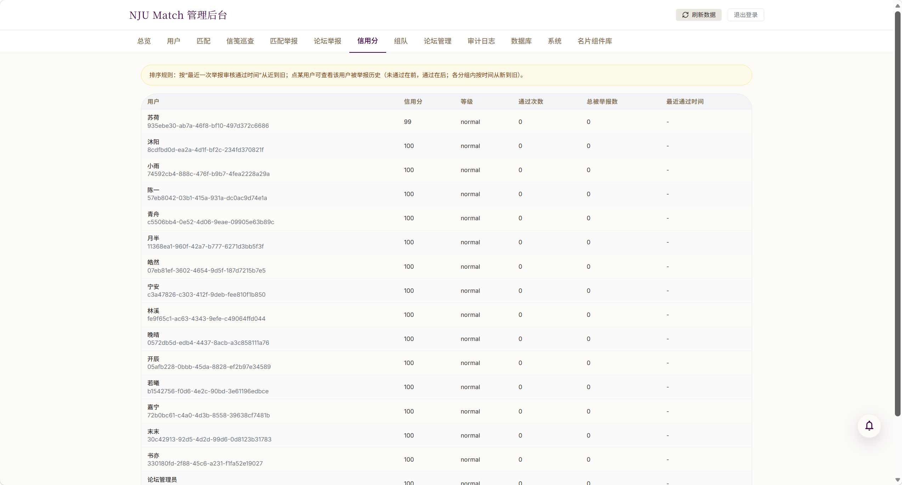

---

### 3.12 管理端

- **操作步骤：** 进入 `/admin`输入密钥。
- **预期结果：** 管理后台提供：
  - 帖子管理（筛选、删除、置顶）
  - 公告管理（新增、编辑、删除）
  - 举报审核面板
  - 信用分用户列表

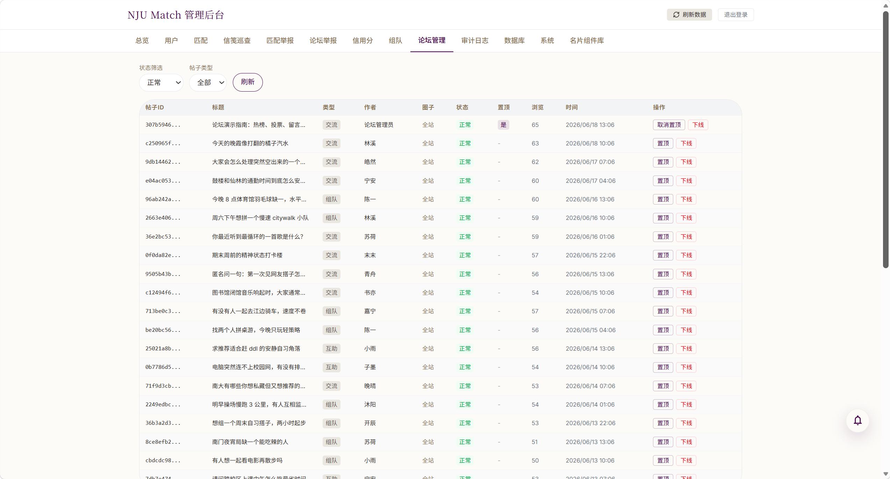

---

### 3.13 关注与粉丝列表

- **操作步骤：** 
  1. 使用"林溪"登录，进入 Dashboard
  2. 点击左侧导航或个人资料区域的关注/粉丝入口，进入 `/follows`
  3. 依次切换三个 Tab：**互相关注** → **关注** → **粉丝**
  4. 点击"沐阳"行进入其个人主页，再返回
  5. 在"粉丝"Tab 中点击"回关"按钮关注一个新用户
  6. 在"互相关注"Tab 中点击"取消关注"并确认弹窗
- **预期结果：**
  - 互相关注 Tab 展示双向关注的用户（种子数据：林溪↔沐阳）
  - 关注 Tab 列出"我关注的"用户
  - 粉丝 Tab 列出"关注我的"用户，可一键回关
  - 列表项展示头像、昵称、个性签名，点击进入对方主页
  - 顶部显示各分组用户数量统计
  - 互相关注 Tab 的用户行右侧显示「发私信」按钮（需校验资格）
  - 取消关注弹出二次确认弹窗

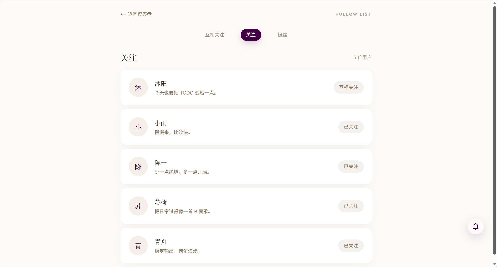

---

### 3.14 私信隐私与防打扰

- **操作步骤：** 
  1. 使用"林溪"登录，进入仪表盘
  2. 点击底部「档案设置」Tab
  3. 在「私信与防打扰」区域，查看四种隐私等级：
     - **所有人**：任何用户都可以先发私信
     - **我关注的人**：仅已关注的用户可以发起私信
     - **互相关注的人**：仅双向关注的用户可以发起私信
     - **所有人都不可以**：完全关闭陌生私信
  4. 切换隐私等级（实时生效，无需保存按钮）
  5. 切换到"所有人都不可以"
  6. 换用"沐阳"账号登录，尝试给"林溪"发私信 → 提示"由于对方的隐私设置，暂时无法发送私信"
  7. 切回"林溪"，将设置改回"所有人"

- **预期结果：**
  - 隐私等级切换即时生效，页面提示"私信与防打扰设置已实时生效"
  - 非互关对话有 **3 条消息限制**，超出后提示需等对方回复
  - 被拉黑后双方均无法互相发送私信
  - 设置页面顶部展示"实时生效"标签

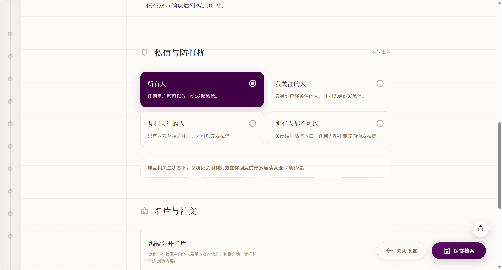

---

### 3.15 拉黑与举报用户

- **操作步骤：** 
  1. 使用"林溪"登录，进入任意他人主页（如沐阳 `/user/:userId`）
  2. 点击右上角「···」菜单按钮
  3. 点击「拉黑」→ 确认操作
  4. 页面提示"已拉黑该用户"，按钮变更为「解除拉黑」
  5. 打开私信沐阳界面 → 显示"你已拉黑对方，将不再接收私信"
  6. 使用"沐阳"登录，打开私信林溪界面 → 显示"由于对方屏蔽设置，无法发送私信"
  7. 使用"林溪"登录，再次点击「···」→「解除拉黑」→ 恢复正常
  8. 进入另一用户主页，点击「···」→「举报」
  9. 弹出举报弹窗，勾选举报原因（挑衅/骚扰/广告/其他），可选填补充说明
  10. 提交举报 → 提示"举报已提交，等待管理员审核"

- **预期结果：**
  - 拉黑后双方均无法互相私信，UI 立即反馈
  - 解除拉黑恢复私信资格
  - 举报弹窗支持多选原因 + 文字补充说明
  - 举报提交后生成审核工单，管理员可在 `/admin` 查看
  - 重复举报同一用户会被拦截（幂等保护）

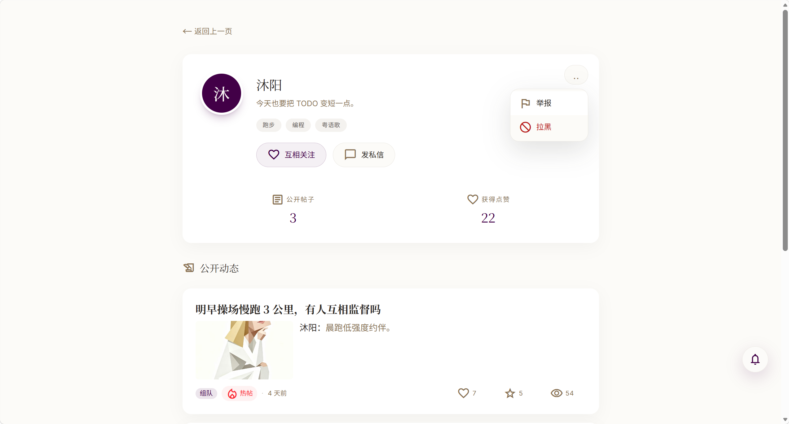
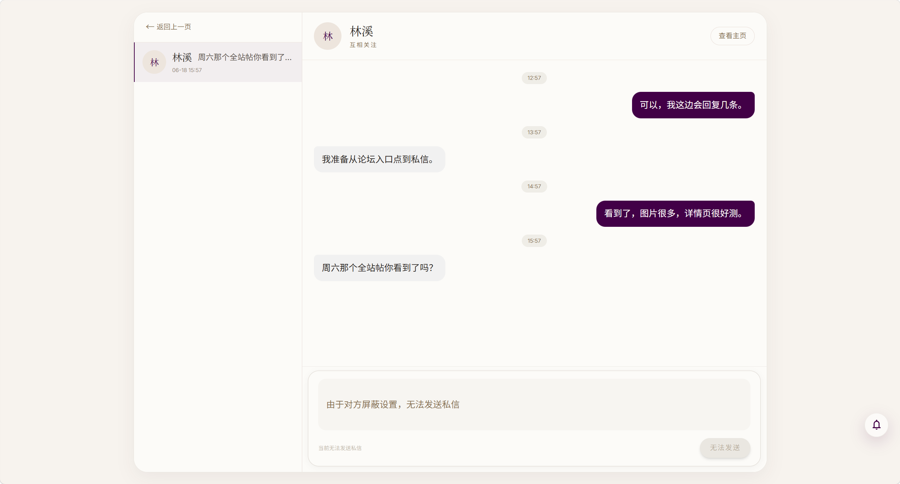
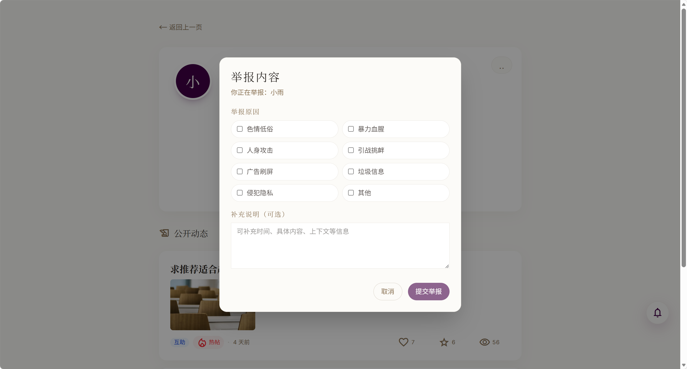

---

## 4. 注意事项

- 演示前请确保已执行 `docker compose -f docker-compose.g3-demo.yml down -v` 清空旧 volume。
- 默认使用宿主机 8080 端口；如需临时切换，可使用 `FRONTEND_PORT=8081 docker compose -f docker-compose.g3-demo.yml up -d --build`。
- `seedForumDemo.ts` 内置迁移和清空逻辑，每次运行都会重建干净数据。
- 推荐排序依赖 `pg_trgm` 扩展（迁移脚本自动启用）。
- G3 演示环境使用 `Dockerfile.demo` 构建，与生产 `Dockerfile` 独立。
- 所有帖子为全站论坛帖子，不关联任何圈子。
